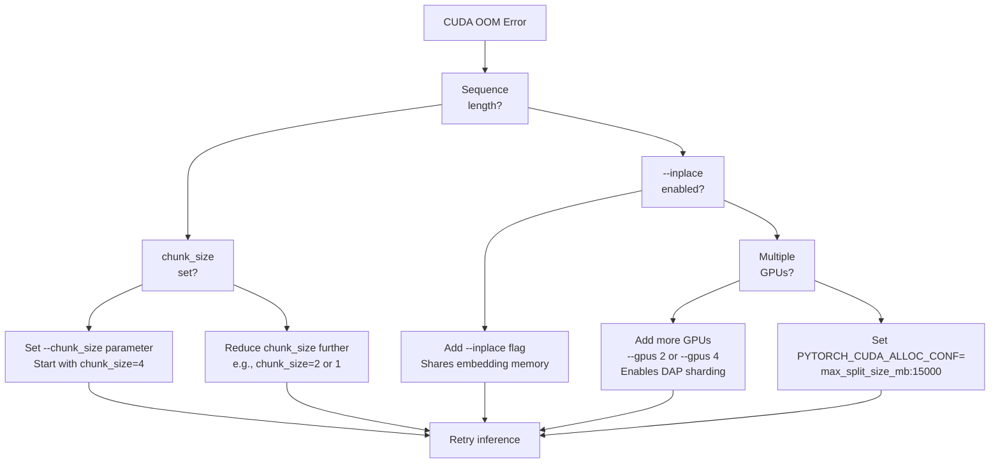
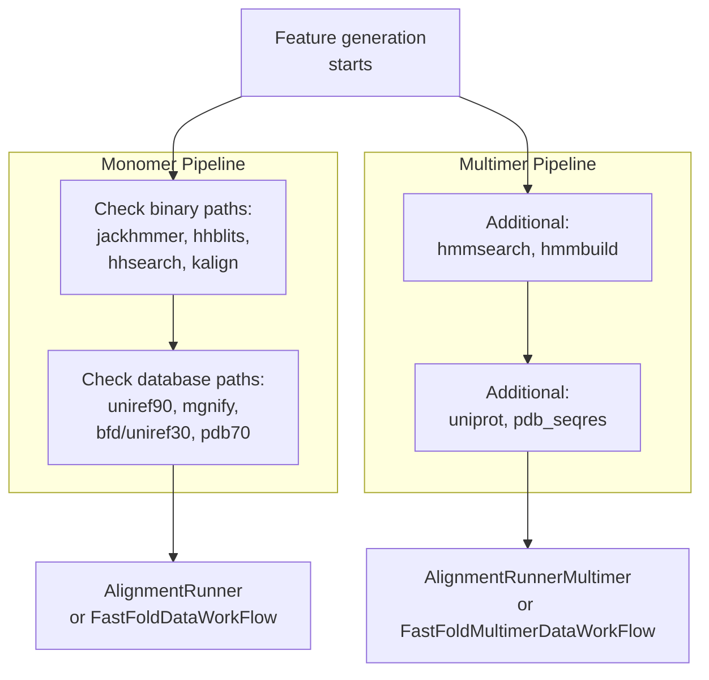
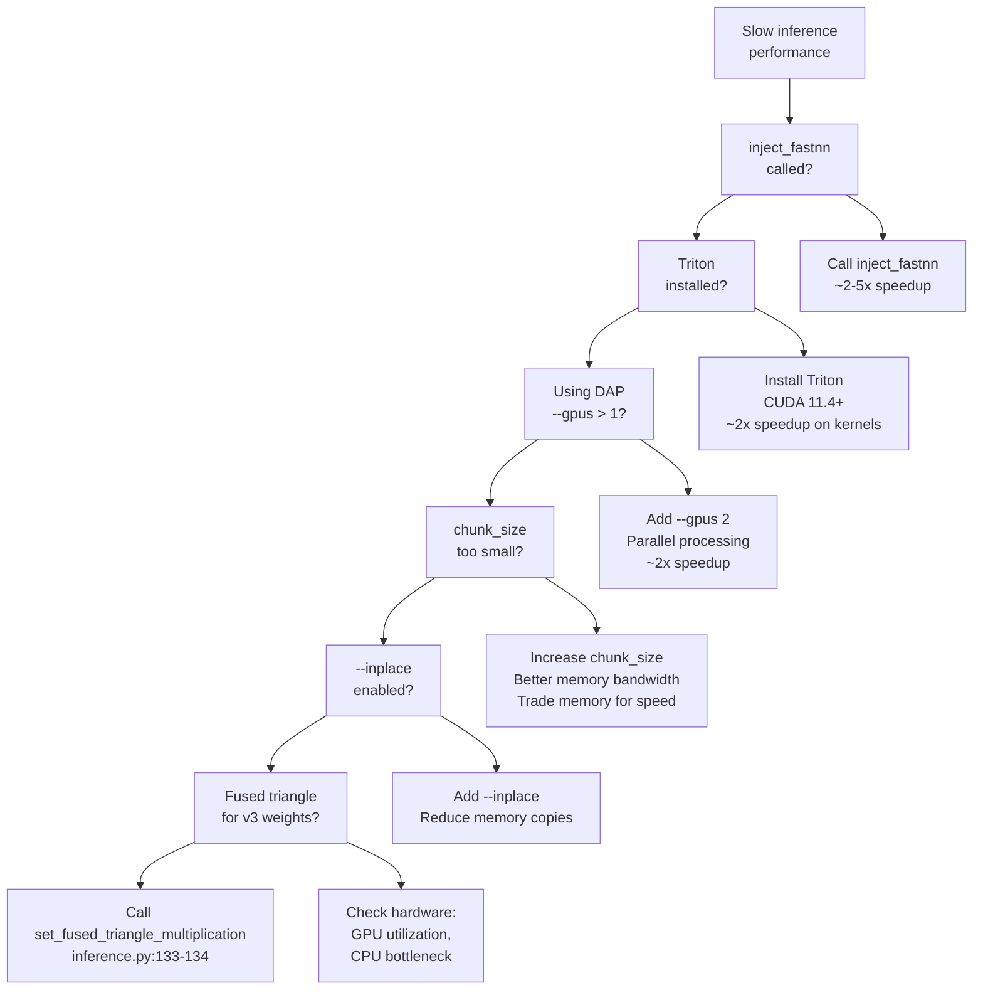

# Troubleshooting

> **Relevant source files**
> * [.github/workflows/build.yml](https://github.com/hpcaitech/FastFold/blob/eba49680/.github/workflows/build.yml)
> * [README.md](https://github.com/hpcaitech/FastFold/blob/eba49680/README.md?plain=1)
> * [docker/Dockerfile](https://github.com/hpcaitech/FastFold/blob/eba49680/docker/Dockerfile)
> * [environment.yml](https://github.com/hpcaitech/FastFold/blob/eba49680/environment.yml)
> * [inference.py](https://github.com/hpcaitech/FastFold/blob/eba49680/inference.py)
> * [requirements/requirements.txt](https://github.com/hpcaitech/FastFold/blob/eba49680/requirements/requirements.txt)
> * [requirements/test_requirements.txt](https://github.com/hpcaitech/FastFold/blob/eba49680/requirements/test_requirements.txt)
> * [setup.py](https://github.com/hpcaitech/FastFold/blob/eba49680/setup.py)

This page provides solutions to common issues encountered when installing, configuring, and running FastFold. It covers installation failures, runtime errors, performance problems, and distributed execution issues.

For installation instructions, see [Installation](/hpcaitech/FastFold/2.1-installation). For inference configuration, see [Quick Start: Inference](/hpcaitech/FastFold/2.2-quick-start:-inference). For distributed execution concepts, see [Dynamic Axial Parallelism](/hpcaitech/FastFold/8.1-dynamic-axial-parallelism-(dap)).

---

## Installation Issues

### CUDA Extension Compilation Failures

**Problem**: `setup.py` fails during CUDA kernel compilation with errors about missing CUDA or version mismatches.

**Root Causes**:

1. **Missing CUDA_HOME**: The build system requires `CUDA_HOME` environment variable to locate CUDA toolkit.
2. **PyTorch-CUDA Version Mismatch**: CUDA extensions must be compiled with the same CUDA version used to compile PyTorch.
3. **Insufficient PyTorch Version**: FastFold requires PyTorch ≥1.10.

**Solutions**:

| Issue | Diagnostic | Solution |
| --- | --- | --- |
| `CUDA_HOME not found` | Build skips CUDA extensions | Set `export CUDA_HOME=/usr/local/cuda` |
| Version mismatch error | `setup.py` RuntimeError [setup.py L32-L38](https://github.com/hpcaitech/FastFold/blob/eba49680/setup.py#L32-L38) | Reinstall PyTorch with matching CUDA version |
| `FastFold requires Pytorch 1.10` | Version check fails [setup.py L72-L74](https://github.com/hpcaitech/FastFold/blob/eba49680/setup.py#L72-L74) | Upgrade PyTorch: `conda install pytorch>=1.12` |

**Verification Steps**:

```javascript
# Check CUDA availabilityecho $CUDA_HOMEnvcc --version # Check PyTorch CUDA versionpython -c "import torch; print(torch.version.cuda)" # Verify PyTorch versionpython -c "import torch; print(torch.__version__)"
```

The build system checks version compatibility in [setup.py L23-L38](https://github.com/hpcaitech/FastFold/blob/eba49680/setup.py#L23-L38)

 and will raise `RuntimeError` if CUDA versions don't match. To bypass this check (at your own risk), comment out the version check, though this may cause runtime errors later.

**Sources**: setup.py:1-144, README.md:31-60

---

### Triton Installation Issues

**Problem**: Triton installation fails or Triton kernels don't execute.

**Root Cause**: Triton requires CUDA ≥11.4, but FastFold base installation supports CUDA 11.3.

**Solution**:

```javascript
# Ensure CUDA 11.4+ is availablenvcc --version  # Must show 11.4 or higher # Install Tritonpip install -U --pre triton # Verify installationpython -c "import triton; print(triton.__version__)"
```

**Fallback Behavior**: FastFold's fused kernels automatically fall back to CUDA implementations when Triton is unavailable. Softmax and LayerNorm have CUDA fallbacks [fastfold/model/fastnn/kernel/](https://github.com/hpcaitech/FastFold/blob/eba49680/fastfold/model/fastnn/kernel/)

 but attention core kernels require Triton.

**Sources**: README.md:52-60

---

### Docker Build Failures

**Problem**: Docker build fails with "CUDA not found" during `python setup.py install`.

**Root Cause**: Building FastFold from scratch requires GPU support during the Docker build process. Standard Docker doesn't provide GPU access to build containers.

**Solution**:

Configure Docker to use NVIDIA runtime as default during builds:

```
// /etc/docker/daemon.json{  "default-runtime": "nvidia",  "runtimes": {    "nvidia": {      "path": "nvidia-container-runtime",      "runtimeArgs": []    }  }}
```

Then restart Docker and rebuild:

```
sudo systemctl restart dockercd FastFolddocker build -t fastfold ./docker
```

**Alternative**: Use the pre-built base image and install FastFold inside a running container instead of during build.

**Sources**: README.md:63-78, docker/Dockerfile:1-14

---

### Conda Environment Creation Failures

**Problem**: `conda env create -f environment.yml` fails to resolve dependencies.

**Root Cause**: Conflicting package versions or channel priorities.

**Solution**:

```sql
# Clean conda cacheconda clean --all # Create environment with explicit channel priorityconda env create --name=fastfold -f environment.yml # If still failing, install packages sequentiallyconda create --name=fastfold python=3.8conda activate fastfoldconda install pytorch=1.12 torchvision torchaudio cudatoolkit=11.3 -c pytorchconda install openmm=7.7.0 pdbfixer -c conda-forgeconda install hmmer=3.3.2 hhsuite=3.3.0 kalign2=2.04 -c biocondapip install -r requirements/requirements.txt
```

**Sources**: environment.yml:1-33, README.md:39-50

---

## Inference Runtime Errors

### Out of Memory Errors

**Problem**: `RuntimeError: CUDA out of memory` during inference, especially for long sequences.

**Diagnostic Flow**:



**Solutions by Sequence Length**:

| Sequence Length | Configuration | Memory (A100 80GB) |
| --- | --- | --- |
| <1000 residues | Default settings | ~20GB |
| 1000-3000 | `--chunk_size 4 --inplace` | ~30GB |
| 3000-5000 | `--chunk_size 4 --gpus 2 --inplace` | ~40GB per GPU |
| 5000-8000 | `--chunk_size 2 --gpus 4 --inplace` | FP32: 61GB (max) |
| 8000-10000 | `--chunk_size 1 --gpus 4 --inplace` + bf16 | BF16: 61GB |
| >10000 | Set `PYTORCH_CUDA_ALLOC_CONF` + above | Requires memory fragmentation tuning |

**Implementation Details**:

The `chunk_size` parameter controls memory-compute tradeoff by processing large tensors in chunks. It's set via:

```markdown
# Command linepython inference.py target.fasta ... --chunk_size 4 # Propagated to config [inference.py:130-131]()config.globals.chunk_size = args.chunk_size # Applied to model [inference.py:145]()set_chunk_size(model.globals.chunk_size)
```

For extreme lengths (>10000 residues), set environment variable:

```javascript
export PYTORCH_CUDA_ALLOC_CONF=max_split_size_mb:15000python inference.py ... --chunk_size 1 --gpus 4 --inplace
```

**Sources**: README.md:141-164, inference.py:117-145

---

### Multi-GPU Spawning Failures

**Problem**: `torch.multiprocessing.spawn` fails with `RuntimeError: NCCL error` or processes hang.

**Root Causes**:

1. **NCCL Shared Memory Issues**: Default NCCL configuration may fail on some systems.
2. **Process Group Initialization**: DAP requires proper environment variable setup.
3. **Port Conflicts**: Multiple processes cannot bind to the same port.

**Solutions**:

```javascript
# Disable NCCL shared memory (common fix)export NCCL_SHM_DISABLE=1python inference.py ... --gpus 2 # Set explicit master address/portexport MASTER_ADDR=localhostexport MASTER_PORT=29500 # Check process environment setup [inference.py:123-125]()# Each spawned process sets RANK, LOCAL_RANK, WORLD_SIZE
```

The spawning mechanism initializes each GPU worker in [inference.py L122-L159](https://github.com/hpcaitech/FastFold/blob/eba49680/inference.py#L122-L159)

:

```markdown
# Main process spawns workers [inference.py:293]() or [inference.py:443]()torch.multiprocessing.spawn(inference_model, nprocs=args.gpus, args=(args.gpus, result_q, batch, args)) # Each worker initializes DAP [inference.py:127]()fastfold.distributed.init_dap()
```

**CI Environment**: The GitHub Actions workflow sets `NCCL_SHM_DISABLE=1` by default [.github/workflows/build.yml L37](https://github.com/hpcaitech/FastFold/blob/eba49680/.github/workflows/build.yml#L37-L37)

**Sources**: inference.py:122-159, .github/workflows/build.yml:34-37

---

### Missing Database or Binary Paths

**Problem**: `FileNotFoundError` for alignment tools or databases during feature generation.

**Diagnostic**:



**Required Arguments**:

For **monomer** inference [inference.py L68-L120](https://github.com/hpcaitech/FastFold/blob/eba49680/inference.py#L68-L120)

:

* `--jackhmmer_binary_path` (default: `/usr/bin/jackhmmer`)
* `--hhblits_binary_path` (default: `/usr/bin/hhblits`)
* `--hhsearch_binary_path` (default: `/usr/bin/hhsearch`)
* `--kalign_binary_path` (default: `/usr/bin/kalign`)
* `--uniref90_database_path`
* `--mgnify_database_path`
* `--bfd_database_path` OR `--uniref30_database_path`
* `--pdb70_database_path`

For **multimer** inference, add:

* `--hmmsearch_binary_path` [inference.py L108](https://github.com/hpcaitech/FastFold/blob/eba49680/inference.py#L108-L108)
* `--hmmbuild_binary_path` [inference.py L109](https://github.com/hpcaitech/FastFold/blob/eba49680/inference.py#L109-L109)
* `--uniprot_database_path` [inference.py L100-L102](https://github.com/hpcaitech/FastFold/blob/eba49680/inference.py#L100-L102)
* `--pdb_seqres_database_path` [inference.py L95-L97](https://github.com/hpcaitech/FastFold/blob/eba49680/inference.py#L95-L97)

**Verification**:

```markdown
# Check binary availabilitywhich jackhmmer hhblits hhsearch kalign hmmsearch hmmbuild # For conda installationconda list | grep -E "hmmer|hhsuite|kalign" # Check database pathsls -lh data/uniref90/uniref90.fastals -lh data/mgnify/mgy_clusters_2022_05.fa
```

**Pre-computed Alignments**: Skip alignment computation by providing `--use_precomputed_alignments <path>` [inference.py L501-L505](https://github.com/hpcaitech/FastFold/blob/eba49680/inference.py#L501-L505)

**Sources**: inference.py:68-120, README.md:97-187

---

### Ray Workflow Failures

**Problem**: `--enable_workflow` flag causes errors or workflow doesn't start.

**Root Causes**:

1. **Ray Not Installed**: Ray is an optional dependency.
2. **Ray Version Incompatibility**: FastFold tested with Ray 2.0.0.
3. **Insufficient Resources**: Ray workflow needs CPU cores for parallel execution.

**Solutions**:

```javascript
# Install Raypip install ray==2.0.0 pyarrow pandas # Verify installationpython -c "import ray; ray.init(); ray.shutdown()" # Check CPU allocationpython inference.py ... --enable_workflow --cpus 12
```

The workflow is invoked in [inference.py L396-L411](https://github.com/hpcaitech/FastFold/blob/eba49680/inference.py#L396-L411)

 for monomers and [inference.py L185-L200](https://github.com/hpcaitech/FastFold/blob/eba49680/inference.py#L185-L200)

 for multimers:

```
if args.enable_workflow:    alignment_data_workflow_runner = FastFoldDataWorkFlow(...)    alignment_data_workflow_runner.run(fasta_path, alignment_dir=local_alignment_dir)
```

**Fallback**: Remove `--enable_workflow` to use sequential `AlignmentRunner` instead. This is slower (~3x) but doesn't require Ray.

**Sources**: inference.py:118, 185-200, 396-411, environment.yml:17-19

---

## Training Issues

### ColossalAI Initialization Errors

**Problem**: Training script fails with `ImportError` or ColossalAI initialization errors.

**Root Cause**: Missing or incompatible ColossalAI version.

**Solution**:

```javascript
# Install specific version tested with FastFoldpip install colossalai==0.2.7 # Verify installationpython -c "import colossalai; print(colossalai.__version__)"
```

**Version Compatibility**: FastFold's `environment.yml` specifies ColossalAI 0.2.7 [environment.yml L20](https://github.com/hpcaitech/FastFold/blob/eba49680/environment.yml#L20-L20)

 Newer versions may have API changes.

**Sources**: environment.yml:20, requirements/requirements.txt:2

---

### NCCL Communication Errors During Training

**Problem**: Distributed training fails with `NCCL error: unhandled system error`.

**Common Causes & Solutions**:

| Error Message | Cause | Solution |
| --- | --- | --- |
| `NCCL error: unhandled system error` | Shared memory issues | `export NCCL_SHM_DISABLE=1` |
| `NCCL timeout` | Slow network or large tensors | Increase `NCCL_TIMEOUT_MS=1800000` |
| `NCCL initializing process group` | Port conflicts | Change `MASTER_PORT` |
| `Address already in use` | Previous process still running | `pkill -9 python; sleep 2` |

**Environment Setup**:

```javascript
# Recommended NCCL settings for multi-node trainingexport NCCL_DEBUG=INFO  # For debuggingexport NCCL_SHM_DISABLE=1  # Disable shared memoryexport NCCL_IB_DISABLE=0  # Enable InfiniBand if availableexport NCCL_SOCKET_IFNAME=eth0  # Specify network interface
```

**Sources**: .github/workflows/build.yml:37

---

## Performance Issues

### Slow Inference Speed

**Problem**: Inference is slower than expected benchmarks.

**Diagnostic Checklist**:



**Essential Optimizations**:

1. **inject_fastnn**: Applied in [inference.py L141](https://github.com/hpcaitech/FastFold/blob/eba49680/inference.py#L141-L141)  - replaces Evoformer with optimized version
2. **Triton Kernels**: Auto-selected when available (see [Installation](https://github.com/hpcaitech/FastFold/blob/eba49680/Installation) )
3. **DAP**: Enabled with `--gpus > 1`, initialized in [inference.py L127](https://github.com/hpcaitech/FastFold/blob/eba49680/inference.py#L127-L127)
4. **Inplace Operations**: Set via `--inplace` flag [inference.py L119-L136](https://github.com/hpcaitech/FastFold/blob/eba49680/inference.py#L119-L136)
5. **Fused Triangle**: For v3 weights, detected in [inference.py L133-L134](https://github.com/hpcaitech/FastFold/blob/eba49680/inference.py#L133-L134)

**Performance Expectations**: FastFold should be 2-10x faster than baseline OpenFold depending on configuration.

**Sources**: inference.py:119-145, README.md:19-29

---

### Kernel Compilation Warnings

**Problem**: Warnings during CUDA kernel compilation about register usage or architecture.

**Example**:

```yaml
warning: excessive register usage ... consider reducing -maxrregcount
```

**Root Cause**: CUDA kernels are optimized for specific GPU architectures. The build targets sm_70 (V100) and sm_80 (A100) [setup.py L107-L111](https://github.com/hpcaitech/FastFold/blob/eba49680/setup.py#L107-L111)

**Impact**: These are warnings, not errors. Performance may be suboptimal on other architectures but kernels will still function.

**Solution for Specific Architecture**:

```javascript
# Set target architecture explicitlyexport TORCH_CUDA_ARCH_LIST="8.0"  # For A100export TORCH_CUDA_ARCH_LIST="7.5"  # For T4/V100python setup.py install
```

**Sources**: setup.py:107-125

---

## Data Processing Issues

### Template Processing Failures

**Problem**: Template search completes but `TemplateHitFeaturizer` fails with parsing errors.

**Common Issues**:

| Error | Cause | Solution |
| --- | --- | --- |
| `mmCIF parsing failed` | Corrupted/invalid mmCIF file | Check template_mmcif_dir integrity |
| `Kalign alignment failed` | Sequence mismatch too large | Template is skipped automatically |
| `Date filter removed all templates` | max_template_date too restrictive | Adjust `--max_template_date` |

**Date Filtering**: By default, `--max_template_date` is set to today [inference.py L113](https://github.com/hpcaitech/FastFold/blob/eba49680/inference.py#L113-L113)

:

```
parser.add_argument('--max_template_date', type=str,                    default=date.today().strftime("%Y-%m-%d"))
```

For validation, use a past date like `--max_template_date 2020-05-14` to match training cutoff.

**Template Directory**: The `template_mmcif_dir` must point to a directory of mmCIF files, typically from PDB. Download via:

```markdown
./scripts/download_all_data.sh data/# Creates data/pdb_mmcif/mmcif_files/
```

**Sources**: inference.py:111-116, 175-182, 344-351

---

### MSA Generation Timeout

**Problem**: Jackhmmer or HHblits runs indefinitely without completing.

**Root Causes**:

1. **Database Too Large**: Full BFD database queries can take hours.
2. **Insufficient CPUs**: Default `--cpus 12` may be too low for large databases.

**Solutions**:

```markdown
# Use reduced databases for faster processingpython inference.py ... --preset reduced_dbs --cpus 24 # Or use pre-computed alignmentspython inference.py ... --use_precomputed_alignments ./precomputed_alignments/ # Monitor progress (jackhmmer writes to stderr)python inference.py ... 2>&1 | tee inference.log
```

**CPU Allocation**: The `--cpus` parameter is passed to alignment tools [inference.py L526-L529](https://github.com/hpcaitech/FastFold/blob/eba49680/inference.py#L526-L529)

:

```
parser.add_argument("--cpus", type=int, default=12,                   help="""Number of CPUs with which to run alignment tools""")
```

**Ray Workflow Speedup**: Using `--enable_workflow` parallelizes across CPUs for ~3x speedup [README.md L138](https://github.com/hpcaitech/FastFold/blob/eba49680/README.md?plain=1#L138-L138)

**Sources**: inference.py:526-529, README.md:138-139

---

## Environment Configuration Issues

### Import Errors for FastFold Modules

**Problem**: `ImportError: cannot import name 'inject_fastnn'` or similar.

**Root Cause**: FastFold not properly installed or PYTHONPATH not set.

**Solutions**:

```javascript
# Reinstall in development modecd FastFoldpip install -e . # Verify installationpython -c "from fastfold.utils import inject_fastnn; print('OK')" # Check if CUDA extensions builtpython -c "import fastfold_layer_norm_cuda; import fastfold_softmax_cuda; print('CUDA OK')" # If CUDA extensions missingpython setup.py build_ext --inplace
```

**CI Verification**: The GitHub Actions workflow tests this in [.github/workflows/build.yml L25-L32](https://github.com/hpcaitech/FastFold/blob/eba49680/.github/workflows/build.yml#L25-L32)

:

```
pip install -r requirements/requirements.txtpip install -e .pip install -r requirements/test_requirements.txt
```

**Sources**: .github/workflows/build.yml:25-32, setup.py:129-143

---

## Habana Platform Issues

**Problem**: Running on Intel Habana Gaudi fails with device errors.

**Setup Requirements**:

1. Install SynapseAI R1.7.1 (verified version)
2. Build custom operators for Gaudi/Gaudi2
3. Use platform-specific scripts

**Procedure**:

```markdown
# Build custom ops for Gaudicd fastfold/habana/fastnn/custom_op/python setup.py build  # For Gaudi# ORpython setup2.py build  # For Gaudi2 cd - # Run inference/trainingbash habana/inference.shbash habana/train.sh
```

**Note**: Habana support is platform-specific. Scripts in `habana/` directory handle device initialization and operator dispatch differently from CUDA path.

**Sources**: README.md:189-199

---

## Debug Mode and Logging

### Enabling Detailed Logging

For debugging difficult issues, enable verbose output:

```javascript
# NCCL debuggingexport NCCL_DEBUG=INFOexport NCCL_DEBUG_SUBSYS=ALL # PyTorch distributed debuggingexport TORCH_DISTRIBUTED_DEBUG=DETAIL # CUDA kernel debuggingexport CUDA_LAUNCH_BLOCKING=1  # Synchronizes kernels (slow but helpful) # Run with Python warningspython -W all inference.py ...
```

### Testing Installation

Verify all components work:

```markdown
# Run test suitecd FastFoldNCCL_SHM_DISABLE=1 pytest tests/ # Benchmark single componentcd benchmarktorchrun --nproc_per_node=1 perf.py --msa-length 128 --res-length 256 # Test DAPtorchrun --nproc_per_node=2 perf.py --msa-length 128 --res-length 256 --dap-size 2
```

**Sources**: .github/workflows/build.yml:34-37, README.md:201-221

---

## Common Error Reference

### Quick Lookup Table

| Error Pattern | Section | Quick Fix |
| --- | --- | --- |
| `CUDA_HOME not found` | [CUDA Extension Compilation](https://github.com/hpcaitech/FastFold/blob/eba49680/CUDA Extension Compilation) | `export CUDA_HOME=/usr/local/cuda` |
| `RuntimeError: CUDA out of memory` | [Out of Memory](https://github.com/hpcaitech/FastFold/blob/eba49680/Out of Memory) | Add `--chunk_size 4 --inplace` |
| `NCCL error: unhandled system error` | [Multi-GPU Spawning](https://github.com/hpcaitech/FastFold/blob/eba49680/Multi-GPU Spawning) | `export NCCL_SHM_DISABLE=1` |
| `FileNotFoundError: jackhmmer` | [Missing Database or Binary](https://github.com/hpcaitech/FastFold/blob/eba49680/Missing Database or Binary) | `which jackhmmer` to locate, set `--jackhmmer_binary_path` |
| `ModuleNotFoundError: triton` | [Triton Installation](https://github.com/hpcaitech/FastFold/blob/eba49680/Triton Installation) | `pip install -U --pre triton` (requires CUDA 11.4+) |
| `ImportError: inject_fastnn` | [Import Errors](https://github.com/hpcaitech/FastFold/blob/eba49680/Import Errors) | `pip install -e .` in FastFold directory |
| Slow inference | [Slow Inference Speed](https://github.com/hpcaitech/FastFold/blob/eba49680/Slow Inference Speed) | Verify `inject_fastnn` called, install Triton |
| Ray workflow fails | [Ray Workflow Failures](https://github.com/hpcaitech/FastFold/blob/eba49680/Ray Workflow Failures) | `pip install ray==2.0.0 pyarrow pandas` |

**Sources**: All sections above