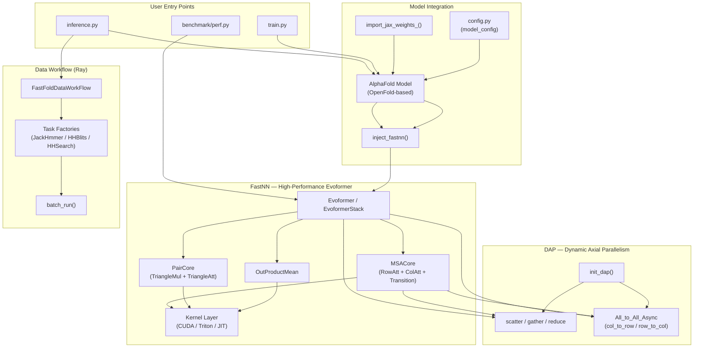

---
slug:1-overview
blog_type:normal
---


FastFold 是 AlphaFold **Evoformer** 模块的高性能重实现，旨在优化 GPU 集群上的蛋白质结构预测。FastFold 基于 ColossalAI 的分布式原语和 OpenFold 的模型架构构建，通过三项核心创新实现了显著的加速与内存缩减：**融合 CUDA/Triton 内核**、**动态轴向并行** 以及 **Ray 加速的数据工作流**。由此构建出的系统，能够在单块 A100 GPU 上推断超过 **10,000 个残基**的序列——远超原始 AlphaFold 的内存上限。


来源: [README.md](/README.md#L1-L30), [setup.py](/setup.py#L129-L143)

## FastFold 解决的问题

AlphaFold 的 Evoformer 是蛋白质结构预测的计算瓶颈。其 48 个迭代块执行 MSA 注意力、三角形乘法更新和外积均值操作，在序列长度上会产生二次方的内存开销。原始实现存在三项根本局限，而 FastFold 正好直击痛点：

| 局限性 | 根本原因 | FastFold 解决方案 |
|---|---|---|
| **内核低效** | 原生 PyTorch 算子导致冗余的内存往返 | 融合 CUDA 内核 + Triton JIT 内核（用于注意力、softmax 和层归一化） |
| **单 GPU 内存墙** | Pair 表示的复杂度相对于序列长度 N 为 O(N²) | 动态轴向并行通过全互联通信将计算分摊到多块 GPU 上 |
| **数据预处理缓慢** | 串行 MSA 搜索 (jackhmmer, HHblits, HHsearch) | 具备任务级并行能力的 Ray 工作流 DAG（单体约 3 倍加速，多体约 3N 倍加速） |

<CgxTip>FastFold 在运行时通过 `inject_fastnn()` 替换 OpenFold 的 Evoformer——这是一种权重复制注入机制，能将原始模型的每个参数映射到优化后的 FastNN 模块中，无需重新训练。这意味着你无需更改训练或推理流程即可获得加速。</CgxTip>

来源: [README.md](/README.md#L19-L30), [fastfold/utils/inject_fastnn.py](/fastfold/utils/inject_fastnn.py#L1-L30)

## 架构概览

FastFold 由四个紧密集成的子系统组成。**FastNN 模块**通过融合内核与分块执行提供优化后的 Evoformer。**DAP 分布式层**通过 scatter/gather 和异步全互联通信处理张量并行。**数据工作流**通过 Ray DAG 加速 MSA 搜索。**模型集成层**通过权重注入与配置将各部分桥接在一起。



来源: [fastfold/model/fastnn/__init__.py](/fastfold/model/fastnn/__init__.py#L1-L13), [fastfold/distributed/__init__.py](/fastfold/distributed/__init__.py#L1-L7), [fastfold/workflow/template/fastfold_data_workflow.py](/fastfold/workflow/template/fastfold_data_workflow.py#L1-L50), [inference.py](/inference.py#L30-L45)

## 项目结构

代码库按职责进行了清晰划分。以下是带有注释的目录结构可视化映射：

```
FastFold/
├── inference.py / train.py          ← 推理与训练入口
├── fastfold/
│   ├── model/
│   │   ├── fastnn/                  ← ⚡ 高性能 Evoformer
│   │   │   ├── evoformer.py         ← Evoformer & EvoformerStack
│   │   │   ├── msa.py               ← MSA 注意力 (行 + 列 + 全局)
│   │   │   ├── triangle.py          ← Pair 注意力 (三角形乘法 + 注意力)
│   │   │   ├── ops.py               ← OutProductMean, Linear, 分块执行
│   │   │   ├── embedders.py         ← 模板与循环嵌入器
│   │   │   └── kernel/              ← 融合内核实现
│   │   │       ├── cuda_native/     ← 自定义 CUDA C++ 内核 (layer_norm, softmax)
│   │   │       ├── triton/          ← Triton JIT 内核 (attention, layernorm, softmax)
│   │   │       └── jit/             ← PyTorch JIT 融合操作
│   │   ├── nn/                      ← 原始 OpenFold 模型组件
│   │   └── hub/                     ← AlphaFold 模型组装
│   ├── distributed/                 ← 🔀 动态轴向并行
│   │   ├── core.py                  ← init_dap() — 并行初始化
│   │   ├── comm.py                  ← Scatter, Gather, Reduce, All-to-All
│   │   └── comm_async.py            ← 用于计算/通信重叠的异步 All-to-All
│   ├── workflow/                    ← 🚀 Ray 加速数据处理
│   │   ├── factory/                 ← 任务工厂 (jackhmmer, hhblits, hhsearch)
│   │   ├── template/                ← 工作流 DAG 模板 (单体 + 多体)
│   │   └── workflow_run.py          ← batch_run() 执行器
│   ├── data/                        ← 特征流水线与变换
│   ├── utils/
│   │   ├── inject_fastnn.py         ← 从 OpenFold 到 FastNN 的权重注入
│   │   ├── import_weights.py        ← JAX 权重导入
│   │   └── checkpointing.py         ← 块级梯度检查点
│   ├── config.py                    ← 模型配置 (model_1..5, multimer)
│   └── relax/                       ← Amber 弛豫后处理
├── habana/                          ← Intel Habana (Gaudi/Gaudi2) 支持
├── benchmark/perf.py                ← 独立 Evoformer 性能基准测试
├── tests/                           ← FastNN 内核与模块的单元测试
└── scripts/                         ← 数据集下载脚本
```

来源: [setup.py](/setup.py#L86-L127), [fastfold/__init__.py](/fastfold/__init__.py#L1-L1)

## 核心技术解析

### 融合内核层

FastFold 提供了 **三种内核后端**，在运行时根据可用性自动选择，并具备自动回退机制：

| 后端 | 语言 | 内核 | 使用时机 |
|---|---|---|---|
| **CUDA Native** | C++ / CUDA | LayerNorm, Softmax | 当 CUDA 可用时始终可用 |
| **Triton** | Triton DSL | Attention 核心, LayerNorm, Softmax | 当安装了 Triton 且 CUDA 版本为 11.4+ 时 |
| **JIT** | PyTorch JIT | 融合偏置-sigmoid、偏置-dropout-残差 | 始终可用作回退方案 |

CUDA 原生内核在安装时通过 `setup.py` 借助 PyTorch 的 `CUDAExtension` 构建系统进行编译，目标架构为 Volta (sm_70) 和 Ampere (sm_80)。融合的 softmax 和层归一化内核消除了困扰原生 PyTorch 实现的冗余全局内存读写。

来源: [setup.py](/setup.py#L86-L127), [fastfold/model/fastnn/kernel/](/fastfold/model/fastnn/kernel/)

### 动态轴向并行 (DAP)

DAP 是 FastFold 的张量并行策略，它沿**序列维度**将 Evoformer 的 MSA 表示划分到多块 GPU 上。核心洞察在于：MSA 行注意力在每行独立运算，而列注意力则需要跨 GPU 通信。DAP 利用这一点的方式如下：

1. 在首个 Evoformer 块将 MSA 张量 (dim=1) 和 Pair 张量 (dim=1) **Scatter** 到各 GPU 上
2. 无需通信，执行**局部 MSA 行注意力**
3. 使用**异步全互联** (`All_to_All_Async`) 将 MSA 分区从行并行布局转置为列并行布局
4. 在异步通信完成后，执行**局部 MSA 列注意力**
5. 在最后一个 Evoformer 块 **Gather** 结果

异步全互联是关键的优化点：它将 `All_to_All` 通信与 `PairCore` 计算重叠，把通信延迟隐藏在有用的工作背后。随后 `All_to_All_Async_Opp` 等待通信句柄并应用重排。

```python
# Evoformer.forward() 内部简化的 DAP 通信模式:
m = self.msa(m, z, msa_mask)                       # 局部行注意力
z = self.communication(m, msa_mask, z)              # 外积均值
m, work = All_to_All_Async.apply(m, 1, 2)          # 启动异步 row→col
z = self.pair(z, pair_mask)                         # 与 pair 更新重叠
m = All_to_All_Async_Opp.apply(m, work, 1, 2)      # 完成异步，当前为列并行
```

<CgxTip>DAP 至少需要 2 块 GPU。当 `dap_size=1` 时，所有通信原语 (scatter, gather, all-to-all) 将变为空操作，因此代码在单 GPU 上运行时完全一致，无需任何条件分支。</CgxTip>

来源: [fastfold/model/fastnn/evoformer.py](/fastfold/model/fastnn/evoformer.py#L30-L91), [fastfold/distributed/comm.py](/fastfold/distributed/comm.py#L85-L204), [fastfold/distributed/comm_async.py](/fastfold/distributed/comm_async.py#L153-L199)

### Ray 数据工作流

AlphaFold 的数据预处理需针对大型生物数据库运行多个串行 MSA 搜索工具 (jackhmmer, HHblits, HHsearch)——对于单个序列，此过程耗时数小时。FastFold 将该流水线建模为 **Ray 工作流 DAG**，使独立的搜索步骤并发执行：

- **步骤 1**: 针对 UniRef90 运行 JackHmmer (生成 `uniref90_hits.a3m`)
- **步骤 2**: 针对 PDB70 运行 HHSearch (依赖于步骤 1 的输出)
- **步骤 3**: 针对 MGnify 运行 JackHmmer (独立于步骤 1-2)
- **步骤 4**: 针对 BFD 运行 HHBlits (独立于步骤 1-3)

步骤 1+2 存在依赖关系 (HHSearch 需要 UniRef90 的命中结果)，但步骤 3 和 4 与整个步骤 1→2 链并行执行。这种并行性在**单体**序列上实现了约 **3 倍加速**，在包含 N 条链的**多体**上实现了约 **3N 倍加速**。该工作流可通过 `--enable_workflow` 标志启用。

来源: [fastfold/workflow/template/fastfold_data_workflow.py](/fastfold/workflow/template/fastfold_data_workflow.py#L121-L170), [README.md](/README.md#L138-L139)

### 内存高效分块执行

对于超长序列，FastFold 提供了**分块执行模式** (`--chunk_size N`)，以更小的分片处理注意力计算，通过牺牲部分吞吐量来换取峰值内存的降低。结合 `--inplace` 标志（共享嵌入表示的内存）与 bfloat16 精度，FastFold 能够在 A100 80GB GPU 上以 61 GB 的内存推断 **10,000+ 残基**的序列。

来源: [fastfold/model/fastnn/ops.py](/fastfold/model/fastnn/ops.py#L31-L42), [README.md](/README.md#L141-L146)

## 平台支持

| 平台 | 精度 | DAP 支持 | 最大序列长度 | 特殊配置 |
|---|---|---|---|---|
| **NVIDIA GPU (A100)** | bf16 / fp32 | ✅ 多 GPU | 10,000+ (bf16, 分块) | CUDA 11.3+, PyTorch 1.12+ |
| **NVIDIA GPU (单卡)** | bf16 / fp32 | 仅单 GPU | ~3,000 (bf16) | 标准安装 |
| **Intel Habana (Gaudi/Gaudi2)** | bf16 / fp32 | ✅ | 视情况而定 | SynapseAI R1.7.1, 自定义算子构建 |

来源: [README.md](/README.md#L31-L61), [habana/](/habana/)

## 核心能力摘要

| 能力 | 描述 | 配置 |
|---|---|---|
| **融合内核** | 用于注意力、softmax 和层归一化的自定义 CUDA + Triton 内核 | 安装时自动生效 |
| **动态轴向并行** | 带异步通信的多 GPU 张量并行 | `init_dap(dap_size)` / `--gpus N` |
| **权重注入** | 以 FastNN 直接替换 OpenFold Evoformer | `inject_fastnn(model)` |
| **JAX 权重导入** | 直接加载预训练的 AlphaFold JAX 权重 | `import_jax_weights_(model, path)` |
| **Ray 数据工作流** | 基于 DAG 调度的并行 MSA 搜索 | `--enable_workflow` |
| **分块执行** | 基于分片的注意力机制，降低峰值内存 | `--chunk_size N` |
| **原位执行** | 内存共享的嵌入表示 | `--inplace` |
| **多体支持** | 带配对 MSA 的 AlphaFold-Multimer 推断 | `--model_preset multimer` |
| **兼容 AlphaFold v2.3** | 支持最新的 AlphaFold 模型配置 | 通过 `model_config()` 自动生效 |
| **Habana 支持** | Intel Gaudi/Gaudi2 加速器支持 | 自定义算子构建 + `habana/` 脚本 |

来源: [README.md](/README.md#L12-L30), [fastfold/config.py](/fastfold/config.py#L30-L125)

## 下一步阅读

现在你已经了解了 FastFold 的架构与能力，以下是建议的阅读路径，助你快速上手：

1. **[快速开始](2-quick-start)** — 安装 FastFold、下载数据集并运行首次推断
2. **[推断指南](3-inference-guide)** — 详细的推断配置：DAP 设置、分块执行、多体模式与内存调优
3. **[架构概览](5-architecture-overview)** — 深入探讨 FastNN、DAP 和数据工作流的互连方式
4. **[FastNN 模块设计](6-fastnn-module-design)** — 优化后的 Evoformer 堆栈内部结构
5. **[DAP 通信原语](9-dap-communication-primitives)** — 驱动多 GPU 并行的 Scatter、Gather 和全互联原语
6. **[用于 MSA 搜索的 Ray 工作流](12-ray-workflow-for-msa-search)** — Ray DAG 如何加速数据预处理流水线