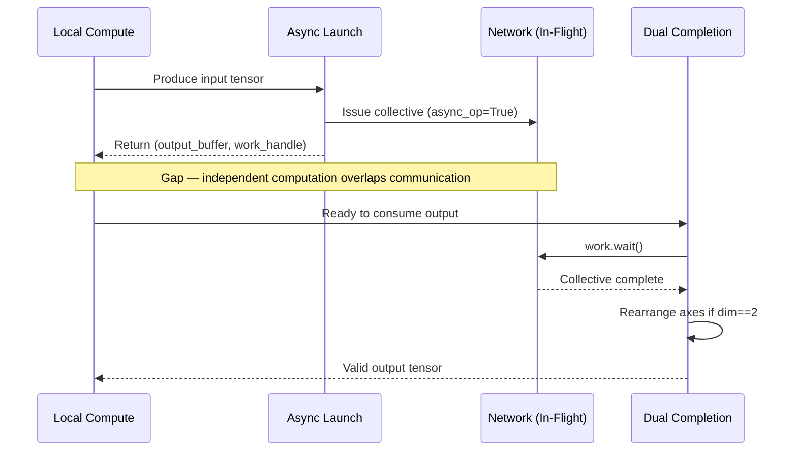

---
slug:10-duality-async-operation
blog_type:normal
---


FastFold 的**对偶异步操作**是一种通信-计算重叠策略，也是动态轴向并行（DAP）的核心。每个异步集合通信操作都配对一个*对偶*完成原语——即“opp”对应项——它既同步正在进行的工作句柄，又应用必要的张量重排。这种对偶契约使得调度器能够在通信发起与其同步屏障之间插入独立的计算，将原本串行的集合通信延迟转化为重叠的吞吐量。

## 对偶契约

对偶模式为每个分布式集合通信建立了一个严格的两阶段协议：**发起**（异步操作）和**完成**（opp 操作）。发起阶段使用 `async_op=True` 发起通信，并立即返回一个工作句柄以及一个预分配的输出缓冲区——调用方不会被阻塞。完成阶段消费工作句柄，调用 `work.wait()`，并执行 DAP 分片语义所需的任何维度轴重排。其不变量是，在 opp 阶段完成之前，任何消费者都不能读取输出缓冲区，但任何独立的计算都可以在发起和完成之间的间隙中执行。



这种重叠并非可选的微优化——它是结构性的。在 Evoformer 块中，MSA 全互联通信和 PairCore 计算在设计上就是并发的；移除这种重叠将使它们串行化，并使挂钟时间增加整个集合通信的延迟。

来源: [comm_async.py](/fastfold/distributed/comm_async.py#L1-L11), [evoformer.py](/fastfold/model/fastnn/evoformer.py#L64-L69)

## 对偶操作对

`comm_async.py` 中定义了三个对偶对。每个对共享一个共同的结构：第一个函数发起异步集合通信并返回 `(tensor, work)`，而第二个函数接收相同的元组，等待工作完成，并应用完成后的转换。

| 对偶对 | 发起（异步） | 完成 | 集合通信 | 重排条件 |
|---|---|---|---|---|
| **Gather** | `gather_async(input, dim)` → `(output, work)` | `gather_async_opp(output, work, dim)` → `Tensor` | `dist.all_gather` | `dim == 2`: `rearrange('n (x h) w c → n h (x w) c')` |
| **All-to-All** | `All_to_All_Async.apply(input, in_dim, out_dim)` → `(output, work)` | `All_to_All_Async_Opp.apply(output, work, in_dim, out_dim)` → `Tensor` | `dist.all_to_all` | `out_dim == 2`: `rearrange('n (x h) w c → n h (x w) c')` |
| **Broadcast** | `broadcast_async(src, tensor, host)` → `work` | `broadcast_async_opp(work)` → `0` | `dist.broadcast` | None（无重排） |

重排条件 `dim == 2`（或 `out_dim == 2`）反映了 DAP 的列并行分片约定。当 gather 或 all-to-all 沿着维度 2（即形状为 `[batch, rows, cols, channels]` 的 4D 张量中的列/序列轴）操作时，收集后的结果会交错并行维度——`n (x h) w c`——并且必须被紧凑化为 `n h (x w) c`，其中 `x` 为全局进程数。这正是将按秩分块排序转换为下游层所期望的连续逻辑排序的轴交换操作。

来源: [comm_async.py](/fastfold/distributed/comm_async.py#L66-L111), [comm_async.py](/fastfold/distributed/comm_async.py#L129-L199), [comm_async.py](/fastfold/distributed/comm_async.py#L34-L55)

## Gather 异步及其对偶

`gather_async` / `gather_async_opp` 对是 FastFold 中最常用的对偶操作。它出现在外积均值、三角形乘法和注意力偏置计算中——即在局部分片的张量必须在归约或 einsum 之前物化为其完整形状的任何地方。

**发起阶段**（`_gather_async`）：预分配形状为 `[..., world_size × dim_1, ...]` 的输出缓冲区，将其拆分为 `world_size` 个块，并使用 `async_op=True` 发起 `dist.all_gather`。输出缓冲区和工作句柄将被立即返回。

**完成阶段**（`gather_async_opp`）：调用 `work.wait()` 进行同步，然后——仅在 `dim == 2` 时——应用 `GatherAsyncOpp`，这是一个自定义的 `torch.autograd.Function`，其前向传播执行 `rearrange('n (x h) w c → n h (x w) c')` 紧凑化，其反向传播通过 `resize_` 将其反转。

支持自动求导的包装器 `gather_async` 和 `gather_async_opp` 在启用梯度时会分派给自定义的 `GatherAsync` / `GatherAsyncOpp` 函数，从而确保正确的反向传播。`GatherAsync.backward` 委托给 `_split`（gather 的数学逆运算），而 `GatherAsyncOpp.backward` 则执行逆 resize。

```python
# OutProductMean.forward 中的典型用法模式：
right_act_all, work = gather_async(right_act, dim=2)   # ← 发起
left_act = self.linear_a(M)                             # ← 重叠：独立计算
M_mask_col = scatter(M_mask, dim=2)                     # ← 重叠：独立计算
left_act = M_mask_col * left_act                        # ← 重叠：独立计算
norm = torch.einsum('bsid,bsjd->bijd', M_mask_col, M_mask) + 1e-3  # ← 重叠
right_act_all = gather_async_opp(right_act_all, work, dim=2)  # ← 完成
```

来源: [comm_async.py](/fastfold/distributed/comm_async.py#L66-L127), [ops.py](/fastfold/model/fastnn/ops.py#L141-L154)

## All-to-All 异步及其对偶

`All_to_All_Async` / `All_to_All_Async_Opp` 对实现了在行并行和列并行张量布局之间转换的轴交换通信——这是 DAP 的基础原语。在 Evoformer 块中，此通信负责将 MSA 表示从行分区形式重新分配为列分区形式。

**发起阶段**（`_all_to_all_async`）：沿 `in_dim` 将输入张量拆分为 `world_size` 个相等的块，预分配输出缓冲区，并使用 `async_op=True` 发起 `dist.all_to_all`。每个秩将其第 `i` 个块发送至秩 `i`，并将秩 `i` 的块接收到其第 `i` 个输出槽位中。

**完成阶段**（`All_to_All_Async_Opp`）：等待工作句柄，然后——当 `out_dim == 2` 时——应用 `rearrange('n (x h) w c → n h (x w) c')` 紧凑化。这与 gather 对偶中的轴交换相同，因为 `out_dim == 2` 的 all-to-all 会产生相同的交错布局。

**通过 `WORLD_WORK_ALL2ALL` 耦合反向传播**：all-to-all 对偶使用模块级全局变量 `WORLD_WORK_ALL2ALL` 来流水线化反向传播。当调用 `All_to_All_Async.backward` 时，它首先等待上一次反向传播步骤中未完成的 `WORLD_WORK_ALL2ALL`，然后将当前反向传播的 all-to-all 工柄设置为新的全局句柄。当调用 `All_to_All_Async_Opp.backward` 时，它会发起一个新的 `_all_to_all_async` 并将其工作句柄存储在 `WORLD_WORK_ALL2ALL` 中。这种串行链式设计确保了连续的反向 all-to-all 操作不会在网络资源上发生竞争，同时仍允许与紧邻的计算进行重叠。

```python
# Evoformer 块 — 典型的对偶重叠：
m, work = All_to_All_Async.apply(m, 1, 2)   # ← 发起 MSA 轴交换
z = self.pair(z, pair_mask)                   # ← 重叠：PairCore 并发运行
m = All_to_All_Async_Opp.apply(m, work, 1, 2)  # ← 完成：MSA 现为列并行
```

来源: [comm_async.py](/fastfold/distributed/comm_async.py#L129-L199), [evoformer.py](/fastfold/model/fastnn/evoformer.py#L64-L69)

## Broadcast 异步及其对偶

`broadcast_async` / `broadcast_async_opp` 对仅用于分块三角形乘法模块（`AsyncChunkTriangleMultiplicationOutgoing` 和 `AsyncChunkTriangleMultiplicationIncoming`）。这些模块实现了一个流水线化的广播调度：在遍历 `world_size` 个秩的循环中，每次迭代将一个秩的投影激活广播给所有其他秩，而前一次迭代的广播仍在传输中。

**发起阶段**：使用 `async_op=True` 发起 `dist.broadcast`。`host` 标志区分源秩（原地广播）与接收秩（广播到预分配的缓冲区）。

**完成阶段**：仅调用 `work.wait()`。与 gather 和 all-to-all 不同，不需要任何重排——广播保持了张量形状不变。

流水线逻辑如下：迭代 `k` 消费前一次迭代的异步广播结果（通过 `broadcast_async_opp`），然后发起迭代 `k+1` 的广播（通过 `broadcast_async`）。第一次迭代使用 `broadcast_sync`，因为没有先前的计算可以重叠。这创建了一个软件流水线，其中每次广播的网络延迟都被隐藏在前一次迭代接收数据的矩阵乘法计算之后。

```python
# 流水线广播调度（简化版）：
for k in range(world_size):
    if work:
        broadcast_async_opp(work)          # ← 完成前一次广播
        right_proj_act_rec = tmp.clone()   # ← 消费接收到的数据
    if k + 1 != world_size:
        work = broadcast_async(k+1, ...)   # ← 发起下一次广播
    # ... 利用 right_proj_act_rec 的矩阵乘法与下一次广播重叠 ...
```

来源: [comm_async.py](/fastfold/distributed/comm_async.py#L34-L55), [ops.py](/fastfold/model/fastnn/ops.py#L446-L483)

## 自动求导集成

每个对偶对都通过自定义 `torch.autograd.Function` 子类与 PyTorch 的自动求导系统集成。这并非为了便利——而是正确性的要求。如果没有支持自动求导的实现，异步通信将对反向传播不可见，从而在 DAP 下产生错误的梯度。

| 自动求导函数 | 前向传播 | 反向传播 |
|---|---|---|
| `GatherAsync` | `_gather_async(input, dim)` | `_split(grad_output, dim)` — scatter 是 gather 的伴随运算 |
| `GatherAsyncOpp` | `rearrange('n (x h) w c → n h (x w) c')` | `resize_(n, h*mp_size, w/mp_size, c)` — 逆重排 |
| `All_to_All_Async` | `_all_to_all_async(input, in_dim, out_dim)` | 当 `in_dim==2` 时 `rearrange(grad, 'n (x h) w c → n h (x w) c')` |
| `All_to_All_Async_Opp` | `work.wait()` + 当 `out_dim==2` 时重排 | `_all_to_all_async(grad, out_dim, in_dim)` — all-to-all 是自伴随的 |

<CgxTip>`All_to_All_Async_Opp.backward` 会发起一个*新的*异步 all-to-all（交换 `in_dim` 和 `out_dim`），并将其工作句柄存储在全局变量 `WORLD_WORK_ALL2ALL` 中。下一次 `All_to_All_Async.backward` 调用将在继续之前等待此句柄。这种串行链式设计是必要的，因为 `torch.autograd.Function.backward` 在调用者的流上同步运行——如果没有全局句柄，两个并发的反向 all-to-all 操作将破坏彼此的网络缓冲区。</CgxTip>

来源: [comm_async.py](/fastfold/distributed/comm_async.py#L98-L199)

## 模型中的使用位置

对偶异步模式被部署在 Evoformer 堆栈中的每个通信边界。下表将每个使用位置映射到其对应的对偶对以及与该通信重叠的计算。

| 模块 | 对偶对 | 重叠的计算 | 文件 |
|---|---|---|---|
| `Evoformer.forward` | All-to-All | `PairCore(z, pair_mask)` | [evoformer.py](/fastfold/model/fastnn/evoformer.py#L67-L69) |
| `OutProductMean.forward` | Gather | `linear_a(M)`, mask scatter, norm einsum | [ops.py](/fastfold/model/fastnn/ops.py#L145-L154) |
| `TriangleMultiplicationOutgoing` | Gather | `output_gate(Z)`, `permute_final_dims` | [triangle.py](/fastfold/model/fastnn/triangle.py#L51-L56) |
| `TriangleMultiplicationIncoming` | Gather | `output_gate(Z)`, `permute_final_dims` | [triangle.py](/fastfold/model/fastnn/triangle.py#L103-L109) |
| `TriangleAttentionStartingNode` | Gather | `attention(Z, Z_mask, (b, work))` — 偏置在内部被消费 | [triangle.py](/fastfold/model/fastnn/triangle.py#L154-L159) |
| `MSARowAttentionWithPairBias` | Gather | `attention(M, M_mask, (b, work))` — 偏置在内部被消费 | [msa.py](/fastfold/model/fastnn/msa.py#L64-L69) |
| `AsyncChunkTriangleMultOutgoing` | Broadcast（流水线化） | `matmul(left_proj_act, right_proj_act_rec)` | [ops.py](/fastfold/model/fastnn/ops.py#L446-L483) |
| `AsyncChunkTriangleMultIncoming` | Broadcast（流水线化） | `matmul(left_proj_act_rec, right_proj_act)` | [ops.py](/fastfold/model/fastnn/ops.py#L575-L614) |
| `ChunkTriangleAttentionStartingNode` | Gather | 分块偏置预计算，然后执行 attention | [ops.py](/fastfold/model/fastnn/ops.py#L662-L680) |

<CgxTip>在注意力模块（`MSARowAttentionWithPairBias`、`TriangleAttentionStartingNode`）中，gather-async 对偶用于对偶偏置张量 `b`。发起操作在进入 `SelfAttention.forward` 之前发生，而完成操作（`gather_async_opp`）在实际消费偏置时于 `SelfAttention.forward` *内部*被调用——它通过 `nonbatched_bias` 参数以元组 `(b, work)` 的形式传递。这种延迟完成最大化了重叠窗口，允许 QKV 投影和部分注意力计算在 gather 完成之前继续执行。</CgxTip>

来源: [evoformer.py](/fastfold/model/fastnn/evoformer.py#L64-L69), [ops.py](/fastfold/model/fastnn/ops.py#L141-L154), [triangle.py](/fastfold/model/fastnn/triangle.py#L51-L56), [msa.py](/fastfold/model/fastnn/msa.py#L64-L69)

## 对偶与同步通信

[comm.py](/fastfold/distributed/comm.py) 中的同步对应项——`gather`、`col_to_row`、`row_to_col`——调用了相同的 `dist.all_gather` / `dist.all_to_all` 原语，但设置了 `async_op=False`，从而阻塞调用方直到集合通信完成。它们仅在 DAP 边界条件下使用：将输入划分到各秩的初始 `scatter`，以及重组完整输出的最终 `gather`。Evoformer 循环内的所有中间通信均使用异步对偶对。

其架构意义在于，Evoformer 每个块的通信成本不再是完整的集合通信延迟，而是 `max(compute_time, comm_time)`——这种重叠将串行的 `compute + comm` 转换为并行的 `compute ∥ comm`。对于 Evoformer 块中的 all-to-all，PairCore 计算（四个三角形操作 + transition）提供了重叠窗口，且其计算量通常大于 all-to-all 延迟，从而使得有效通信成本接近于零。

来源: [comm.py](/fastfold/distributed/comm.py#L42-L65), [comm.py](/fastfold/distributed/comm.py#L146-L173), [evoformer.py](/fastfold/model/fastnn/evoformer.py#L53-L86)

## 后续步骤

对偶异步操作构建在 [DAP 通信原语](9-dap-communication-primitives) 中描述的基础集合通信之上。有关定义张量如何跨 DAP 秩进行分区与重组的特定 scatter-gather 和 all-to-all 模式，请参见 [Scatter-Gather 与 All-to-All](11-scatter-gather-and-all-to-all)。