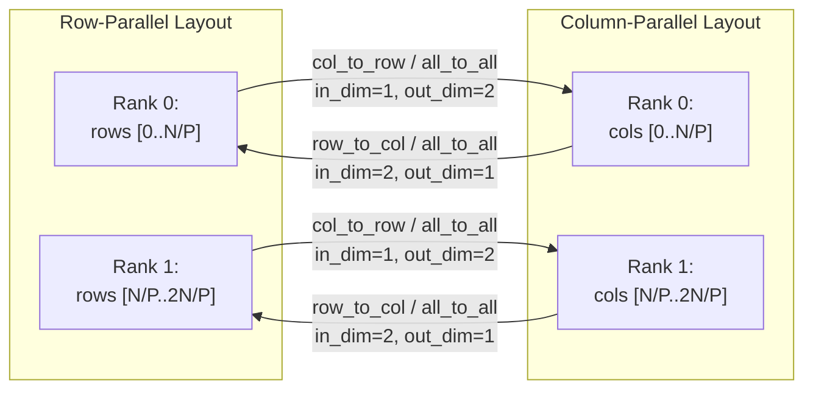
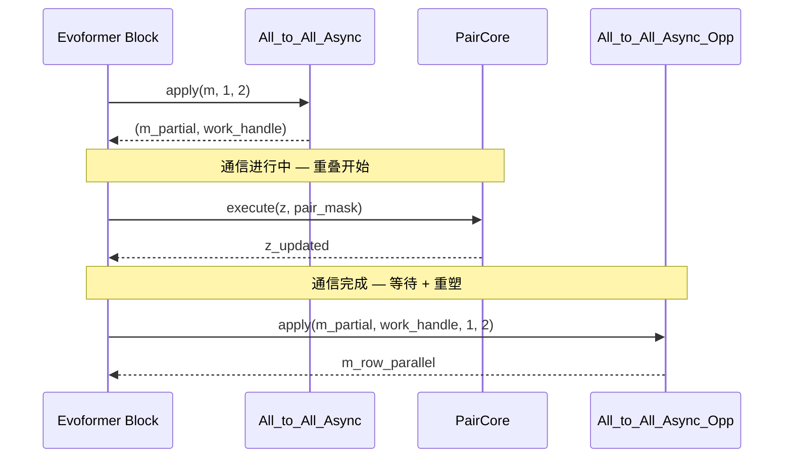
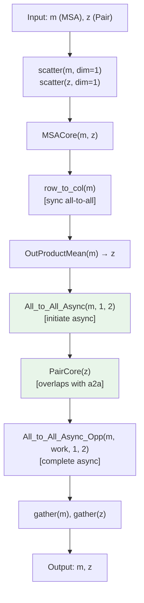

---
slug:11-scatter-gather-and-all-to-all
blog_type:normal
---


FastFold的动态轴向并行依赖于两族集合通信——**scatter-gather**用于沿单轴切分和重组张量，**all-to-all**用于在行并行和列并行分解机制之间转置数据。这两族通信均被实现为`torch.autograd.Function`的子类，将自身的逆运算嵌入为反向传播，从而对训练过程透明。构建在这些同步原语之上的异步层使通信与下游计算重叠，这是让Evoformer能在pair堆栈执行期间隐藏all-to-all延迟的关键机制。

来源：[comm.py](/fastfold/distributed/comm.py#L1-L204)，[comm_async.py](/fastfold/distributed/comm_async.py#L1-L199)，[core.py](/fastfold/distributed/core.py#L1-L41)

## 同步Scatter与Gather

`scatter` / `gather`对构成了每个DAP区域的入口和出口边界。**Scatter**沿指定维度将全局复制的张量切分为等大的块，并仅返回属于当前本地rank的块。**Gather**是其逆运算——将所有rank的块重新拼接为完整的张量。两者均作为公共函数暴露，根据是否启用梯度来分派至原始集合通信或autograd包装版本。

| 操作 | 前向传播 | 反向传播 |
|-----------|---------|---------------------|
| `scatter(input, dim)` | `_split` — 通过`torch.split`获取本地块 | `_gather` — `dist.all_gather`后接`torch.cat` |
| `gather(input, dim)` | `_gather` — `dist.all_gather`后接`torch.cat` | `_split` — 通过`torch.split`获取本地块 |

`_split`辅助函数计算`split_size = tensor.shape[dim] / world_size`，调用`torch.split`，并返回由本地rank索引的切片。`_gather`辅助函数在批次维度大小为1且`dim=1`时，具有一条**优化的快速路径**：它预分配一个单一的连续输出张量，并使用`output.chunk()`为`dist.all_gather`生成基于视图的子张量，从而避免额外的拼接操作。常规路径则分配一个按rank划分的缓冲区列表，将数据`all_gather`至其中，然后执行`torch.cat`。

```python
# 入口：跨DAP ranks切分MSA与pair表征
m = scatter(m, dim=1)   # MSA：沿序列行切分
z = scatter(z, dim=1)   # Pair：沿首个pair维度切分

# 出口：在返回非DAP代码前重组
m = gather(m, dim=0)    # MSA：跨批次切分块进行gather
z = gather(z, dim=0)    # Pair：跨批次切分块进行gather
```

当`world_size == 1`时，这两个操作会提前原样返回输入，因此相同的代码在不启用DAP时也能正确运行。

来源：[comm.py](/fastfold/distributed/comm.py#L30-L143)，[evoformer.py](/fastfold/model/fastnn/evoformer.py#L45-L56)

## 同步All-to-All：`col_to_row`与`row_to_col`

scatter-gather沿*单一*轴移动数据，而all-to-all则同时跨*两*轴重新分配数据——它是将**列并行**布局转换为**行并行**布局（反之亦然）的通信原语。在FastFold中，这由两个命名的便捷包装器实现：

- **`row_to_col(input)`** — 以`in_dim=2, out_dim=1`调用`_all_to_all`。将MSA或pair数据从行并行（序列在dim 2上切分）重新分配为列并行（序列在dim 1上切分）。
- **`col_to_row(input)`** — 以`in_dim=1, out_dim=2`调用`_all_to_all`。逆方向的转换。

内部`_all_to_all`函数沿`in_dim`将输入张量切分为`world_size`个块，发起`dist.all_to_all`将每个rank的块重新分配至不同的rank，然后沿`out_dim`拼接接收到的块。与`_gather`类似，当`out_dim == 1`时，它具有一条**连续内存快速路径**：单一预分配缓冲区被切分为多个视图作为输出列表，消除了最后的`torch.cat`操作。

autograd包装器`All_to_All`在`ctx`中保存了`in_dim`和`out_dim`，其反向传播仅以**交换**的维度（`in_dim`与`out_dim`互换）再次调用`_all_to_all`。这在数学上是可靠的，因为当维度转置时，all-to-all是其自身的逆运算。



来源：[comm.py](/fastfold/distributed/comm.py#L146-L203)，[triangle.py](/fastfold/model/fastnn/triangle.py#L241-L253)

## 异步All-to-All：通信与计算重叠

同步all-to-all是一个同步屏障——每个rank都会阻塞，直到所有数据交换完毕。对于Evoformer的内部循环，这是不可接受的，因为MSA堆栈和pair堆栈可以在不同的数据上并发执行。FastFold通过`All_to_All_Async`和`All_to_All_Async_Opp`解决了这个问题，这是一种**分阶段**的all-to-all，将发起与完成解耦。

该模式如下：

1. **发起** — `All_to_All_Async.apply(m, in_dim=1, out_dim=2)`以`async_op=True`调用`dist.all_to_all`，返回一个结果缓冲区（其内容尚无效）和一个异步`work`句柄。
2. **重叠** — 调用方继续在不依赖all-to-all结果的数据上执行pair堆栈（`PairCore`），从而有效将通信延迟隐藏在有用的计算之后。
3. **完成** — `All_to_All_Async_Opp.apply(m, work, in_dim=1, out_dim=2)`调用`work.wait()`进行同步，然后当`out_dim == 2`时应用`rearrange`重塑输出（使用einops从为gather优化的dim-1布局转换至目标dim-2布局）。



`All_to_All_Async_Opp`的反向传播在相反方向（`in_dim` ↔ `out_dim`）重新发起一次**异步**all-to-all，并将work/句柄存储在全局`WORLD_WORK_ALL2ALL`中。`All_to_All_Async`的反向传播在继续之前会等待此全局句柄，确保在梯度累加继续之前反向通信已完成。这种全局变量方法是一种刻意的权衡：它避免了在autograd计算图中进行复杂的句柄传递，代价是限制同一时刻只能有一个未完成的all-to-all以保证正确性——Evoformer的串行块结构恰好满足此条件。

来源：[comm_async.py](/fastfold/distributed/comm_async.py#L129-L199)，[evoformer.py](/fastfold/model/fastnn/evoformer.py#L64-L69)

## 异步Gather：偏置通信与注意力计算重叠

第二种异步通信模式出现在计算pair偏置的注意力层内部。当`MSARowAttentionWithPairBias`计算`b = F.linear(Z, self.linear_b_weights)`时，偏置张量`b`处于行并行布局，但注意力计算需要其在dim 1上gathered。代码未在同步gather上阻塞，而是发起`gather_async(b, dim=1)`，将`(b, work)`元组向下游传递给注意力核心，该核心仅在偏置被实际消费时——即在Q/K/V投影已计算完毕之后——才调用`gather_async_opp`进行等待和重排。

`GatherAsync` autograd函数在`ctx.dim`中保存`dim`，其反向传播对`dim == 2`具有特化的重排：当梯度回传时，它会在切分前将大小从`(n, h, w, c)`调整为`(n, h/mp_size, w*mp_size, c)`，这正是`GatherAsyncOpp`前向传播中`rearrange('n (x h) w c -> n h (x w) c')`的逆操作。

| 层 | 异步原语 | 重叠的计算 |
|-------|----------------|----------------------|
| `MSARowAttentionWithPairBias` | `gather_async(b, dim=1)` | Q/K/V线性投影 |
| `TriangleAttentionStartingNode` | `gather_async(b, dim=1)` | Q/K/V线性投影 |
| `TriangleMultiplicationOutgoing` | `gather_async(right_act, dim=1)` | 输出门控 + 左置换 |
| `TriangleMultiplicationIncoming` | `gather_async(left_act, dim=2)` | 输出门控 + 右置换 |
| `Evoformer` / `ExtraMSABlock` | `All_to_All_Async(m, 1, 2)` | `PairCore`完整执行 |

来源：[comm_async.py](/fastfold/distributed/comm_async.py#L66-L127)，[msa.py](/fastfold/model/fastnn/msa.py#L59-L72)，[triangle.py](/fastfold/model/fastnn/triangle.py#L40-L56)

## Evoformer块中的DAP数据流

将所有原语组合起来，单个Evoformer块执行以下精确的通信序列：



在`MSACore`内部，一次内部的`row_to_col`（同步all-to-all）在行注意力和列注意力之间将MSA表征从行并行转换为列并行。在`PairCore`内部，发生三次轴向转置操作：传入三角形乘法前的`row_to_col`，起始节点三角形注意力前的`col_to_row`，以及结束节点注意力后的最终`col_to_row`。`PairCore`内部的每个`row_to_col` / `col_to_row`均为同步all-to-all，因为pair堆栈的操作是顺序执行的，没有重叠机会。

<CgxTip>异步all-to-all重叠是Evoformer中影响最大的通信优化。当pair堆栈的计算时间超过all-to-all传输时间时（这在长序列中很典型），all-to-all实际上变得免费。这就是为什么`All_to_All_Async`被应用于MSA张量而`PairCore`同时运行的原因——MSA all-to-all与pair计算处理的是独立的数据。</CgxTip>

来源：[evoformer.py](/fastfold/model/fastnn/evoformer.py#L30-L91)，[msa.py](/fastfold/model/fastnn/msa.py#L140-L151)，[triangle.py](/fastfold/model/fastnn/triangle.py#L241-L253)

## Autograd对偶性：前向-反向求逆

`comm.py`中的每个通信原语均被实现为`torch.autograd.Function`，其反向传播是其前向传播的**精确逆运算**。这并非巧合——这是DAP的结构性要求。在前向传播期间，数据被切分和转置以匹配每个子操作的并行布局。在反向传播期间，梯度必须遵循相反的路径：`scatter`的反向传播是`gather`，`gather`的反向传播是`scatter`，`all_to_all(in_dim, out_dim)`的反向传播是`all_to_all(out_dim, in_dim)`。

| 前向操作 | 反向操作 | 数学依据 |
|---|---|---|
| `Scatter.forward` → `_split` | `Scatter.backward` → `_gather` | 部分梯度之和 = 完整梯度 |
| `Gather.forward` → `_gather` | `Gather.backward` → `_split` | 局部梯度 = 完整梯度之分片 |
| `All_to_All.forward` → `_all_to_all(in, out)` | `All_to_All.backward` → `_all_to_all(out, in)` | All-to-all在维度交换下自逆 |
| `Reduce.forward` → `_reduce` (all-reduce SUM) | `Reduce.backward` → 恒等(Identity) | 求和为线性操作；梯度无损传递 |
| `Copy.forward` → 恒等(Identity) | `Copy.backward` → `_reduce` | 前向复制 → 反向归约求和 |

`Reduce`和`Copy`函数是用于权重同步的辅助原语。`Copy`在前向传播中是一个无操作（输入已被复制），但在反向传播中归约梯度以确保跨rank一致性。`Reduce`在前向传播中执行all-reduce，并在反向传播中让梯度无损传递，用于必须在所有rank上相同的输出。

来源：[comm.py](/fastfold/distributed/comm.py#L68-L143)，[comm.py](/fastfold/distributed/comm.py#8-L192-L203)

## 填充与整除性

所有scatter、gather和all-to-all操作均要求被切分的维度可被`world_size`整除。`core.py`中的`ensure_divisibility`断言在`_split`层强制执行了这一点。在Evoformer中，此要求通过计算`padding_size = (seq_length / dap_size + 1) * dap_size - seq_length`并在初始scatter前对MSA和pair张量进行零填充来处理。在最终gather之后，填充被切片剥离：`m = m[:, :-padding_size, :]`和`z = z[:-padding_size, :-padding_size, :]`。这确保了无论序列长度如何，昂贵的集合通信操作都不会遇到整除性错误。

<CgxTip>在调试DAP通信问题时，请验证scatter维度在入口前已被正确填充，且填充在最终gather后被剥离。此处的不匹配将悄无声息地产生错误结果而非抛出错误，因为gather在切片前会重组包含填充在内的所有块。</CgxTip>

来源：[core.py](/fastfold/distributed/core.py#L7-L9)，[evoformer.py](/fastfold/model/fastnn/evoformer.py#L40-L50)

## API参考

### 同步原语 (`comm.py`)

| 函数 | 签名 | 描述 |
|----------|-----------|-------------|
| `scatter` | `(input: Tensor, dim: int = -1) → Tensor` | 沿`dim`切分，返回本地rank的块 |
| `gather` | `(input: Tensor, dim: int = -1) → Tensor` | 沿`dim`全收集，拼接 |
| `reduce` | `(input: Tensor) → Tensor` | 跨张量并行组的全归约求和 |
| `copy` | `(input: Tensor) → Tensor` | 前向传播为恒等，反向传播为全归约 |
| `col_to_row` | `(input_: Tensor) → Tensor` | All-to-all `in_dim=1, out_dim=2` |
| `row_to_col` | `(input_: Tensor) → Tensor` | All-to-all `in_dim=2, out_dim=1` |

### 异步原语 (`comm_async.py`)

| 函数 | 签名 | 描述 |
|----------|-----------|-------------|
| `gather_async` | `(input: Tensor, dim: int) → (Tensor, Work)` | 发起异步全收集 |
| `gather_async_opp` | `(output: Tensor, work, dim: int) → Tensor` | 等待 + 重排异步gather结果 |
| `All_to_All_Async.apply` | `(input_, in_dim, out_dim) → (Tensor, Work)` | 发起异步all-to-all |
| `All_to_All_Async_Opp.apply` | `(output, work, in_dim, out_dim) → Tensor` | 等待 + 重排异步all-to-all结果 |
| `broadcast_sync` / `broadcast_async` | `(src, tensor, host) → ...` | 同步 / 异步广播 |

所有异步原语均返回一个`(tensor, work_handle)`元组。在调用对应的`_opp`函数传入work句柄之前，张量的内容是**未定义**的。

来源：[comm.py](/fastfold/distributed/comm.py#L85-L189)，[comm_async.py](/fastfold/distributed/comm_async.py#L66-L199)，[__init__.py](/fastfold/distributed/__init__.py#L1-L7)

## 相关主题

- 这些操作所基于的基础原语记录在[DAP通信原语](9-dap-communication-primitives)中。
- 异步重叠的理念与分阶段操作模式在[对偶异步操作](10-duality-async-operation)中阐述。
- 关于使用这些原语的模型级编排，请参阅[FastNN模块设计](6-fastnn-module-design)和[内存高效分块执行](8-memory-efficient-chunked-execution)。