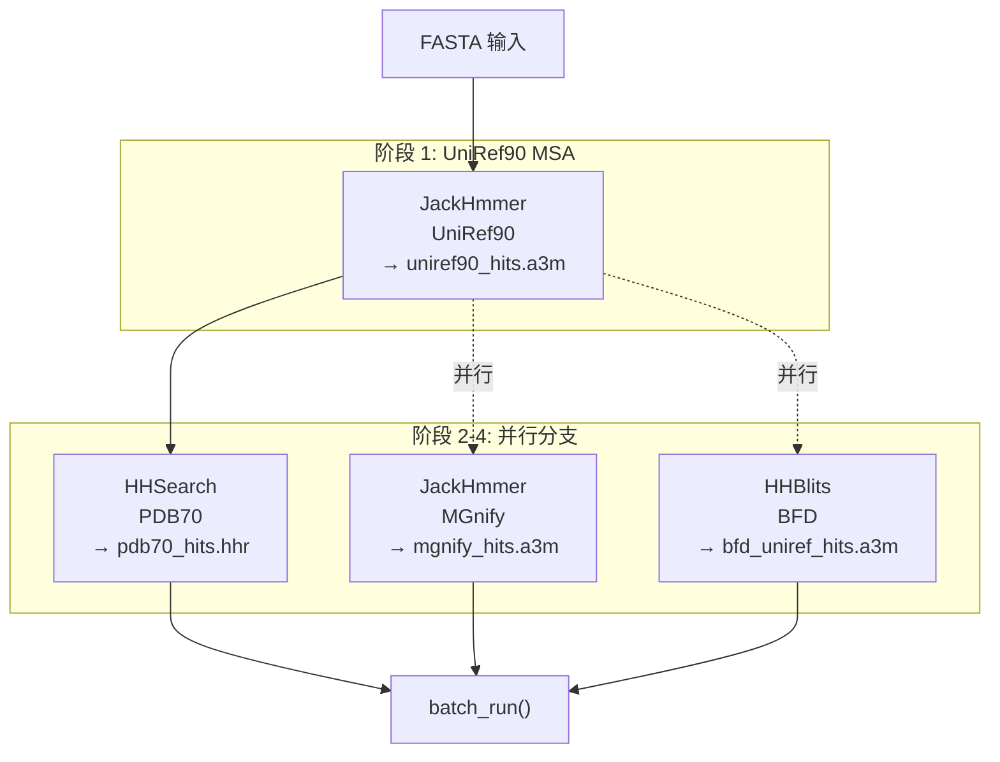
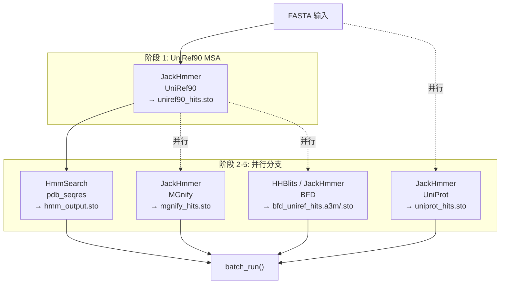

---
slug:12-ray-workflow-for-msa-search
blog_type:normal
---


FastFold 使用 **Ray Workflow** 编排的 DAG（有向无环图）替代了 AlphaFold2 顺序执行的 MSA 搜索流水线，该 DAG 以声明式同时表达了依赖顺序与并行性。通过将每次生物信息学工具的调用建模为 Ray 远程函数节点，独立的搜索得以并发执行，而具有依赖关系的阶段（例如，MSA 生成后的模板搜索）则被自动排序——这显著减少了数据预处理瓶颈的实际耗时。

## 架构概述

该工作流系统分为三层：**工作流模板** 负责组合端到端的 MSA 搜索 DAG，**任务工厂** 负责生成封装了生物信息学工具的独立 Ray 函数节点，**数据工具** 则是调用 HMMER/HH-suite 二进制文件的子进程级运行器。这种分离确保了工作流拓扑、节点配置和工具执行能够独立测试与扩展。

```
┌─────────────────────────────────────────────────────────────────┐
│                     工作流模板                          │
│  FastFoldDataWorkFlow          FastFoldMultimerDataWorkFlow    │
│  (单体: HHSearch 路径)      (多聚体: HmmSearch 路径)     │
└──────────────┬──────────────────────────┬──────────────────────┘
              "             │                          │
               ▼                          ▼
┌─────────────────────────────────────────────────────────────────┐
│                       任务工厂                            │
│  JackHmmerFactory  HHBlitsFactory  HHSearchFactory             │
│  HmmSearchFactory  HHfilterFactory  (基类: TaskFactory)        │
│  ─ gen_node() → ray.remote FunctionNode with .bind()           │
└──────────────┬──────────────────────────┬──────────────────────┘
"             │                          │
               ▼                          ▼
┌─────────────────────────────────────────────────────────────────┐
│                     数据工具 (子进程)                     │
│  Jackhmmer  HHBlits  HHSearch  Hmmsearch  Hmmbuild             │
│  ─ query() → subprocess.Popen → parse output                   │
└─────────────────────────────────────────────────────────────────┘
```

顶层的 `batch_run` 编排器将组合好的 DAG 提交至 Ray 的工作流运行时，由运行时自动处理调度、检查点与恢复。

来源: [fastfold_data_workflow.py](/fastfold/workflow/template/fastfold_data_workflow.py#L1-L170), [fastfold_multimer_data_workflow.py](/fastfold/workflow/template/fastfold_multimer_data_workflow.py#L1-L193), [task_factory.py](/fastfold/workflow/factory/task_factory.py#L1-L51)

## 单体 MSA 搜索 DAG

`FastFoldDataWorkFlow` 为单链结构预测构建了一个四阶段的 DAG。其关键洞察在于**阶段 2、3 和 4 彼此独立**，并在阶段 1 完成后并行执行，这利用了在 PDB70 上运行 HHSearch、在 MGnify 上运行 JackHmmer 以及在 BFD 上运行 HHBlits 互不存在数据依赖——它们仅依赖于 UniRef90 结果这一事实。



`run()` 方法通过工厂调用生成节点，并利用 `after` 参数显式表达依赖关系，从而构建此 DAG：

| 步骤 | 工具 | 数据库 | 输出 | 依赖于 |
|------|------|----------|--------|------------|
| 1 | JackHmmer | UniRef90 | `uniref90_hits.a3m` | FASTA 输入 |
| 2 | HHSearch | PDB70 | `pdb70_hits.hhr` | 步骤 1 输出 |
| 3 | JackHmmer | MGnify | `mgnify_hits.a3m` | FASTA 输入 (并行) |
| 4 | HHBlits / JackHmmer | BFD | `bfd_uniref_hits.a3m` | FASTA 输入 (并行) |

当 `use_small_bfd=True` 时，阶段 4 会从 `HHBlitsFactory` 切换为指向 small BFD 变体的 `JackHmmerFactory`，且输出格式更改为 Stockholm (`.sto`)。

来源: [fastfold_data_workflow.py](/fastfold/workflow/template/fastfold_data_workflow.py#L121-L169)

## 多聚体 MSA 搜索 DAG

`FastFoldMultimerDataWorkFlow` 扩展了单体流水线，具有两个关键差异：**HmmSearch 替代了 HHSearch** 用于模板搜索（使用 `pdb_seqres` 代替 `pdb70`），并新增了 **在 UniProt 上运行 JackHmmer** 的阶段用于链间 MSA 配对。所有输出格式默认为 Stockholm (`.sto`)，以支持多聚体特征处理路径。



| 步骤 | 工具 | 数据库 | 输出 | 依赖于 |
|------|------|----------|--------|------------|
| 1 | JackHmmer | UniRef90 | `uniref90_hits.sto` | FASTA 输入 |
| 2 | HmmSearch | pdb_seqres | `hmm_output.sto` | 步骤 1 输出 |
| 3 | JackHmmer | MGnify | `mgnify_hits.sto` | FASTA 输入 (并行) |
| 4 | HHBlits / JackHmmer | BFD | `bfd_uniref_hits.*` | FASTA 输入 (并行) |
| 5 | JackHmmer | UniProt | `uniprot_hits.sto` | FASTA 输入 (并行) |

来源: [fastfold_multimer_data_workflow.py](/fastfold/workflow/template/fastfold_multimer_data_workflow.py#L139-L193)

## TaskFactory：节点生成模式

工作流中的每个生物信息学工具都由继承自 `TaskFactory` 的**工厂类**封装。工厂模式具有双重目的：它通过 `isReady()` 在构造时验证配置的完整性，并通过 `gen_node()` 生成可组合为 DAG 的 Ray 可序列化 `FunctionNode` 实例。

`TaskFactory` 基类定义了如下契约：

```python
class TaskFactory:
    keywords = []  # 每个子类所需的配置键

    def gen_node(self, after=None, *args, **kwargs) -> FunctionNode:
        raise NotImplementedError  # 必须被重写

    def isReady(self):
        # 验证所有声明的关键字是否存在于 self.config 中
```

每个具体的工厂在 `gen_node()` 内部遵循相同的三步模式：**验证** 配置就绪状态，**实例化** 底层数据工具运行器，以及**定义** 一个 `@ray.remote` 函数（该函数在其闭包中捕获运行器与 I/O 路径），随后通过 `.bind(after)` 返回绑定的节点。

### 工厂注册表

| 工厂 | 关键字 | 数据工具 | 输入格式 | 输出格式 |
|---------|----------|-----------|--------------|---------------|
| `JackHmmerFactory` | `binary_path`, `database_path`, `n_cpu`, `uniref_max_hits` | `Jackhmmer` | FASTA 路径 | a3m 或 sto |
| `HHBlitsFactory` | `binary_path`, `databases`, `n_cpu` | `HHBlits` | FASTA 路径 | a3m |
| `HHSearchFactory` | `binary_path`, `databases`, `n_cpu` | `HHSearch` | a3m 字符串 | hhr |
| `HmmSearchFactory` | `binary_path`, `hmmbuild_binary_path`, `database_path`, `n_cpu` | `Hmmsearch` | sto 字符串 | sto |
| `HHfilterFactory` | `binary_path` | (内联子进程) | fasta 路径 | fasta |

<CgxTip>`gen_node()` 中的 `after` 参数是**表达 DAG 依赖关系的唯一机制**。没有 `after` 依赖（或 `after=None`）的节点有资格立即并行执行。`batch_run()` 函数会同时提交所有独立的根节点。</CgxTip>

来源: [task_factory.py](/fastfold/workflow/factory/task_factory.py#L8-L51), [jackhmmer.py](/fastfold/workflow/factory/jackhmmer.py#L12-L44), [hhblits.py](/fastfold/workflow/factory/hhblits.py#L9-L29), [hhsearch.py](/fastfold/workflow/factory/hhsearch.py#L11-L42), [hmmsearch.py](/fastfold/workflow/factory/hmmsearch.py#L14-L41), [hhfilter.py](/fastfold/workflow/factory/hhfilter.py#L10-L33)

## DAG 执行：batch_run 与 Ray Workflow

`batch_run` 函数是执行入口，负责将组合好的 DAG 提交至 Ray 的工作流运行时：

```python
def batch_run(workflow_id: str, dags: List[FunctionNode]) -> None:
    @ray.remote
    def batch_dag_func(dags) -> None:
        return
    batch = batch_dag_func.bind(dags)
    workflow.run(batch, workflow_id=workflow_id)
```

该函数将 DAG 根节点列表封装为一个远程函数，并调用 `workflow.run()`，从而提供**持久执行**能力——Ray 会将中间结果检查点化，这样一旦某节点失败，在重试时仅重新计算该节点（及其下游依赖项）。工作流由基于时间戳的 `workflow_id` 标识，且在每次调用前，先前运行产生的过期工作流状态会被显式取消并删除。

<CgxTip>Ray 工作流存储配置为 `file:///tmp/ray/<timestamp>/workflow_data`。此本地文件系统存储适用于单节点工作流；对于多节点集群，请通过工作流模板 `run()` 方法中的 `storage_dir` 参数配置共享存储后端（例如 S3）。</CgxTip>

来源: [workflow_run.py](/fastfold/workflow/workflow_run.py#L1-L15), [fastfold_data_workflow.py](/fastfold/workflow/template/fastfold_data_workflow.py#L121-L138)

## 与推理流水线的集成

该工作流通过推理入口的 `--enable_workflow` CLI 标志激活。启用后，`FastFoldDataWorkFlow`（单体）或 `FastFoldMultimerDataWorkFlow`（多聚体）将替代传统数据流水线中顺序执行的 `AlignmentRunner` / `AlignmentRunnerMultimer`：

```python
if args.enable_workflow:
    alignment_runner = FastFoldDataWorkFlow(...)     # 或 FastFoldMultimerDataWorkFlow
else:
    alignment_runner = data_pipeline.AlignmentRunner(...)
```

这两条路径会在相同的 `alignment_dir` 目录布局下生成一致的比对输出文件——工作流仅仅是通过利用并行性来加速计算过程。下游的 `DataPipeline.process_fasta()` 和 `FeaturePipeline.process_features()` 在消费这些比对文件时，不关心它们是由哪条路径生成的，处理方式完全一致。

来源: [inference.py](/inference.py#L40-L41), [inference.py](/inference.py#L184-L276)

## 工作流生命周期

每次工作流调用都遵循以下生命周期：

1. **初始化** — 若 Ray 尚未运行，则使用工作流存储初始化 Ray；取消并删除过期的工作流状态
2. **DAG 构建** — 工厂 `gen_node()` 调用通过 `after` 参数生成带有依赖边的 `FunctionNode` 实例
3. **提交** — `batch_run()` 封装所有根节点，并使用唯一的 `workflow_id` 调用 `workflow.run()`
4. **执行** — Ray 在可用 CPU 间并行调度独立节点；依赖节点等待上游完成
5. **完成** — 所有比对文件写入 `alignment_dir`；Ray 工作流数据持久化于 `/tmp/ray/` 以备潜在恢复

`no_cpus` 参数控制每次工具调用的 CPU 分配。当为 `None` 时，默认为 `multiprocessing.cpu_count()`，即将所有可用核心分配给单个工具。对于包含并行分支的工作流，你可能需要将该值设置得更低，以避免多个工具子进程同时运行时出现超订。

来源: [fastfold_data_workflow.py](/fastfold/workflow/template/fastfold_data_workflow.py#L121-L170)

## 扩展工作流

要向工作流中添加新的 MSA 工具，请实现这三层模式：

1. **数据工具** — 在 `fastfold/data/tools/` 中创建一个运行器类，通过 `subprocess.Popen` 封装二进制文件，并实现 `query()`
2. **任务工厂** — 在 `fastfold/workflow/factory/` 中创建一个继承 `TaskFactory` 的工厂，定义 `keywords` 以及包含 `@ray.remote` 内部函数的 `gen_node()`
3. **工作流模板** — 将该工厂作为类属性添加到相应的工作流模板中，在 `run()` 方法中以正确的 `after` 依赖将其接入，并将其节点包含在 `batch_run()` DAG 列表中

工厂的 `gen_node()` 必须通过 `func.bind(after)` 返回一个 `FunctionNode`，且底层数据工具的 `query()` 方法必须在 `tmpdir_manager` 上下文中处理所有文件 I/O，以确保失败时进行清理。

来源: [task_factory.py](/fastfold/workflow/factory/task_factory.py#L8-L51), [jackhmmer.py](/fastfold/workflow/factory/jackhmmer.py#L12-L44)

如需进一步了解工作流生成的比对结果如何被消费，请参阅 [Feature Pipeline and Transforms](13-feature-pipeline-and-transforms)。如需了解基于此工作流的多聚体特定数据处理，请参阅 [Multimer Data Processing](14-multimer-data-processing)。