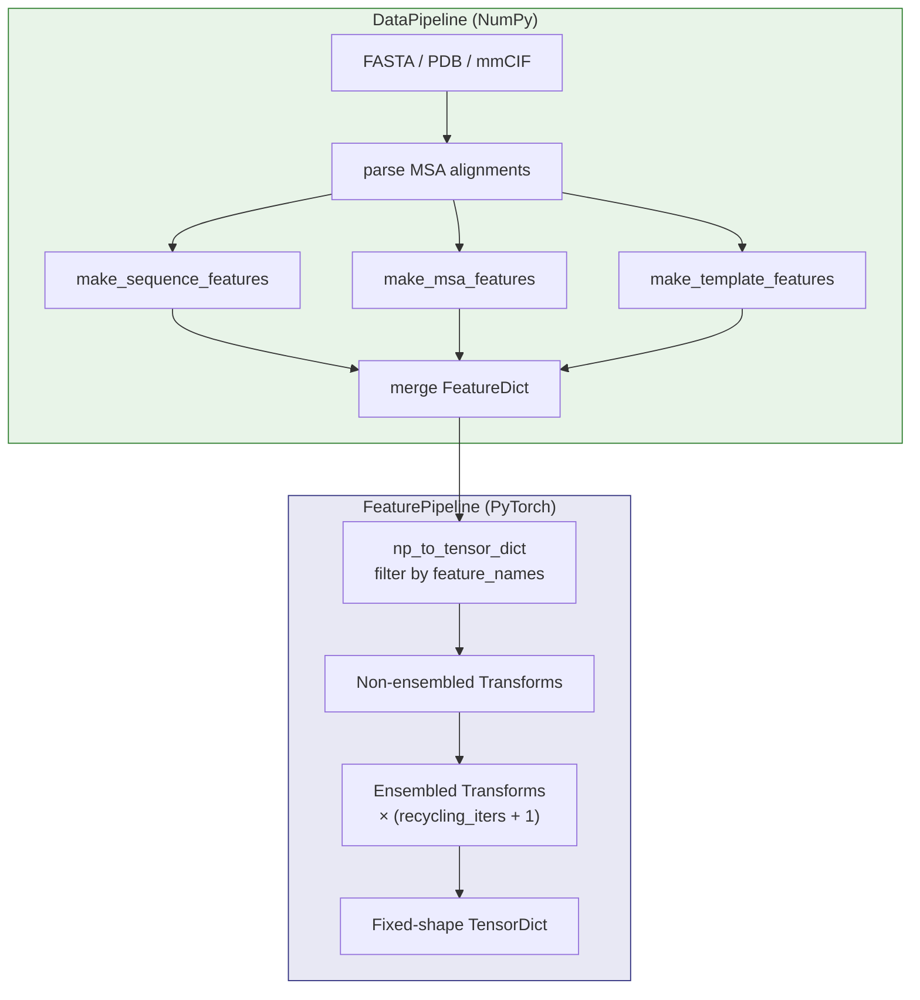
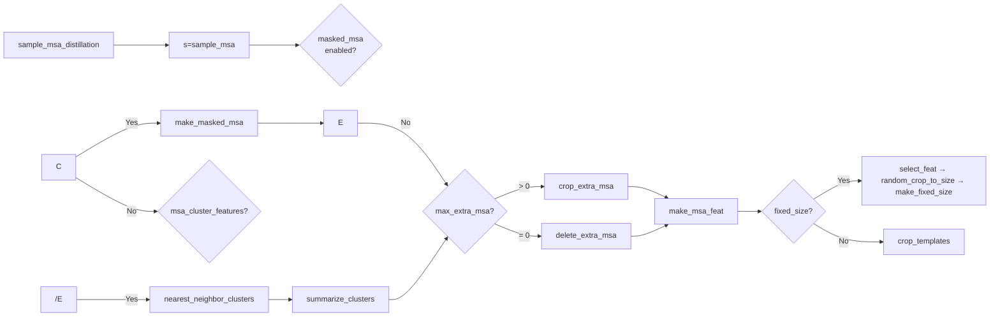

---
slug:13-feature-pipeline-and-transforms
blog_type:normal
---


FastFold的特征流水线是原始生物信息学比对与Evoformer网络所消耗的张量表示之间的关键桥梁。它编排了一个两阶段架构：**DataPipeline**从MSA/模板搜索输出中组装NumPy特征字典，然后**FeaturePipeline**通过一个可组合的函数变换链，将这些字典转换为固定形状的PyTorch张量。这种分离确保了耗时的I/O约束特征组装只需运行一次，而GPU加速的变换则可以在循环迭代期间重新应用，无需冗余计算。

## 两阶段架构

端到端的特征处理流程遵循严格的生产者-消费者模式。**DataPipeline**阶段在NumPy空间中运行——解析FASTA输入，读取比对文件（`.a3m`、`.sto`、`.hhr`），合并MSA行并进行去重，以及从PDB命中中构建模板特征。**FeaturePipeline**阶段随后接收该`FeatureDict`（一个`Mapping[str, np.ndarray]`），将其转换为`TensorDict`（一个`Dict[str, torch.Tensor]`），并应用一系列分阶段的变换，逐步对特征进行重塑、增强和填充，使其达到网络就绪的形式。



来源：[feature_pipeline.py](/fastfold/data/feature_pipeline.py#L27-L129), [data_pipeline.py](/fastfold/data/data_pipeline.py#L784-L960)

## DataPipeline：原始特征组装

`DataPipeline`类负责从驻留在磁盘上的比对数据中构建初始`FeatureDict`。它暴露了三个主要入口点——`process_fasta`、`process_mmcif`和`process_pdb`——每个入口点都遵循相同的三步组装模式：**序列特征** → **模板特征** → **MSA特征**，通过字典解包进行合并。

| 方法 | 输入来源 | 序列来源 | 用例 |
|---|---|---|---|
| `process_fasta` | FASTA文件 + 比对目录 | 从FASTA字符串解析 | 标准推理 |
| `process_mmcif` | mmCIF对象 + 比对目录 | `chain_to_seqres`映射 | 来自PDB的训练 |
| `process_pdb` | PDB文件 + 比对目录 | `protein.from_pdb_string` | 蒸馏训练 |

### 序列特征构建

`make_sequence_features`从输入的氨基酸字符串构建逐残基的特征集：独热编码的`aatype`（形状为`[N_res, 22]`）、`residue_index`数组、跨残基广播的`seq_length`，以及元数据字段（`domain_name`、`sequence`）。这些构成了所有后续变换增强所依赖的身份骨架。

来源：[data_pipeline.py](/fastfold/data/data_pipeline.py#L90-L109), [data_pipeline.py](/fastfold/data/data_pipeline.py#L918-L960)

### MSA特征构建

`make_msa_features`接收一个已解析的`Msa`对象列表（来自`.a3m`和`.sto`文件），并跨所有MSA来源执行**序列去重**。每个唯一序列通过`HHBLITS_AA_TO_ID`映射为整数残基索引，并收集其删除矩阵行和物种标识符。输出特征为`msa`（`[N_seq, N_res]`）、`deletion_matrix_int`、`num_alignments`和`msa_species_identifiers`。

去重至关重要：当多个比对数据库（UniRef90、MGnify、BFD）包含重叠的命中时，`seen_sequences`确保每个序列仅出现一次，保留首次出现的删除统计信息。

来源：[data_pipeline.py](/fastfold/data/data_pipeline.py#L205-L242)

### 模板特征构建

`make_template_features`委托给`TemplateHitFeaturizer`或`HmmsearchHitFeaturizer`，以从PDB命中中提取结构模板。当不存在命中（或未提供特征化器）时，`empty_template_feats`返回具有正确秩的零填充数组：`template_aatype`为`[0, N_res]`，`template_all_atom_positions`为`[0, N_res, 37, 3]`，`template_sum_probs`为`[0, 1]`。这种优雅降级确保了流水线绝不会在缺乏结构模板的新颖序列上失败。

来源：[data_pipeline.py](/fastfold/data/data_pipeline.py#L47-L87)

## FeaturePipeline：张量转换与变换编排

`FeaturePipeline`类是一个轻量级的配置容器，其唯一的公共方法`process_features`委托给`np_example_to_features`。该函数执行三个顺序操作：

1. **配置解析**通过`make_data_config`完成，它深拷贝模型配置，从实际序列长度解析`crop_size`，并通过组合`unsupervised_features`、`template_features`（若`use_templates`）和`supervised_features`（若`mode_cfg.supervised`）来组装特征名称列表。

2. **NumPy到张量的转换**通过`np_to_tensor_dict`完成，它不仅将数组转换为张量，**还过滤**特征字典，使其仅包含已解析的`feature_names`列表中指定的特征。此过滤至关重要——它会剥离那些构建时需要但模型不会使用的中间特征。

3. **变换应用**通过`input_pipeline.process_tensors_from_config`（单体）或`input_pipeline_multimer.process_tensors_from_config`（多聚体）完成，并包裹在`torch.no_grad()`中。在Habana加速器上，额外的`hmp.disable_casts()`上下文会在特征处理期间防止不需要的混合精度类型转换。

```python
# 核心调度逻辑
if is_multimer:
    input_pipeline_fn = input_pipeline_multimer.process_tensors_from_config
else:
    input_pipeline_fn = input_pipeline.process_tensors_from_config

with torch.no_grad():
    features = input_pipeline_fn(tensor_dict, cfg.common, cfg[mode])
```

<CgxTip>删除矩阵在NumPy与PyTorch的边界处经历从`int32` → `float32`的类型提升：`np_example["deletion_matrix"] = np_example.pop("deletion_matrix_int").astype(np.float32)`。这种重命名（`deletion_matrix_int` → `deletion_matrix`）必须在张量转换之前发生，因为下游变换期望浮点类型的键。</CgxTip>

来源：[feature_pipeline.py](/fastfold/data/feature_pipeline.py#L73-L108), [feature_pipeline.py](/fastfold/data/feature_pipeline.py#L111-L129)

## 变换流水线：非集成阶段

变换被组织为两个阶段——**非集成**（应用一次）和**集成**（每次循环迭代应用一次）。非集成变换处理数据类型归一化、残基类型校正，以及决不能在集成成员之间变化的确定性特征构建。

| 变换 | 目的 | 关键输出特征 |
|---|---|---|
| `cast_to_64bit_ints` | 将所有`int32`归一化为`int64` | (原位数据类型变更) |
| `correct_msa_restypes` | 将HHblits残基索引重新排序为内部顺序 | `msa`（重索引），`*profile*`（置换） |
| `squeeze_features` | 移除独热输入中的单例维度 | `aatype`（argmax降为索引），`seq_length`（标量） |
| `randomly_replace_msa_with_unknown(0.0)` | MSA破坏（推理时设为0.0禁用） | `msa`，`aatype`（当比例=0时不变） |
| `make_seq_mask` | 构建逐残基的有效性掩码 | `seq_mask` |
| `make_msa_mask` | 构建逐MSA条目的有效性掩码 | `msa_mask`，`msa_row_mask` |
| `make_hhblits_profile` | 计算MSA位置频率谱 | `hhblits_profile` |

当启用模板时（`common_cfg.use_templates`），会追加三个额外的变换：`fix_templates_aatype`（通过`MAP_HHBLITS_AATYPE_TO_OUR_AATYPE`将独热模板残基重新映射为整数索引）、`make_template_mask`和`make_pseudo_beta("template_")`。如果请求了模板扭转角，还会应用`atom37_to_torsion_angles("template_")`。

对于有监督模式，一组几何变换构建了真实结构目标：`make_atom14_positions`、`atom37_to_frames`、`atom37_to_torsion_angles("")`、`make_pseudo_beta("")`、`get_backbone_frames`和`get_chi_angles`。

来源：[input_pipeline.py](/fastfold/data/input_pipeline.py#L23-L67)

## 变换流水线：集成阶段

集成变换是数据增强和形状塑造阶段。它们被组合并在每次循环迭代时应用一次（加上初始传递的一次），生成一个特征字典列表，供模型在循环期间遍;历。



### MSA采样与聚类

**`sample_msa`**是最具影响力的集成变换。它随机置换MSA行（将查询序列保留在索引0处），选择前`max_msa_clusters`行作为主MSA，并将其余行存储为`extra_*`特征（例如`extra_msa`、`extra_deletion_matrix`）。这种划分是Evoformer双轨架构的基础——“聚类MSA”馈入主MSA表示，而“额外MSA”由单独的栈处理。

当`resample_msa_in_recycling`为`False`时，MSA采样种子固定为`ensemble_seed`，确保在所有循环迭代中使用相同的MSA子集。这种确定性对推理的可复现性至关重要。

**`nearest_neighbor_clusters`**通过优化的矩阵乘法（`[N_extra, N_res×23] × [N_cluster, N_res×23]^T`）计算加权汉明一致性得分，将每个额外MSA序列分配给其最近的聚类MSA序列。其结果`extra_cluster_assignment`驱动后续的`summarize_clusters`变换，该变换聚合每个聚类的谱和删除统计信息。

来源：[input_pipeline.py](/fastfold/data/input_pipeline.py#L70-L150), [data_transforms.py](/fastfold/data/data_transforms.py#L183-L208), [data_transforms.py](/fastfold/data/data_transforms.py#L280-L366)

### MSA特征工程

**`make_msa_feat`**构建Evoformer实际消耗的拼接特征向量。它产生两个关键张量：

- **`msa_feat`** `[N_seq, N_res, C_msa]`：独热MSA（23类）、二值化删除指示器`clip(deletion_matrix, 0, 1)`和反正切缩放的删除值`atan(d/3) × (2/π)`的拼接。当存在聚类特征时，会追加`cluster_profile`和`cluster_deletion_mean`。
- **`target_feat`** `[N_res, C_target]`：`between_segment_residues`指示器和21类独热`aatype`的拼接。

反正切缩放`atan(d/3) × (2/π)`将删除概率从`[0, ∞)`映射到`[0, 1)`，提供了一个有界且平滑变化的特征，保留了弱删除和强删除位置之间的相对幅度差异。

来源：[data_transforms.py](/fastfold/data/data_transforms.py#L524-L571)

### 固定尺寸填充

**`make_fixed_size`**是最终的形状塑造变换，将所有特征填充到编译模型所需的确定性维度。它使用一个`shape_schema`映射，其中维度占位符（`NUM_RES`、`NUM_MSA_SEQ`、`NUM_EXTRA_SEQ`、`NUM_TEMPLATES`）被解析为具体大小：

| 占位符 | 解析为 |
|---|---|
| `NUM_RES` | `crop_size`（来自配置或序列长度） |
| `NUM_MSA_SEQ` | `pad_msa_clusters` |
| `NUM_EXTRA_SEQ` | `max_extra_msa` |
| `NUM_TEMPLATES` | `max_templates` |

每个特征张量使用`torch.nn.functional.pad`进行右填充，以匹配其模式指定的形状。`extra_cluster_assignment`张量被显式跳过，因为它是模型前向传播未使用的中间索引数组。

来源：[data_transforms.py](/fastfold/data/data_transforms.py#L485-L520)

## 几何特征变换

几个变换将原子坐标转换为蒸馏头和结构模块所需的结构表示：

**`atom37_to_frames`**使用`Rigid.from_3_points`为每个残基构建8个刚体组（骨架帧 + 7个侧链chi角帧）。它计算真实帧、用于模糊原子命名的替代帧（7个氨基酸具有可交换的原子名），以及存在掩码。输出包括`rigidgroups_gt_frames` `[N_res, 8, 4, 4]`（齐次变换矩阵）、`rigidgroups_gt_exists`和`rigidgroups_alt_gt_frames`。

**`atom37_to_torsion_angles`**从原子位置计算骨架扭转角（pre-ω、φ、ψ）和侧链chi角。它使用`Rigid.from_3_points`构造放置每个扭转帧，然后从第四个原子的局部坐标中提取sin/cos表示。输出`torsion_angles_sin_cos` `[N_res, 7, 2]`将所有7个角编码为（sin，cos）对，`alt_torsion_angles_sin_cos`提供模糊chi角的π周期替代表示。

**`make_atom14_masks`** / **`make_atom14_positions`**创建更密集的14原子表示（与标准的37原子格式相比），包括两种表示之间的映射索引，并通过置换矩阵处理原子重命名歧义。

来源：[data_transforms.py](/fastfold/data/data_transforms.py#L774-L910), [data_transforms.py](/fastfold/data/data_transforms.py#L941-L1106), [data_transforms.py](/fastfold/data/data_transforms.py#L587-L771)

## 组合模式与变换调度

所有变换都遵循统一的**柯里化函数**签名：每个变换接受一个`protein`特征字典作为其第一个参数，并返回修改后的字典。配置参数通过`@curry1`装饰器进行部分应用，将`f(protein, arg)`转换为`f(arg)(protein)`。这使得变换可以在流水线构建时进行配置，并在运行时统一应用。

`input_pipeline.py`中的`compose`函数将一系列已配置的变换规约（reduce）为一个单一的 callable：

```python
@data_transforms.curry1
def compose(x, fs):
    for f in fs:
        x = f(x)
    return x
```

`process_tensors_from_config`通过`compose`应用一次非集成变换，然后使用`map_fn`将(集成变换组合)映射到`torch.arange(num_recycling + 1)`上，生成一个特征字典列表——3每次循环迭代一个。每个集成成员接收一个`ensemble_index`字段以实现可追溯性。

<CgxTip>`@curry1`装饰器是变换架构的关键。没有它，`compose`无法统一迭代具有异构参数签名的变换。该装饰器的实现使用`@wraps(f)`保留函数元数据，并返回`lambda x: f(x, *args, **kwargs)`——因此`sample_msa(max_seq=512, keep_extra=True)`返回一个仅等待`protein`字典的函数。</CgxTip>

来源：[data_transforms.py](/fastfold/data/data_transforms.py#L72-L78), [input_pipeline.py](/fastfold/data/input_pipeline.py#L153-L209)

## 完整变换序列摘要

下表按执行顺序枚举了默认单体推理流水线中的每个变换：

| # | 阶段 | 变换 | 条件 |
|---|---|---|---|
| 1 | 非集成 | `cast_to_64bit_ints` | 始终 |
| 2 | 非集成 | `correct_msa_restypes` | 始终 |
| 3 | 非集成 | `squeeze_features` | 始终 |
| 4 | 非集成 | `randomly_replace_msa_with_unknown(0.0)` | 始终 |
| 5 | 非集成 | `make_seq_mask` | 始终 |
| 6 | 非集成 | `make_msa_mask` | 始终 |
| 7 | 非集成 | `make_hhblits_profile` | 始终 |
| 8 | 非集成 | `fix_templates_aatype` | `use_templates` |
| 9 | 非集成 | `make_template_mask` | `use_templates` |
| 10 | 非集成 | `make_pseudo_beta("template_")` | `use_templates` |
| 11 | 非集成 | `atom37_to_torsion_angles("template_")` | `use_template_torsion_angles` |
| 12 | 非集成 | `make_atom14_masks` | 始终 |
| 13 | 集成 | `sample_msa_distillation` | 配置中包含`max_distillation_msa_clusters` |
| 14 | 集成 | `sample_msa` | 始终 |
| 15 | 集成 | `make_masked_msa` | 配置中包含`masked_msa` |
| 16 | 集成 | `nearest_neighbor_clusters` | `msa_cluster_features` |
| 17 | 集成 | `summarize_clusters` | `msa_cluster_features` |
| 18 | 集成 | `crop_extra_msa`或`delete_extra_msa` | `max_extra_msa > 0` |
| 19 | 集成 | `make_msa_feat` | 始终 |
| 20 | 集成 | `select_feat` → `random_crop_to_size` → `make_fixed_size` | `fixed_size`模式 |

对于多聚体路径，`input_pipeline_multimer.process_tensors_from_config`用其处理配对MSA和跨链特征的多聚体特定变体替换了步骤14的流水线。有关详细信息，请参见[多聚体数据处理](14-multimer-data-processing)。

来源：[input_pipeline.py](/fastfold/data/input_pipeline.py#L23-L150), [feature_pipeline.py](/fastfold/data/feature_pipeline.py#L73-L108)

## 导航

- **上一节**：[用于MSA搜索的Ray工作流](12-ray-workflow-for-msa-search) —— 生成`DataPipeline`消耗的比对文件
- **下一节**：[多聚体数据处理](14-multimer-data-processing) —— 将此流水线扩展为具有配对MSA的多链复合物