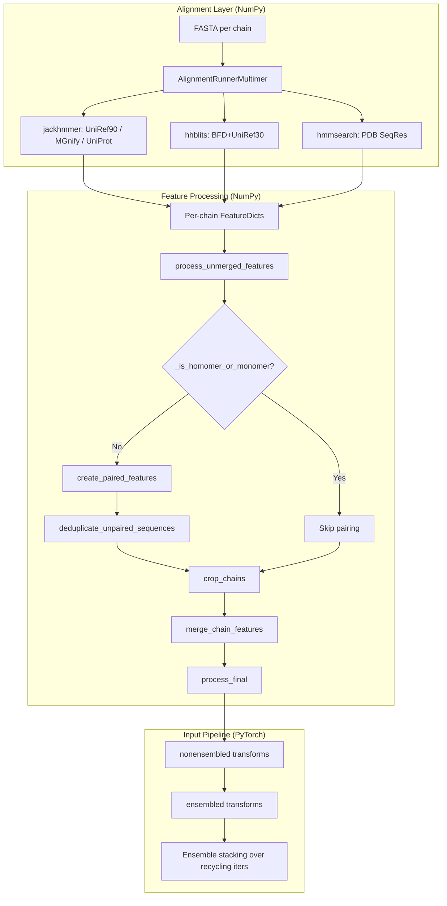
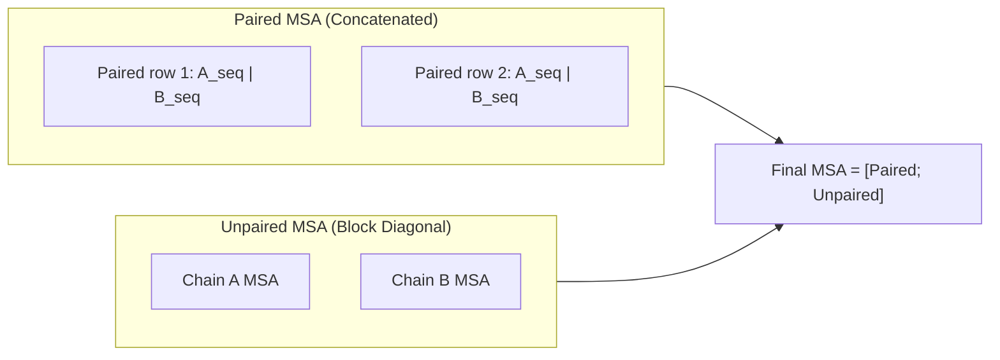

---
slug:14-multimer-data-processing
blog_type:normal
---

FastFold 的多聚体数据处理流水线将单体特征提取工作流进行了扩展，以处理由多条链组成的蛋白质复合物。核心架构挑战在于**跨链 MSA 配对**：当不同的多肽链在同一个生物组装体内共同演化时，必须通过共享的物种标识符对跨链 MSA 进行比对，从而捕获它们之间的演化耦合关系。该流水线统筹协调了逐链特征提取、物种感知 MSA 配对、块对角合并以及多聚体专用的张量变换，最终生成供 Evoformer 使用的特征字典。

## 架构概述

多聚体数据处理系统由三个同心层组成：**比对运行器**使用外部工具（jackhmmer、hhblits、hmmsearch）为每条链发现同源序列；**特征处理层**对跨链 MSA 进行配对与合并；**输入流水线**应用 PyTorch 张量变换以供模型使用。数据从原始 FASTA 输入流经基于 NumPy 的特征工程，随后跨越 NumPy→PyTorch 边界，进入可微变换流水线。

来源: [data_pipeline.py](fastfold/data/data_pipeline.py#L461-L599), [feature_processing_multimer.py](fastfold/data/feature_processing_multimer.py#L50-L84), [input_pipeline_multimer.py](fastfold/data/input_pipeline_multimer.py#L26-L78)

## AlignmentRunnerMultimer：逐链 MSA 搜索

`AlignmentRunnerMultimer` 类与其单体对应物 `AlignmentRunner` 在三个关键方面有所不同。首先，它通过 jackhmmer 增加了 **UniProt 数据库**搜索——UniProt 提供了跨链 MSA 配对所必需的物种标识符。其次，它将针对 `pdb_seqres` 的 hhsearch 替换为 **hmmsearch** 以进行模板检测，这更适用于多聚体模板搜索。第三，它引入了 `uniprot_max_hits`（默认值为 50,000）作为额外的命中上限，反映了复合物预测所需的更大搜索空间。

| 参数 | 单体运行器 | 多聚体运行器 | 原理 |
|---|---|---|---|
| UniProt DB | — | jackhmmer | 用于 MSA 配对的物种 ID |
| PDB 模板搜索 | hhsearch + PDB70 | hmmsearch + PDB SeqRes | 更广的结构覆盖率 |
| `uniprot_max_hits` | — | 50,000 | 复合物需要更大的搜索空间 |
| `hmmsearch` 二进制文件 | — | 必需 | 模板命中检测 |

每条链的 FASTA 都会通过比对运行器独立处理，生成逐链的 MSA 命中结果，并存储为 Stockholm/A3M 文件。UniProt MSA 是配对的骨干——其物种标识符（通过 `msa_identifiers.get_identifiers` 解析）作为跨链连接的键。

来源: [data_pipeline.py](fastfold/data/data_pipeline.py#L461-L599), [msa_identifiers.py](fastfold/data/msa_identifiers.py#L25-L91)

## MSA 物种标识符提取

配对机制依赖于从 MSA 序列描述中提取**物种标识符**。`msa_identifiers` 模块使用编译好的正则表达式解析 UniProtKB 格式的头信息（例如 `tr|A0A146SKV9|A0A146SKV9_FUNHE`），以捕获 1-5 个字符的物种助记码。`Identifiers` 数据类将其存储为 `species_id`，并作为跨链配对的分组键。当头信息与 UniProt 模式不匹配时，会返回空的 `species_id`，该序列将被排除在配对之外——它仅保留在合并后 MSA 的未配对（块对角）部分中。

来源: [msa_identifiers.py](fastfold/data/msa_identifiers.py#L25-L91)

## MSA 配对：跨链序列关联

`msa_pairing` 模块实现了多聚体的核心创新：**物种感知 MSA 配对**。`pair_and_merge` 编排器首先检查 `_is_homomer_or_monomer`——如果所有链共享相同的 `entity_id`，则会完全跳过配对，因为相同链的 MSA 关联是显而易见的。对于异聚体，配对过程分为四个阶段：

### 阶段 1：创建配对特征 (`create_paired_features`)

对于每条链，使用 MSA 构建一个 pandas DataFrame，包含以下列：`msa_species_identifiers`、`msa_row`、`msa_similarity`（与查询序列匹配的残基比例）以及 `gap`（空位残基的比例）。序列按物种标识符进行分组。对于在**两条或多条链**中出现的每个物种（并且每个物种的序列数 ≤600，以限制开销），`_match_rows_by_sequence_similarity` 会对行进行配对：将每条链物种组内的序列按与查询序列的相似度排序，然后对前 k 行（k 为各链中的最小计数值）进行位置对齐。仅出现在单条链中的物种将被跳过——它们不提供跨链信号。

### 阶段 2：重排配对行 (`reorder_paired_rows`)

配对行索引按配对中的**链数**（降序）排序，使得全链配对排在最前。在每个组内，行按其索引的乘积（e值排序的代理指标）排序。这种排序确保了信息量最大、完全配对的序列占据最终 MSA 的顶部行。

### 阶段 3：去重 (`deduplicate_unpaired_sequences`)

配对后，未配对的 MSA 中可能包含已存在于配对 MSA 中的序列。`deduplicate_unpaired_sequences` 将配对的 MSA 行转换为哈希集，然后过滤未配对的 MSA 以移除重复项，从而防止信息冗余和空间浪费。

### 阶段 4：合并链特征 (`merge_chain_features`)

这是将逐链特征字典转化为单一复合物级特征字典的步骤。合并策略取决于特征类型：

| 特征类别 | 合并策略 | 形状变换 |
|---|---|---|
| `MSA_FEATURES`（未配对） | 通过 `block_diag()` 进行块对角化 | `(N_msa, ΣN_res)`，带有非对角填充 |
| `MSA_FEATURES`（配对，`_all_seq`） | 沿 `num_res` 维度拼接 | `(N_paired, ΣN_res)` |
| `SEQ_FEATURES` | 沿 `num_res` 维度拼接 | `(ΣN_res,)` |
| `TEMPLATE_FEATURES` | 沿 `num_res` 维度拼接 | `(N_tmpl, ΣN_res, ...)` |
| `CHAIN_FEATURES` | 跨链求和 | 标量 |

在配对模式下，最终的 MSA 通过沿序列轴拼接 `[paired_all_seq, unpaired_block_diag]` 来构建。随后，`_correct_post_merged_feats` 函数生成 `cluster_bias_mask`（确保每个链的查询序列始终包含在聚类采样中）和 `bert_mask`（在 BERT 风格的掩码 MSA 目标中屏蔽非对角块）。

来源: [msa_pairing.py](fastfold/data/msa_pairing.py#L56-L88), [msa_pairing.py](fastfold/data/msa_pairing.py#L181-L232), [msa_pairing.py](fastfold/data/msa_pairing.py#L433-L460), [msa_pairing.py](fastfold/data/msa_pairing.py#L463-L483)

## MSA 裁剪策略

`_crop_single_chain` 函数实现了一种**预算感知裁剪**策略，该策略遵循全局 `MSA_CROP_SIZE`（默认 2048）限制。当配对生效时，预算会被拆分：配对的 MSA（`_all_seq` 特征）最多接收 `MSA_CROP_SIZE // 2` 行。随后，未配对预算会减去已被消耗的非空位配对行数，从而确保每条链满足 `paired + unpaired ≤ MSA_CROP_SIZE`。这种动态分配防止单条链独占 MSA 预算。模板独立裁剪至 `MAX_TEMPLATES`（默认 4）。

来源: [feature_processing_multimer.py](fastfold/data/feature_processing_multimer.py#L87-L166)

## 合并前与合并后的特征处理

### `process_unmerged_features`（合并前）

在链被配对或合并之前，每条链的特征都会进行逐链归一化：整型缺失矩阵被转换为 `float32`，`deletion_mean` 被计算为逐位置的平均值，`all_atom_mask` 和零初始化的 `all_atom_positions` 通过 `STANDARD_ATOM_MASK` 从 `aatype` 派生，`assembly_num_chains` 被设置为总链数。`entity_mask` 被计算为 `(entity_id != 0)`，用于区分真实残基与填充。

### `process_final`（合并后）

合并后，`_correct_msa_restypes` 将 MSA 残基类型从 HHblits 排序重新映射到内部 `residue_constants` 排序。`_make_seq_mask` 和 `_make_msa_mask` 分别从 `entity_id` 和 MSA 内容生成二值掩码。随后，`_filter_features` 丢弃不在 `REQUIRED_FEATURES` 冻结集中的任何特征，生成一个恰好包含 30 个所需特征键的干净字典。

来源: [feature_processing_multimer.py](fastfold/data/feature_processing_multimer.py#L212-L245), [feature_processing_multimer.py](fastfold/data/feature_processing_multimer.py#L169-L209), [feature_processing_multimer.py](fastfold/data/feature_processing_multimer.py#L26-L35)

## 多聚体张量变换 (PyTorch)

`input_pipeline_multimer` 模块应用最终的可微变换，为模型使用准备 NumPy 特征。它沿用了单体流水线结构，但替换为多聚体专用的变换实现。

### 非集成变换

这些变换仅运行一次，与循环迭代无关：

| 变换 | 操作 |
|---|---|
| `cast_to_64bit_ints` | 将整型特征向上转型，以保证数值稳定性 |
| `make_msa_profile` | 通过 `masked_mean` 计算逐残基的 MSA 轮廓 |
| `create_target_feat` | 将 `aatype` 独热编码为 21 类 |
| `make_atom14_masks` | 生成 Atom14 表示的掩码 |
| `make_pseudo_beta`（如有模板） | 为模板特征计算伪 beta 位点 |

### 集成变换

这些变换在每次循环迭代中运行，并带有随机变化：

| 变换 | 操作 | 关键细节 |
|---|---|---|
| `sample_msa` | 基于 Gumbel-argsort 的 MSA 行采样 | 拆分为 `msa`（聚类）+ `extra_msa`；`cluster_bias_mask` 保留查询行 |
| `make_masked_msa` | BERT 风格的 MSA 掩码 | 均匀随机氨基酸、轮廓和同概率替换的混合 |
| `nearest_neighbor_clusters` | 将额外 MSA 分配至最近的聚类中心 | 在 `T=1e-3`（尖锐）下对一致性得分取 Softmax |
| `create_msa_feat` | 拼接独热编码与缺失特征 | 49 维：23（独热）+ 1（has_deletion）+ 1（deletion_value）+ 23（cluster_profile）+ 1（cluster_deletion_mean） |

### 基于 Gumbel 的随机采样

多聚体变换在两种采样操作中采用了 **Gumbel-max 技巧**。`gumbel_argsort_sample_idx` 生成一个由输入对数加权的随机排列——用于 `sample_msa` 中，在保持可微性的同时随机优先选择信息量大的 MSA 行。`gumbel_max_sample` 抽取分类样本——用于 `make_masked_msa` 中，为掩码位置选择替换词元。两者均使用 `torch.Generator` 以实现可复现的种子设定，当禁用 `resample_msa_in_recycling` 时种子将被固定。

### 集成堆叠

`process_tensors_from_config` 函数首先组合非集成变换，然后通过 `map_fn` 将集成变换映射到 `max_recycling_iters + 1` 次迭代上。每次迭代产生一个独立的特征字典；`map_fn` 沿着新的尾部维度将它们堆叠，生成形状为 `(..., num_ensemble_iters)` 的张量，供模型在循环期间求平均。

来源: [input_pipeline_multimer.py](fastfold/data/input_pipeline_multimer.py#L26-L137), [data_transforms_multimer.py](fastfold/data/data_transforms_multimer.py#L9-L70), [data_transforms_multimer.py](fastfold/data/data_transforms_multimer.py#L253-L304), [data_transforms_multimer.py](fastfold/data/data_transforms_multimer.py#L125-L180), [data_transforms_multimer.py](fastfold/data/data_transforms_multimer.py#L191-L219)

## 全原子多聚体工具

`all_atom_multimer.py` 模块为多聚体结构模块提供几何操作。`atom37_to_frames` 从全原子位点计算每个残基的 8 个刚体组帧（骨架 + pre-ω + φ + ψ + χ₁–χ₄），通过绕 x 轴旋转 180° 处理歧义旋转异构体组。`torsion_angles_to_frames` 通过链接 chi 组帧从预测扭转角重建帧。`frames_and_literature_positions_to_atom14_pos` 将文献原子位点映射到刚体组帧，以生成最终的 Atom14 坐标。`extreme_ca_ca_distance_violations` 函数通过标记 Cα–Cα 距离偏离预期键长 1.5Å 以上的残基来监控结构质量——这对于检测多聚体预测中的链间界面扭曲至关重要。

来源: [all_atom_multimer.py](fastfold/utils/all_atom_multimer.py#L100-L208), [all_atom_multimer.py](fastfold/utils/all_atom_multimer.py#L280-L318), [all_atom_multimer.py](fastfold/utils/all_atom_multimer.py#L321-L339)

## 同聚体与异聚体决策矩阵

流水线的行为会根据链的组成产生分岔。下表总结了关键差异：

| 方面 | 同聚体 / 单体 | 异聚体 |
|---|---|---|
| MSA 配对 | 跳过 | 物种感知配对生效 |
| MSA 合并 | 仅块对角 | 配对拼接 + 块对角 |
| `cluster_bias_mask` | 逐链查询行偏好 | 单行 0 偏好 |
| `bert_mask` | 块对角 | `concat(paired_all_seq, block_diag_unpaired)` |
| UniProt 搜索 | 仍对增加深度有用 | **配对键所必需** |
| `_merge_homomers_dense_msa` | 合并具有相同 `entity_id` 的链 | 透传不同的实体 |
| 去重 | 不应用 | 从未配对中移除已配对的序列 |

<CgxTip>在配置多聚体推理时，请确保已下载 UniProt 数据库并设置了 `uniprot_database_path`——若无此设置，将无法提取物种标识符，MSA 配对将退化为仅块对角形式，从而丢失所有跨链演化信号。</CgxTip>

<CgxTip>2048 的 `MSA_CROP_SIZE` 由所有链共享。对于包含许多链的复合物，每条链将获得按比例缩小的 MSA 预算。对于链间接触稀疏的大型异聚体复合物，请考虑增大此值。</CgxTip>

来源: [feature_processing_multimer.py](fastfold/data/feature_processing_multimer.py#L41-L47), [msa_pairing.py](fastfold/data/msa_pairing.py#L270-L332), [msa_pairing.py](fastfold/data/msa_pairing.py#L391-L415)

## 流水线集成

从 FASTA 到模型就绪张量的完整多聚体数据流由工作流层统筹协调。若要深入了解为该流水线提供数据的基于 Ray 的分布式 MSA 搜索，请参阅 [Ray Workflow for MSA Search](12-ray-workflow-for-msa-search)。有关单体和多聚体路径共享的张量变换，请参阅 [Feature Pipeline and Transforms](13-feature-pipeline-and-transforms)。关于生成的特征如何配置 AlphaFold 模型，请参阅 [AlphaFold Model Configuration](16-alphafold-model-configuration)。