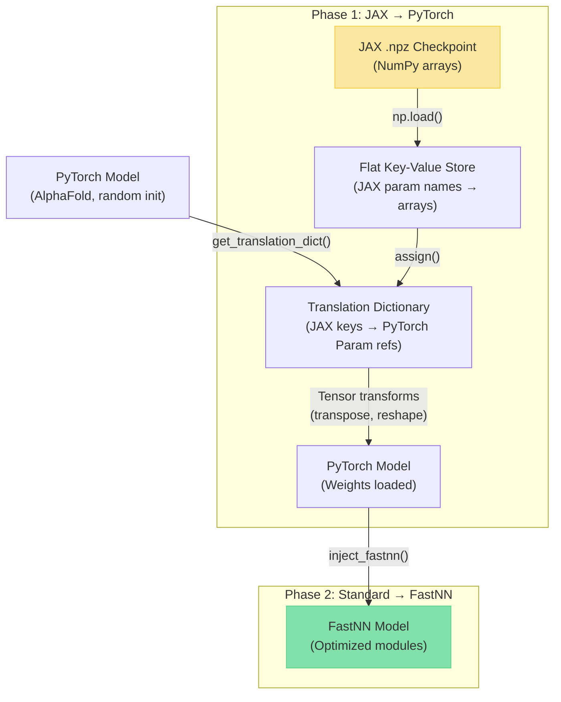
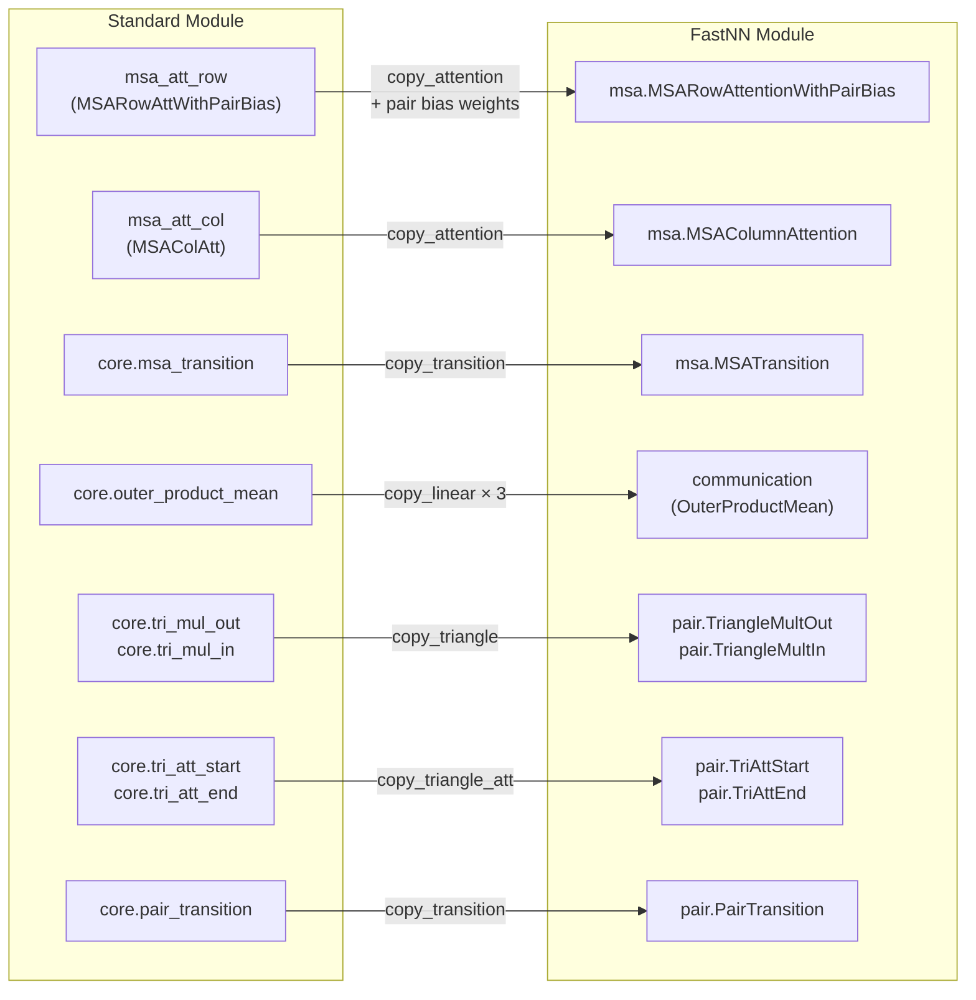

---
slug:15-weight-injection-from-jax
blog_type:normal
---


FastFold 是 AlphaFold2 的 PyTorch 重新实现，其原始训练参数以兼容 JAX 的 `.npz` 检查点文件形式存在。**权重注入流水线**通过两阶段流程弥合了这一框架差异：首先，加载 JAX 权重并通过转换字典将其语义映射到原生 PyTorch 模型中；其次，在保留所有已加载参数的前提下，将标准 PyTorch 子模块精准替换为高性能的 FastNN 等效模块。此架构确保 FastFold 在解锁 GPU 优化的融合内核与分块执行策略的同时，实现与 DeepMind 原始 JAX 实现的位级精确数值一致性。

来源: [import_weights.py](/fastfold/utils/import_weights.py#L1-L628), [inject_fastnn.py](/fastfold/utils/inject_fastnn.py#L1-L423)

## 两阶段注入架构

完整的注入流水线在推理初始化期间按顺序调用。在 [inference.py](/inference.py#L138-L141) 中，首先使用随机参数实例化 AlphaFold 模型，随后导入 JAX 权重，最后使用 FastNN 模块替换标准模块：

```python
model = AlphaFold(config)
import_jax_weights_(model, args.param_path, version=args.model_name)
model = inject_fastnn(model)
```

此顺序至关重要——JAX 导入针对的是**原始** `model.nn` 模块结构（该结构映射了 AlphaFold 的 JAX 参数命名），而 FastNN 注入则创建新的优化模块，并从已加载的标准模块中复制权重。下图展示了此数据流：



<CgxTip>两阶段设计不仅是组织架构层面的考量，更是**正确性保证**。阶段 1 通过转置操作，将 JAX 的行主序权重布局映射为 PyTorch 的列主序约定。随后阶段 2 完全在 PyTorch 张量空间中运作，将已转置的权重复制到预期相同内存布局的融合内核模块中。</CgxTip>

来源: [inference.py](/inference.py#L138-L141), [import_weights.py](/fastfold/utils/import_weights.py#L588-L608)

## 阶段 1：JAX 权重导入 — 转换字典

### ParamType 枚举与语义转换

JAX 和 PyTorch 在线性层权重存储上采用根本不同的约定。JAX 以行主序存储 `(out_features, in_features)` 形状的权重，而 PyTorch 期望列主序的 `(out_features, in_features)` 形状——因此需要进行转置。此外，JAX 中多头注意力（MHA）的权重存储了领先的头维度，在赋值前必须将其展平。`ParamType` 枚举对这些语义转换进行了编码：

| ParamType | 转换 | 应用于 |
|---|---|---|
| `LinearWeight` | `w.transpose(-1, -2)` | 标准线性层权重 |
| `LinearWeightMHA` | `w.reshape(..., -1).transpose(-1, -2)` | MHA 查询/键/值权重（头维度展平） |
| `LinearMHAOutputWeight` | `w.reshape(..., -1, w.shape[-1]).transpose(-1, -2)` | MHA 输出投影权重 |
| `LinearBiasMHA` | `w.reshape(..., -1)` | MHA 偏置（头维度展平） |
| `LinearWeightOPM` | `w.reshape(..., -1, w.shape[-1]).transpose(-1, -2)` | 外积均值输出权重 |
| `LinearWeightMultimer` | `w.unsqueeze(-1)` 或 `w.reshape(..., -1).transpose(-1, -2)` | Multimer 专属线性权重 |
| `LinearBiasMultimer` | `w.reshape(-1)` | Multimer 专属偏置 |
| `Other` | 恒等变换 (`w`) | 偏置、层归一化参数、非线性参数 |

每个 `ParamType` 将其转换操作作为 `partial` 包装的 lambda 表达式携带，并在 `assign()` 步骤中被调用。`Param` 数据类将张量引用与其类型以及用于处理重复块的 `stacked` 标志捆绑在一起。

来源: [import_weights.py](/fastfold/utils/import_weights.py#L29-L59)

### 构建转换字典

`get_translation_dict(model, version)` 函数构建了一个嵌套字典，将 **JAX 检查点键路径**映射到模型内的**活跃 PyTorch 张量引用**。它定义了一组参数提取 lambda 表达式词汇表，用于遍历模型的模块树：

- **`LinearParams(l)`** → 提取 `l.weight`（作为 `LinearWeight`）和 `l.bias`（作为 `Other`）
- **`LayerNormParams(l)`** → 提取 `l.weight` 作为 `"scale"`，提取 `l.bias` 作为 `"offset"`（匹配 JAX 命名）
- **`AttentionParams(att)`** → 提取 Q/K/V 权重作为 `LinearWeightMHA`，输出作为 `LinearMHAOutputWeight`
- **`AttentionGatedParams(att)`** → 扩展 `AttentionParams` 以包含门控权重和偏置
- **`GlobalAttentionParams(att)`** → 将 K/V 覆盖为使用 `LinearWeight`（全局注意力使用非 MHA 布局）
- **`TriMulOutParams` / `TriMulInParams`** → 处理融合与非融合的三角形乘法变体

该字典围绕根植于 `alphafold/alphafold_iteration/` 的 JAX 键层级进行组织，涵盖了 **evoformer**、**structure module** 以及所有辅助头部（预测的 LDDT、距离图、实验解析、掩码 MSA，以及 PTM/multimer 模型的预测对齐误差）。

来源: [import_weights.py](/fastfold/utils/import_weights.py#L131-L585)

### 堆叠块参数

AlphaFold 的 Evoformer、ExtraMSA 和模板对堆栈均由重复的相同块组成。`stacked()` 工具函数并非单独列出每个块的参数，而是将各块的参数聚合成列表，并设置 `stacked=True`。在 `assign()` 过程中，堆叠参数沿维度 0 从 JAX 数组中解绑，每个切片独立进行转换并复制到其对应的块中。这反映了 JAX 将堆叠参数作为带有前导块维度的单一数组进行存储的方式。

来源: [import_weights.py](/fastfold/utils/import_weights.py#L81-L107)

### 键展平与赋值

`_process_translations_dict()` 函数将嵌套的转换字典展平为从全限定 JAX 键字符串（例如 `alphafold/alphafold_iteration/evoformer/evoformer_iteration/msa_row_attention_with_pair_bias/query_norm/scale`）到 `Param` 对象的扁平映射。前缀 `alphafold/alphafold_iteration/` 在顶层被添加。

随后，`assign()` 函数执行实际的权重加载：对于每个键，它从 `.npz` 数据中检索 NumPy 数组，将其转换为 PyTorch 张量，应用 `ParamType` 转换，并通过 `p.copy_(w)` 在 `torch.no_grad()` 上下文中将结果复制到活跃的模型参数中。健全性检查断言所有转换键均存在于检查点中（反之则不强制，因为某些 JAX 参数可能未被使用）。

来源: [import_weights.py](/fastfold/utils/import_weights.py#L62-L129), [import_weights.py](/fastfold/utils/import_weights.py#L588-L608)

### 融合三角形乘法修正

当启用融合三角形乘法时（通过参数路径中的 `"v3"` 检测），相对于伪代码，AlphaFold 的 JAX 实现交换了**传入**三角形乘法变体的“左”和“右”投影。`_change_tri_mul_in_left_right()` 后处理函数通过交换所有 `tri_mul_in` 模块中拼接的左/右权重和偏置张量的两半来纠正这一点，这些模块分布在模板对堆栈、额外 MSA 堆栈和 evoformer 块中。

来源: [import_weights.py](/fastfold/utils/import_weights.py#L610-L628)

### 模型版本变体

`version` 参数控制两个行为分支：

| 条件 | 效果 |
|---|---|
| `"multimer" in version` | 使用 Multimer 专属参数类型（`LinearWeightMultimer`、`LinearBiasMultimer`），具有独立 Q/K/V 标量和点投影的 Multimer IPA 参数，以及 Multimer 模板嵌入结构 |
| `version in ["model_3", "model_4", "model_5", ...]` | 从转换字典中移除所有与模板相关的条目（这些模型不使用模板） |
| `"_ptm" in version` 或 multimer | 将 `predicted_aligned_error_head` 添加到字典中 |

来源: [import_weights.py](/fastfold/utils/import_weights.py#L131-L134), [import_weights.py](/fastfold/utils/import_weights.py#L565-L584)

## 阶段 2：FastNN 模块注入

在 JAX 权重填充标准模型后，`inject_fastnn(model)` 将四个关键子模块替换为其优化的 FastNN 对应项，从已加载的标准模块中复制权重。这是**模块替换**，而非权重重新加载——FastNN 模块被全新构建，并通过直接张量复制进行填充。

### 注入目标

| 注入函数 | 替换 | 替换为 | 覆盖范围 |
|---|---|---|---|
| `inject_evoformer()` | `model.evoformer` | `EvoformerStack` | 所有 MSA 行/列注意力、过渡层、外积均值、三角形注意力/乘法、对过渡层 |
| `inject_extramsa()` | `model.extra_msa_stack` | `ExtraMSAStack` | 与 Evoformer 子结构相同，但具有全局列注意力 |
| `inject_template()` | `model.template_embedder` | `TemplateEmbedder` 或 `TemplateEmbedderMultimer` | 模板角度/对嵌入器、模板对堆栈、逐点注意力 |
| `inject_embedder()` | `model.recycling_embedder` + `model.input_embedder` | `RecyclingEmbedder` + `InputEmbedder` | 循环位置嵌入，输入 MSA/目标/相对位置嵌入 |

来源: [inject_fastnn.py](/fastfold/utils/inject_fastnn.py#L318-L423)

### 权重复制原语

注入依赖于一组底层复制函数，这些函数处理标准与 FastNN 模块布局之间的结构差异：

- **`copy_linear(model_fast, model_ori)`** — 布局匹配模块的直接权重/偏置复制
- **`copy_layernorm(model_fast, model_ori)`** — 复制缩放（权重）和偏移（偏置）
- **`copy_qkv_linear(model_fast, ori_q, ori_k, ori_v)`** — 将独立的 Q、K、V 权重拼接成单一融合的 `[3*heads*c, input]` 权重张量，反映 FastNN 的融合 QKV 投影
- **`copy_kv_linear(model_fast, ori_k, ori_v)`** — 拼接 K 和 V 用于全局注意力的融合 KV 投影
- **`copy_left_right(model_fast, ori_left, ori_right)`** — 将独立的左/右投影权重拼接成单一融合张量，用于三角形乘法
- **`copy_attention(model_fast, model_ori)`** — 为完整的注意力模块编排 QKV 融合、门控线性复制和输出线性复制
- **`copy_triangle(model_fast, model_ori)`** — 处理融合与非融合的三角形乘法布局，对非融合变体使用 `copy_left_right`

<CgxTip>关键的架构洞察在于，FastNN 模块**融合**了标准实现中保持独立的部分。标准注意力模块拥有独立的 `linear_q`、`linear_k`、`linear_v` 投影；而 FastNN 的等效项则具有单一的 `to_qkv` 线性层。`copy_qkv_linear` 函数沿维度 0 拼接权重以构造此融合权重，随后该权重被单一融合 CUDA 内核消费，从而改善内存局部性并减少内核启动开销。</CgxTip>

来源: [inject_fastnn.py](/fastfold/utils/inject_fastnn.py#L24-L95)

### Evoformer 块参数映射

`copy_evoformer_para()` 函数展示了最复杂的映射，涵盖了单个 Evoformer 块内所有六个子操作：



每个块复制操作都被包装在 `torch.no_grad()` 中，并通过 `if target_block.training == False: fast_block.eval()` 保留原始模块的训练/评估模式。

来源: [inject_fastnn.py](/fastfold/utils/inject_fastnn.py#L107-L153)

## Multimer 与 Monomer 分支

两个注入阶段都会适应模型变体。在阶段 1 中，`get_translation_dict()` 检查 `is_multimer = "multimer" in version` 以在 `IPAParams`（单体，具有融合 Q/KV 标量投影）和 `IPAParamsMultimer`（具有独立 Q/K/V 标量投影和用于点注意力的 `PointProjectionParams`）之间进行选择。模板嵌入结构也有所不同：单体使用单一的 `embedding2d` 线性层，而多聚体则分解为 9 个独立的嵌入线性层（dgram、aatype × 2、查询嵌入、伪 beta 掩码、xyz 坐标、骨干掩码）。

在阶段 2 中，`inject_template()` 检查 `model.evoformer.blocks[0].is_multimer` 以在 `TemplateEmbedder` 和 `TemplateEmbedderMultimer` 之间进行选择，而 `inject_embedder()` 对多聚体模型提前返回（在多聚体路径中不替换循环和输入嵌入器）。

来源: [import_weights.py](/fastfold/utils/import_weights.py#L270-L316), [inject_fastnn.py](/fastfold/utils/inject_fastnn.py#L358-L374), [inject_fastnn.py](/fastfold/utils/inject_fastnn.py#L376-L379)

## 端到端权重加载概览

| 步骤 | 输入 | 输出 | 机制 |
|---|---|---|---|
| 1. 模型实例化 | `model_config(name)` | 带有随机参数的 `AlphaFold(config)` | 标准 PyTorch `__init__` |
| 2. 融合三角形标志 | `"v3" in param_path` | `set_fused_triangle_multiplication()` | 用于内核选择的全局标志 |
| 3. JAX 权重导入 | `.npz` 文件 + 模型 | 带有正确权重的模型 | 转换字典 + 带转置的 `assign()` |
| 4. 三角形修正 | 启用融合三角形的模型 | `tri_mul_in` 中交换的左/右 | `_change_tri_mul_in_left_right()` |
| 5. FastNN 注入 | 加载权重的标准模型 | 带有优化子模块的模型 | 模块构造 + 权重复制 |
| 6. 评估 + CUDA | 注入后的模型 | `model.eval().cuda()` | 标准 PyTorch 部署 |

此流水线确保 FastFold 从与原始 JAX 检查点**数值一致**的权重启动，同时完全在优化的 PyTorch 执行图中运行。有关模型变体的配置详情，请参见 [AlphaFold 模型配置](16-alphafold-model-configuration)；有关 Habana 专属注入路径，请参见 [Habana 平台支持](17-habana-platform-support)。