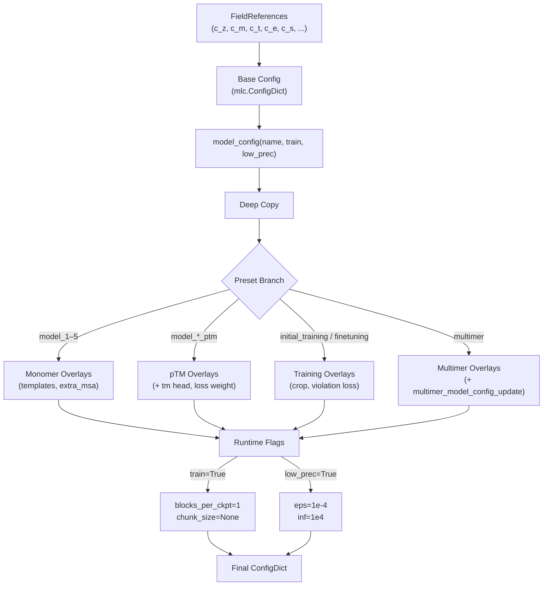
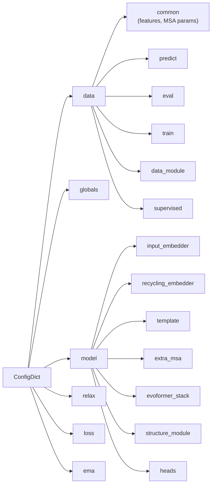

---
slug:16-alphafold-model-configuration
blog_type:normal
---


FastFold 的模型配置系统是掌控 AlphaFold 推理与训练流水线各个方面的唯一事实来源——从 MSA 特征维度和 Evoformer 块深度，到损失权重和弛豫容差。该系统基于 DeepMind 的 `ml_collections.ConfigDict` 构建，并策略性地放置了 `FieldReference` 锚点，从而确保对核心维度的修改（例如 `c_z = 128`）能自动传播至每一个依赖它的子模块，免去了在长达 600 多行的庞大定义中进行手动同步的麻烦。`model_config()` 工厂函数位于该系统的顶层，负责将人类可读的模型预设名称转化为一个完全实例化且自洽的配置字典，供 `AlphaFold` 模块、`AlphaFoldLoss` 和数据流水线直接使用。

来源: [config.py](/fastfold/config.py#L1-L607), [alphafold.py](/fastfold/model/hub/alphafold.py#L46-L105)

## 配置架构

配置系统遵循**工厂加覆盖**模式：整块基础配置仅定义一次，随后 `model_config()` 对其进行深拷贝，并针对所请求的模型预设应用定向修改。这种设计将*共享基础*（所有 AlphaFold 变体的公共部分）与*变体特有增量*（模板使用、额外 MSA 深度、pTM 头、多聚体调整）分离开来，使得无需复制整段定义即可轻松理清不同预设之间的差异。



`FieldReference` 机制是架构的基石。当在模块作用域中定义 `c_z = mlc.FieldReference(128, field_type=int)` 时，配置字典内后续对 `c_z` 的每一次引用都将指向**同一个**可变插槽。在一处修改 `c_z` 便会同时更新所有依赖它的子配置——这对于维持 Evoformer 堆栈的配对通道维度、结构模块的输入维度以及 Distogram 头的特征维度之间的一致性至关重要。

来源: [config.py](/fastfold/config.py#L128-L146), [config.py](/fastfold/config.py#L30-L125)

## 核心维度参数

五个由 `FieldReference` 支撑的维度常量定义了整个模型的数学形状。切忌随意更改这些常量——每一层权重矩阵的形状均派生自它们。

| 参数 | 默认值 | 语义角色 | 主要消费者 |
|-----------|---------|---------------|-------------------|
| **`c_z`** | 128 | 配对表征通道 | EvoformerStack, StructureModule, TemplateEmbedder, DistogramHead, TMHead |
| **`c_m`** | 256 | MSA 表征通道 | EvoformerStack, InputEmbedder, RecyclingEmbedder, MaskedMSAHead |
| **`c_t`** | 64 | 模板配对通道 | TemplatePairStack, TemplatePairEmbedder, TemplatePointwiseAttention |
| **`c_e`** | 64 | 额外 MSA 通道 | ExtraMSAEmbedder, ExtraMSAStack |
| **`c_s`** | 384 | 单一表征通道 | StructureModule, LDDTHead, ExperimentallyResolvedHead |

另外两个 `FieldReference` 参数控制的是执行策略而非模型架构：**`blocks_per_ckpt`**（梯度检查点粒度，默认为 `None`）和 **`chunk_size`**（节省内存的分块执行分片大小，默认为 `None`）。当 `train=True` 时，它们会被分别强制设为 `1` 和 `None`，从而为受内存限制的反向传播启用逐块检查点机制。

来源: [config.py](/fastfold/config.py#L128-L134), [config.py](/fastfold/config.py#L115-L123)

## 模型预设

`model_config(name, train=False, low_prec=False)` 函数将预设名称映射到配置覆盖。每个预设对应 AlphaFold 2 补充表 4–5 中的一行，忠实地复现了原论文的训练与推理配置。

### 单体预设（模型 1–5）

| 预设 | `max_extra_msa` | 模板 | 模板扭转角 | `reduce_max_clusters_by_max_templates` | AF2 补充表 |
|--------|-----------------|-----------|------------------------|---------------------------------------|------------------|
| `model_1` | 5120 | ✅ 启用 | ✅ 启用 | ✅ True | 5, Model 1.1.1 |
| `model_2` | 1024 (默认) | ✅ 启用 | ✅ 启用 | ✅ True | 5, Model 1.1.2 |
| `model_3` | 5120 | ❌ 禁用 | — | — | 5, Model 1.2.1 |
| `model_4` | 5120 | ❌ 禁用 | — | — | 5, Model 1.2.2 |
| `model_5` | 1024 (默认) | ❌ 禁用 | — | — | 5, Model 1.2.3 |

核心架构区别在于**启用模板**的模型（1、2）与**无模板**的模型（3–5）之间。启用模板的预设会激活 `model.template.enabled`、`data.common.use_templates` 和 `data.common.use_template_torsion_angles`，将来自 PDB 模板的结构同源信息引入配对表征中。模型 1 和 3 将 `max_extra_msa` 从默认的 1024 提升至 5120，扩展了额外 MSA 堆栈的容量，以进行更深层的进化信号处理。

### pTM 预设（带 pTM 的模型 1–5）

每个单体预设都有一个对应的 `_ptm` 变体，该变体会额外启用**预测 TM-score 头**（`model.heads.tm.enabled = True`）并将其损失权重设为 `0.1`（`loss.tm.weight = 0.1`）。pTM 头用于预测所预测结构与真实结构之间的 TM-score，提供逐样本的置信度指标，这在 CASP 类基准测试中对预测结果排序尤为有用。

### 训练预设

| 预设 | `max_extra_msa` | `crop_size` | `max_msa_clusters` | `violation.weight` |
|--------|-----------------|-------------|---------------------|---------------------|
| `initial_training` | 1024 (默认) | 256 (默认) | 128 (默认) | 0.0 (默认) |
| `finetuning` | 5120 | 384 | 512 | 1.0 |

**`finetuning`** 预设拓宽了 MSA 上下文（额外 MSA 增至 5 倍，簇数增至 4 倍），将裁剪尺寸从 256 个残基增至 384 个，并激活冲突损失（权重 `1.0`），对立体化学冲突（原子碰撞及键长/键角偏差）进行惩罚。这反映了 AlphaFold 2 补充材料中的两阶段训练策略：初始训练学习结构先验，随后微调在更强的物理约束下进行精炼。

来源: [config.py](/fastfold/config.py#L30-L113)

## 多聚体配置

当预设名称包含 `"multimer"` 时，配置会通过 `multimer_model_config_update` 进行大幅覆盖。这并非简单的标志位切换——它重构了多个子模块以处理多链蛋白质复合物。

关键的多聚体特有覆盖如下：

| 参数 | 单体 | 多聚体 | 原理 |
|-----------|---------|----------|-----------|
| `globals.is_multimer` | `False` | `True` | 将 InputEmbedder/TemplateEmbedder 切换为多聚体变体 |
| `data.predict.max_msa_clusters` | 128 | 252 | 跨链配对 MSA 需要更多簇 |
| `model.structure_module.trans_scale_factor` | 10 | 20 | 链间距离需要更大的平移范围 |
| `model.input_embedder.use_chain_relative` | — | `True` | 启用链相对位置编码 |
| `model.input_embedder.max_relative_chain` | — | 2 | 最大相对链索引偏移量 |
| `model.input_embedder.max_relative_idx` | — | 32 | 最大相对残基索引偏移量 |
| `model.heads.tm.enabled` | `False` (默认) | `True` | 多聚体置信度评估始终开启 pTM 头 |

此外，多聚体模式通过五个链标识特征扩展了 `data.common.unsupervised_features`：**`msa_mask`**、**`seq_mask`**、**`asym_id`**（不对称单元标识符）、**`entity_id`**（唯一序列标识符）和 **`sym_id`**（对称群标识符）。这些特征使模型能够区分复合物中的链，并应用链感知的注意力模式。模板嵌入器也被替换为多聚体感知变体，新增了 `template_single_embedder` (c_in=34, c_m=256) 和修改后的 `template_pair_embedder`（包含 `c_dgram=39` 和 `c_aatype=22` 通道）。

来源: [config.py](/fastfold/config.py#L96-L111), [config.py](/fastfold/config.py#L535-L606)

## 配置层级深入探讨

完整的配置树包含六个顶层部分，分别供不同的子系统使用：



### `data` 部分

`data` 部分控制特征流水线，并细分为针对特定模式的配置（`predict`、`eval`、`train`），用于管理 MSA 裁剪、模板下采样和有监督特征包含。`common.feat` 字典使用占位常量（`NUM_RES`、`NUM_MSA_SEQ`、`NUM_EXTRA_SEQ`、`NUM_TEMPLATES`）将每个特征名称映射至其预期的张量形状，从而在数据加载时实现形状校验。`common.masked_msa` 子配置指定了 BERT 风格的 MSA 掩码策略，包含三个概率分量：`profile_prob=0.1`、`same_prob=0.1`、`uniform_prob=0.1`。

### `model` 部分

`model` 部分体量最大，定义了每个神经子模块的超参数。**Evoformer 堆栈**内的关键参数包括 `no_blocks=48`（完整的 48 块主干）、`no_heads_msa=8`、`no_heads_pair=4`，以及 `0.15`（MSA）和 `0.25`（配对）的 dropout 率。**结构模块**运行 `no_blocks=8` 次 IPA 迭代，`no_heads_ipa=12`，`trans_scale_factor=10`。**模板**子树包含距离图分箱（`min_bin=3.25`、`max_bin=50.75`、`no_bins=39`）、模板配对堆栈和模板逐点注意力——全部由 `template.enabled` 门控。

### `loss` 部分

`loss` 部分定义了七个损失分量及其权重和超参数。主要结构损失为 **FAPE**（权重 `1.0`，主链截断值 10Å，侧链长度尺度 10Å）和 **distogram**（权重 `0.3`，从 2.3125Å 到 21.6875Å 的 64 个分箱）。**冲突**损失（默认权重 `0.0`，在微调期间激活）以 12.0（冲突）和 1.5（碰撞重叠）的容差因子惩罚立体化学错误。**TM 损失**（默认权重 `0.0`）与 pTM 头一同激活。

来源: [config.py](/fastfold/config.py#L146-L532), [config.py](/fastfold/config.py#L468-L530)

## 运行时配置覆盖

尽管 `model_config()` 返回的是静态字典，调用代码通常会在实例化模型之前应用**运行时覆盖**。这些覆盖是在不修改基础配置文件的前提下，将配置适配到执行环境的主要机制。

### 推理覆盖

在推理流水线中，调用 `model_config()` 之后通常会覆盖三个全局参数：

```python
config = model_config(args.model_name)
if args.chunk_size:
    config.globals.chunk_size = args.chunk_size  # 节省内存的分块
config.globals.inplace = args.inplace             # 原地操作以节省内存
config.globals.is_multimer = args.model_preset == 'multimer'
```

**`chunk_size`** 覆盖对性能的影响最为关键：将其设为 `128` 或 `256` 等值可启用分块注意力计算，以计算换内存，使得原本会 OOM（内存溢出）的序列也能完成推理。**`inplace`** 标志在模板嵌入期间启用原地张量操作，以牺牲中间激活值的调试便利性为代价降低峰值内存。当参数路径包含 `"v3"`（AlphaFold-Multimer v3 权重）时，还会通过 `set_fused_triangle_multiplication()` 激活融合三角乘法。

来源: [inference.py](/inference.py#L129-L143), [demo.py](/demo.py#L94-L106)

### 训练覆盖

训练流水线应用两个确定性覆盖：

```python
config = model_config(args.config_preset, train=True)
config.globals.inplace = False  # 训练期间始终禁用
```

`train=True` 标志会在 `model_config()` 内部触发两项修改：**`blocks_per_ckpt = 1`**（为每个 Evoformer 块设置检查点以实现节省内存的反向传播）和 **`chunk_size = None`**（禁用分块——分块执行是仅限推理的优化）。随后原地操作会被显式禁用，以确保计算图中的梯度能够正确保留。

来源: [train.py](/train.py#L171-L173), [config.py](/fastfold/config.py#L115-L117)

### 低精度模式

`low_prec=True` 标志使配置适应低精度算术（例如 FP16/BF16 训练或推理）：

```python
if low_prec:
    c.globals.eps = 1e-4      # 宽松的 epsilon（从 1e-8 调整）
    set_inf(c, 1e4)           # 封顶的无穷大（从 1e8/1e9 调整）
```

递归辅助函数 `set_inf()` 遍历整个配置树，将每个 `"inf"` 键的值替换为 `1e4` 而非默认的 `1e8`–`1e9`。这可以在半精度浮点数下防止溢出，同时为注意力掩码和距离分箱保留足够的动态范围。

来源: [config.py](/fastfold/config.py#L22-L27), [config.py](/fastfold/config.py#L119-L123)

## 模型对配置的消费

`fastfold/model/hub/alphafold.py` 中的 `AlphaFold` 模块是配置的主要消费者。其 `__init__` 方法将配置拆分为两个作用域：

```python
self.globals = config.globals          # 执行级参数
config = config.model                  # 架构级参数
```

`globals` 作用域（包含 `chunk_size`、`c_z`、`c_m`、`is_multimer`、`eps`）被存储为 `self.globals`，并在前向传播中被全程访问以控制分块大小和模式分支。`model` 作用域被解构为子配置，通过 `**config["sub_module"]` 直接解包至子模块构造器中：

| 子模块 | 配置键 | 消费的关键参数 |
|------------|------------|------------------------|
| `InputEmbedder` / `InputEmbedderMultimer` | `model.input_embedder` | `tf_dim=22`, `msa_dim=49`, `c_z`, `c_m`, `relpos_k=32` |
| `RecyclingEmbedder` | `model.recycling_embedder` | `c_z`, `c_m`, `min_bin`, `max_bin`, `no_bins=15` |
| `TemplateEmbedder` | `model.template` | 整个模板子树（distogram, pair stack, attention） |
| `ExtraMSAStack` | `model.extra_msa.extra_msa_stack` | `c_e`, `c_z`, `no_blocks=4`, `no_heads_msa=8` |
| `EvoformerStack` | `model.evoformer_stack` | `c_m`, `c_z`, `no_blocks=48`, `no_heads_msa=8` |
| `StructureModule` | `model.structure_module` | `c_s`, `c_z`, `no_heads_ipa=12`, `no_blocks=8` |
| `AuxiliaryHeads` | `model.heads` | LDDT, distogram, TM, masked MSA, experimentally resolved |

损失模块通过 `AlphaFoldLoss(config.loss)` 独立消费 `config.loss`，数据流水线通过 `FeaturePipeline(config.data)` 消费 `config.data`。这种三方消费模式意味着配置同时管辖着数据准备、模型架构和优化目标——即完整训练/推理运行的三根支柱。

<CgxTip>`ml_collections.FieldReference` 模式意味着你**绝不能**直接修改全局 `config` 对象——必须始终使用 `copy.deepcopy()`（由 `model_config()` 提供）。由于 FieldReferences 是共享指针而非独立值，修改基础配置会悄无声息地破坏后续所有的 `model_config()` 调用。</CgxTip>

<CgxTip>在调试维度不匹配问题时，请追踪 FieldReference 链：Evoformer 配对注意力中的形状错误很可能源于 `c_z` 在某处预设覆盖中被修改。请首先检查 `config.globals.c_z`——它是所有子模块应当引用的权威事实来源。</CgxTip>

来源: [alphafold.py](/fastfold/model/hub/alphafold.py#L53-L105), [loss.py](/fastfold/model/hub/loss.py#L1E-L36), [train.py](/train.py#L206-L210), [inference.py](/inference.py#L138-L139)

## 预设选择快速参考

| 用例 | 推荐预设 | `model_config()` 调用 | 备注 |
|----------|-------------------|----------------------|-------|
| 单体推理（含模板） | `model_1` | `model_config("model_1")` | 具有同源物的单链最高精度 |
| 单体推理（无模板） | `model_5` | `model_config("model_5")` | 适用于无 PDB 模板的孤儿序列 |
| 单体 + pTM 置信度 | `model_1_ptm` | `model_config("model_1_ptm")` | 增加预测 TM-score 输出 |
| 多聚体推理 | `model_1_multimer` | `model_config("model_1_multimer")` | 带有链感知特征的多链复合物 |
| 从头训练 | `initial_training` | `model_config("initial_training", train=True)` | 无冲突损失，标准裁剪 |
| 微调 | `finetuning` | `model_config("finetuning", train=True)` | 开启冲突损失，更大裁剪和 MSA |
| 低精度推理 | 任意 + `low_prec=True` | `model_config("model_1", low_prec=True)` | FP16/BF16 安全的 eps 和 inf 值 |

来源: [config.py](/fastfold/config.py#L30-L125)

若要深入了解配置的架构参数如何转化为高性能 CUDA 内核，请参阅 [FastNN 模块设计](6-fastnn-module-design)。若要了解通过 `chunk_size` 全局变量实现的运行时内存优化，请参阅 [节省内存的分块执行](8-memory-efficient-chunked-execution)。若要了解如何将 JAX 权重加载至由此配置构建的模型中，请参阅 [从 JAX 注入权重](15-weight-injection-from-jax)。