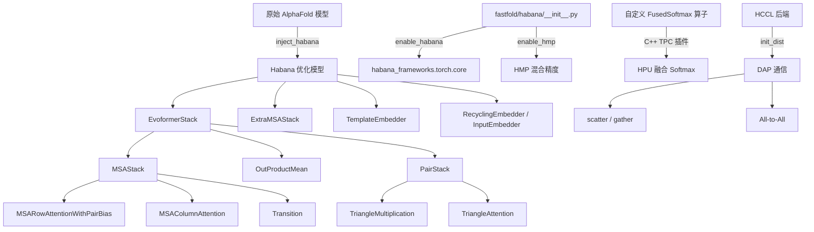

---
slug:17-habana-platform-support
blog_type:normal
---


FastFold 的 Habana 集成提供了一条在 Intel Habana Gaudi/Gaudi2 加速器上运行 AlphaFold 推理和训练的完整路径。该集成涵盖四个架构层：**运行时初始化**、**自定义算子融合**、**针对 Habana 优化的 Evoformer 重实现**，以及**基于 HCCL 的分布式并行**。这并非一个简单的设备移植层，而是一个专用加速栈，它用 HPU 优化的等效模块替换了核心计算模块，同时通过严格的权重注入机制保持数值等效性。

来源: [__init__.py](/fastfold/habana/__init__.py#L1-L21), [inject_habana.py](/fastfold/habana/inject_habana.py#L1-L404)

## 架构概述

Habana 支持系统遵循**模块替换**策略：首先使用标准 PyTorch 操作构建原始 AlphaFold 模型，随后 `inject_habana()` 精准地将 Evoformer、ExtraMSA、Template 和 Embedder 子模块替换为 Habana 优化的实现，并逐参数迁移其预训练权重。此设计确保 Habana 路径在利用 HPU 特定性能特征的同时，产生与 GPU 路径完全一致的结果。



来源: [inject_habana.py](/fastfold/habana/inject_habana.py#L358-L404), [__init__.py](/fastfold/habana/fastnn/__init__.py#L1-L200)

## 运行时初始化

Habana 激活的入口点位于 `fastfold/habana/__init__.py`，该文件暴露了两个全局标志及其控制函数：

| 标志 | 默认值 | 激活函数 | 作用 |
|------|---------|---------------------|--------|
| `ENABLE_HABANA` | `False` | `enable_habana()` | 导入 `habana_frameworks.torch.core`，启用 Lazy 模式 |
| `ENABLE_HMP` | `False` | `enable_hmp()` | 激活 Habana 混合精度 (HMP) |

`enable_habana()` 调用必须先于任何 HPU 张量操作。它启用了 Habana 的**延迟执行模式**（`ENABLE_LAZY_MODE = True`），在该模式下，操作被累积到计算图中，仅在调用 `htcore.mark_step()` 时才执行——这是 Habana 硬件上关键的性能优化模式，能够分摊算子启动开销。`is_habana()` 和 `is_hmp()` 查询函数允许在整个代码库中设置条件代码路径。

来源: [__init__.py](/fastfold/habana/__init__.py#L1-L21)

## 针对 Habana 优化的 FastNN 模块

`fastfold/habana/fastnn/` 包提供了 Evoformer 计算核心的完整重实现，专为 HPU 执行特征而构建。这些模块在权重注入后替换了标准的 `fastfold/model/fastnn/` 等效模块。

### 模块组成

| 模块 | 文件 | 替换目标 | 关键 HPU 优化 |
|--------|------|----------|---------------------|
| `EvoformerStack` | `__init__.py` | `EvoformerStack` | 逐块 `mark_step()`，在块边界融合 scatter/gather |
| `MSAStack` | `msa.py` | MSA 注意力模块 | 用于 DAP 感知列注意力的 `row_to_col` / `scatter` |
| `PairStack` | `triangle.py` | Triangle 模块 | Triangle 乘法中 matmul 前的融合 `gather` |
| `SelfAttention` | `ops.py` | 标准注意力 | 融合 QKV 投影，自定义融合 softmax |
| `OutProductMean` | `ops.py` | 外积均值 | 带 DAP gather/scatter 的分块 matmul |
| `Linear` | `ops.py` | `nn.Linear` | AlphaFold 特定的初始化器支持 |

### EvoformerStack — 核心调度

`Evoformer` 块通过在块边界显式执行 scatter/gather 来编排 DAP 感知的执行过程。第一个块沿 MSA 维度散射 MSA 表示，沿序列维度散射 pair 表示，而最后一个块将它们收集回来并裁剪填充。每个块以 `htcore.mark_step()` 结束，以刷新延迟执行图：

```python
# Evoformer.forward() 的简化流程
if self.first_block:
    m = scatter(m, dim=1)   # 跨 DAP 秩划分 MSA
    z = scatter(z, dim=1)   # 跨 DAP 秩划分 pair

m = self.msa(m, z, msa_mask)
z = self.communication(m, msa_mask, z)
m = All_to_All.apply(m, 1, 2)  # 轉置 MSA 以進行列注意力計算
z = self.pair(z, pair_mask)

if self.last_block:
    m = gather(m, dim=0)   # 重新組裝完整 MSA
    z = gather(z, dim=0)   # 重新組裝完整 pair
```

<CgxTip>在 scatter 之前会应用填充，以确保序列长度能被 DAP world size 整除：`padding_size = (seq_length // dap_size + 1) * dap_size - seq_length`。在 gather 之后，填充将被裁剪掉：`m = m[:, :-padding_size, :]`。此填充策略至关重要——若没有它，scatter 操作将在不均匀的分区上失败。</CgxTip>

来源: [__init__.py](/fastfold/habana/fastnn/__init__.py#L34-L115), [msa.py](/fastfold/habana/fastnn/msa.py#L1-L159)

### 带 DAP 通信的 MSA 注意力

Habana 路径中的 `MSAStack` 将 DAP 通信原语直接集成到注意力流中。`MSARowAttentionWithPairBias` 在注意力计算前对 pair 偏置应用 `gather`，而从行注意力到列注意力的转换则使用 `row_to_col` 全互通信原语：

```python
# MSAStack.forward() — DAP 感知的 row→column 转換
node_mask_row = scatter(node_mask, dim=1)
node = self.MSARowAttentionWithPairBias(node, pair, node_mask_row)
node = row_to_col(node)              # all-to-all: 重新分佈 MSA rows→columns
node_mask_col = scatter(node_mask, dim=2)
node = self.MSAColumnAttention(node, node_mask_col)
```

`ExtraMSACore` 遵循相同的模式，但将 `MSAColumnAttention` 替换为 `MSAColumnGlobalAttention`，后者按照 AlphaFold ExtraMSA 堆栈的要求使用 `GlobalAttention` 模块（独立的 Q/KV 投影而非融合 QKV）。

来源: [msa.py](/fastfold/habana/fastnn/msa.py#L83-L159), [ops.py](/fastfold/habana/fastnn/ops.py#L108-L200)

### Triangle 乘法 — 融合 Gather + Matmul

Habana 三角乘法模块（`TriangleMultiplicationOutgoing` 和 `TriangleMultiplicationIncoming`）将 DAP `gather` 直接融合到计算路径中。对于外向乘法，右投影在批量 matmul 之前沿 dim=1 收集；对于内向乘法，左投影沿 dim=2 收集。这消除了冗余的同步点：

```python
# TriangleMultiplicationOutgoing.forward()
right_proj_act = gather(right_proj_act.contiguous(), dim=1)
p = torch.matmul(
    permute_final_dims(left_proj_act, (2, 0, 1)),
    permute_final_dims(right_proj_act, (2, 1, 0)),
)
```

来源: [triangle.py](/fastfold/habana/fastnn/triangle.py#L27-L93)

## 自定义融合 Softmax 算子

`custom_op/` 子包提供了用于融合 softmax 操作的 Habana TPC (Tensor Processing Core) 自定义算子，该算子作为通过 Habana 自定义算子框架注册的 C++ 插件实现。

### 算子注册架构

`hpu_fusedsoftmax.cpp` 中的 C++ 实现向 Habana 图编译器注册了三个自定义操作：

| 操作 | 模式 | GUID (Gaudi) | GUID (Gaudi2) | 用途 |
|-----------|--------|---------------|---------------|---------|
| `fusedsoftmax` | `(Tensor, Tensor, int) → Tensor` | `fusedsoftmax_fwd_f32` | `fusedsoftmax_fwd_f32_gaudi2` | 前向: softmax(input + mask) |
| `fusedsoftmax_bias` | `(Tensor, Tensor, Tensor, int) → Tensor` | `fusedsoftmax_bias_fwd_f32` | `fusedsoftmax_bias_fwd_f32_gaudi2` | 前向: softmax(input + mask + bias) |
| `fusedsoftmax_backward` | `(Tensor, Tensor, int) → Tensor` | `softmax_bwd_f32` | `softmax_bwd_f32` | 反向: y * (grad - sum(grad * y)) |

该算子通过 Habana 的 `CppExtension` 构建系统编译，链接 `habana_pytorch_plugin`。`GAUDI2` 预处理宏在编译时选择适当的 TPC 算子 GUID。构建出的共享对象（`libcustom_tpc_perf_lib.so`）在运行时通过 `GC_KERNEL_PATH` 环境变量加载。

### Python Autograd 集成

Python 侧（`fusedsoftmax.py`）将 C++ 算子封装在带有适当反向传播支持的 `torch.autograd.Function` 子类中：

```python
class FusedSoftmaxBiasFunction(torch.autograd.Function):
    @staticmethod
    def forward(ctx, input, mask, bias, dim):
        tensor = torch.ops.custom_op.fusedsoftmax_bias(input, mask, bias, dim)
        ctx.y = tensor  # 保存以供反向傳播使用
        return tensor

    @staticmethod
    def backward(ctx, grad_output):
        grad_input = torch.ops.custom_op.fusedsoftmax_backward(ctx.y, grad_output, ctx.dim)
        grad_bias = torch.sum(grad_input, dim=-4, keepdim=True) if ctx.use_bias else None
        return grad_input, None, grad_bias, None
```

`fused_softmax_bias` 函数包含形状兼容性守卫：仅当 `input[..., :, :1, :1, :].shape == mask.shape` 且 `input[..., :1, :, :, :].shape == bias.shape` 时才调用自定义算子，否则回退到标准 PyTorch 操作。

来源: [hpu_fusedsoftmax.cpp](/fastfold/habana/fastnn/custom_op/hpu_fusedsoftmax.cpp#L1-L200), [fusedsoftmax.py](/fastfold/habana/fastnn/custom_op/fusedsoftmax.py#L1-L82), [setup.py](/fastfold/habana/fastnn/custom_op/setup.py#L1-L27)

## 权重注入机制

`inject_habana()` 函数是 Habana 集成的核心枢纽。它执行**精准的模块替换**与精确的权重迁移，确保 Habana 优化模型与原始模型数值完全一致。该过程遵循严格的协议：


### 注入范围

按顺序应用四个注入函数：

| 函数 | 目标模块 | 功能描述 |
|----------|---------------|--------------|
| `inject_evoformer()` | `model.evoformer` | 替换为 `EvoformerStack`，复制所有 48 个块 |
| `inject_extramsa()` | `model.extra_msa_stack` | 替换为 `ExtraMSAStack`，复制所有 4 个块 |
| `inject_template()` | `model.template_embedder` | 替换为 `TemplateEmbedder` 或 `TemplateEmbedderMultimer` |
| `inject_embedder()` | `model.recycling_embedder` + `model.input_embedder` | 替换为 `RecyclingEmbedder` + `InputEmbedder`（仅单体） |

### 参数复制原语

注入依赖于一组参数复制函数库，在原始模块和 Habana 模块的参数布局之间进行映射：

| 复制函数 | 源 → 目标 | 关键转换 |
|---------------|-----------------|-------------------|
| `copy_qkv_linear()` | `linear_q, linear_k, linear_v` → `to_qkv` | 拼接 Q, K, V 权重：`cat((Q.w, K.w, V.w), dim=0)` |
| `copy_kv_linear()` | `linear_k, linear_v` → `to_kv` | 拼接 K, V 权重用于全局注意力 |
| `copy_attention()` | 完整注意力模块 | 融合 QKV，复制门控和输出线性层 |
| `copy_triangle()` | Triangle 乘法 | 复制左/右投影、门控、输出投影 |
| `copy_layernorm()` | LayerNorm | 直接复制权重和偏置 |

融合 QKV 投影（`copy_qkv_linear`）是一项关键优化——Habana 路径不再执行三次独立的线性传递，而是将权重矩阵拼接成单个 `to_qkv` 线性层，通过一次 matmul 生成完整的 QKV 张量，从而减少了 HPU 上的算子启动开销。

<CgxTip>所有参数复制均在 `torch.no_grad()` 上下文中执行，以防止注入期间的梯度追踪。复制完成后，若原始模块处于 eval 模式（`training == False`），快速模块也将通过 `fast_module.eval()` 设置为 eval 模式。这确保了批归一化和 dropout 在推理期间行为正确。</CgxTip>

来源: [inject_habana.py](/fastfold/habana/inject_habana.py#L23-L100), [inject_habana.py](/fastfold/habana/inject_habana.py#L280-L404)

## HCCL 分布式通信

Habana 分布式后端使用 **HCCL**（Habana Collective Communication Library）替换了 NCCL，同时保留了相同的 DAP（动态轴向并行）通信原语。

### 通过 MPI + HCCL 初始化

`core.py` 中的 `init_dist()` 函数通过 MPI 秩发现引导分布式训练，然后初始化 HCCL：

```python
def init_dist(tensor_model_parallel_size_=1):
    comm = MPI.COMM_WORLD
    world_size = comm.Get_size()
    rank = comm.Get_rank()
    
    import habana_frameworks.torch.distributed.hccl
    dist.init_process_group(backend='hccl', rank=rank, world_size=world_size)
```

HCCL 初始化后，将构建两个进程组——**张量模型并行**（用于模型内的 DAP）和**数据并行**（用于跨模型副本的梯度同步）——遵循与 GPU 分布式后端相同的组构建逻辑。

### 通信原语

`comm.py` 模块提供了具有正确反向传播实现的自动求分感知集合操作：

| 原语 | 前向 | 反向 | DAP 角色 |
|-----------|---------|----------|----------|
| `scatter(input, dim)` | 沿 dim `_split` | 沿 dim `_gather` | 跨 DAP 秩分區張量 |
| `gather(input, dim)` | 沿 dim `_gather` | 沿 dim `_split` | 從 DAP 秩重新組裝張量 |
| `reduce(input)` | `all_reduce(SUM)` | 恆等 | 同步複製的張量 |
| `copy(input)` | 恆等 | `_reduce` | 梯度同步鈎子 |
| `col_to_row(input)` | `_all_to_all(dim=1→2)` | `_all_to_all(dim=2→1)` | MSA row↔column 佈局轉換 |
| `row_to_col(input)` | `_all_to_all(dim=2→1)` | `_all_to_all(dim=1→2)` | `col_to_row` 的逆操作 |

每个原语均实现为 `torch.autograd.Function` 子类，确保梯度能正确流经分布式边界。`All_to_All` 类尤为关键——它使 MSA 表示能够在 Evoformer 块内的行并行和列并行布局之间重新分布。

来源: [core.py](/fastfold/habana/distributed/core.py#L1-L123), [comm.py](/fastfold/habana/distributed/comm.py#L1-L189), [__init__.py](/fastfold/habana/distributed/__init__.py#L1-L9)

## HPU 性能辅助器

`hpuhelper.py` 模块提供了 `hpu_perf`，这是一个轻量级分析器，它使用 `mark_step()` 边界和可选的内存追踪来检测训练步骤：

| 方法 | 行为 |
|--------|----------|
| `__init__(module, ...)` | 记录开始时间，可选地重置峰值内存统计 |
| `checknow(log)` | 调用 `mark_step()` + 可选同步，打印*当前*阶段的耗时 |
| `checkahead(log)` | 调用 `mark_step()` + 可选同步，打印*前一*阶段的耗时 |

`checkahead` 方法实现了非侵入式性能分析，其时间标签与前一个阶段而非当前阶段匹配，从而产生更清晰的输出（如 `forward: 120ms`, `backward: 340ms`），而不会干扰训练循环。

来源: [hpuhelper.py](/habana/hpuhelper.py#L1-L44)

## 使用 HMP 的混合精度

Habana 混合精度 (HMP) 在训练中通过 `--hmp` 标志控制。启用后，它使用算子级别的 BF16/FP32 列表应用 O1 级别的混合精度：

**BF16 操作** (`ops_bf16.txt`)：`addmm`, `conv2d`, `max_pool2d`, `sum`, `relu`, `mm`, `bmm`, `mv`, `linear`, `t`, `mul`, `sub`, `add`, `truediv`, `layer_norm`

**FP32 操作** (`ops_fp32.txt`)：`cross_entropy`, `log_softmax`, `nll_loss`, `softmax`

FP32 列表为对归约敏感的操作（softmax, cross_entropy）保留了数值精度，同时允许大量线性代数运算在 BF16 下运行。HMP 通过以下方式激活：

```python
hmp.convert(opt_level='O1',
            bf16_file_path=args.hmp_bf16,
            fp32_file_path=args.hmp_fp32,
            isVerbose=args.hmp_verbose)
```

在优化器步骤期间，通过 `with hmp.disable_casts(): optimizer.step()` 禁用类型转换操作，以防止梯度更新中意外的精度提升。

来源: [train.py](/habana/train.py#L147-L210), [ops_bf16.txt](/habana/ops_bf16.txt#L1-L16), [ops_fp32.txt](/habana/ops_fp32.txt#L1-L5)

## 推理流水线

Habana 推理脚本（`habana/inference.py`）遵循以下执行流程：

1. 通过 `habana.enable_habana()` 和 `init_dist()` **启用 Habana 运行时**
2. 在 CPU 上使用 `AlphaFold(config)` **构建模型**
3. 通过 `import_jax_weights_(model, param_path)` **加载 JAX 权重**
4. 通过 `inject_habana(model)` **注入 Habana 模块**
5. 通过 `model.to(device="hpu")` **转移至 HPU**
6. 在 `torch.no_grad()` 下**运行推理**，并在前向传播后调用 `htcore.mark_step()`

单体和多聚体模式均受支持。当设置 `--enable_workflow` 时，多聚体路径使用 `FastFoldMultimerDataWorkFlow` 进行并行 MSA 搜索。`--chunk_size` 参数控制 OutProductMean 和注意力模块内的内存高效分块执行。

来源: [inference.py](/habana/inference.py#L82-L130), [inference.sh](/habana/inference.sh#L1-L21)

## 训练流水线

Habana 训练脚本（`habana/train.py`）支持多 HPU 分布式训练，包含以下组件：

| 组件 | 实现 |
|-----------|---------------|
| 分布式启动 | `mpirun` 搭带 `--allow-run-as-root --bind-to none` |
| 后端 | 通过 `habana_frameworks.torch.distributed.hccl` 实现 HCCL |
| 数据并行 | 搭带 `gradient_as_bucket_view=True`, `bucket_cap_mb=400` 的 `DistributedDataParallel` |
| 优化器 | 来自 `habana_frameworks.torch.hpex.optimizers` 的 `FusedAdamW` |
| 混合精度 | 搭带可配置 BF16/FP32 算子列表的 HMP O1 |
| 性能分析 | 搭带 `mark_step()` 的逐步计时 `hpu_perf` |

训练循环在每次验证前向传播后应用 `htcore.mark_step()`，以确保延迟图在度量计算之前执行。

来源: [train.py](/habana/train.py#L1-L250), [train.sh](/habana/train.sh#L1-L32)

## 环境设置

推理和训练脚本均需设置两个关键环境变量：

```bash
# 加載自定義 TPC 算子庫
export GC_KERNEL_PATH=./fastfold/habana/fastnn/custom_op/libcustom_tpc_perf_lib.so:$GC_KERNEL_PATH

# 將項目根目錄添加至 Python 路徑
export PYTHONPATH=./:$PYTHONPATH
```

`GC_KERNEL_PATH` 变量告知 Habana 运行时在何处查找自定义融合 softmax TPC 算子共享对象。若未设置，融合 softmax 自定义算子将在运行时加载失败。

来源: [inference.sh](/habana/inference.sh#L1-L3), [train.sh](/habana/train.sh#L1-L3)

## Habana 与 GPU 集成对比

| 方面 | GPU 路径 | Habana 路径 |
|--------|----------|-------------|
| 设备 | `cuda` | `hpu` |
| 集合通信后端 | NCCL | HCCL |
| 分布式初始化 | 直接使用 `torch.distributed` | MPI 秩发现 → HCCL |
| 自定义算子 | CUDA 融合算子 | 通过 `hpu_custom_op.h` 实现的 TPC 自定义算子 |
| 执行模型 | 即时执行 (默认) | 搭带 `mark_step()` 的延遲執行模式 |
| 混合精度 | AMP (autocast/GradScaler) | HMP (基於算子列表的 BF16/FP32) |
| 优化器 | `torch.optim.AdamW` | 來自 `habana_frameworks` 的 `FusedAdamW` |
| Softmax 融合 | 自定義 CUDA 算子 | 搭帶 Gaudi/Gaudi2 GUID 的自定義 TPC 算子 |
| DAP 原語 | `fastfold/distributed/` | `fastfold/habana/distributed/` (相同 API，HCCL 後端) |
| 權重注入 | `inject_fastnn()` | `inject_habana()` (融合 QKV 佈局) |

来源: [inject_habana.py](/fastfold/habana/inject_habana.py#L1-L404), [core.py](/fastfold/habana/distributed/core.py#L30-L50)

## 后续步骤

- 有关 GPU 和 Habana 路径共享的底层 DAP 通信设计，请参阅 [DAP 通信原语](9-dap-communication-primitives)
- 有关 Habana 模块所效仿的 FastNN 模块架构，请参阅 [FastNN 模块设计](6-fastnn-module-design)
- 有关为两条路径提供权重的 JAX 权重注入，请参阅 [从 JAX 注入权重](15-weight-injection-from-jax)
- 有关性能测量方法，请参阅 [性能基准测试](18-performance-benchmarking)