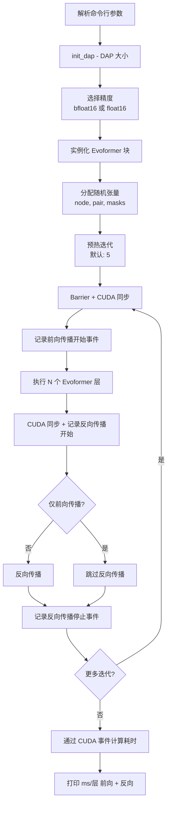
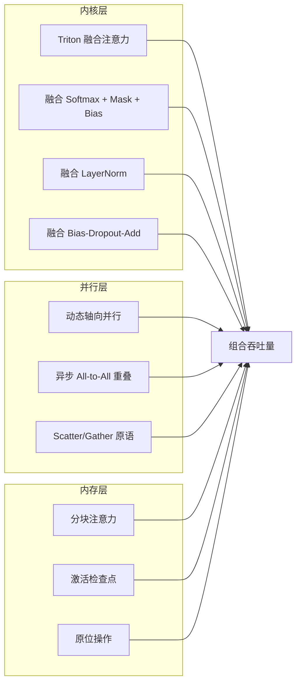

---
slug:18-performance-benchmarking
blog_type:normal
---


FastFold 的性能工程建立在三个协同支柱之上：通过 Triton 和 CUDA 原生实现进行的**融合核加速**，将 All-to-All 通信与计算重叠的**动态轴向并行**，以及通过激活检查点和分块注意力限制峰值显存的**内存高效分块执行**。本页提供了跨这些维度测量和优化 FastFold 性能所需的方法论、工具和调优指南——从 Evoformer 主干的单 GPU 微基准测试，到端到端推理和训练的多 GPU 分布式扩展。

来源: [perf.py](benchmark/perf.py#L1-L188), [evoformer.py](fastfold/model/fastnn/evoformer.py#L1-L92)

## 基准测试架构与工具

标准基准测试入口点是 `benchmark/perf.py`，这是一个独立的 Evoformer 性能测试工具，它将计算密集型的 Evoformer 主干与完整的 AlphaFold 流水线隔离开来。这种设计能够将吞吐量的提升精确归因于特定的优化——融合核、DAP 通信重叠或分块执行——而不会受到数据 I/O 或辅助模型头的干扰。

基准测试编排以下测量协议：



基准测试工具中的**关键设计决策**：使用 CUDA 事件（`torch.cuda.Event(enable_timing=True)`）而非系统时钟 `time.time()`，以确保 GPU 端计时的准确性，排除主机端开销。每次迭代前通过 `torch.distributed.barrier()` 和 `torch.cuda.synchronize()` 消除跨秩不同步的伪影。预热阶段（默认 5 次迭代）被排除在报告的统计数据之外，以允许 Triton 核的 JIT 编译和 CUDA 上下文初始化达到稳定。

来源: [perf.py](benchmark/perf.py#L93-L184)

## 基准测试参数与配置

基准测试脚本暴露了对 Evoformer 计算每个维度的细粒度控制：

| 参数 | 默认值 | 描述 |
|-----------|---------|-------------|
| `--dap-size` | 1 | 动态轴向并行使用的 GPU 数量 |
| `--msa-length` | 132 | MSA 序列深度（MSA 表示中的 N_rows） |
| `--res-length` | 256 | 残基序列长度（N_res，决定配对维度） |
| `--trials` | 50 | 测量的基准测试迭代次数 |
| `--warmup-trials` | 5 | 从统计中排除的预热迭代次数 |
| `--layers` | 12 | 要执行的 Evoformer 块数量 |
| `--cm` | 256 | MSA 隐藏通道维度 (c_m) |
| `--cz` | 128 | 配对隐藏通道维度 (c_z) |
| `--heads` | 8 | 多头注意力头数 |
| `--openfold` | False | 基准测试 OpenFold 的 EvoformerBlock 以进行比较 |
| `--fwd` | False | 仅前向传播模式（跳过反向传播） |
| `--prof` | False | 启用 PyTorch 性能分析器并导出至 TensorBoard |

**精度选择**不是用户可配置的，而是受关键约束支配：当 `dap_size > 1` 时，精度自动从 `bfloat16` 回退到 `float16`，因为 PyTorch 的 All-to-All 通信原语在分布式模式下不支持 BFloat16 数据类型。这是一个已知的 PyTorch 限制，直接影响了吞吐量（bfloat16 在 Ampere+ GPU 上通常更快）和数值行为。

来源: [perf.py](benchmark/perf.py#L14-L43)

## 运行基准测试

### 单 GPU Evoformer 基准测试

最简单的调用方式是在单个 GPU 上使用默认问题维度对 FastFold Evoformer 进行基准测试：

```bash
python benchmark/perf.py
```

这会生成以下格式的输出：
```
[ MSA Attn ] Input:    1,  132,  256, ( 256  128) Fwd Time / Layer: X.XXX ms Bwd Time / Layer: Y.YYY ms
```

### 多 GPU DAP 基准测试

要测量动态轴向并行在例如 4 个 GPU 上的扩展性：

```bash
torchrun --nproc_per_node=4 benchmark/perf.py --dap-size 4
```

### 对比 OpenFold 基线

与 OpenFold Evoformer 实现的直接 A/B 比较使用 `--openfold` 标志，该标志动态导入 `openfold.model.evoformer.EvoformerBlock` 并将其封装以匹配 FastFold 基准测试接口：

```bash
python benchmark/perf.py --openfold
python benchmark/perf.py           # FastFold，用于比较
```

### 性能分析器集成

要进行核级别的归因分析，请启用 PyTorch 性能分析器，它会将追踪记录导出到 TensorBoard：

```bash
python benchmark/perf.py --prof
# 查看追踪记录：
# tensorboard --logdir=./log/fastfold
```

性能分析器使用调度模式：`wait=1, warmup=5, active=50, repeat=1`，这与默认的迭代/预热计数一致，以确保性能分析仅捕获稳态执行。追踪处理程序将数据写入 `./log/fastfold`。

### 自定义问题规模

对于具有非典型 MSA 深度或序列长度的蛋白质：

```bash
# 长序列（例如，512 个残基，深度 MSA）
python benchmark/perf.py --res-length 512 --msa-length 256 --layers 48

# 短序列，浅 MSA（例如，多肽预测）
python benchmark/perf.py --res-length 64 --msa-length 16 --layers 12
```

来源: [perf.py](benchmark/perf.py#L82-L121), [perf.py](benchmark/perf.py#L122-L132)

## 性能优化向量

FastFold 通过分层优化策略实现加速。每一层针对 Evoformer 计算中独特的瓶颈，且各层之间以相乘而非相加的方式组合。



### 融合核加速

内核层通过将多步操作融合为单次内核启动，消除了冗余的 GPU 往返。调度架构遵循 **Triton 优先回退策略**：优先尝试 Triton 核以在 Ampere+ GPU 上获得卓越性能；如果 Triton 不可用，系统回退到 CUDA 原生核（通过 C++ 扩展）或纯 PyTorch 操作。

| 核 | Triton 实现 | 回退方案 | 融合收益 |
|--------|-----------------------|----------|----------------|
| **注意力核心** | Triton 中的 Flash 风格分块注意力 | `torch.matmul` + `softmax` + `matmul` | 消除完整 N×N 注意力矩阵的具体化；在 SRAM 中进行在线 softmax |
| **Softmax** | 融合 softmax + mask + bias | CUDA 原生 softmax 核 | 单个核对比 3 个独立操作；反向传播与保存的输出融合 |
| **LayerNorm** | Triton LayerNorm | Apex FusedLayerNormAffine | 单次遍历对比多操作；MSA 深度 > 4000 时自动分块 |
| **Bias-Dropout-Add** | JIT 编译的融合操作 | PyTorch functional dropout | 融合偏置加法、sigmoid、逐元素乘法、dropout 和残差 |

Triton 注意力核心实现了 **Flash 风格分块算法**，以 128 个元素的块（`BLOCK_M=BLOCK_N=128`）处理 Q×K^T 计算，并维护运行时的最大值和求和统计量，以实现数值稳定的在线 softmax。这将注意力矩阵的内存复杂度从 O(N²) 降低到 O(N)，这对于蛋白质结构预测中的长序列至关重要。该核支持编译时条件性的掩码和偏置应用（`use_mask: tl.constexpr`，`use_bias: tl.constexpr`），避免了分支开销。

<CgxTip>Triton 注意力核将头维度 (`Lk`) 约束为 {16, 32, 64, 128}，并在 Lk ≤ 64 时使用 `num_warps=4`，否则使用 `num_warps=8`。未对齐到 BLOCK=128 分块大小的序列长度通过掩码加载而非填充处理，避免了计算浪费。</CgxTip>

来源: [attention_core.py](fastfold/model/fastnn/kernel/attention_core.py#L1-L53), [triton/attention_core.py](fastfold/model/fastnn/kernel/triton/attention_core.py#L1-L191), [softmax.py](fastfold/model/fastnn/kernel/softmax.py#L1-L59), [layer_norm.py](fastfold/model/fastnn/kernel/layer_norm.py#L1-L61), [__init__.py](fastfold/model/fastnn/kernel/__init__.py#L1-L13)

### 动态轴向并行 (DAP) 扩展

DAP 通过沿其两个轴向维度——行和列——划分 MSA 表示，将 Evoformer 计算分布到多个 GPU 上。行并行和列并行状态之间通过 **All-to-All 通信**进行转换，该通信重新分配数据，使得每个 GPU 持有其分配的 MSA 行（或列）子集的完整序列维度。

关键的性能洞察是，All-to-All 通信是**异步的且与计算重叠**。在 Evoformer 的前向传播中，`MSACore` 完成其行并行计算后，异步启动 All-to-All 转置（`All_to_All_Async.apply`），而 `PairCore` 在通信进行期间**并发地**对配对表示执行计算。异步操作的完成句柄（`work`）仅在下次需要 MSA 表示时才被等待：

```
m = self.msa(m, z, msa_mask)           # 行并行 MSA 计算
z = self.communication(m, msa_mask, z) # 外积均值
m, work = All_to_All_Async.apply(m)    # 启动异步 All-to-All
z = self.pair(z, pair_mask)            # 配对计算与通信重叠
m = All_to_All_Async_Opp.apply(m, work) # 等待通信完成
```

**DAP 扩展基准测试**应将 `--dap-size` 从 1 扫描至可用 GPU 数量。预期的扩展曲线是次线性的，原因在于：(1) All-to-All 通信量按每 GPU O(N²/P) 缩放，引入了通信开销下限；(2) 当 DAP > 1 时 float16 精度要求，其吞吐量可能不同于单 GPU 上的 bfloat16；(3) 为对齐 `dap_size` 的序列填充（计算为 `(seq_length // dap_size + 1) * dap_size - seq_length`）对不可整除的序列长度引入了浪费。

来源: [evoformer.py](fastfold/model/fastnn/evoformer.py#L30-L91), [comm_async.py](fastfold/distributed/comm_async.py#L129-L199), [core.py](fastfold/distributed/core.py#L17-L41)

### 内存高效执行

两种互补机制控制峰值显存：

**分块注意力**——通过 `set_chunk_size()` 和 `--chunk-size` 命令行参数控制，分块将大型注意力操作分解为按顺序处理的小型块，以吞吐量换取更低的激活内存。模型配置中的 `chunk_size` 参数（`config.globals.chunk_size`）会传播至所有分块注意力模块（`ChunkMSARowAttentionWithPairBias`、`ChunkMSAColumnGlobalAttention`、`ChunkTransition`）。

**激活检查点**——EvoformerStack 中的 `checkpoint_blocks` 函数将 Evoformer 块栈划分为大小为 `blocks_per_ckpt` 的块。每个块的输入激活被保存，而块内的中间激活在反向传播期间重新计算。配置 `blocks_per_ckpt=None` 完全禁用检查点（最快速度，最大内存）；`blocks_per_ckpt=1` 检查点每个块（最小内存，最多重计算）。在训练期间，配置自动设置 `blocks_per_ckpt=1` 和 `chunk_size=None`，优先为更大的反向传播内存占用节省内存。

| 设置 | `blocks_per_ckpt` | `chunk_size` | 内存 | 速度 |
|---------|-------------------|--------------|--------|-------|
| 推理（默认） | `None` | `None` | 高 | 最快 |
| 推理（内存受限） | 例如 `4` | 例如 `512` | 中 | 中等 |
| 训练 | `1` | `None` | 最低 | 最慢（重计算） |

**原位操作**提供了额外的内存优化路径。`Evoformer.inplace()` 方法原位修改张量而非创建新分配，由 `config.globals.inplace` 控制（在推理期间通过 `--inplace` 标志设置）。这对配对表示 `z` 尤其有效，因为它通过多个子模块更新而无需保留原始值。

<CgxTip>当 `input.shape[-3] > 4000` 时，LayerNorm 核实现自动分块：分块大小计算为 `min(4000² / dim, (dim + 1) / 2)`，平衡核占用与内存。这透明地处理了深度 MSA 堆栈，无需手动配置。</CgxTip>

来源: [checkpointing.py](fastfold/utils/checkpointing.py#L30-L84), [evoformer.py](fastfold/model/fastnn/evoformer.py#L93-L152), [inference.py](inference.py#L130-L145), [config.py](fastfold/config.py#L115-L124), [layer_norm.py](fastfold/model/fastnn/kernel/layer_norm.py#L37-L52)

## 端到端推理基准测试

虽然 `benchmark/perf.py` 隔离了 Evoformer，但完整推理性能通过 `inference.py` 流水线测量，它对包含所有模型阶段的完整模型前向传播计时：

```python
t = time.perf_counter()
out = model(batch)
print(f"Inference time: {time.perf_counter() - t}")
```

推理流水线应用以下与性能相关的配置序列：

1. 通过 `import_jax_weights_()` **导入 JAX 权重**——一次性成本，不包含在推理计时中
2. 通过 `inject_fastnn(model)` **注入 FastNN**——用融合核等效项替换标准 PyTorch 模块
3. 通过 `set_chunk_size(model.globals.chunk_size)` **配置分块大小**——应用内存/速度权衡
4. 通过 `set_fused_triangle_multiplication()` 为 v3 模型权重**融合三角形乘法**
5. 对 PyTorch ≥ 1.12 **启用 TF32**：`torch.backends.cuda.matmul.allow_tf32 = True`

推理脚本（`inference.sh`、`inference_multimer.sh`）使用适当的分布式启动配置封装 `inference.py`。对于 DAP 推理，启动必须设置 `WORLD_SIZE` 和 `RANK` 环境变量，`init_dap()` 消耗这些变量以初始化 ColossalAI 张量并行上下文。

来源: [inference.py](inference.py#L122-L159), [inference.py](inference.py#L47-L48)

## 训练性能

训练性能通过 **ColossalAI** 的分布式训练框架和 `HybridAdam` 优化器管理。训练脚本（`train.py`）暴露了 `--dap_size` 参数（推荐范围：1 到 `nproc_per_node`），该参数在 ColossalAI 的并行上下文中配置张量并行大小：

```python
colossalai.launch_from_torch(
    config=dict(parallel=dict(tensor=dict(size=args.dap_size)),
                torch_ddp=dict(static_graph=True)))
```

DDP 配置中的 `static_graph=True` 标志启用图优化，因为 Evoformer 的计算图在迭代间是固定的——批次内无动态控制流或变长序列。这消除了每次迭代的图分析开销。

训练自动配置内存保守设置：`blocks_per_ckpt=1`（完全激活检查点）和 `chunk_size=None`（不分块，仅依赖检查点进行内存管理）。`config.globals.inplace` 在训练期间设置为 `False`，以维护通过检查点块的正确梯度计算。

来源: [train.py](train.py#L1-L18), [train.py](train.py#L155-L174), [config.py](fastfold/config.py#L115-L118)

## 基准测试最佳实践

**确定性比较**需要控制所有方差来源。设置固定种子（如 `perf.py` 中的 `torch.manual_seed(42)`、`torch.cuda.manual_seed_all(42)`），禁用 CUDA 基准测试模式（`torch.backends.cudnn.benchmark = False`），并使用确定性算法。注意，由于并行 warp 中的浮点归约顺序，Triton 核在不同运行间仍可能表现出轻微的非确定性。

**预热充分性**取决于被基准测试的优化层。对于 Triton 核基准测试，5 次预热迭代（默认）通常足以完成 JIT 编译。对于 DAP 扩展基准测试，可能需要额外预热以允许 NCCL 通信通道完全初始化——考虑增加至 10–15 次预热迭代。

**隔离优化贡献**需要系统性的 A/B 方法论：

| 比较 | 命令 A | 命令 B | 隔离因素 |
|------------|-----------|-----------|-----------------|
| FastNN 对比 OpenFold | `perf.py` | `perf.py --openfold` | 融合核 + DAP |
| DAP 扩展 | `perf.py --dap-size 1` | `perf.py --dap-size N` | 并行 + 通信重叠 |
| 前向 对比 前向+反向 | `perf.py --fwd` | `perf.py` | 反向传播成本 |
| 有/无性能分析器 | `perf.py` | `perf.py --prof` | 核级别归因 |

**报告约定**：始终报告每层时序（ms/层）而非总时间，因为 Evoformer 块的数量在不同模型配置中有所不同。每次测量都包含完整的维度签名 `(batch, msa_length, res_length, c_m, c_z)` 以实现跨研究比较。注意，基准测试始终使用 `batch_size=1`，反映了蛋白质结构预测中典型的单序列推理工作负载。

来源: [perf.py](benchmark/perf.py#L47-L49), [perf.py](benchmark/perf.py#L179-L183)

## 解释基准测试结果

基准测试输出格式编码了完整的问题规格：

```
[ MSA Attn ] Input:    1,  132,  256, ( 256  128) Fwd Time / Layer: 12.345 ms Bwd Time / Layer: 34.567 ms
                  │     │    │      │    │                    │                        │
                  │     │    │      │    │                    │                        └─ 每个 Evoformer 块的反向传播毫秒数
                  │     │    │      │    │                    └─ 每个 Evoformer 块的前向传播毫秒数
                  │     │    │      │    └─ c_z（配对通道）
                  │     │    │      └─ c_m（MSA 通道）
                  │     │    └─ res_length（序列 / 配对维度）
                  │     └─ msa_length（MSA 深度）
                  └─ batch_size
```

内核级别的**性能预期**：对于序列长度 ≥ 256，Triton 融合注意力核心应比未融合的 PyTorch 基线实现 2–4 倍的加速，且随着序列变长差距扩大，因为 O(N²) → O(N) 的内存减少支持了更大的分块占用。具有异步通信重叠的 DAP 扩展在 4 个 GPU 上对于典型蛋白质长度（256–384 个残基）应达到 70–85% 的并行效率，而对于通信开销占主导的较短序列，效率下降。`--openfold` 比较基线通常显示比 FastFold 慢 3–9 倍的每层时序，这归因于基线实现中缺少融合核、DAP 和异步通信重叠。

如需更深入的性能分析，请继续阅读 [融合核实现](7-fused-kernel-implementations) 了解核级别优化细节，[对偶异步操作](10-duality-async-operation) 了解通信-计算重叠机制，或 [内存高效分块执行](8-memory-efficient-chunked-execution) 了解分块和检查点策略。