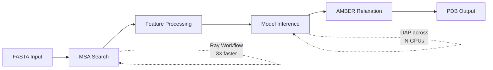

---
slug:2-quick-start
blog_type:normal
---


几分钟内让 FastFold 跑起来 — 从环境配置到首次蛋白质结构预测。本指南将带你完成安装、数据集准备，以及运行单体和多聚体推理。

## 前置条件

在安装前，FastFold 需要以下基础依赖：

| 需求 | 最低版本 | 备注 |
|---|---|---|
| **Python** | 3.8 或 3.9 | 推荐通过 Conda 安装 3.8 |
| **NVIDIA CUDA** | 11.3+ | Triton 内核需要 11.4+ |
| **PyTorch** | 1.12+ | 在推荐流程中通过 Conda 安装 |
| **GPU** | Volta (SM 7.0) 或更高版本 | Ampere (SM 8.0) 在构建时自动检测 |

来源: [README.md](/README.md#L31-L37), [setup.py](/setup.py#L72-L74), [setup.py](/setup.py#L107-L111)

## 安装

### 选项 A: Conda (推荐)

基于 Conda 的安装会在单个可复现的步骤中创建一个隔离的 `fastfold` 环境，包含所有依赖 — 包括生物信息学工具链（`hmmer`、`hhsuite`、`kalign2`）和分子动力学库（`openmm`、`pdbfixer`）。

```shell
git clone https://github.com/hpcaitech/FastFold
cd FastFold
conda env create --name=fastfold -f environment.yml
conda activate fastfold
python setup.py install
```

`environment.yml` 固定了 **PyTorch 1.12** 与 **CUDA 11.3**、用于分布式原语的 **ColossalAI 0.2.7**，以及用于加速数据工作流的 **Ray 2.0.0**。`setup.py install` 步骤会针对你本地的 CUDA 工具包编译自定义 CUDA 内核（`fastfold_layer_norm_cuda`、`fastfold_softmax_cuda`），这就是为什么需要一个对 GPU 可见的构建环境。

来源: [README.md](/README.md#L39-L49), [environment.yml](/environment.yml#L1-L33), [setup.py](/setup.py#L118-L143)

### 选项 B: Docker

若要使用完全避免依赖冲突的容器化设置，请使用提供的 Dockerfile。**注意：** 构建需要 NVIDIA Docker Runtime，因为 CUDA 扩展是在镜像构建时编译的。

```shell
cd FastFold
docker build -t fastfold ./docker
docker run -ti --gpus all --rm --ipc=host fastfold bash
```

基础镜像为 `hpcaitech/pytorch-cuda:1.12.0-11.3.0`，已包含支持 CUDA 的 PyTorch。Dockerfile 随后会在从源码构建 FastFold 之前，叠加安装 OpenMM、生物信息学工具和 Python 依赖。

来源: [README.md](/README.md#L63-L78), [docker/Dockerfile](/docker/Dockerfile#L1-L14)

### 可选: 安装 Triton 以启用高级内核

要解锁额外的融合内核优化，请安装 OpenAI 的 Triton。**这需要 CUDA 11.4 或更高版本** — 如果你的 Conda 环境附带的是 CUDA 11.3，则需要单独升级工具包。

```bash
pip install -U --pre triton
```

来源: [README.md](/README.md#L53-L60)

## 下载数据集

FastFold 复用 AlphaFold 的遗传和结构数据库进行 MSA 搜索和模板匹配。`download_all_data.sh` 脚本使用 `aria2c` 进行高吞吐量获取，统筹所有下载任务。

```shell
./scripts/download_all_data.sh data/
```

这会将**所有**必需的数据库检索到 `data/` 中：

| 数据库 | 用途 | 单体 | 多聚体 |
|---|---|---|---|
| **UniRef90** | JackHMMER MSA 搜索 | ✅ | ✅ |
| **MGnify** | 宏基因组 MSA 扩展 | ✅ | ✅ |
| **PDB70** | HHSearch 模板搜索 | ✅ | ✅ |
| **UniRef30 / BFD** | HHblits MSA 搜索 | ✅ | ✅ |
| **PDB mmCIF** | 模板结构文件 | ✅ | ✅ |
| **AlphaFold Params** | 预训练 JAX 权重 | ✅ | ✅ |
| **UniProt** | 多聚体链配对 | ❌ | ✅ |
| **PDB SeqRes** | 多聚体链分配 | ❌ | ✅ |

对于磁盘空间受限的环境，请使用精简数据库模式：

```shell
./scripts/download_all_data.sh data/ reduced_dbs
```

<CgxTip>完整下载可能会超过 2.5 TB。如果你只需要验证设置是否正常工作，可以考虑先仅下载 AlphaFold 参数：`./scripts/download_alphafold_params.sh data/` — 然后使用 `demo.py`（无需任何数据库）来测试模型前向传播。</CgxTip>

来源: [scripts/download_all_data.sh](/scripts/download_all_data.sh#L1-L75), [scripts/download_alphafold_params.sh](/scripts/download_alphafold_params.sh#L32-L41)

## 使用 Demo 快速验证

在运行完整推理之前，请通过执行内置 demo 来验证你的安装。该脚本生成**随机输入特征**（绕过所有数据库依赖）并在模型中运行单次前向传播 — 非常适合确认 CUDA 内核和分布式设置是否正常工作。

```shell
python demo.py --gpus 1 --n_res 50 --model_name model_1
```

| 参数 | 默认值 | 描述 |
|---|---|---|
| `--gpus` | 1 | 用于动态轴向并行的 GPU 数量 |
| `--n_res` | 50 | 随机输入的虚拟残基数 |
| `--model_name` | `model_1` | AlphaFold 模型配置名称 |
| `--chunk_size` | None | 用于减少内存占用的块大小 |
| `--inplace` | False | 启用原地内存共享 |

来源: [demo.py](/demo.py#L86-L153)

## 运行单体推理

下载数据库后，即可根据 FASTA 文件预测单链蛋白质结构。以下命令运行使用 Ray 加速数据处理的 2-GPU 并行推理：

```shell
python inference.py target.fasta data/pdb_mmcif/mmcif_files/ \
    --output_dir ./outputs \
    --gpus 2 \
    --uniref90_database_path data/uniref90/uniref90.fasta \
    --mgnify_database_path data/mgnify/mgy_clusters_2022_05.fa \
    --pdb70_database_path data/pdb70/pdb70 \
    --uniref30_database_path data/uniref30/UniRef30_2021_03 \
    --bfd_database_path data/bfd/bfd_metaclust_clu_complete_id30_c90_final_seq.sorted_opt \
    --jackhmmer_binary_path `which jackhmmer` \
    --hhblits_binary_path `which hhblits` \
    --hhsearch_binary_path `which hhsearch` \
    --kalign_binary_path `which kalign` \
    --enable_workflow \
    --inplace
```

或者使用便捷的 shell 脚本（运行前请编辑其中的路径）：

```shell
./inference.sh
```

**完整推理流程**分三个阶段执行，如下图所示：



来源: [inference.py](/inference.py#L122-L159), [inference.sh](/inference.sh#L1-L21)

### 关键推理标志

| 标志 | 默认值 | 作用 |
|---|---|---|
| `--gpus N` | 1 | 通过动态轴向并行在 N 个 GPU 上分布推理 |
| `--enable_workflow` | False | 使用 Ray 工作流实现约 3 倍快的 MSA/数据处理 |
| `--inplace` | False | 共享嵌入张量的内存以降低峰值占用 |
| `--chunk_size N` | None | 启用分块执行 — N 越小内存占用越少，速度越慢 |
| `--model_name` | `model_1` | 选择模型配置: `model_{1-5}`、`model_{1-5}_ptm` 或多聚体变体 |
| `--param_path` | auto | `.npz` 权重文件路径；若省略则从 `data/params/` 自动解析 |
| `--model_preset` | `monomer` | 在 `monomer` 和 `multimer` 流水线之间切换 |
| `--use_precomputed_alignments` | None | 跳过 MSA 搜索并复用现有的比对目录 |
| `--relaxation` | False | 对预测结构运行 AMBER 弛豫 |

来源: [inference.py](/inference.py#L491-L550), [inference.py](/inference.py#L68-L119)

## 运行多聚体推理

对于多链蛋白质复合物，请切换到多聚体预设。这需要两个额外的数据库（`--uniprot_database_path` 和 `--pdb_seqres_database_path`）以及多聚体权重文件：

```shell
python inference.py target.fasta data/pdb_mmcif/mmcif_files/ \
    --output_dir ./ \
    --gpus 2 \
    --model_preset multimer \
    --uniref90_database_path data/uniref90/uniref90.fasta \
    --mgnify_database_path data/mgnify/mgy_clusters_2022_05.fa \
    --pdb70_database_path data/pdb70/pdb70 \
    --uniref30_database_path data/uniref30/UniRef30_2021_03 \
    --bfd_database_path data/bfd/bfd_metaclust_clu_complete_id30_c90_final_seq.sorted_opt \
    --uniprot_database_path data/uniprot/uniprot.fasta \
    --pdb_seqres_database_path data/pdb_seqres/pdb_seqres.txt \
    --param_path data/params/params_model_1_multimer.npz \
    --model_name model_1_multimer \
    --jackhmmer_binary_path `which jackhmmer` \
    --hhblits_binary_path `which hhblits` \
    --hhsearch_binary_path `which hhsearch` \
    --kalign_binary_path `which kalign`
```

或者使用便捷脚本：

```shell
./inference_multimer.sh
```

多聚体 FASTA 输入应包含由 `>` 头部分隔的多个序列。FastFold 在 MSA 搜索期间独立处理每条链，然后为复合物级别的预测配对结果。

来源: [README.md](/README.md#L166-L187), [inference_multimer.sh](/inference_multimer.sh#L1-L24)

## 长序列推理

FastFold 可以通过结合分块执行与 bf16 精度，预测超过 **10,000 个残基**的序列结构。使用 `--chunk_size` 以牺牲吞吐量换取内存余量：

```shell
export PYTORCH_CUDA_ALLOC_CONF=max_split_size_mb:15000
python inference.py target.fasta data/pdb_mmcif/mmcif_files/ \
    --output_dir ./outputs \
    --gpus 2 \
    --chunk_size 4 \
    --enable_workflow --inplace \
    ... # (与上述相同的数据库标志)
```

| 场景 | 块大小 | 内存 | 最大序列长度 |
|---|---|---|---|
| **短序列** (≤1K 残基) | None (默认) | A100 上约 40 GB | ~1,000 |
| **中等序列** (1K–5K) | 8–16 | A100 上约 55 GB | ~5,000 |
| **超长序列** (5K–10K+) | 4 | A100 上约 61 GB (bf16) | **10,000+** |

<CgxTip>对于 fp32 下超过 8,000 个残基的序列，请设置环境变量 `PYTORCH_CUDA_ALLOC_CONF=max_split_size_mb:15000` 以防止 CUDA 内存碎片化。对于 bf16，此限制可扩展至约 10,000 个残基。</CgxTip>

来源: [README.md](/README.md#L141-L164), [inference.py](/inference.py#L117-L118)

## 编程式使用

你可以将 FastFold 的高性能 Evoformer 直接集成到你自己的 PyTorch 项目中。关键在于 `inject_fastnn` 函数，它用优化后且基于 CUDA 内核的实现替换 OpenFold 的默认 Evoformer，同时保留所有已学习的权重：

```python
from fastfold.model.hub import AlphaFold
from fastfold.config import model_config
from fastfold.utils.inject_fastnn import inject_fastnn
from fastfold.utils.import_weights import import_jax_weights_

# 构建模型并加载预训练权重
config = model_config("model_1")
model = AlphaFold(config)
import_jax_weights_(model, "data/params/params_model_1.npz", version="model_1")

# 替换为高性能内核（仅需一行代码）
model = inject_fastnn(model)
```

对于多 GPU 动态轴向并行，请在你的训练/推理循环之前添加分布式初始化器：

```python
import fastfold
from fastfold.distributed import init_dap

fastfold.distributed.init_dap(dap_size=2)  # 使用 2 个 GPU
```

来源: [README.md](/README.md#L82-L95), [fastfold/utils/inject_fastnn.py](/fastfold/utils/inject_fastnn.py#L17-L21), [fastfold/distributed/__init__.py](/fastfold/distributed/__init__.py#L1-L7)

## 下一步？

既然你已经让 FastFold 跑起来了，接下来可以探索其架构与高级功能：

1. **[推理指南](3-inference-guide)** — 深入了解单体/多聚体推理配置、输出解释与弛豫
2. **[训练设置](4-training-setup)** — 在你的数据上建立微调工作流
3. **[架构概览](5-architecture-overview)** — 理解 FastFold 各组件的协同方式
4. **[FastNN 模块设计](6-fastnn-module-design)** — 了解高性能 Evoformer 如何实现其速度
5. **[DAP 通信原语](9-dap-communication-primitives)** — 掌握动态轴向并行内部机制