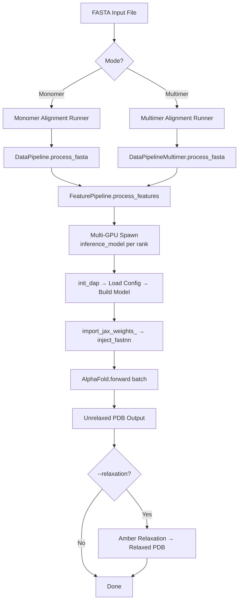
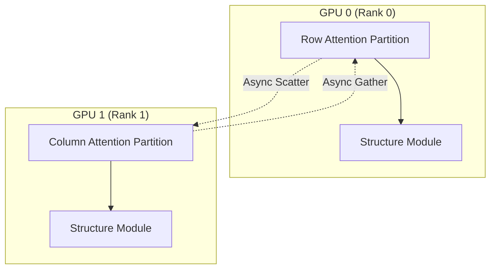

---
slug:3-inference-guide
blog_type:normal
---


FastFold 为蛋白质结构预测提供了一个高性能推理流水线，通过动态轴向并行（Dynamic Axial Parallelism, DAP）支持**单体**和**多体**模式下的多 GPU 并行。本指南将介绍完整的推理工作流——从数据准备、模型执行到 PDB 输出——涵盖命令行调用、配置选项以及内部执行流水线。

## 推理流水线概述

端到端的推理过程遵循四阶段流水线：**FASTA 输入 → MSA/模板比对 → 特征处理 → 模型预测 → 结构输出**。每个阶段均可独立配置，比对阶段还可选择利用基于 Ray 的并行工作流来加速数据处理。



来源: [inference.py](/inference.py#L122-L489), [inference.sh](/inference.sh#L1-L21)

## 快速调用

### 单体推理

运行单体结构预测最简单的方式是使用提供的 shell 脚本，它封装了所有必需的数据库路径和标志：

```bash
# 使用 2 块 GPU 进行基础单体推理
python inference.py target.fasta data/pdb_mmcif/mmcif_files \
    --output_dir ./outputs \
    --gpus 2 \
    --uniref90_database_path data/uniref90/uniref90.fasta \
    --mgnify_database_path data/mgnify/mgy_clusters_2022_05.fa \
    --pdb70_database_path data/pdb70/pdb70 \
    --uniref30_database_path data/uniref30/UniRef30_2021_03 \
    --bfd_database_path data/bfd/bfd_metaclust_clu_complete_id30_c90_final_seq.sorted_opt \
    --jackhmmer_binary_path `which jackhmmer` \
    --hhblits_binary_path `which hhblits` \
    --hhsearch_binary_path `which hhsearch` \
    --kalign_binary_path `which kalign` \
    --enable_workflow \
    --inplace
```

来源: [inference.sh](/inference.sh#L7-L20)

### 多体推理

通过 `--model_preset multimer` 激活多体模式，该模式需要额外的数据库（`pdb_seqres`、`uniprot`）以及多体专用的模型参数：

```bash
python inference.py target.fasta data/pdb_mmcif/mmcif_files \
    --output_dir ./ \
    --gpus 1 \
    --pdb_seqres_database_path data/pdb_seqres/pdb_seqres.txt \
    --uniprot_database_path data/uniprot/uniprot.fasta \
    --model_preset multimer \
    --param_path data/params/params_model_1_multimer_v3.npz \
    --model_name model_1_multimer \
    ... # 其他数据库路径
```

与单体模式的关键区别在于，多体模式使用 `HmmsearchHitFeaturizer` 进行模板特征化，并使用 `DataPipelineMultimer` 进行数据处理，后者负责处理 FASTA 输入中多条序列的链级比对和配对。

来源: [inference_multimer.sh](/inference_multimer.sh#L7-L24), [inference.py](/inference.py#L169-L338)

## 命令行参数参考

### 核心参数

| 参数 | 类型 | 默认值 | 描述 |
|---|---|---|---|
| `fasta_path` | positional | — | 输入 FASTA 文件路径 |
| `template_mmcif_dir` | positional | — | 模板 mmCIF 目录路径 |
| `--output_dir` | str | `os.getcwd()` | 预测结果输出目录 |
| `--model_name` | str | `model_1` | 模型配置名称（参见模型配置表） |
| `--param_path` | str | auto-derived | JAX `.npz` 参数文件路径 |
| `--model_preset` | str | `monomer` | `monomer` 或 `multimer` 模式 |
| `--gpus` | int | `1` | 推理使用的 GPU 数量 (DAP) |
| `--cpus` | int | `12` | 比对工具使用的 CPU 数量 |
| `--preset` | str | `full_dbs` | 数据库预设：`full_dbs` 或 `reduced_dbs` |

### 性能参数

| 参数 | 类型 | 默认值 | 描述 |
|---|---|---|---|
| `--chunk_size` | int | `None` | 节省内存执行的块大小（越低显存占用越少，速度越慢） |
| `--inplace` | flag | `False` | 启用原地操作以减少内存分配 |
| `--enable_workflow` | flag | `False` | 使用 Ray 并行工作流进行 MSA 搜索 |
| `--relaxation` | flag | `False` | 对预测结构运行 Amber 弛豫 |
| `--save_prediction_result` | bool | `True` | 将原始预测字典保存为 `.pkl` 文件 |

### 数据源参数

| 参数 | 类型 | 默认值 | 描述 |
|---|---|---|---|
| `--use_precomputed_alignments` | str | `None` | 预计算比对目录的路径（跳过 MSA 步骤） |
| `--uniref90_database_path` | str | `None` | UniRef90 数据库路径 |
| `--mgnify_database_path` | str | `None` | MGnify 数据库路径 |
| `--pdb70_database_path` | str | `None` | PDB70 数据库路径（单体） |
| `--uniref30_database_path` | str | `None` | UniRef30 数据库路径 |
| `--bfd_database_path` | str | `None` | BFD 数据库路径 |
| `--pdb_seqres_database_path` | str | `None` | PDB seqres 数据库（多体） |
| `--uniprot_database_path` | str | `None` | UniProt 数据库（多体） |
| `--max_template_date` | str | today | 模板最大发布日期 |

来源: [inference.py](/inference.py#L68-L120), [inference.py](/inference.py#L491-L556)

## 模型配置名称

FastFold 支持标准的 AlphaFold 2 模型命名约定。`--model_name` 标志不仅选择架构配置，还在省略 `--param_path` 时选择参数文件路径（自动推导为 `data/params/params_{model_name}.npz`）。

| 模型名称 | 模板 | 额外 MSA | pTM 头 | 适用场景 |
|---|---|---|---|---|
| `model_1` | ✓ | 5120 | ✗ | 带模板的单体 |
| `model_2` | ✓ | default | ✗ | 带模板的单体（减少的额外 MSA） |
| `model_3` | ✗ | 5120 | ✗ | 无模板的单体 |
| `model_4` | ✗ | 5120 | ✗ | 无模板的单体（备用配置） |
| `model_5` | ✗ | default | ✗ | 无模板的单体（轻量级） |
| `model_1_ptm` | ✓ | 5120 | ✓ | 带 pTM 分数的单体 |
| `model_2_ptm`–`model_5_ptm` | varies | varies | ✓ | pTM 变体 |
| `model_{1-5}_multimer` | ✓ (Hmmsearch) | varies | ✗ | 蛋白质复合物预测 |

当 `--param_path` 的路径字符串中包含 `v3` 时，FastFold 会自动启用**融合三角形乘法**核函数以获得额外的性能提升。

来源: [fastfold/config.py](/fastfold/config.py#L30-L125), [inference.py](/inference.py#L133-L134), [inference.py](/inference.py#L553-L554)

## 内部推理执行流程

理解内部流程对于调试和自定义至关重要。`inference_model` 函数通过 `torch.multiprocessing.spawn` 在所有 GPU 上派生，每个进程执行以下序列：


### 第 1 步：分布式初始化

每个派生的进程设置其 `RANK`、`LOCAL_RANK` 和 `WORLD_SIZE` 环境变量，然后调用 `fastfold.distributed.init_dap()` 来初始化动态轴向并行通信后端。DAP 将 Evoformer 的轴向计算划分到各个 GPU 上——一组计算行注意力，另一组计算列注意力——并通过异步通信使计算重叠。

### 第 2 步：模型构建与权重加载

根据配置构建 `AlphaFold` 模型，然后通过 `import_jax_weights_` 导入 JAX 权重。该函数读取 `.npz` 参数文件，并使用转换字典将每个参数映射到正确的 PyTorch 张量，该字典负责处理权重转置、MHA 重塑以及多体专用参数布局。

### 第 3 步：FastNN 注入

`inject_fastnn` 函数是性能的基石——它递归地将原始的 AlphaFold 子模块替换为优化的 **FastNN** 对应项。此替换覆盖了整个 Evoformer 堆栈：用于注意力的融合 QKV 投影、自定义 LayerNorm 核函数、融合三角乘法更新以及分块执行包装器。参数权重通过专用的 `copy_*` 函数从原始模块复制到其 FastNN 替代模块中，这些函数负责处理 QKV 拼接、左/右权重堆叠和偏置对齐。

### 第 4 步：前向传播与输出

在 `torch.no_grad()` 下，预处理后的特征批次被转移到 GPU 并送入模型。然后，输出字典通过 `tensor_tree_map` 作为 NumPy 数组映射回 CPU。`torch.distributed.barrier()` 和 `torch.cuda.synchronize()` 确保所有进程干净地完成。

来源: [inference.py](/inference.py#L122-L159), [fastfold/distributed/__init__.py](/fastfold/distributed/__init__.py#L1-L7), [fastfold/utils/inject_fastnn.py](/fastfold/utils/inject_fastnn.py#L17-L21), [fastfold/utils/import_weights.py](/fastfold/utils/import_weights.py#L110-L129)

## 数据处理：比对策略

FastFold 支持两种比对策略，它们决定了在模型推理前如何生成 MSA 和模板数据。

### 顺序比对（默认）

不使用 `--enable_workflow` 时，比对工具（`jackhmmer`、`hhblits`、`hhsearch`）通过 `AlignmentRunner` 顺序运行。这与原始 AlphaFold 的方法一致，简单直接，但对于长序列可能会很慢。

### Ray 工作流比对 (`--enable_workflow`)

设置 `--enable_workflow` 后，FastFold 使用 **Ray Workflow** 引擎来并行化独立的比对步骤。`FastFoldDataWorkFlow` 构建了一个比对操作的有向无环图（DAG）：

| 步骤 | 工具 | 数据库 | 依赖 |
|---|---|---|---|
| 1 | `jackhmmer` | UniRef90 | 无（根节点） |
| 2 | `hhsearch` | PDB70 | 步骤 1（需要 UniRef90 输出） |
| 3 | `jackhmmer` | MGnify | 无（根节点，与步骤 1 并行） |
| 4a | `hhblits` | BFD | 无（根节点，full_dbs 模式） |
| 4b | `jackhmmer` | small_bfd | 无（根节点，reduced_dbs 模式） |

步骤 1、3 和 4 并发运行，因为它们之间没有相互依赖；步骤 2 仅等待步骤 1。该工作流通过带有唯一 ID 的 `ray.workflow` 进行管理，并且每次运行时都会清理之前的工作流状态。

来源: [fastfold/workflow/template/fastfold_data_workflow.py](/fastfold/workflow/template/fastfold_data_workflow.py#L121-L169), [inference.py](/inference.py#L396-L426)

### 预计算比对

对于同一序列的重复预测，传入 `--use_precomputed_alignments <path>` 可完全跳过比对并复用缓存的 MSA/模板文件。这是在先前已生成特征时的最快路径。

## 输出文件

FastFold 在 `--output_dir` 目录中生成多个输出文件：

| 文件 | 条件 | 描述 |
|---|---|---|
| `{tag}_{model}_unrelaxed.pdb` | 始终 | 未经弛豫的预测结构 |
| `{tag}_{model}_relaxed.pdb` | `--relaxation` | 经 Amber 8力场弛豫后的结构5 |
| `{tag}_{model}.pkl` | `--save_prediction_result` | 原始预测字典（包含 `plddt`、距离图等） |
| `alignments/` | 无预计算 | 包含 MSA 命中结果 (.a3m, .hhr) 的目录 |

对于多体，`{tag}` 通过用 `_and_` 连接所有链标签来构建。**pLDDT** 分数（逐残基置信度）作为 B 因子嵌入在 PDB 文件中，平均 pLDDT 在执行期间计算并打印。

来源: [inference.py](/inference.py#L447-L488), [inference.py](/inference.py#L297-L337)

## 演示模式：合成数据推理

`demo.py` 脚本提供了一种轻量级的方式来验证你的安装并对推理速度进行基准测试，而无需任何生物数据库或真实的 FASTA 输入。它生成与预期模型输入模式相匹配的**随机合成特征**：

```bash
# 使用合成的 50 残基输入在 1 块 GPU 上运行
python demo.py --n_res 50 --gpus 1 --model_name model_1

# 使用分块执行进行内存效率基准测试
python demo.py --n_res 500 --gpus 2 --chunk_size 128 --inplace
```

该演示绕过了整个数据流水线——无需比对，无需特征处理——并直接构建一个包含随机 MSA 特征（128 条序列）、模板特征（4 个模板）和额外 MSA 特征（5120 条序列）的批次。请注意，`demo.py` **不**调用 `import_jax_weights_`，因此它使用随机初始化的权重运行（适用于计时，不适用于有效预测）。

来源: [demo.py](/demo.py#L65-L152)

## 多 GPU 并行配置

FastFold 的多 GPU 扩展由**动态轴向并行（DAP）**驱动，这与数据并行或张量并行方法不同。DAP 划分了 Evoformer 的双轴向计算——MSA 行注意力和列注意力被拆分到 GPU 组之间，并通过异步 scatter/gather 通信使计算重叠。



GPU 数量由 `--gpus N` 控制，它设置 `WORLD_SIZE` 并通过 `torch.multiprocessing.spawn` 派生 N 个进程。每个进程接收 `rank` 和 `world_size` 作为参数，并调用 `init_dap()` 建立通信通道。可用的 DAP 通信原语包括 `scatter`、`gather`、`reduce`、`col_to_row` 和 `row_to_col` 变换。

<CgxTip>对于具有大 MSA 深度的序列，当行/列注意力划分的计算量均衡时，DAP 的扩展效果最佳。对于短序列或浅层 MSA，由于通信开销，使用 `--chunk_size` 和 `--inplace` 的单 GPU 推理可能比多 GPU DAP 更快。</CgxTip>

来源: [inference.py](/inference.py#L122-L128), [fastfold/distributed/__init__.py](/fastfold/distributed/__init__.py#L1-L7)

## 内存优化

两种互补的机制控制着推理期间的峰值 GPU 内存使用：

**分块执行** (`--chunk_size N`)：将大型张量操作（尤其是注意力和三角形更新）沿批次或序列维度拆分为大小为 N 的块。较小的块大小以增加内核启动次数为代价减少峰值内存。块大小会同时传播到配置（`config.globals.chunk_size`）以及通过 `set_chunk_size()` 设置的全局状态中。

**原地操作** (`--inplace`)：在支持的情况下，覆盖中间张量而不是重新分配，从而减少总内存占用。这通过 `config.globals.inplace` 控制。

| 序列长度 | 推荐 `--chunk_size` | `--inplace` | 近似显存 (每块 GPU) |
|---|---|---|---|
| ≤ 200 | `None` (禁用) | 可选 | ~10 GB |
| 200–500 | `128` | ✓ | ~16 GB |
| 500–1000 | `64`–`128` | ✓ | ~24 GB |
| > 1000 | `32`–`64` | ✓ | 32+ GB |

<CgxTip>从 `--chunk_size 128 --inplace` 开始，如果遇到 OOM 则减小块大小。`demo.py` 脚本非常适合在运行完整预测之前，快速测试不同残基数下的内存设置。</CgxTip>

来源: [inference.py](/inference.py#L117-L119), [inference.py](/inference.py#L130-L136), [demo.py](/demo.py#L95-L106)

## Habana 平台推理

FastFold 还通过 `habana/inference.py` 入口支持在 Intel Habana Gaudi 加速器上进行推理。Habana 路径通过关键替换镜像了 CUDA 推理流程：

| 组件 | CUDA 路径 | Habana 路径 |
|---|---|---|
| 设备选择 | `torch.cuda.set_device(rank)` | `torch.device("hpu")` |
| DAP 初始化 | `fastfold.distributed.init_dap()` | `habana.enable_habana()` + `init_dist()` |
| 核函数注入 | `inject_fastnn(model)` | `inject_habana(model)` |
| 步骤标记 | `torch.cuda.synchronize()` | `htcore.mark_step()` |

Habana 推理脚本使用 `model.to(device="hpu")` 而不是 `model.cuda()`，并设置 `config.globals.inplace = False`（原地操作尚未针对 HPU 优化）。所有其他参数与 CUDA 推理保持一致。

来源: [habana/inference.py](/habana/inference.py#L115-L156)

## 故障排除

| 症状 | 可能原因 | 解决方案 |
|---|---|---|
| `RuntimeError: CUDA out of memory` | 序列过长，超出 GPU 显存 | 减小 `--chunk_size`（尝试 64 或 32），添加 `--inplace` |
| 比对阶段缓慢 | 工具顺序执行 | 添加 `--enable_workflow` 以实现 Ray 并行 |
| `ValueError: Invalid model name` | 不支持的 `--model_name` | 使用 `model_{1-5}`、`model_{1-5}_ptm` 或 `model_{1-5}_multimer` |
| 加载时参数形状错误 | 模型名称与 param_path 不匹配 | 确保 `--model_name` 与 `--param_path` 中的架构匹配 |
| 多体缺失数据库 | 数据库路径不完整 | 提供 `--pdb_seqres_database_path` 和 `--uniprot_database_path` |
| 推理在屏障处挂起 | DAP 通信不匹配 | 验证 `--gpus` 与可用 GPU 匹配且 NCCL 后端正常运行 |

## 后续步骤

- **了解 FastNN 核函数优化**：参见 [FastNN 模块设计](6-fastnn-module-design)，了解 `inject_fastnn` 如何替换标准模块
- **深入探究 DAP 通信**：参见 [DAP 通信原语](9-dap-communication-primitives)，了解 scatter/gather 机制
- **权重加载内幕**：参见 [从 JAX 注入权重](15-weight-injection-from-jax)，了解参数转换流水线
- **对配置进行基准测试**：参见 [性能基准测试](18-performance-benchmarking)，了解系统化性能分析