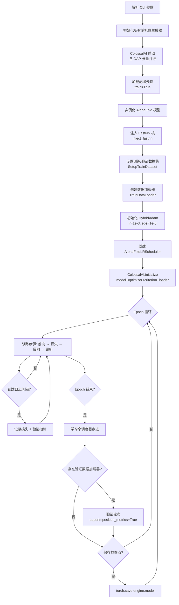

---
slug:4-training-setup
blog_type:normal
---


FastFold 为蛋白质结构预测提供了一套完整的训练流程，该流程集成了 **ColossalAI** 以实现分布式并行，集成了 **FastNN 融合核** 以实现 GPU 加速，以及集成了 **动态轴向并行** 以支持多 GPU 扩展。本页涵盖环境准备、数据准备、配置选择、启动流程，以及适用于 NVIDIA GPU 和 Intel Habana 平台的训练循环架构。

## 先决条件与环境

FastFold 要求 PyTorch ≥ 1.10 且支持 CUDA，同时需要用于生成 MSA 和处理模板的特定生物信息学工具。该项目提供了三种互补的环境规范：

| 规范 | 用例 | 主要内容 |
|---|---|---|
| `environment.yml` | 基于 Conda 的完整安装 | PyTorch 1.12, CUDA 11.3, OpenMM, HHsuite, HMMER, Kalign |
| `requirements/requirements.txt` | 最小化 pip 依赖 | `einops`, `colossalai` |
| `docker/Dockerfile` | 容器化可复现构建 | `hpcaitech/pytorch-cuda:1.12.0-11.3.0` 基础镜像 |

**Conda 环境** 是推荐的起点。它捕获了完整的依赖树，包括数据预处理和结构弛豫所需的生物信息学工具链（`hmmer==3.3.2`, `hhsuite==3.3.0`, `kalign2==2.04`）和分子动力学库（`openmm==7.7.0`, `pdbfixer`）：

```bash
conda env create -f environment.yml
conda activate fastfold
```

对于 Docker 用户，Dockerfile 执行两阶段安装：首先是 conda 层的生物信息学工具，其次是 pip 层的 Python 包，最后从源码编译并安装 FastFold 及其 CUDA 核扩展。

来源：[environment.yml](/environment.yml#L1-L33), [requirements/requirements.txt](/requirements/requirements.txt#L1-L3), [docker/Dockerfile](/docker/Dockerfile#L1-L14)

### 从源码安装并启用 CUDA 扩展

FastFold 在安装时会编译自定义 CUDA 核——特别是 **融合 LayerNorm** 和 **融合 Softmax**——这对 FastNN 的性能优势至关重要。`setup.py` 构建过程会验证 CUDA 版本的兼容性，并针对相应的计算能力进行编译：

```bash
python setup.py install
```

安装程序执行多个验证步骤：通过 `nvcc -V` 检测 CUDA 基础版本，将其与 PyTorch 二进制文件的 CUDA 版本进行交叉引用，并设置计算能力标志（Volta 架构对应 `sm_70`，当 CUDA ≥ 11 时 Ampere 架构对应 `sm_80`）。每个 CUDA 扩展都使用 `-maxrregcount=50` 和 `--use_fast_math` 进行编译，以实现针对寄存器压力调整的高吞吐量核执行。如果未设置 `CUDA_HOME` 或未检测到 GPU，构建将在不包含 CUDA 扩展的情况下完成，并记录一条通知。

<CgxTip>安装程序要求 PyTorch ≥ 1.10，对于更旧的版本将抛出 `RuntimeError`。如果为特定架构进行交叉编译，请确保设置了 `TORCH_CUDA_ARCH_LIST` 环境变量。</CgxTip>

来源：[setup.py](/setup.py#L1-L144)

## 数据准备

训练 AlphaFold 需要三类数据：**模型参数**、**MSA/搜索数据库** 和 **模板结构数据**。FastFold 在 `scripts/` 目录下为每类数据提供了下载脚本。

### 下载数据库与参数

主脚本 `download_all_data.sh` 负责编排所有下载任务。它接受一个目标目录和一个可选模式（`full_dbs` 或 `reduced_dbs`）：

```bash
bash scripts/download_all_data.sh /path/to/data_dir full_dbs
```

该脚本按顺序下载：AlphaFold 模型参数、BFD（或在缩减模式下为 Small BFD）、MGnify、PDB70、PDB mmCIF 文件、UniRef30、UniRef90、UniProt 和 PDB SeqRes。所有下载均使用 `aria2c` 以实现高吞吐量的并行获取。模型参数从 Google Cloud Storage（`alphafold_params_2022-12-06.tar`）中解压到 `params/` 子目录。

### 训练数据目录布局

训练脚本要求训练输入遵循特定的目录结构。以下是所需的布局：

```
${DATA_DIR}/
├── mmcif_dir/              # 训练 mmCIF (*.cif) 或 PDB (*.pdb) 文件
├── alignment_dir/           # 每条链的预计算比对
│   └── {PDB_ID}_{CHAIN_ID}/
│       ├── *.a3m
│       ├── *.sto
│       └── *.hhr
├── data/
│   └── pdb_mmcif/
│       └── mmcif_files/    # 模板 mmCIF 数据库
├── mmcif_cache.json        # 模板发布日期缓存
└── chain_data_cache.json   # 用于训练过滤的链级数据
```

**比对目录** 包含带有 MSA 和模板搜索输出的逐链子目录。**链数据缓存** 是一个 JSON 文件，存储随机训练过滤器使用的逐链元数据（分辨率、序列、聚类大小）。这两种缓存均可使用 `scripts/generate_mmcif_cache.py` 工具生成。

来源：[scripts/download_all_data.sh](/scripts/download_all_data.sh#L1-L76), [scripts/download_alphafold_params.sh](/scripts/download_alphafold_params.sh#L1-L42)

## 配置预设

FastFold 实现了补充论文中完整的 AlphaFold 2 配置分类体系。`fastfold/config.py` 中的 `model_config()` 函数返回一个由预设名称参数化的深度嵌套 `ml_collections.ConfigDict`。每个预设都会调整数据处理、模板使用和损失加权：

| 预设 | 描述 | 关键覆盖 |
|---|---|---|
| `initial_training` | 默认 AF2 初始训练（补充表 4） | 无（基线） |
| `finetuning` | AF2 微调（补充表 4） | `max_extra_msa=5120`, `crop_size=384`, `violation.weight=1.0` |
| `model_1` | 启用模板，含额外 MSA（补充表 5, 1.1.1） | 模板 + `max_extra_msa=5120` |
| `model_2` | 启用模板，无额外 MSA（补充表 5, 1.1.2） | 仅模板 |
| `model_3` / `model_4` / `model_5` | 禁用模板的变体（补充表 5, 1.2.x） | 关闭模板 |
| `model_1_ptm` 至 `model_5_ptm` | 带有 TM 损失的 PTM 变体 | `tm.weight=0.1` |
| `multimer` | 多聚体模式 | `is_multimer=True`, `max_msa_clusters=252`, `trans_scale_factor=20` |

当传入 `train=True` 时，配置会强制执行 **逐块梯度检查点**（`blocks_per_ckpt=1`）并禁用分块执行（`chunk_size=None`），以保留完整的激活图用于反向传播。在训练期间，全局 `inplace` 标志也会被设置为 `False`，以防止原地变异干扰自动求导。

来源：[fastfold/config.py](/fastfold/config.py#L28-L75), [train.py](/train.py#L147-L152)

## 训练循环架构

训练流程由 `train.py` 编排，它将 ColossalAI 的分布式引擎与 AlphaFold 的自定义优化器和损失函数集成在一起。以下流程图展示了完整的初始化和训练序列：



### ColossalAI 集成与 DAP

训练脚本通过 `colossalai.launch_from_torch()` 启动，其配置设定了 **DAP（动态轴向并行）张量并行大小**，并为 torch DDP 优化启用 `static_graph=True`。`--dap_size` 参数控制有多少 GPU 参与 Evoformer 的 MSA 和对表示的张量并行切分。当 `dap_size=1` 时，训练以标准数据并行模式运行；当 `dap_size=nproc_per_node` 时，则在整个节点上采用全张量并行。

初始化后，ColossalAI 通过 `colossalai.initialize()` 将所有组件封装为一个统一的 `engine` 对象，该对象会自动处理梯度同步、张量并行通信和混合精度调度。

来源：[train.py](/train.py#L120-L185), [fastfold/distributed/comm.py](/fastfold/distributed/comm.py#L1-L50)

### FastNN 核注入

`inject_fastnn()` 函数将 AlphaFold 模型中的标准 PyTorch 模块替换为以优化 CUDA 核为支撑的等效模块。它执行精细的权重复制——将层归一化、线性投影、QKV 注意力权重以及三角乘法更新参数从原始模型复制到 FastNN 替代模块中。这在为 Evoformer 块、ExtraMSA 块和模板嵌入器换入高性能核的同时，保留了任何预训练权重。

来源：[fastfold/utils/inject_fastnn.py](/fastfold/utils/inject_fastnn.py#L1-L50), [train.py](/train.py#L149-L150)

### 优化器与学习率调度

训练使用 **HybridAdam**（ColossalAI 的 CPU/GPU 混合 Adam 实现），参数为 `lr=1e-3` 和 `eps=1e-8`。学习率遵循 `AlphaFoldLRScheduler` 中实现的 AlphaFold 2 补充材料调度：

| 阶段 | 步数范围 | 学习率公式 |
|---|---|---|
| 预热 | `0 → warmup_no_steps` | `base_lr + (step / warmup_no_steps) × max_lr` |
| 平台期 | `warmup_no_steps → start_decay_after_n_steps` | `max_lr` (= 0.001) |
| 衰减 | `> start_decay_after_n_steps` | `max_lr × 0.95^((steps_since_decay // 50000) + 1)` |

默认调度参数：`warmup_no_steps=1000`、`start_decay_after_n_steps=50000`、`decay_every_n_steps=50000`、`decay_factor=0.95`。这产生了一个 1K 步的线性预热，一个 49K 步的峰值学习率平台期，随后是每 50K 步衰减 5% 的指数衰减。

来源：[fastfold/model/hub/lr_scheduler.py](/fastfold/model/hub/lr_scheduler.py#L22-L98), [train.py](/train.py#L170-L172)

### 损失计算与日志记录

`AlphaFoldLoss` 类聚合了由配置加权的多个损失项——FAPE（帧对齐点误差）、distogram、置信度、违规以及辅助头。在训练期间，损失分解会与由 `compute_validation_metrics()` 计算的 **验证指标** 一同记录。日志辅助函数 `log_loss()` 将所有单独的损失名称及其格式化后的值拼接成一个字符串，供分布式记录器使用。

来源：[train.py](/train.py#L16-L30), [fastfold/model/hub/loss.py](/fastfold/model/hub/loss.py#L1-L50)

### 检查点

当指定了 `--save_ckpt_path` 时，模型检查点会通过 `torch.save()` 作为完整的 `engine.model` 对象保存。保存频率由 `--save_ckpt_interval` 控制（默认：每个 epoch）。另外，**激活检查点** 通过 `blocks_per_ckpt=1`（当 `train=True` 时自动设置）在块级别进行配置，这会在反向传播期间为每个 Evoformer/ExtraMSA 块重新计算激活，以约 48 倍的内存节省换取每个块额外的一次前向传播。

来源：[train.py](/train.py#L245-L248), [fastfold/utils/checkpointing.py](/fastfold/utils/checkpointing.py#L26-L85)

## 启动训练

### NVIDIA GPU 训练

`train.sh` 脚本提供了标准的启动模板。配置脚本顶部的变量，然后执行：

| 变量 | 描述 | 示例 |
|---|---|---|
| `DATA_DIR` | 数据根目录 | `/data/fastfold` |
| `gpus_per_node` | 每个节点的 GPU 数 | `2` |
| `nnodes` | 节点数 | `1` |
| `max_template_date` | 模板截止日期 | `2021-10-10` |
| `train_epoch_len` | 虚拟 epoch 长度 | `10000` |

```bash
bash train.sh
```

该脚本使用 `torchrun --standalone` 启动分布式训练。对于多节点设置，请调整 `--nnodes` 并添加 `--node_rank` 以及 `--master_addr`/`--master_port` 参数。传递给 `train.py` 的主要训练参数为：

| 参数 | 默认值 | 描述 |
|---|---|---|
| `--config_preset` | `initial_training` | 模型配置预设名称 |
| `--dap_size` | `1` | DAP 张量并行大小（1 到 nproc_per_node） |
| `--max_epochs` | `10000` | 最大训练 epoch 数 |
| `--seed` | `42` | 可复现性的随机种子 |
| `--log_interval` | `1` | 日志条目之间的步数间隔 |
| `--save_ckpt_path` | `None` | 检查点保存目录 |
| `--save_ckpt_interval` | `1` | 检查点保存之间的 epoch 间隔 |
| `--from_torch` | `False` | 使用 `colossalai.launch_from_torch` 的标志 |

来源：[train.sh](/train.sh#L1-L31), [train.py](/train.py#L120-L165)

### Intel Habana 训练

FastFold 通过 `habana/train.py` 中的并行训练流程支持在 Intel Habana Gaudi 加速器上进行训练。Habana 变体在以下几个关键方面有所不同：

| 方面 | NVIDIA (`train.py`) | Habana (`habana/train.py`) |
|---|---|---|
| 启动 | `torchrun` | `mpirun --allow-run-as-root` |
| 并行机制 | ColossalAI 引擎 + DAP | 原生 DDP (`gradient_as_bucket_view=True`) |
| 优化器 | `HybridAdam` | `FusedAdamW` (Habana) |
| 混合精度 | ColossalAI FP16 | HMP O1 (BF16/FP32 算子列表) |
| 设备 | `.cuda()` | `.to(device="hpu")` |
| 核注入 | `inject_fastnn()` | `inject_habana()` |

Habana 混合精度配置使用独立的 BF16 和 FP32 算子允许列表。BF16 列表包含计算密集型算子（`addmm`, `mm`, `bmm`, `linear`, `layer_norm`），而 FP32 列表则为数值敏感算子（`cross_entropy`, `log_softmax`, `nll_loss`, `softmax`）保持精度。通过以下命令启动：

```bash
bash habana/train.sh
```

Habana 脚本设置 `GC_KERNEL_PATH` 以加载自定义 TPC 性能库，并使用 `mpirun` 代替 `torchrun` 进行进程派生。

来源：[habana/train.py](/habana/train.py#L1-L50), [habana/train.sh](/habana/train.sh#L1-L32), [habana/ops_bf16.txt](/habana/ops_bf16.txt#L1-L16), [habana/ops_fp32.txt](/habana/ops_fp32.txt#L1-L5)

## 数据流程与随机过滤

训练数据流经 `SetupTrainDataset()` → `TrainDataLoader()`，它们构造了一个实现了 AlphaFold **随机训练过滤器** 的 `OpenFoldDataset`。此过滤器应用两层选择：

1. **确定性过滤器** —— 拒绝分辨率 > 9.0 Å 或单氨基酸比例 > 0.8 的链
2. **随机过滤器** —— 以与聚类大小成反比且按链长缩放的概率对链进行采样，与 DeepMind 公开的训练机制相匹配

数据集同时接受 **PDB 训练数据** 和 **蒸馏数据** 作为单独的来源，并具有可配置的混合概率（默认 `distillation_prob=0.75`）。数据默认以 `batch_size=1` 和 `num_workers=16` 加载，并受 `train_epoch_len` 虚拟长度参数控制逐 epoch 的打乱。

来源：[fastfold/data/data_modules.py](/fastfold/data/data_modules.py#L210-L330), [train.py](/train.py#L154-L169)

## 推荐阅读路径

既然你已经了解了训练设置，接下来可以探索使 FastFold 训练高效运行的内部机制：

- **[FastNN 模块设计](6-fastnn-module-design)** —— 训练期间注入的融合 CUDA 核如何实现其加速
- **[DAP 通信原语](9-dap-communication-primitives)** —— 实现多 GPU 张量并行的 scatter/gather/all-to-all 操作
- **[AlphaFold 模型配置](16-alphafold-model-configuration)** —— 深入探讨配置预设系统及所有可调参数
- **[性能基准测试](18-performance-benchmarking)** —— 跨 GPU 配置的定量训练吞吐量测量