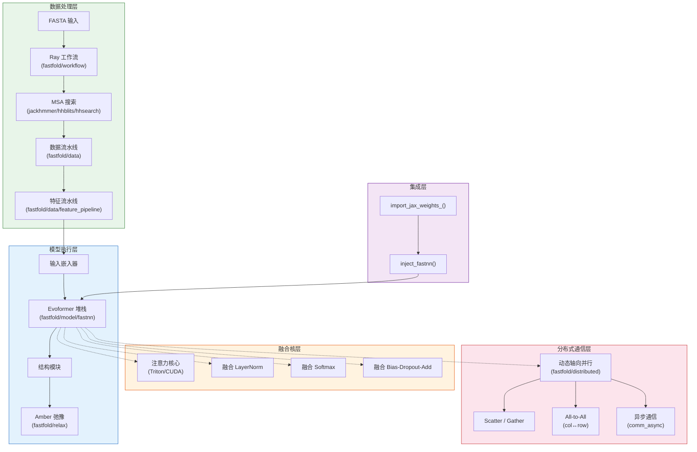
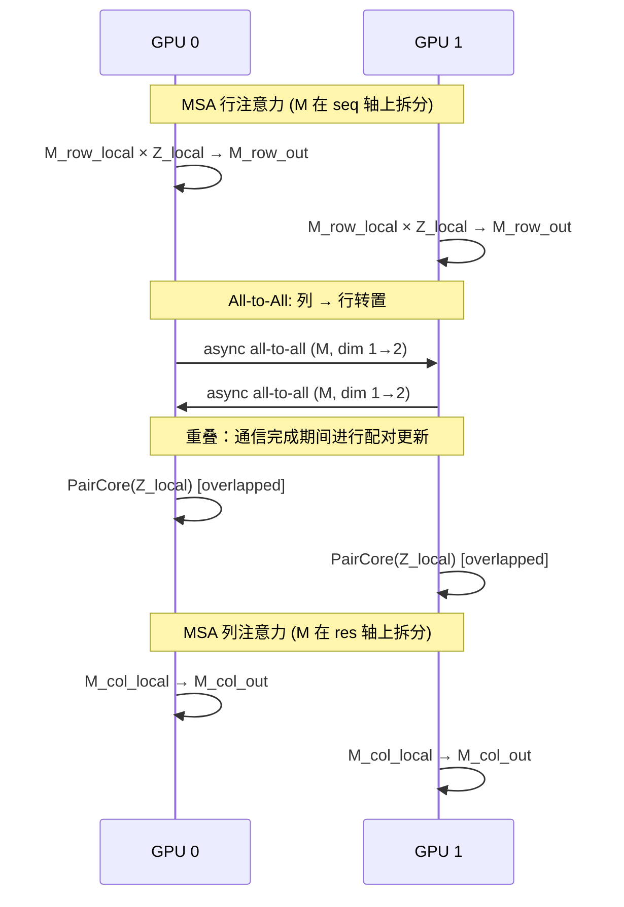

---
slug:5-architecture-overview
blog_type:normal
---


FastFold 是 AlphaFold2 Evoformer 堆栈的高性能重实现，专为消除 GPU 集群上蛋白质结构预测的计算瓶颈而构建。该项目通过三大协同支柱实现加速：**融合核加速**（FastNN）、用于多 GPU 扩展的**动态轴向并行**（DAP），以及用于数据流水线并行的 **Ray 编排工作流**。理解这些层级的组合方式——从原始 FASTA 输入，到分布式张量通信，再到最终的 3D 坐标——是高效导航 FastFold 代码库的关键。

## 系统架构

下图展示了端到端的数据流以及 FastFold 四个主要子系统之间的关系。每个彩色区域代表一个具有清晰所有权边界的独立架构关注点。



来源: [inference.py](/inference.py#L1-L120), [fastfold/workflow/workflow_run.py](/fastfold/workflow/workflow_run.py#L1-L15)

## 核心子系统

FastFold 的架构可分解为五个子系统，每个子系统都具有明确的职责和公共接口。下表总结了它们的作用、入口点和关键依赖。

| 子系统 | 目录 | 职责 | 主要入口点 | 关键依赖 |
|---|---|---|---|---|
| **FastNN** | `fastfold/model/fastnn/` | 融合核 Evoformer，MSA 注意力，配对更新 | `Evoformer`, `EvoformerStack` | Triton / CUDA |
| **分布式 (DAP)** | `fastfold/distributed/` | 多 GPU 张量并行原语 | `init_dap()` | ColossalAI |
| **数据流水线** | `fastfold/data/` | MSA 搜索，特征提取，模板处理 | `data_pipeline`, `feature_pipeline` | jackhmmer, HH-suite |
| **Ray 工作流** | `fastfold/workflow/` | 并行化的 MSA 搜索编排 | `batch_run()` | Ray Workflows |
| **集成** | `fastfold/utils/inject_fastnn.py` | 将 OpenFold 模块替换为 FastNN 等价模块 | `inject_fastnn()` | JAX 权重加载器 |

来源: [fastfold/model/fastnn/__init__.py](/fastfold/model/fastnn/__init__.py#L1-L14), [fastfold/distributed/__init__.py](/fastfold/distributed/__init__.py#L1-L7)

## 项目结构

下面的目录布局突出了每个模块的架构所有权。带有 `⭐` 前缀的模块是 FastFold 区别于 OpenFold/AlphaFold 的主要创新点。

```
fastfold/
├── config.py                          # 模型配置 (model_1..5, ptm, multimer)
├── common/                            # 蛋白质数据类型，残基常量
├── ⭐ model/fastnn/                   # 高性能 Evoformer 实现
│   ├── evoformer.py                   #   Evoformer 与 EvoformerStack 块
│   ├── msa.py                         #   带有 DAP 的 MSA 行/列注意力
│   ├── triangle.py                    #   配对核心（三角形更新 + 注意力）
│   ├── ops.py                         #   融合 Linear, Transition, OutProductMean
│   ├── embedders.py                   #   模板与循环嵌入器
│   ├── template.py                    #   模板配对堆栈
│   └── kernel/                        #   ⭐ 融合 CUDA/Triton 核
│       ├── attention_core.py          #     注意力分派 (Triton → PyTorch)
│       ├── layer_norm.py              #     融合 LayerNorm
│       ├── softmax.py                 #     融合 Softmax
│       ├── triton/                    #     Triton 核实现
│       ├── cuda_native/               #     自定义 CUDA C++ 核
│       └── jit/                       #     JIT 编译的融合操作
├── model/nn/                          # 参考的 OpenFold nn.Module 实现
├── ⭐ distributed/                    # 动态轴向并行
│   ├── core.py                        #   通过 ColossalAI 进行 DAP 初始化
│   ├── comm.py                        #   同步：scatter, gather, all-to-all
│   └── comm_async.py                  #   异步：通信与计算重叠
├── data/                              # 数据处理 (MSA, 模板, 特征)
├── ⭐ workflow/                       # 基于 Ray 的 MSA 搜索工作流
│   ├── factory/                       #   工具包装器 (jackhmmer, hhblits 等)
│   ├── template/                      #   单体与多聚体工作流 DAG
│   └── workflow_run.py               #   批量执行入口点
├── utils/
│   ├── inject_fastnn.py              #   ⭐ 模块替换与权重复制
│   ├── import_weights.py             #   JAX → PyTorch 权重加载
│   └── checkpointing.py              #   梯度检查点工具
├── habana/                            # Intel Habana (Gaudi) 平台支持
└── relax/                             # 最终结构的 Amber 弛豫
```

来源: [fastfold/model/fastnn/kernel/__init__.py](/fastfold/model/fastnn/kernel/__init__.py#L1-L13), [fastfold/distributed/core.py](/fastfold/distributed/core.py#L1-L41)

## 执行流程：推理路径

推理流水线是 FastFold 中遍历最多的路径。下面的流程图追踪了从 FASTA 输入到 PDB 输出的精确序列，突出显示了每个子系统的激活位置。


关键的集成步骤是 `inject_fastnn()`，它遍历模型的模块树，并将每个 OpenFold 子层（MSA 注意力、三角形乘法、外积均值等）替换为其 FastNN 融合等价模块，逐参数复制权重以确保数值一致性。这种设计意味着 FastFold **无需对模型定义进行任何更改**——只需在模型构建后进行一次函数调用即可。

来源: [inference.py](/inference.py#L1-L120), [fastfold/utils/inject_fastnn.py](/fastfold/utils/inject_fastnn.py#L1-L50)

## 动态轴向并行 (DAP) 架构

DAP 是 FastFold 用于在 GPU 间划分 Evoformer 的 MSA 和配对表示的机制。核心洞察在于，Evoformer 的两个主导张量——MSA 表示 **M** `(N_seq, N_res, c_m)` 和配对表示 **Z** `(N_res, N_res, c_z)`——具有互补的可划分轴。DAP 利用这一点，在 MSA 注意力中沿**行轴**进行拆分，在配对注意力中沿**列轴**进行拆分，并在阶段之间通过 `all-to-all` 集合通信来转置划分。



上述异步通信模式通过 `All_to_All_Async` 和 `All_to_All_Async_Opp` 自定义 autograd 函数实现，它们使用 `async_op=True` 启动 `dist.all_to_all` 操作，并将配对计算（`PairCore`）与通信重叠。这种**异步操作的对偶性**是使 DAP 能够扩展而不产生成比例通信开销的主要机制。

来源: [fastfold/distributed/comm.py](/fastfold/distributed/comm.py#L1-L100), [fastfold/distributed/comm_async.py](/fastfold/distributed/comm_async.py#L1-L80), [fastfold/model/fastnn/evoformer.py](/fastfold/model/fastnn/evoformer.py#L1-L80)

## FastNN 核层级

FastNN 提供了多后端核分派策略。每个关键操作最多有三种实现，并带有自动回退机制：

| 操作 | Triton 核 | CUDA C++ 核 | JIT 回退 | 分派逻辑 |
|---|---|---|---|---|
| **注意力核心** | `triton/attention_core.py` | — | PyTorch matmul | 若 Triton 可用则使用 Triton，否则使用 `_torch_attention_core` |
| **LayerNorm** | `triton/layer_norm.py` | `cuda_native/layer_norm.py` | — | Triton → CUDA → 错误 |
| **Softmax** | `triton/softmax.py` | `cuda_native/softmax.py` | — | Triton → CUDA → 错误 |
| **Bias-Dropout-Add** | — | — | `jit/fused_ops.py` | 始终使用 JIT |

注意力核心的分派遵循一种简洁的模式：在导入时，FastFold 尝试加载 Triton 核；如果未安装 Triton（或 CUDA < 11.4），则回退到 PyTorch 原生实现。这确保了 FastFold 可以在任何 CUDA 平台上运行，同时在硬件允许的情况下实现最高性能。

<CgxTip>在安装 FastFold 时，如果你的 CUDA 版本为 11.4+，**请务必安装 Triton (`pip install -U --pre triton`)**。Triton 注意力核带来了最大的单次推理加速——缺少它，注意力将回退到标准的 `torch.matmul`，这对于 Evoformer 的注意力模式而言会慢 2-3 倍。</CgxTip>

来源: [fastfold/model/fastnn/kernel/attention_core.py](/fastfold/model/fastnn/kernel/attention_core.py#L1-L53), [fastfold/model/fastnn/kernel/__init__.py](/fastfold/model/fastnn/kernel/__init__.py#L1-L13)

## 内存高效的分块执行

对于超长序列（>1000 个残基），配对表示 **Z** 呈 O(N²) 增长，使得全量物化不可行。FastFold 通过由 `set_chunk_size()` 控制的**分块执行**策略来解决此问题。当设置了分块大小时，`OutProductMean`、`ChunkTransition` 和 `ChunkMSAColumnGlobalAttention` 等操作会按分块在序列维度上进行迭代，每次处理 `chunk_size × multiplier` 个残基。这以适度的速度开销换取了显著的内存减少，从而能够在单张 A100 (80GB) 上以 bf16 精度对 **10,000+ 残基**的序列进行推理。

<CgxTip>对于长序列推理，请设置 `--chunk_size N`，其中 N 控制分块粒度。值越小，内存消耗越少，但迭代开销越大。对于 A100 80GB 上的 10K 残基序列，经验证的配置为 `--chunk_size 128`，同时使用 bf16 精度和 `PYTORCH_CUDA_ALLOC_CONF=max_split_size_mb:15000`。</CgxTip>

来源: [fastfold/model/fastnn/ops.py](/fastfold/model/fastnn/ops.py#L1-L60), [README.md](/README.md#L100-L130)

## 配置架构

FastFold 在 `config.py` 中的模型配置系统定义了与 AlphaFold2 的五种模型变体（加上 PTM 和多聚体扩展）相匹配的参数预设。该配置是一个深度嵌套的 `ml_collections.ConfigDict`，包含三个贯穿整个模型的关键维度常量：

| 符号 | 常量 | 默认值 | 含义 |
|---|---|---|---|
| `c_m` | MSA 通道维度 | 256 | MSA 表示的特征维度 |
| `c_z` | 配对通道维度 | 128 | 配对表示的特征维度 |
| `c_s` | 单一通道维度 | 384 | 输出单一嵌入维度 |
| `c_t` | 模板通道维度 | 64 | 模板特征维度 |

`model_config()` 函数克隆基础配置并应用特定于变体的覆盖（例如，`model_1` 启用模板并设置 `max_extra_msa=5120`，而 `model_5` 完全禁用模板）。`low_prec` 标志会交换数值常量以适应 bf16 训练。

来源: [fastfold/config.py](/fastfold/config.py#L1-L80)

## 平台可扩展性：Habana

FastFold 通过位于 `fastfold/habana/` 的专用 Habana 后端扩展到了 NVIDIA GPU 之外。`inject_habana()` 函数镜像了 `inject_fastnn()` 的模式——它通过补丁让操作使用 Habana 的 SynapseAI 自定义核。架构在**模型定义**（`model/nn/`）与**优化执行**（`model/fastnn/`、`habana/`）之间的清晰分离，使得这种可移植性成为可能，而无需复制模型逻辑。

来源: [README.md](/README.md#L1-L50), [fastfold/habana/](/fastfold/habana/)

## 阅读指南

该架构自然而然地提示了一种从性能关键的内部核心向外延伸到集成与部署的阅读顺序：

1. **从此处开始** → [FastNN 模块设计](6-fastnn-module-design) — 理解融合 Evoformer 如何替换 OpenFold 的参考实现
2. **然后** → [融合核实现](7-fused-kernel-implementations) — 深入了解 Triton 和 CUDA 核内部机制
3. **然后** → [内存高效分块执行](8-memory-efficient-chunked-execution) — 学习针对长序列的分块策略
4. **然后** → [DAP 通信原语](9-dap-communication-primitives) — 理解 scatter/gather/all-to-all 基础
5. **然后** → [对偶异步操作](10-duality-async-operation) — 掌握计算-通信重叠模式
6. **然后** → [从 JAX 注入权重](15-weight-injection-from-jax) — 了解预训练的 AlphaFold 权重如何转换到 FastFold
7. **最后** → [用于 MSA 搜索的 Ray 工作流](12-ray-workflow-for-msa-search) — 加速数据预处理瓶颈