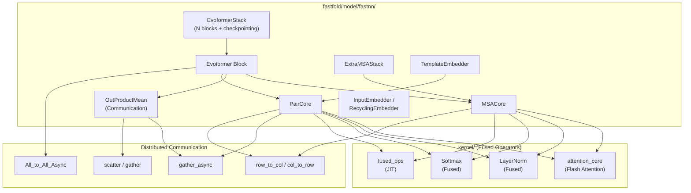

---
slug:6-fastnn-module-design
blog_type:normal
---


FastFold 的 **FastNN** 模块是对 AlphaFold2 Evoformer 主干网络的彻底重写，旨在用高性能组件替换原有的 `fastfold/model/nn/` 层。这些高性能组件集成了融合的 CUDA/Triton 核、用于动态轴向并行 (DAP) 的异步通信原语，以及内存高效的分块执行机制。该模块作为**直接替换方案**——其注入机制将原始 JAX 派生参数中的预训练权重复制到优化后的 PyTorch 架构中，从而无需重新训练即可实现加速。

## 架构概览

FastNN 模块被组织为计算核心的分层组合，每个核心负责 Evoformer 算法的一个独立阶段。顶层 `EvoformerStack` 编排重复的 `Evoformer` 块，而每个块委派给三个子核心——`MSACore`、`OutProductMean` 和 `PairCore`——它们分别对应 AlphaFold2 论文中算法 6 的 MSA 更新、通信和配对更新步骤。



来源: [__init__.py](/fastfold/model/fastnn/__init__.py#L1-L14), [evoformer.py](/fastfold/model/fastnn/evoformer.py#L1-L30)

## 模块组合与公共 API

FastNN 包从 `__init__.py` 导出其顶层构建块，形成 FastFold 其余部分导入的公共接口：

| 导出 | 来源文件 | 作用 |
|---|---|---|
| `Evoformer` | `evoformer.py` | 具有 DAP scatter/gather 的单个 Evoformer 块 |
| `EvoformerStack` | `evoformer.py` | 完整主干：N 个块 + 梯度检查点 |
| `MSACore` | `msa.py` | MSA 行注意力 → 列注意力 → 转换 |
| `ExtraMSACore` | `msa.py` | 具有全局列注意力的额外 MSA 变体 |
| `ExtraMSABlock` / `ExtraMSAStack` | `msa.py` | 集成了 DAP 的额外 MSA 块 |
| `OutProductMean` | `ops.py` | MSA→配对通信（外积均值） |
| `PairCore` | `triangle.py` | 三角乘法 + 三角注意力 + 转换 |
| `TemplatePairBlock` / `TemplatePairStack` | `template.py` | 模板配对嵌入块 |
| `set_chunk_size` | `ops.py` | 用于内存调优的全局分块大小控制 |

来源: [__init__.py](/fastfold/model/fastnn/__init__.py#L1-L14)

## Evoformer 块：核心执行单元

`Evoformer` 类是 Evoformer 主干的原子单元。每个块执行三个连续阶段，并与 **DAP 通信操作**交错进行，这些通信操作在张量并行轴上重新分配张量：

**单体执行顺序：**
1. **MSA 更新** — `MSACore` 对 MSA 表示 `m` 应用带配对偏置的行注意力、列注意力和 MSA 转换
2. **通信** — `OutProductMean` 将 MSA 投影到配对空间，更新 `z`
3. **异步 All-to-All** — `All_to_All_Async` 沿并行轴重新分配 `m`（配对更新通过异步工作句柄并发运行）
4. **配对更新** — `PairCore` 对 `z` 应用三角乘法更新、三角注意力和配对转换
5. **异步 All-to-All 完成** — `All_to_All_Async_Opp` 完成 MSA 的重新分配

**多聚体执行顺序**重新排列了步骤 1–3：通信首先运行，配对核心与 MSA 重新分配并发执行，MSA 更新最后使用通信前的配对状态 `z_ori` 应用。

当 `first_block=True` 或 `last_block=True` 时，该块还处理**边界填充与分配**——在入口处将序列长度填充为 DAP world size 的倍数，将输入张量分散到各设备，并在出口处将它们收集回来。

```python
# 简化的 Evoformer 前向传播（单体路径）
if self.first_block:
    m = scatter(m, dim=1)       # 沿 DAP 秩分配 MSA
    z = scatter(z, dim=1)       # 沿 DAP 秩分配配对

m = self.msa(m, z, msa_mask)                  # MSA 更新
z = self.communication(m, msa_mask, z)        # MSA→配对
m, work = All_to_All_Async.apply(m, 1, 2)    # 开始异步重新分配
z = self.pair(z, pair_mask)                   # 配对更新（与通信重叠）
m = All_to_All_Async_Opp.apply(m, work, 1, 2)# 完成重新分配

if self.last_block:
    m = gather(m, dim=0)        # 从所有秩收集 MSA
    z = gather(z, dim=0)        # 从所有秩收集配对
```

<CgxTip>异步 All-to-All 通信是实现**通信-计算重叠**的关键机制：当 MSA 张量 `m` 在设备间传输时，配对核心处理 `z`。这对配对更新路径完全隐藏了通信延迟。</CgxTip>

来源: [evoformer.py](/fastfold/model/fastnn/evoformer.py#L33-L120)

## EvoformerStack：带检查点的块重复

`EvoformerStack` 封装了 `no_blocks` 个 `Evoformer` 实例，通过 `checkpoint_blocks` 应用梯度激活检查点，以内存换计算。第一个块接收 `first_block=True`（处理 scatter + 填充），最后一个块接收 `last_block=True`（处理 gather + 去填充）。所有块执行完毕后，线性投影从第一行 MSA 中提取单一表示 `s`：`s = Linear(m[..., 0, :, :])`。

同时提供了标准 `forward()` 和 **`inplace()`** 变体。就地路径在每个块中原地修改输入张量，通过避免中间分配来降低峰值内存——这是长序列推理的关键优化。

来源: [evoformer.py](/fastfold/model/fastnn/evoformer.py#L150-L333)

## MSACore：MSA 表示更新

`MSACore` 实现了算法 6 的 MSA 堆栈，由三个子操作组成，这些子操作按顺序执行，并在它们之间进行 DAP 轴转置：

| 子操作 | 类 | DAP 转换 |
|---|---|---|
| 带配对偏置的行注意力 | `MSARowAttentionWithPairBias` | 在行分布数据上操作 |
| 列注意力 | `MSAColumnAttention` | 之前执行 `row_to_col()`，在列分布数据上操作 |
| MSA 转换 | `Transition` | 在列分布数据上进行前馈 |

**MSARowAttentionWithPairBias** 是架构上最重要的 MSA 操作。它计算非批处理的配对偏置 `b = LayerNorm(Z) · W_b`，该偏置通过 `gather_async` 沿 DAP 列维度异步收集。然后，注意力使用**融合的 QKV 投影**（产生 `3 * n_head * c` 输出的单个 `Linear`），随后是融合的 softmax 核和输出门控。配对偏置被融合到 softmax 调用中，消除了单独的加法核。

**MSAColumnAttention** 更简单——它沿列轴应用自注意力（在之前和之后转置 MSA），而没有配对偏置。这两个操作都使用 `ops.py` 中的 `SelfAttention` 类，该类封装了 QKV 投影、融合 softmax、加权平均和门控输出投影。

**ExtraMSACore** 遵循相同的结构，但替换为分块变体（`ChunkMSARowAttentionWithPairBias`、`ChunkMSAColumnGlobalAttention`、`ChunkTransition`），并在列方向使用**全局注意力**而非标准自注意力——这反映了算法 8 中额外 MSA 堆栈的不同注意力模式。

来源: [msa.py](/fastfold/model/fastnn/msa.py#L32-L160)

## PairCore：配对表示更新

`PairCore` 实现了算法 6 的配对堆栈，执行五个子操作并进行 DAP 轴转置：

| 步骤 | 操作 | DAP 轴 |
|---|---|---|
| 1 | `TriangleMultiplicationOutgoing` | 行分布 |
| 2 | `TriangleMultiplicationIncoming` | 列分布（在 `row_to_col` 之后） |
| 3 | `TriangleAttentionStartingNode` | 行分布（在 `col_to_row` 之后） |
| 4 | `TriangleAttentionEndingNode` | 列分布（在 `row_to_col` 之后） |
| 5 | `PairTransition` | 列分布 → 行分布（在 `col_to_row` 之后） |

**三角乘法更新**（`TriangleMultiplicationOutgoing` / `TriangleMultiplicationIncoming`）是通信最密集的配对操作。它们通过融合的 `left_right_projection`（产生 `2c` 输出并一分为二的单个 `Linear`）将配对表示投影为左右因子，应用 sigmoid 门控，然后沿配对维度计算矩阵乘法。`gather_async` 原语将矩阵乘法所需的跨秩数据移动与输出门控的本地计算重叠执行。

**三角注意力**（`TriangleAttentionStartingNode` / `TriangleAttentionEndingNode`）沿配对表示的一个轴应用带学习线性偏置的多头注意力。`EndingNode` 变体在注意力之前和之后转置配对张量。两者都使用 `last_bias_fuse=True` 的 `SelfAttention`，这会将输出偏置融合到最终的线性投影中，从而节省一次核启动。

`PairCore` 的 `inplace()` 变体在每个子操作中原地修改配对张量，这对于减少长序列推理期间的峰值内存至关重要。

来源: [triangle.py](/fastfold/model/fastnn/triangle.py#L1-L271)

## OutProductMean：MSA→配对通信

`OutProductMean` 通过计算 MSA 两次线性投影的外积并在序列维度上取平均值，从而连接 MSA 和配对表示。这是算法 6 中 MSA 堆栈和配对堆栈之间的通信步骤：

1. 对 MSA 表示进行 LayerNorm
2. 投影到维度为 `n_feat_proj` 的左（`linear_a`）和右（`linear_b`）因子
3. 沿 DAP 列维度对右因子执行**异步收集**
4. 通过 `einsum('bsid, bsje->bijde')` 计算带掩码的外积
5. 重塑并通过 `o_linear` 投影以产生配对大小的输出
6. 根据非掩码 MSA 行的有效计数进行归一化

分块执行路径（当设置了 `CHUNK_SIZE` 时）沿并行维度以固定大小的块进行迭代，计算部分外积并增量写入结果。这将峰值内存从 O(N_seq × N_res²) 降低到 O(chunk_size × N_res²)。

来源: [ops.py](/fastfold/model/fastnn/ops.py#L100-L199)

## 核层：融合算子分发

`kernel/` 子包提供了 FastNN 所依赖的底层融合算子。每个算子遵循**Triton 优先，CUDA 回退**的分发策略：

```
kernel/
├── attention_core.py      # Flash Attention 分发
├── layer_norm.py          # 融合 LayerNorm 分发
├── softmax.py             # 融合 Softmax 分发
├── jit/fused_ops.py       # JIT 编译的偏置融合操作
├── triton/                # Triton 核实现
│   ├── attention_core.py  # Triton flash attention 核
│   ├── layer_norm.py      # Triton LayerNorm 核
│   └── softmax.py         # Triton softmax 核
└── cuda_native/           # CUDA 回退实现
    ├── layer_norm.py      # 基于 Apex 的 LayerNorm
    └── softmax.py         # 自定义 CUDA softmax
```

| 算子 | Triton 实现 | CUDA 回退 | 关键优化 |
|---|---|---|---|
| `fused_attention_core` | Triton 中的分块 flash attention | PyTorch matmul+softmax | 在线 softmax、SRAM 分块、mask+bias 融合 |
| `LayerNorm` | Triton LayerNorm 核 | Apex `FusedLayerNormAffineFunction` | 当 dim > 4000 时的分块执行 |
| `fused_softmax` | Triton 融合 softmax | 自定义 CUDA softmax 核 | mask + bias 融合到单次 softmax 过程中 |
| `bias_dropout_add` | JIT 编译 | — | 融合偏置 + dropout + 残差 |
| `bias_sigmod_ele` | JIT 编译 | — | 融合偏置 + sigmoid 门控 + 逐元素相乘 |

**FusedLayerNorm** 包含一种特殊的**自适应分块**策略：当输入的第三维超过 4000 时，它会自动将计算分块为最多 `min(4000² / dim, dim/2)` 行的切片，从而在极长序列上防止核启动失败，同时最大化计算效率。

**FusedAttentionCore** 在 Triton 中使用在线 softmax 技术实现了分块 flash-attention 算法。该核以 `BLOCK_M=128` 行的块处理 Q，以 `BLOCK_N=128` 列的块迭代 K/V，维护运行时的最大值和归一化常数，以避免实例化完整的 N×N 注意力矩阵。它通过编译时常量（`use_mask`、`use_bias`）支持可选的 mask 和 bias 张量，当它们为 `None` 时，Triton 可以将其完全优化掉。

来源: [kernel/__init__.py](/fastfold/model/fastnn/kernel/__init__.py#L1-L13), [kernel/attention_core.py](/fastfold/model/fastnn/kernel/attention_core.py#L1-L53), [kernel/layer_norm.py](/fastfold/model/fastnn/kernel/layer_norm.py#L1-L61), [kernel/softmax.py](/fastfold/model/fastnn/kernel/softmax.py#L1-L59), [kernel/triton/attention_core.py](/fastfold/model/fastnn/kernel/triton/attention_core.py#L1-L191)

## SelfAttention：统一注意力原语

`ops.py` 中的 `SelfAttention` 是 MSA 和配对注意力模块共同使用的核心注意力实现。其设计集成了多项性能优化：

- **融合 QKV 投影**：单个 `Linear(qkv_dim, 3 * n_head * c)` 替换了三个独立的 Q、K、V 线性层，将核启动次数从 3 减少到 1
- **融合 softmax**：调用 `fused_softmax(logits, mask, bias)`，将掩码应用、偏置相加和 softmax 融合到单个核中
- **融合门控**：使用 `bias_sigmod_ele(gate_values, gating_bias, weighted_avg)` 来融合 sigmoid 计算、偏置相加和逐元素相乘
- **末尾偏置融合**：当 `last_bias_fuse=True` 时，输出线性投影省略其偏置（它将被融合到调用者的 `bias_dropout_add` 中）
- **分块执行**：当设置了 `CHUNK_SIZE` 时，沿并行维度分块迭代，降低峰值内存

`GlobalAttention`（用于 ExtraMSA 列中）遵循不同的模式：它使用独立的 Q 投影和融合的 KV 投影，并应用全局注意力，其中查询关注所有位置，并以完整序列长度进行归一化。

来源: [ops.py](/fastfold/model/fastnn/ops.py#L290-L399)

## 线性层与权重初始化

FastNN 的 `Linear` 类扩展了 `nn.Linear`，带有**AlphaFold2 特定的初始化器**，这些初始化器与 JAX 参数初始化方案相匹配。这对于从预训练检查点正确注入权重至关重要：

| 初始化器 | 增益 | 用例 |
|---|---|---|
| `'linear'` | 1.0（Glorot 均匀） | 标准投影，注意力 QKV |
| `'relu'` | 2.0（具有 ReLU 增益的 Glorot 均匀） | 转换隐藏层 |
| `'zeros'` | 0.0 | 输出投影，门控线性，偏置初始化 |

`glorot_uniform_af` 初始化器处理了**JAX/PyTorch 维度顺序差异**：AlphaFold2 的 JAX 代码初始化形状为 `[feature_in, n_head, feature_out]` 的张量，而 PyTorch 使用 `[feature_out, feature_in, n_head]`。该初始化器无论总秩如何，都从**最后两个维度**计算 fan-in/fan-out，从而保留了原始 JAX 初始化语义。

来源: [ops.py](/fastfold/model/fastnn/ops.py#L259-L288), [initializer.py](/fastfold/model/fastnn/initializer.py#L1-L30)

## 权重注入：桥接 nn → fastnn

`inject_fastnn.py` 工具提供了将预训练权重从原始 `fastfold/model/nn/` 模块传输到优化后的 `fastnn/` 模块的机制。这是必不可少的，因为 FastFold 将 AlphaFold2 的官方 JAX 检查点加载到 `nn/` 架构中，然后注入到 `fastnn/` 中进行推理。

注入通过专门的复制函数处理两种架构之间的**结构不匹配**：

| 复制函数 | 处理内容 |
|---|---|
| `copy_qkv_linear` | 通过 `torch.cat` 将独立的 Q、K、V 权重融合为单个 `to_qkv` 权重 |
| `copy_kv_linear` | 为全局注意力的 `to_kv` 融合独立的 K、V 权重 |
| `copy_left_right` | 将独立的左/右投影权重融合为单个 `left_right_projection` |
| `copy_attention` | 编排 QKV 融合 + 门控 + 输出投影复制 |
| `copy_triangle` | 复制乘法更新权重，处理融合与未融合的三角路径 |
| `copy_evoformer_para` | 顶层：复制一个 Evoformer 块的所有参数 |

<CgxTip>权重注入是**架构感知**的：它在注入时检查 `is_fused_triangle_multiplication()`，以决定是使用融合的左/右投影路径还是独立投影路径，从而确保与 JIT 编译和非融合三角实现的兼容性。</CgxTip>

来源: [inject_fastnn.py](/fastfold/utils/inject_fastnn.py#L1-L200)

## 分块执行与内存控制

FastNN 通过 `ops.py` 中的 `set_chunk_size()` / `get_chunk_size()` 提供了全局**分块大小机制**。当设置了分块大小时，所有可分块操作（`SelfAttention`、`OutProductMean`、`Transition`、三角操作）沿并行维度以固定大小的切片迭代，而不是一次性处理整个张量。

这将内存配置从**实例化完整中间张量**转换为**流式处理部分结果**，代价是每个块内的并行度降低。这种权衡是可调的：较大的块使用更多内存，但能更好地饱和 GPU 计算单元；较小的块适应受限内存，但会增加核启动开销。

关键的可分块操作及其分块策略：

| 操作 | 分块维度 | 块乘数 |
|---|---|---|
| `ChunkTransition` | MSA 序列维度 (dim=1) | `CHUNK_SIZE × 48` |
| `OutProductMean.inplace` | MSA 序列维度 | `CHUNK_SIZE × 32` |
| `SelfAttention` | 批处理并行维度 (dim=1) | `CHUNK_SIZE`（直接） |
| `ChunkTriangleAttention` | 行维度 | `CHUNK_SIZE × 48` |

来源: [ops.py](/fastfold/model/fastnn/ops.py#L17-L29), [ops.py](/fastfold/model/fastnn/ops.py#L130-L199)

## 对比：nn 与 fastnn 架构

下表总结了参考实现（`model/nn/`）与优化的 FastNN（`model/fastnn/`）之间的关键架构差异：

| 方面 | `model/nn/`（参考） | `model/fastnn/`（优化） |
|---|---|---|
| 注意力 QKV | 独立的 Q、K、V 线性层 | 单个融合的 `to_qkv` 线性层 |
| Softmax | `torch.nn.functional.softmax` | 带 mask+bias 的融合 Triton/CUDA 核 |
| LayerNorm | `torch.nn.LayerNorm` | 带自适应分块的融合 Triton/CUDA 核 |
| 偏置 + Dropout + 残差 | 独立操作 | JIT 融合的 `bias_dropout_add` |
| Sigmoid 门控 | 独立的 sigmoid + 相乘 | JIT 融合的 `bias_sigmod_ele` |
| DAP 通信 | 不支持 | 带重叠的 `gather_async`、`All_to_All_Async` |
| 内存控制 | `chunk_layer` 工具 | 带就地变体的全局 `CHUNK_SIZE` |
| 梯度检查点 | 逐模块 | 跨块组的 `checkpoint_blocks` |
| 权重初始化 | PyTorch 默认 | 兼容 JAX 的 `glorot_uniform_af` |

来源: [evoformer.py](/fastfold/model/fastnn/evoformer.py#L1-L30), [ops.py](/fastfold/model/fastnn/ops.py#L259-L399), [inject_fastnn.py](/fastfold/utils/inject_fastnn.py#L1-L50)

## 后续步骤

- 深入了解融合核实现：[Fused Kernel Implementations](7-fused-kernel-implementations)
- 理解分块执行如何减少内存：[Memory-Efficient Chunked Execution](8-memory-efficient-chunked-execution)
- 探索实现异步重叠的 DAP 通信原语：[DAP Communication Primitives](9-dap-communication-primitives)
- 了解如何加载和注入预训练权重：[Weight Injection from JAX](15-weight-injection-from-jax)