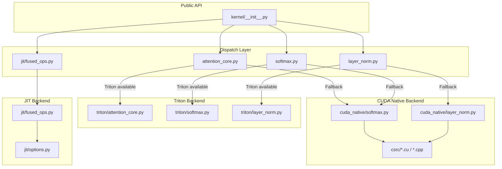

---
slug:7-fused-kernel-implementations
blog_type:normal
---

FastFold 相较于原版 AlphaFold2 的性能优势，很大程度上归功于其一系列**融合 GPU 核函数**，这些核函数将多步数学运算折叠为单次 GPU 启动，消除了中间内存分配和核函数启动开销。这些核函数组织在 `fastfold/model/fastnn/kernel/` 目录下，并提供三种不同的后端实现——**Triton**、**CUDA Native (C++/CU)** 和 **PyTorch JIT**——具备运行时自动分发机制：优先使用 Triton（若可用），否则透明回退至 CUDA native 核函数。

## 核函数架构与分发策略

核函数子系统在架构上分为多层：**公共 API 层**从 `kernel/__init__.py` 导出五个融合操作，每个操作由一个**分发模块**作为支撑，该模块在运行时选择最优后端；以及一个**后端层**，包含三个并行目录中的实际核函数代码。此设计确保 `ops.py`、`evoformer.py`、`msa.py` 和 `triangle.py` 中的上层模型代码无需感知当前激活的是哪个后端。

分发逻辑遵循一致的模式：每个模块在加载时尝试导入 Triton 核函数，设置 `_triton_available` 标志，并在导入失败时发出日志警告。在执行时，前向和反向路径根据此标志进行分支。这意味着回退是**按进程静态的**——如果 Triton 导入失败一次，则在该进程的整个生命周期内，所有后续调用都会使用 CUDA native。

| 融合操作 | Triton 后端 | CUDA Native 后端 | JIT 后端 | 自动求导支持 |
|---|---|---|---|---|
| `fused_attention_core` | ✅ Flash Attention | ❌ (回退至 PyTorch) | ❌ | 仅前向 |
| `fused_softmax` | ✅ 前向 + 反向 | ✅ 前向 + 反向 | ❌ | 完整 (前向 + 反向) |
| `LayerNorm` | ✅ 前向 + 反向 | ✅ 前向 + 反向 | ❌ | 完整 (前向 + 反向) |
| `bias_sigmod_ele` | ❌ | ❌ | ✅ `@torch.jit.script` | 通过 JIT |
| `bias_dropout_add` | ❌ | ❌ | ✅ `@torch.jit.script` | 通过 JIT |
| `bias_ele_dropout_residual` | ❌ | ❌ | ✅ `@torch.jit.script` | 通过 JIT |

来源: [__init__.py](fastfold/model/fastnn/kernel/__init__.py#L1-L13), [attention_core.py](fastfold/model/fastnn/kernel/attention_core.py#L1-L53), [softmax.py](fastfold/model/fastnn/kernel/softmax.py#L1-L59), [layer_norm.py](fastfold/model/fastnn/kernel/layer_norm.py#L1-L61)

## 融合注意力核心

`fused_attention_core` 操作是 FastFold 中架构意义最重大的核函数——它实现了 **Flash Attention** 算法，将整个 Q·K^T → mask → bias → softmax → ·V 流水线融合为一个单一的分块核函数，避免了在 HBM 中具象化完整的 N×N 注意力矩阵。这对 AlphaFold 的 Evoformer 至关重要，因为其注意力维度可达数千个残基。

### Triton 实现

Triton 核函数 `_attention_core` 是一个由 `@triton.jit` 装饰的函数，以 **BLOCK_M × BLOCK_N 大小的分块**（两者均设为 128）处理注意力。每个 Triton 程序处理查询的一个行块，遍历所有键/值块，通过 **m/l 递归**（最大值和指数和）维护运行中的在线 softmax，这是 Flash Attention 的核心算法创新：

1. **加载 Q 分块** 到 SRAM 一次——在所有 K/V 迭代中持久存在
2. **对于每个 K/V 分块**：计算 QK^T，就地应用缩放、偏置和掩码，然后使用数值稳定的递推更新运行中的最大值/总和以及累加器：`m_i_new = max(m_i, m_ij)`，`l_i_new = α·l_i + β·l_ij`，其中 `α = exp(m_i - m_i_new)` 且 `β = exp(m_ij - m_i_new)`
3. **写入输出** 在所有分块处理完毕后

该核函数通过 `tl.constexpr` 标志（`use_mask`、`use_bias`）支持**条件掩码和偏置应用**，这使得 Triton 的 JIT 编译器能够完全消除死代码路径。偏置索引处理 5D 批次结构 `(b1, b2, heads, seq, dim)`，通过计算 `off_hz_bias = (off_hz // (batch_2 * H)) * H + (off_hz % H)`，将展平的程序 ID 正确映射回每个头的偏置向量。

封装函数强制要求数据类型约束（仅限 `float16` 或 `bfloat16`），并通过 `einops.rearrange` 自动处理 5D→4D 的形状重塑，在启动大小为 `(triton.cdiv(N_CTX, BLOCK), batch × heads)` 的网格之前展平两个批次维度。

### 回退路径

当 Triton 不可用时，`FusedAttenionCoreFunc.forward` 回退至 `_torch_attention_core`，后者使用标准 PyTorch 原语执行相同的数学运算：显式 Q·K^T 矩阵乘法、偏置/掩码相加、float32 softmax 以及最终与 V 的矩阵乘法。此路径在功能上是正确的，但会分配完整的注意力矩阵并发出 4 次以上的独立核函数启动。

<CgxTip>Triton Flash Attention 核函数设置 `num_stages=1`（禁用软件流水线），因为内循环对累加器存在写后读依赖——流水线化会破坏此依赖性并产生错误结果。</CgxTip>

来源: [triton/attention_core.py](fastfold/model/fastnn/kernel/triton/attention_core.py#L1-L191), [attention_core.py](fastfold/model/fastnn/kernel/attention_core.py#L1-L53)

## 带掩码和偏置的融合 Softmax

`fused_softmax` 操作在单次融合过程中计算 `softmax(input + bias) * mask`，这是 AlphaFold 注意力层中占主导地位的 softmax 模式，其中始终存在成对偏置项和 MSA 掩码。该融合消除了原版 PyTorch 所需的三个独立核函数（加偏置 → 应用掩码 → softmax）。

### 自动求导函数设计

`FusedSoftmaxFunc` 通过显式的前向/反向方法扩展了 `torch.autograd.Function`。前向传播为反向传播保存输出和掩码；反向传播在融合核函数中计算标准 softmax 梯度 `d_input = output * (d_output - sum(output * d_output))`。当存在偏置时，`grad_bias = sum(d_input, dim=1, keepdim=True)` 作为简单的规约进行计算——这是唯一非融合的步骤，但其开销可忽略不计。

### Triton Softmax 核函数

Triton 实现为了**分发优化**拆分为两种核函数变体：

- **`softmax_mask_bias_kernel`**：每个程序处理一行。每个程序加载一行，逐元素应用偏置和掩码，计算数值稳定的 softmax（减去最大值，求指数，除以总和），并存储结果。
- **`softmax_mask_bias_kernel_two_rows`**：每个程序处理**连续的两行**。当 `n_cols ≤ 128` 且 `n_rows` 为偶数时激活此变体，有效将启动的程序数减半，提高了小序列场景下的 GPU 占用率。

两种核函数均使用 `tl.constexpr` 处理 `use_mask` 和 `use_bias`，以启用编译时分支消除。`BLOCK_SIZE` 设为 `triton.next_power_of_2(n_cols)`，warp 数量随块大小缩放（1024→2048→4096+ 个元素对应 1→4→8→16 个 warp）。

反向核函数 `softmax_grad_kernel` 同样具有双行变体，并通过 `is_bf16` constexpr 处理 bfloat16，在梯度计算前将其提升为 float32。

### CUDA Native Softmax 核函数

CUDA native softmax 是 `softmax_cuda_kernel.cu` 中的高性能实现，使用 **warp 级原语** 进行规约操作：

- `WarpAllReduceMax`：跨 32 个通道使用 `__shfl_xor_sync` 蝶蝶规约
- `WarpAllReduceSum`：求和采用相同模式

核函数 `fastfold_softmax<T, cols_per_thread>` 每个块处理 **4 行**（128 个线程 = 4 个 warp × 32 个通道），每个通道处理 `cols_per_thread` 个元素。关键优化是**编译时列特化**：CUDA 代码使用宏 `COLS_CASE(n)` 为 1–32 的 `cols_per_thread` 0-值6生成特化的模板实例/# 实例，覆盖至多 1024 的列宽。对于超过 1024+ 的宽度，共享内存回退核函数 `fastfold_softmax_sm` 使用 CUB `:BlockReduce` 进行跨 warp 规约。

掩码变体 `fastfold_softmax_mask` 在 softmax 计算前通过将零项替换为 `-1e9` 来应用掩码，掩码梯度变体则将 `mask == 0` 处的 `d_input` 项置零。组合的掩码+偏置变体 `fastfold_softmax_mask_bias` 在单次过程中执行这两种操作。所有核函数均通过模板特化支持 **float32、float16 和 bfloat16**。

<CgxTip>CUDA softmax 核函数的每块 4 行设计（128 线程中的 4 个 warp）是专门为 AlphaFold 典型的注意力头维度调优的，其中行与列的比例使得 4 行批处理在隐藏延迟的同时可保持寄存器压力处于合理水平，从而达到最优。</CgxTip>

来源: [softmax.py](fastfold/model/fastnn/kernel/softmax.py#L1-L59), [triton/softmax.py](fastfold/model/fastnn/kernel/triton/softmax.py#L1-L221), [softmax_cuda_kernel.cu](fastfold/model/fastnn/kernel/cuda_native/csrc/softmax_cuda_kernel.cu#L1-L200), [cuda_native/softmax.py](fastfold/model/fastnn/kernel/cuda_native/softmax.py#L1-L23)

## 融合 LayerNorm

`FusedLayerNorm` 模块用核函数替换了 PyTorch 的 `nn.LayerNorm`，将归一化 → 缩放 → 偏移流水线（均值计算、方差计算、倒数平方根、仿射变换）融合为单次过程，避免了对输入张量的多次读取和中间内存分配。

### 针对大维度的自适应分块

`FusedLayerNorm.forward` 方法实现了**自适应分块策略**：当输入的倒数第三维超过 4000 时（在具有数千条序列的 AlphaFold MSA 表示中很常见），输入被拆分为大小为 `min(4000² / dim, dim / 2)` 的块。每个块通过 `kernel_forward` 独立归一化，结果写入预分配的输出张量。这确保了每次核函数启动都在经过最大计算效率优化的子张量上操作，同时保持内存使用受限。

### Triton LayerNorm 核函数

Triton 前向核函数 `_layer_norm_fwd_fused` 每个程序处理一行：

1. **第一次过程**：在 `_mean` 缓冲区中累加元素总和（在 `BLOCK_SIZE` 上分块），计算 `mean = sum / N`
2. **第二次过程**：累加平方偏差 `(a - mean)²`，计算 `var = sum / N` 和 `rstd = 1 / sqrt(var + eps)`
3. **第三次过程**：应用仿射变换 `(a - mean) * rstd * weight + bias` 并存储

`BLOCK_SIZE` 启发式选择为 `min(65536 / element_size, next_power_of_2(N))`，并限幅至 [128, 4096]，在 SRAM 使用率和分块开销之间取得平衡。

反向传播被拆分为两个核函数：`_layer_norm_bwd_dx_fused` 以融合的双过程设计计算输入梯度 `dx = (w·dout - â·mean1 - mean2) · rstd`（其中 `mean1 = mean(â·w·dout)` 且 `mean2 = mean(w·dout)`），而 `_layer_norm_bwd_dwdb` 使用带有 `BLOCK_SIZE_M` 行批处理的展开循环累加跨行的权重和偏置梯度。

### CUDA Native LayerNorm 核函数

`layer_norm_cuda_kernel.cu` 中的 CUDA 层归一化核函数使用 **Welford 在线算法** 进行数值稳定的均值/方差计算。`WelfordOnline` 设备函数增量更新运行统计数据（计数、均值、M2），`WelfordWarpAllReduce` 使用 `__shfl_down_sync` 蝶蝶模式跨 warp 合并每个线程的 Welford 状态。这比两过程方法（先计算均值，再计算方差）数值更稳定，因为它避免了当值较大且相近时出现的灾难性抵消。

该核函数每个块处理 4 行（与 softmax 设计匹配），每个 warp 通道处理 `(cols + 31) / 32` 个元素。反向传播使用跨步加载方案（`cuLoadWriteStridedInputs`），仔细将线程块映射到输入行和列，以实现合并内存访问。

来源: [layer_norm.py](fastfold/model/fastnn/kernel/layer_norm.py#L1-L61), [triton/layer_norm.py](fastfold/model/fastnn/kernel/triton/layer_norm.py#L1-L243), [layer_norm_cuda_kernel.cu](fastfold/model/fastnn/kernel/cuda_native/csrc/layer_norm_cuda_kernel.cu#L1-L200), [cuda_native/layer_norm.py](fastfold/model/fastnn/kernel/cuda_native/layer_norm.py#L1-L36)

## JIT 融合操作

三个 JIT 融合操作处理频繁出现在 Evoformer 的 dropout 和门控路径中的**逐元素复合模式**。它们使用 `@torch.jit.script` 装饰，并受益于 PyTorch 的 JIT 融合优化器，该优化器在运行时将多个逐元素操作合并为单个 CUDA 核函数。

| 操作 | 数学公式 | 使用场景 |
|---|---|---|
| `bias_sigmod_ele(y, bias, z)` | `σ(y + bias) · z` | 三角更新中带偏置的门控 |
| `bias_dropout_add(x, bias, dropmask, residual, prob)` | `(x + bias) · dropout(mask, p) + residual` | 带残差连接的注意力输出 |
| `bias_ele_dropout_residual(ab, b, g, dropout_mask, Z_raw, prob)` | `Z_raw + dropout(mask, p) · g · (ab + b)` | 带门控和残差的配对更新 |

JIT 选项模块（`jit/options.py`）在导入时配置 PyTorch 的 JIT 融合器，禁用性能分析模式并启用 CPU/GPU 融合，这将为这些逐元素模式触发旧版 NNC 融合器。

来源: [jit/fused_ops.py](fastfold/model/fastnn/kernel/jit/fused_ops.py#L1-L23), [jit/options.py](fastfold/model/fastnn/kernel/jit/options.py#L1-L29)

## 模型操作中的核函数使用

融合核函数被 `fastfold/model/fastnn/ops.py` 中的操作模块所使用，这些模块构建了 Evoformer 的上层基础模块。每个 `Transition` 模块都使用 `LayerNorm` 而不是 PyTorch 的原生实现。`MSACore`、`PairCore` 和三角注意力模块对所有注意力 softmax 操作使用 `fused_softmax`，并传入它们各自的掩码和偏置。`fused_attention_core` 在可对完整 QKV 注意力进行分块的注意力计算路径中被调用。JIT 融合操作（`bias_dropout_add`、`bias_ele_dropout_residual`、`bias_sigmod_ele`）用于 MSA 和配对注意力模块的 dropout 和门控路径，用单次融合操作替代了原本需要 3–4 次独立逐元素核函数启动的过程。

来源: [ops.py](fastfold/model/fastnn/ops.py#L1-L50), [evoformer.py](fastfold/model/fastnn/evoformer.py#L1-L60)

## 后端对比与选择指南

| 标准 | Triton | CUDA Native (C++/CU) | PyTorch JIT |
|---|---|---|---|
| **编译** | 首次调用时 JIT | 通过 `setup.py` 预编译 | 首次调用时 JIT |
| **灵活性** | 高——Python 级核函数编写 | 低——需要 C++/CUDA 重新构建 | 中——带 JIT 注解的 Python |
| **性能** | 注意力操作最佳（flash 算法） | softmax/LayerNorm 最佳（warp 特化） | 逐元素融合良好 |
| **数据类型支持** | fp16, bf16 | fp32, fp16, bf16 | 继承自 PyTorch 操作 |
| **自动求导** | 手动（注意力仅前向） | 手动（完整前向+反向） | 通过 JIT 自动 |
| **依赖** | `triton` 包 | CUDA toolkit + `pybind11` | PyTorch 内置 |
| **回退链** | → CUDA native / PyTorch 操作 | → PyTorch 原生操作 | → 求值模式 |

默认行为——注意力操作偏好 Triton，softmax/LayerNorm 回退至 CUDA native——在大多数 GPU 架构上提供了最佳的即用型性能。对于 Triton 不可用的环境（较旧的 GPU、非 NVIDIA 加速器），CUDA native 核函数提供了稳健的回退，相比未融合的 PyTorch 操作仍能提供显著的加速。

若要深入了解这些核函数如何集成到实现内存高效长序列推理的分块执行策略中，请参阅[内存高效分块执行](8-memory-efficient-chunked-execution)。关于在 Evoformer 架构中协调这些核函数的模块级设计，请参阅[FastNN 模块设计](6-fastnn-module-design)。