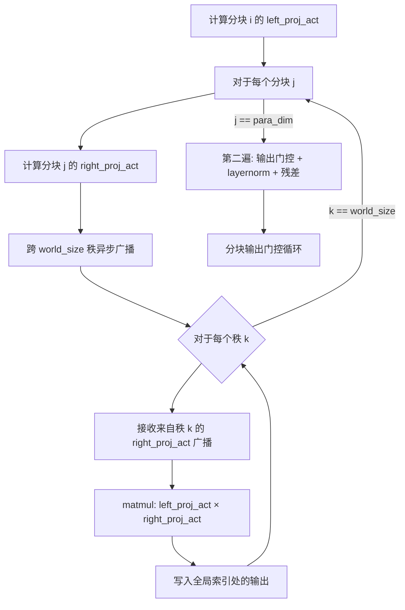

---
slug:8-memory-efficient-chunked-execution
blog_type:normal
---


FastFold 的分块执行框架是关键机制，它将 Evoformer 中消耗大量内存的 O(N²) 和 O(N³) 张量运算转化为内存可行的负载。该框架并没有为长蛋白质序列实例化庞大的中间张量（例如对表示 Z ∈ ℝ^{N×N×C_z}），而是沿序列维度将计算拆分为小块，独立处理每个小块并将结果写入预分配的输出缓冲区。这种架构决策以受控的重计算开销换取峰值内存的大幅降低，从而能够对原本会耗尽 GPU HBM 的序列进行推理。

## 分块控制平面

整个分块执行系统由一个全局变量及其访问器函数管控，构建了一个轻量级的控制平面，每个 FastNN 算子都会在运行时查询该平面：

| API | 用途 | 位置 |
|-----|---------|----------|
| `CHUNK_SIZE` (全局) | 运行时分块粒度；`None` 表示禁用分块 | `ops.py` |
| `set_chunk_size(chunk_size)` | 设置全局分块大小 | `ops.py` |
| `get_chunk_size()` | 读取当前分块大小 | `ops.py` |

当 `CHUNK_SIZE` 为 `None` 时，每个算子都会回退到其**全量实例化路径**——一次性计算整个张量。当设置为正整数时，每个算子进入其**分块路径**，以 `CHUNK_SIZE`（或其派生的倍数）为步长沿序列维度迭代。这种双模式设计通过在每个 `forward()` 方法入口处的 `if CHUNK_SIZE == None` / `else` 分支，统一应用于所有 FastNN 模块。

来源: [ops.py](fastfold/model/fastnn/ops.py#L31-L42)

## 按算子类别划分的分块策略

不同算子带来不同的内存瓶颈，因此采用不同的分块粒度。下表总结了用户指定的 `CHUNK_SIZE` 与内部使用的实际迭代步长之间的关系：

| 算子类 | 有效分块步长 | 分块维度 | 原理 |
|----------------|----------------------|--------------------|-----------|
| `SelfAttention` | `CHUNK_SIZE` | `dim=1` (batch/MSA 行) | 每个批切片的 Attention QKV 占主导内存 |
| `OutProductMean` | `CHUNK_SIZE` | `dim=2` (序列列) | 外积 ⟂ 展开在每个切片的复杂度为 O(N·C²) |
| `ChunkTransition` | `CHUNK_SIZE × 48` | `dim=1` | Transition 轻量；更宽的分块可摊销开销 |
| `AsyncChunkTriangleMulOutgoing` | `CHUNK_SIZE × 32` | `dim=1` (外), `dim=1` (内) | 带有异步广播的嵌套双循环 |
| `AsyncChunkTriangleMulIncoming` | `CHUNK_SIZE × 32` | `dim=2` (外), `dim=2` (内) | Outgoing 的镜像；沿列轴分块 |
| `ChunkTriangleAttStartingNode` | `CHUNK_SIZE` | `dim=1` | 注意力偏置 `b` 分块计算，随后复用 |
| `ChunkTriangleAttEndingNode` | `CHUNK_SIZE` | `dim=2` | 转置 + 带偏置复用的分块注意力 |
| `ChunkMSAColumnGlobalAttention` | `CHUNK_SIZE` | `dim=2` | 列方向全局注意力分块 |
| `RecyclingEmbedder` | `CHUNK_SIZE × 48` | `dim=1` | Distogram 线性层窄；宽分块足矣 |

乘数因子（×32, ×48）反映了一种校准原则：**单元素计算成本低的算子使用更宽的分块**，以减少循环开销和内核启动成本；而**具有庞大中间张量的算子（attention, 外积）则使用原始 `CHUNK_SIZE`**，以严格限制峰值内存。

来源: [ops.py](fastfold/model/fastnn/ops.py#L85-L108), [ops.py](fastfold/model/fastnn/ops.py#L157-L171), [ops.py](fastfold/model/fastnn/ops.py#L414-L416)

## 分块自注意力模式

`SelfAttention.forward()` 方法是分块模式的典型范例。其非分块路径在全量张量上计算 QKV 投影、注意力矩阵乘法和输出投影。分块路径则沿 `dim=1` 进行分解：

```python
# 分块路径 (CHUNK_SIZE != None)
para_dim = in_data.shape[1]
chunk_size = CHUNK_SIZE
output = []
for ax in range(0, para_dim, chunk_size):
    in_data_part = in_data[:, ax:ax + chunk_size, :, :]
    mask_part = mask[:, ax:ax + chunk_size, :]
    # 在切片上进行全量 attention 流水线
    qkv = self.to_qkv(in_data_part).chunk(3, dim=-1)
    q, k, v = map(lambda t: rearrange(t, 'b1 b2 n (h d) -> b1 b2 h n d', h=self.n_head), qkv)
    q = q * self.scaling
    logits = torch.matmul(q, k.transpose(-1, -2))
    weights = fused_softmax(logits, mask_part, bias.unsqueeze(1) if nonbatched_bias else None)
    weighted_avg = torch.matmul(weights, v)
    # ... 门控，输出投影
    output.append(self.o_linear(weighted_avg))
output = torch.cat(output, dim=1)
```

核心洞见在于，每次迭代仅为 `chunk_size` 行分配 QKV、logits 和加权平均，而非完整的 MSA 深度。输出通过列表追加 + `torch.cat` 进行累积，这避免了在 autograd 追踪期间对预分配张量的原地写入。

来源: [ops.py](fastfold/model/fastnn/ops.py#L304-L363)

## 分块 OutProductMean：控制外积爆炸

外积均值模块产生了 Evoformer 中最消耗内存的中间结果：完整外积 `O[b,i,j,d,e] = Σ_s left[b,s,i,d] × right[b,s,j,e]`，其维度为 (N_seq, N_res, N_res, C_proj, C_proj)。沿序列轴（`dim=2`）分块可防止该张量被全量实例化：

```python
# 分块外积
para_dim = left_act.shape[2]
chunk_size = CHUNK_SIZE
for ax in range(0, para_dim, chunk_size):
    left_act_part = left_act[:, :, ax:ax + chunk_size, :]
    O = torch.einsum('bsid,bsje->bijde', left_act_part, right_act_all)
    O = rearrange(O, 'b i j d e -> b i j (d e)')
    O = self.o_linear(O)
    norm0 = norm[:, ax:ax + chunk_size, :, :]
    Z[:, ax:ax + chunk_size, :, :] = O / norm0
```

此处，分块的 `left_act_part` 将 einsum 的内存占用从 O(N²·C²) 降低至 O(chunk_size·N·C²)。结果被直接写入预分配的 `Z` 中正确的切片偏移位置——无需拼接，因为每个分块写入的是互不重叠的内存区域。

来源: [ops.py](fastfold/model/fastnn/ops.py#L157-L171)

## 分块三角乘法：带异步广播的嵌套循环

三角乘法更新算子（`AsyncChunkTriangleMultiplicationOutgoing` 和 `AsyncChunkTriangleMultiplicationIncoming`）提出了最复杂的分块挑战。其底层计算是对表示的矩阵乘法，要求跨分布式 Worker 对右（或左）投影激活进行**全互联访问**。分块策略在序列维度上使用**嵌套双循环**，并结合流水线化的异步广播：



外层循环沿左投影的序列维度迭代分块 `i`。内层循环沿右投影的分块迭代 `j`。%在每对 (i, j) 内，一个**遍历 `world_size` 秩的第三层循环**执行异步广播流水线：当前秩广播其 `right_proj_act`，同时接收来自其他秩的数据，从而重叠通信. 通信与计算。矩阵乘法的结果被写入输出张量的全局位置 `(i-1)*para_dim + j` 处。在嵌套循环完成后，**第二遍处理**在一个沿 `dim=1` 的独立分块循环中应用输出门控、层归一化和偏置-丢弃-残差1.

来源: [ops.py](fastfold/model/fastnn/ops.py#L414-L498)

## 偏置重计算：以计算换内存

在 `ChunkTriangleAttentionStartingNode` 和 `ChunkMSARowAttentionWithPairBias` 中出现了一个微妙但关键的模式。这些模块从大型对表示 `Z` 计算一个小型偏置张量 `b`。偏置比 `Z` 小得多（形状为 `[B, N, N, n_head]` 对比 `[B, N, N, C_z]`），因此策略如下：

1. **第一遍分块处理**：通过迭代 `Z` 的分块来计算 `b`，将每个切片写入预分配的 `b` 张量，然后对完整的 `b` 执行异步聚合。
2. **第二遍分块处理**：再次迭代分块，从原始输入重新计算 `layernorm(Z_chunk)`，但此时使用已聚合的完整 `b` 作为注意力偏置。

源码中的注释精确地捕捉了这一点：*“z 很大，但 b 很小。因此我们先分块计算 z 以得到 b，随后再分块重新计算 z，而不是存储它。”* 这避免了在两遍处理之间存储完整的归一化 `Z` 张量，以多执行一次 LayerNorm 遍历为代价，节省了 O(B·N²·C_z) 的内存。

来源: [ops.py](fastfold/model/fastnn/ops.py#L672-L701), [ops.py](fastfold/model/fastnn/ops.py#L791-L821)

## 原地变体：零拷贝内存缩减

多个分块算子提供了 `inplace()` 方法，这些方法操作列表包装的张量（例如用 `M_raw[0]` 代替 `M_raw`）。这些变体将结果直接写回输入张量的切片中，从而消除了单独输出张量的分配。其模式如下：

```python
def inplace(self, M_raw, Z, M_mask):
    # M_raw 是一个列表: [tensor]
    for i in range(0, para_dim_m, chunk_size):
        m_raw = M_raw[0][:, i:i + chunk_size, :, :]
        m = self.layernormM(m_raw)
        # ... 计算 attention ...
        M_raw[0][:, i:i + chunk_size, :, :] = result  # 原地写入
    return M_raw
```

此模式用于 Evoformer 的 `inplace()` 前向路径中，其中 MSA 表示 `m` 和对表示 `z` 被包装在单元素列表中，并在 EvoformerStack 块之间进行原地修改，从而避免了在块之间分配中间副本。

来源: [ops.py](fastfold/model/fastnn/ops.py#L823-L867), [evoformer.py](fastfold/model/fastnn/evoformer.py#L93-L152)

## 块级激活检查点

与算子级分块正交，FastFold 通过 `checkpoint_blocks()` 实现了**块级激活检查点**。该函数将 Evoformer 的块堆栈划分为每组 `blocks_per_ckpt` 个块，并用 `torch.utils.checkpoint.checkpoint()` 包装每个组：


当 `blocks_per_ckpt=2` 且共有 6 个块时，块 0-1 的激活在计算后即被丢弃，并在块 2-3 的反向传播期间重新计算，依此类推。`EvoformerStack.__init__()` 接受 `blocks_per_ckpt` 和 `clear_cache_between_blocks` 参数来控制此行为：

| 参数 | 效果 |
|-----------|--------|
| `blocks_per_ckpt = None` | 无检查点；保留所有激活（最快，内存最高） |
| `blocks_per_ckpt = 1` | 每个块都设置检查点（最慢，内存最低） |
| `blocks_per_ckpt = N` | 每 N 个块组成一个检查点组（平衡的权衡） |

**算子级分块**与**块级检查点**之间的交互是乘性的：分块降低了每个块内的峰值内存，而检查点减少了在内存中同时驻留激活的块数量。

来源: [checkpointing.py](fastfold/utils/checkpointing.py#L31-L84), [evoformer.py](fastfold/model/fastnn/evoformer.py#L161-L170)

## 内存缩减分析

分块和检查点对 Evoformer 主导内存项的综合影响可近似如下。设 N 为序列长度，S 为 MSA 深度，C 为通道维度，K 为分块大小：

| 内存项 | 未分块 | 分块 | 缩减因子 |
|-------------|-----------------|---------------|-----------------|
| MSA attention QKV | O(S·N·3·h·c) | O(K·N·3·h·c) | S/K |
| 外积中间项 | O(N²·C_proj²) | O(K·N·C_proj²) | N/K |
| 三角乘法中间项 | O(N²·C) | 每个分块对 O(K·N·C) | N/K |
| 块激活 | O(B · block_mem) | O(blocks_per_ckpt · block_mem) | B/blocks_per_ckpt |

对于典型的长序列（N=2500, S=1024），在 `CHUNK_SIZE=128` 的情况下，外积内存降低约 20 倍，MSA attention QKV 降低约 8 倍，使得原先会 OOM 的序列能够在单 GPU 上可行。

<CgxTip>设置 `CHUNK_SIZE` 时，可从等于 N/4 的值开始，并逐次减半直到满足目标内存预算。Transition 和 TriangleMul 上的 ×32 和 ×48 乘数意味着这些算子对 `CHUNK_SIZE` 的变化不太敏感——请将调优重点放在使用原始值的 attention 和外积算子上。</CgxTip>

<CgxTip>结合分块与检查点以实现最大内存缩减：先设置 `CHUNK_SIZE` 以限定每块的峰值内存，再设置 `blocks_per_ckpt`，使得 `blocks_per_ckpt × 每块峰值内存` 适配你的 HBM 预算。这两种机制是正交的，并以乘法方式组合。</CgxTip>

来源: [ops.py](fastfold/model/fastnn/ops.py#L31-L42), [ops.py](fastfold/model/fastnn/ops.py#L157-L171), [checkpointing.py](fastfold/utils/checkpointing.py#L31-L84)

## 相关主题

- 有关加速每个分块操作的融合内核（softmax, layer norm, bias-sigmoid），请参阅 [Fused Kernel Implementations](7-fused-kernel-implementations)。
- 有关分块三角乘法如何与 DAP 异步广播流水线交互，请参阅 [Duality Async Operation](10-duality-async-operation)。
- 有关编排带检查点的分块块的 EvoformerStack，请参阅 [FastNN Module Design](6-fastnn-module-design)。