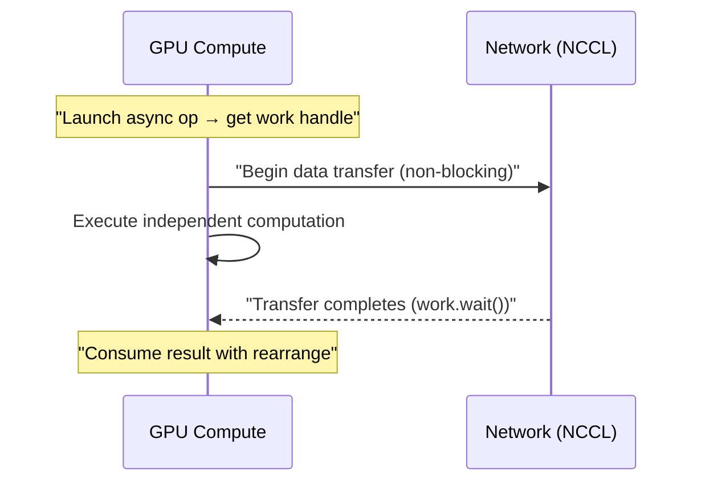
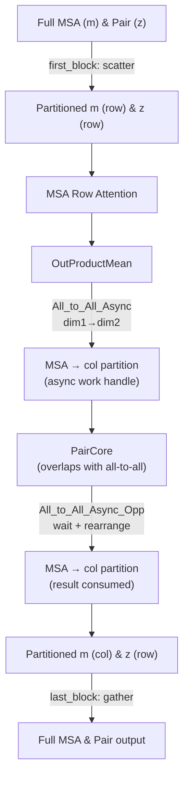

---
slug:9-dap-communication-primitives
blog_type:normal
---


FastFold 的动态轴向并行通过沿张量的行轴和列轴对张量进行分区，将 Evoformer 的计算分配到多个 GPU 上。`fastfold/distributed/` 中的**通信原语**是使这种分区对模型其余部分透明的基础构建块——它们负责处理数据移动、梯度同步以及 DAP 所需的关键行↔列轴转置操作。Evoformer 堆栈、模板嵌入器和 Pair 核心中的每一个高层 DAP 操作，最终都会委托给这六个核心原语：**scatter**、**gather**、**reduce**、**copy**、**col_to_row** 和 **row_to_col**。

来源: [__init__.py](/fastfold/distributed/__init__.py#L1-L7), [core.py](/fastfold/distributed/core.py#L1-L41)

## DAP 初始化

在任何通信原语执行之前，必须通过 `init_dap` 初始化 DAP 进程组。此函数替代了 `torch.distributed.init_process_group`，并配置了 ColossalAI 的张量并行上下文，所有原语都依赖该上下文来解析全局规模、秩和通信器组。

```python
from fastfold.distributed import init_dap

init_dap(tensor_model_parallel_size_=4)  # 在 4 个 GPU 上进行分区
```

在内部，`init_dap` 会为单设备回退设置缺失的分布式环境变量（`WORLD_SIZE`、`RANK`、`LOCAL_RANK`、`MASTER_ADDR`、`MASTER_PORT`），然后通过张量并行配置委托给 `colossalai.launch_from_torch`。`ensure_divisibility` 守卫——在所有原语中均有使用——会断言张量维度能被并行度整除，从而防止因不均匀拆分导致的数据静默损坏。

来源: [core.py](/fastfold/distributed/core.py#L1-L41)

## 同步原语

所有同步原语均位于 `comm.py` 中，并共享一种通用架构模式：每个原语都暴露一个**公共函数**，该函数检查 `torch.is_grad_enabled()`，并将操作分发给原始的集合通信操作（例如 `_split`），或分发给自定义的 `torch.autograd.Function` 子类，该子类将前向集合通信与其**解析推导的反向集合通信**配对。这种设计确保了 DAP 下的梯度正确性，而无需手动同步梯度。

### 原语参考

| 原语 | 前向操作 | 反向操作 | 张量变换 |
|-----------|------------------|--------------------|---------------------|
| `scatter` | 沿 `dim` 拆分张量 → 本地分片 | 沿 `dim` 收集分片 | 完整 → 已分区 |
| `gather` | 沿 `dim` 拼接分片 | 沿 `dim` 拆分梯度 | 已分区 → 完整 |
| `reduce` | 跨组全规约求和 | 恒等直通 | 逐设备 → 已求和 |
| `copy` | 恒等（前向无操作） | 梯度全规约求和 | 前向无变化 |
| `col_to_row` | 全互斥（dim1→dim2） | 全互斥（dim2→dim1） | 列分区 → 行分区 |
| `row_to_col` | 全互斥（dim2→dim1） | 全互斥（dim1→dim2） | 行分区 → 列分区 |

来源: [comm.py](/fastfold/distributed/comm.py#L1-L204)

### Scatter 和 Gather — 张量分区

**Scatter** 沿指定维度将完整张量拆分为等大的分片，并返回当前秩所拥有的分片。它是每个 DAP 块起始处的入口原语——完整的 MSA 嵌入沿 MSA 行维度进行 scatter，完整的 Pair 表示沿 Pair 行维度进行 scatter。

```python
def _split(tensor: Tensor, dim: int = -1) -> Tensor:
    split_size = divide(tensor.shape[dim], gpc.get_world_size(ParallelMode.TENSOR))
    tensor_list = torch.split(tensor, split_size, dim=dim)
    return tensor_list[gpc.get_local_rank(ParallelMode.TENSOR)].contiguous()
```

**Gather** 是 scatter 的逆操作——它通过 `dist.all_gather` 拼接所有分片，并生成完整张量。在每个 DAP 块的末尾会调用它来重新组装完整的表示。其自动求导配对是精确的：`Scatter.backward = _gather` 且 `Gather.backward = _split`，这反映了分区与重组之间的基本对偶性。

`_gather` 中存在一个重要的优化：当 `dim == 1` 且批次维度为 1 时，输出缓冲区会被预分配为一个单一的连续张量，并为 `all_gather` 执行 `chunk` 操作，从而避免了分配 `world_size` 个独立张量及随后的 `cat` 操作。

来源: [comm.py](/fastfold/distributed/comm.py#L24-L72)

### Reduce 和 Copy — 梯度同步

**Reduce** 在张量并行组中执行带有 `SUM` 的原地 `dist.all_reduce` 操作。它的反向操作是恒等函数——因为梯度在前向传播中已经被求和，每个秩都持有正确的总梯度，因此不需要进一步的规约。

**Copy** 是一个微妙但至关重要的原语。它的前向操作是恒等函数，但其反向操作会调用 `_reduce`。这实现了**“前向复制，反向规约”**模式：张量在各秩之间复制（前向值相同），而在反向传播期间，来自每个秩的局部梯度被求和以产生正确的全局梯度。这是对于那些必须在各分区之间保持相同、但在训练期间又会接收各秩贡献的张量的标准模式。

来源: [comm.py](/fastfold/distributed/comm.py#L74-L112)

### col_to_row 和 row_to_col — 轴转置

这些是 DAP 中架构意义最重要的原语。它们实现了 `dist.all_to_all` 集合通信，以将张量从列并行布局**重新分区**为行并行布局（反之亦然）。这种转置是 DAP 的通信瓶颈，每当计算从面向行的操作（例如行注意力、输出三角形乘法）切换到面向列的操作（例如列注意力、输入三角形乘法）时，都需要进行此转置。

底层的 `_all_to_all` 沿 `in_dim` 拆分输入，执行全互斥交换，并沿 `out_dim` 拼接接收到的块。自动求导规则是对称的：`col_to_row` 的反向操作是 `row_to_col`（维度互换），这正是 `_all_to_all` 的反向操作通过交换 `in_dim` 和 `out_dim` 所实现的。

```python
# All_to_All backward: swap in_dim and out_dim
def backward(ctx, grad_output):
    saved_tensors = ctx.saved_tensors[0]
    return _all_to_all(grad_output, in_dim=int(saved_tensors[1]),
                       out_dim=int(saved_tensors[0])), None, None
```

来源: [comm.py](/fastfold/distributed/comm.py#L137-L204)

## 异步原语

文件 `comm_async.py` 引入了 gather 和全互斥通信的非阻塞变体，它们返回**工作句柄**而不是阻塞至完成。这实现了**计算与通信重叠**，这是 FastFold 的关键性能优化之一。

### 异步通信架构



异步模式分为三个阶段：（1）**启动**——集合通信操作开始并立即返回一个 `(output_tensor, work_handle)` 对；（2）**重叠**——在网络传输数据时进行独立计算；（3）**完成**——调用 `work.wait()`，随后执行 `rearrange`，将收集到的数据从其拼接传输布局重塑为最终的轴转置布局。

### 异步 Gather

`_gather_async` 发出带有 `async_op=True` 的 `dist.all_gather`，并返回预分配的输出缓冲区及工作句柄。完成函数 `gather_async_opp` 调用 `work.wait()`，并在 `dim == 2` 时应用 `einops.rearrange`，将拼接布局 `(n, x*h, w, c)` 转换为目标布局 `(n, h, x*w, c)`——这种重排是 DAP 特有的重塑操作，它将 all-gather 拼接顺序转换为行分区数据的正确空间排列。

来源: [comm_async.py](/fastfold/distributed/comm_async.py#L62-L131)

### 异步 All-to-All

`All_to_All_Async` 和 `All_to_All_Async_Opp` 实现了轴转置的启动-完成模式。启动操作（`All_to_All_Async.forward`）返回 `(output, work)`。完成操作（`All_to_All_Async_Opp.forward`）调用 `work.wait()`，并在 `out_dim == 2` 时应用 `rearrange`。

一个关键的实现细节是**全局变量 `WORLD_WORK_ALL2ALL`**。在 `All_to_All_Async_Opp` 的反向传播中，会在启动新的异步通信之前等待上一个异步工作句柄完成。这种串行化防止了竞态条件，即新的全互斥通信可能会覆盖仍在被传输中数据使用的缓冲区。`All_to_All_Async` 的反向操作将已启动的工作存储在 `WORLD_WORK_ALL2ALL` 中，下一次反向调用会确保其在继续之前完成。

来源: [comm_async.py](/fastfold/distributed/comm_async.py#L133-L199)

### 异步广播

`broadcast_sync` 和 `broadcast_async` 提供了带有 `host` 标志的秩到全体广播操作，该标志决定当前秩是源（原地修改）还是接收者（分配输出缓冲区）。这些原语用于分发所有秩都需要保持一致的标量值或配置张量。

来源: [comm_async.py](/fastfold/distributed/comm_async.py#L12-L44)

## 实践中的 DAP 数据流

通信原语在每个 Evoformer 块内协调着精确的数据流模式。理解此数据流对于调试 DAP 行为和优化通信调度至关重要。

### Evoformer 块通信模式



在块入口处，`scatter` 沿 MSA 序列维度对完整的 MSA 表示进行分区，沿 Pair 行维度对完整的 Pair 表示进行分区。在块内部，MSA 行注意力在行分区数据上操作，随后 `All_to_All_Async` 将 MSA 转置为列分区布局，同时与 Pair 计算重叠。在块出口处，`gather` 重组完整张量并裁剪填充。

来源: [evoformer.py](/fastfold/model/fastnn/evoformer.py#L44-L102)

### PairCore 通信模式

`PairCore` 模块展示了轴转置原语最密集的使用——在面向行与面向列的计算之间进行子层切换时，每次都需要调用 `row_to_col` 或 `col_to_row`：

```python
def forward(self, pair, pair_mask):
    pair_mask_row = scatter(pair_mask, dim=1)     # Row-partitioned mask
    pair_mask_col = scatter(pair_mask, dim=2)     # Col-partitioned mask
    pair = TriangleMultiplicationOutgoing(pair, pair_mask_row)  # Row-oriented
    pair = row_to_col(pair)                       # Transpose → col
    pair = TriangleMultiplicationIncoming(pair, pair_mask_col)  # Col-oriented
    pair = col_to_row(pair)                       # Transpose → row
    pair = TriangleAttentionStartingNode(pair, pair_mask_row)   # Row-oriented
    pair = row_to_col(pair)                       # Transpose → col
    pair = TriangleAttentionEndingNode(pair, pair_mask_col)     # Col-oriented
    pair = PairTransition(pair)
    pair = col_to_row(pair)                       # Final → row
    return pair
```

掩码上的每次 `scatter` 调用都会为当前轴方向创建正确的分区视图。交替的 `row_to_col` / `col_to_row` 调用确保每个三角形操作都能接收到其所期望的分区方向的数据。此模式在模板 Pair 块中同样重复出现。

来源: [triangle.py](/fastfold/model/fastnn/triangle.py#L212-L231), [template.py](/fastfold/model/fastnn/template.py#L249-L278)

### 三角形乘法中的异步重叠

`TriangleMultiplicationOutgoing` 模块展示了异步原语最复杂的用法——将右侧投影激活的 gather 与输出门的计算重叠：

```python
# Launch async gather — returns immediately
right_proj_act, work = gather_async(right_proj_act.contiguous(), dim=1)

# Computation that DOES NOT depend on right_proj_act runs here
g = torch.sigmoid(self.output_gate(Z))      # Overlaps with network transfer

# Wait for gather to complete, then rearrange
right_proj_act = gather_async_opp(right_proj_act, work, dim=1)
```

`output_gate` 的计算仅依赖于 `Z`（层归一化后的输入），而不依赖于已收集的 `right_proj_act`，因此它可以在 all-gather 传输期间继续执行。这种重叠隐藏了很大一部分通信延迟。相同的模式也出现在 `TriangleMultiplicationIncoming`（左侧投影的异步 gather）和 `MSARowAttentionWithPairBias`（Pair 偏置的异步 gather）中。

来源: [triangle.py](/fastfold/model/fastnn/triangle.py#L52-L67), [msa.py](/fastfold/model/fastnn/msa.py#L55-L64)

## 填充与可整除性

DAP 要求分区后的维度能被全局规模整除。当序列长度不可整除时，Evoformer 和模板块会在 scatter 之前应用**对称填充**：

```python
padding_size = (int(seq_length / dap_size) + 1) * dap_size - seq_length
m = torch.nn.functional.pad(m, (0, 0, 0, padding_size))
z = torch.nn.functional.pad(z, (0, 0, 0, padding_size, 0, padding_size))
```

在块出口处 gather 之后，填充会被裁剪：`m = m[:, :-padding_size, :]`。这种填充策略确保所有秩接收到大小相等的分片，这是 NCCL 集合通信的先决条件。

来源: [evoformer.py](/fastfold/model/fastnn/evoformer.py#L59-L65)

## 自动求导设计哲学

通信原语遵循一致的自动求导设计原则：**每个原语的反向操作是其前向操作的解析共轭**。这并非任意设定——它源于应用于分布式计算的链式法则。关键的共轭对如下：

| 前向 | 反向 | 数学依据 |
|---------|----------|---------------------------|
| 拆分 | 拼接 | ∂(split)/∂x = gather |
| 拼接 | 拆分 | ∂(concat)/∂x = split |
| 全规约 | 恒等 | ∂(Σxᵢ)/∂xᵢ = 1 |
| 恒等 | 全规约 | 梯度从所有副本中累积 |
| 全互斥 (dim_a→dim_b) | 全互斥 (dim_b→dim_a) | 转置是自逆的 |

`Copy` 原语尤其值得注意：它在正向传播中没有任何开销（恒等操作），但其反向传播会通过全规约在各秩之间隐式同步梯度。这使得它成为那些在所有秩上产生相同输出、但在训练期间需要累加梯度的层的正确原语选择。

<CgxTip>在调试不正确的 DAP 结果时，首先验证 `torch.is_grad_enabled()` 是否处于预期状态。如果梯度跟踪被意外禁用（例如在 `torch.no_grad()` 内部），原语将执行原始的集合通信操作而非自动求导函数，从而产生正确的前向值，但会静默丢弃梯度同步——导致微妙的训练发散而非明显的崩溃。</CgxTip>

<CgxTip>`comm_async.py` 中的全局变量 `WORLD_WORK_ALL2ALL` 会对整个模型的反向传播全互斥操作进行串行化。如果你引入了在反向路径中使用 `All_to_All_Async` 的新模块，请确保在启动新的异步通信之前已等待上一个工作句柄完成——否则可能会因重叠的传输占用而导致缓冲区损坏。</CgxTip>

来源: [comm.py](/fastfold/distributed/comm.py#L74-L204), [comm_async.py](/fastfold/distributed/comm_async.py#L166-L199)

## API 总结

### `fastfold.distributed.comm` — 同步原语

| 函数 | 签名 | 描述 |
|----------|-----------|-------------|
| `scatter` | `(input: Tensor, dim: int = -1) → Tensor` | 分区张量；自动求导与 gather 配对 |
| `gather` | `(input: Tensor, dim: int = -1) → Tensor` | 重组张量；自动求导与 scatter 配对 |
| `reduce` | `(input: Tensor) → Tensor` | 全规约求和；反向操作为恒等 |
| `copy` | `(input: Tensor) → Tensor` | 前向恒等；反向操作为梯度全规约 |
| `col_to_row` | `(input_: Tensor) → Tensor` | 全互斥轴转置 (col→row) |
| `row_to_col` | `(input_: Tensor) → Tensor` | 全互斥轴转置 (row→col) |

### `fastfold.distributed.comm_async` — 异步原语

| 函数 | 签名 | 描述 |
|----------|-----------|-------------|
| `gather_async` | `(input: Tensor, dim: int) → (Tensor, Work)` | 非阻塞 gather；返回输出缓冲区 + 句柄 |
| `gather_async_opp` | `(output: Tensor, work, dim: int) → Tensor` | 完成异步 gather；等待 + 重排 |
| `All_to_All_Async.apply` | `(input_, in_dim, out_dim) → (Tensor, Work)` | 非阻塞全互斥；返回缓冲区 + 句柄 |
| `All_to_All_Async_Opp.apply` | `(output, work, in_dim, out_dim) → Tensor` | 完成异步全互斥；等待 + 重排 |
| `broadcast_async` | `(src, tensor, host) → Work` | 非阻塞广播；返回工作句柄 |

来源: [comm.py](/fastfold/distributed/comm.py#L1-L204), [comm_async.py](/fastfold/distributed/comm_async.py#L1-L199)

## 下一步

此处涵盖的同步原语构成了基础，但真正的性能提升来自**异步操作的对偶性**——通信与计算的系统性重叠。要了解异步原语如何编排成完整的重叠策略，请参阅 [对偶异步操作](10-duality-async-operation)。对于支撑 `col_to_row`/`row_to_col` 的底层 scatter-gather 和全互斥模式，请参阅 [Scatter-Gather 与 All-to-All](11-scatter-gather-and-all-to-all)。