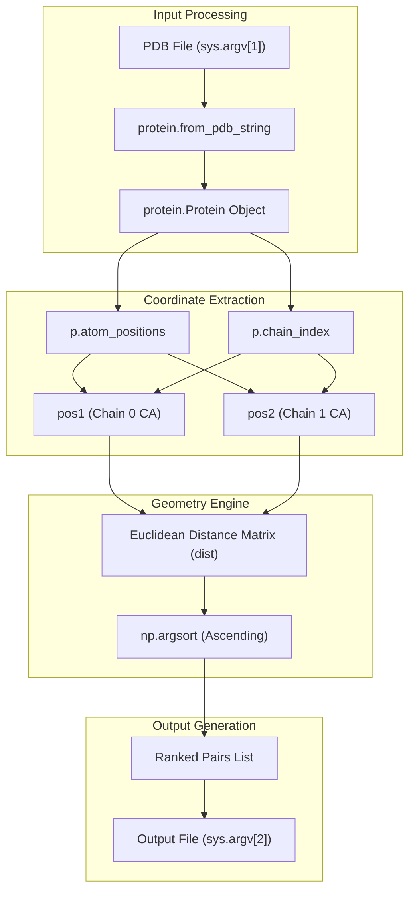
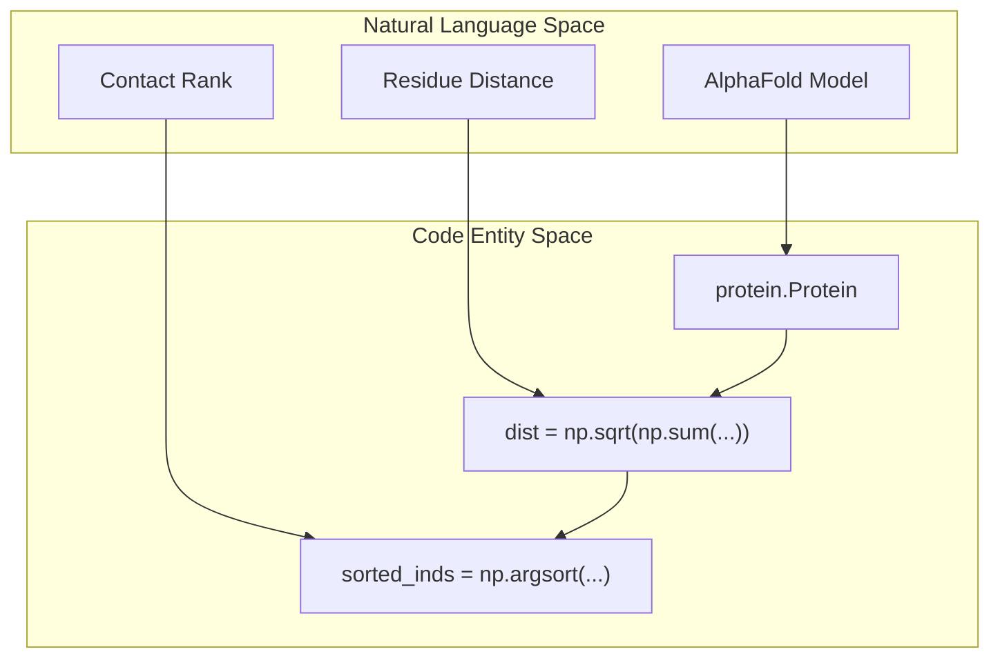

# AlphaFold Baseline Comparison

> **Relevant source files**
> * [alphafold/compute_alphafold_ranked_pairs.py](https://github.com/zw2x/glinter/blob/8871ca11/alphafold/compute_alphafold_ranked_pairs.py)

The `compute_alphafold_ranked_pairs.py` script serves as a benchmarking utility within the `alphafold/` directory. Its primary purpose is to derive a "ground truth" or baseline contact ranking directly from the 3D coordinates of an AlphaFold-predicted structure. This allows for a direct comparison between GLINTER's graph-based contact predictions and the physical proximity of residues in AlphaFold's final output models.

### Implementation and Data Flow

The script implements a straightforward Euclidean distance calculation between the $C\alpha$ atoms of two protein chains. It bypasses the complex neural network inference used by GLINTER, instead treating the AlphaFold PDB output as a static geometric object to extract inter-chain residue pairs sorted by distance.

#### Coordinate Extraction

The script utilizes the `alphafold.common.protein` module to parse PDB files. It specifically targets the $C\alpha$ atom for each residue to represent the residue's position in 3D space.

* **PDB Parsing**: The script reads a PDB file provided as a command-line argument and converts it into a `protein.Protein` object using `protein.from_pdb_string` [alphafold/compute_alphafold_ranked_pairs.py L7-L9](https://github.com/zw2x/glinter/blob/8871ca11/alphafold/compute_alphafold_ranked_pairs.py#L7-L9)
* **Atom Filtering**: It identifies the index for $C\alpha$ atoms using the `residue_constants.atom_order` mapping [alphafold/compute_alphafold_ranked_pairs.py L11-L12](https://github.com/zw2x/glinter/blob/8871ca11/alphafold/compute_alphafold_ranked_pairs.py#L11-L12)
* **Chain Splitting**: The positions are partitioned based on the `chain_index` attribute of the protein object, separating the coordinates into `pos1` (Chain A) and `pos2` (Chain B) [alphafold/compute_alphafold_ranked_pairs.py L13-L14](https://github.com/zw2x/glinter/blob/8871ca11/alphafold/compute_alphafold_ranked_pairs.py#L13-L14)

#### Distance Computation and Ranking

Once coordinates are isolated, the script calculates the full pairwise distance matrix between the two chains.

* **Distance Matrix**: A broadcasted subtraction and square root sum of squares calculation is performed to generate a matrix `dist` of shape $(L_1, L_2)$, where $L$ is the number of residues in each chain [alphafold/compute_alphafold_ranked_pairs.py L15](https://github.com/zw2x/glinter/blob/8871ca11/alphafold/compute_alphafold_ranked_pairs.py#L15-L15)
* **Sorting**: The matrix is flattened, and `np.argsort` is used to find the indices of residue pairs in ascending order of distance (closest pairs first) [alphafold/compute_alphafold_ranked_pairs.py L16](https://github.com/zw2x/glinter/blob/8871ca11/alphafold/compute_alphafold_ranked_pairs.py#L16-L16)
* **Index Mapping**: The flattened indices are mapped back to the original 2D matrix coordinates `inds1` and `inds2` [alphafold/compute_alphafold_ranked_pairs.py L17-L18](https://github.com/zw2x/glinter/blob/8871ca11/alphafold/compute_alphafold_ranked_pairs.py#L17-L18)

**Sources:**

* [alphafold/compute_alphafold_ranked_pairs.py L1-L21](https://github.com/zw2x/glinter/blob/8871ca11/alphafold/compute_alphafold_ranked_pairs.py#L1-L21)

### Logic Flow Diagram

The following diagram illustrates the transformation from an AlphaFold PDB file to a ranked list of residue contacts.

**AlphaFold Baseline Generation Logic**

**Sources:**

* [alphafold/compute_alphafold_ranked_pairs.py L7-L21](https://github.com/zw2x/glinter/blob/8871ca11/alphafold/compute_alphafold_ranked_pairs.py#L7-L21)

### Code Entity Mapping

This diagram maps the natural language concepts of "Contact Ranking" to the specific variables and functions used in the script.

**System Entity Mapping**

**Sources:**

* [alphafold/compute_alphafold_ranked_pairs.py L9-L16](https://github.com/zw2x/glinter/blob/8871ca11/alphafold/compute_alphafold_ranked_pairs.py#L9-L16)

### Output Format

The script produces a text file where each line represents a residue pair across the interface, formatted for easy parsing by evaluation scripts like `check_topk.py`.

| Column | Description | Code Reference |
| --- | --- | --- |
| **Index 1** | 0-based residue index in Chain A | `i1` [alphafold/compute_alphafold_ranked_pairs.py L21](https://github.com/zw2x/glinter/blob/8871ca11/alphafold/compute_alphafold_ranked_pairs.py#L21-L21) |
| **Index 2** | 0-based residue index in Chain B | `i2` [alphafold/compute_alphafold_ranked_pairs.py L21](https://github.com/zw2x/glinter/blob/8871ca11/alphafold/compute_alphafold_ranked_pairs.py#L21-L21) |
| **Distance** | Euclidean distance in Angstroms (Å) | `dist[i1, i2]` [alphafold/compute_alphafold_ranked_pairs.py L21](https://github.com/zw2x/glinter/blob/8871ca11/alphafold/compute_alphafold_ranked_pairs.py#L21-L21) |

The output is sorted such that the residue pair with the smallest physical distance appears on the first line.

**Sources:**

* [alphafold/compute_alphafold_ranked_pairs.py L19-L21](https://github.com/zw2x/glinter/blob/8871ca11/alphafold/compute_alphafold_ranked_pairs.py#L19-L21)