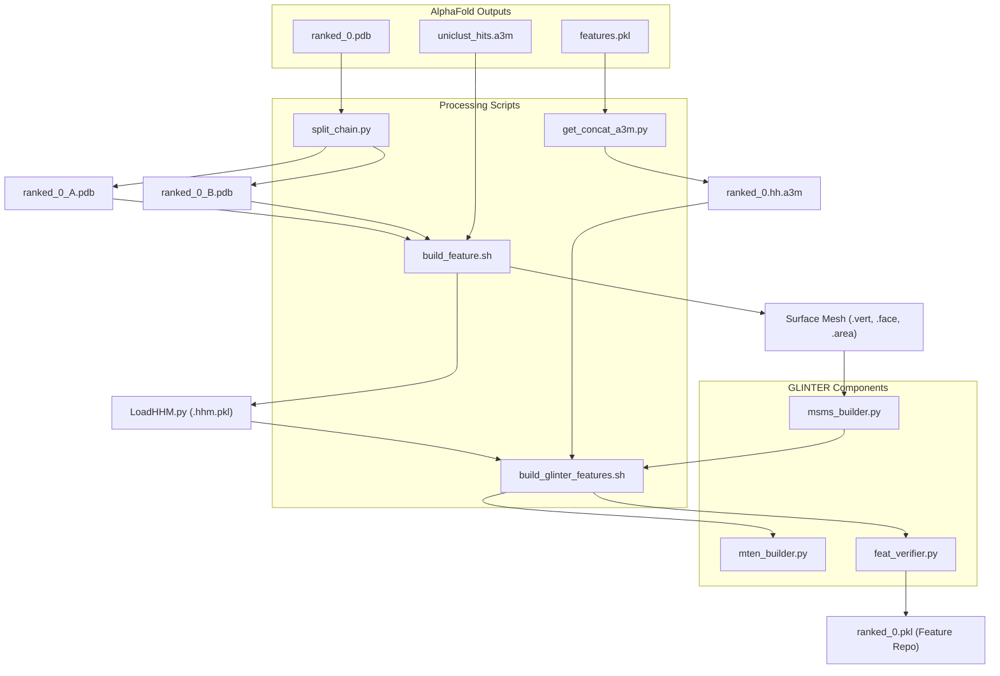
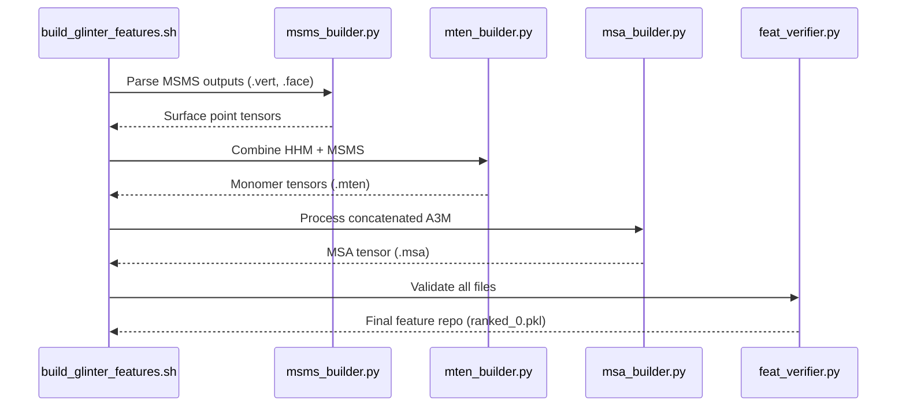

# AlphaFold Feature Extraction

> **Relevant source files**
> * [alphafold/build_feature.sh](https://github.com/zw2x/glinter/blob/8871ca11/alphafold/build_feature.sh)
> * [alphafold/build_glinter_features.sh](https://github.com/zw2x/glinter/blob/8871ca11/alphafold/build_glinter_features.sh)
> * [alphafold/get_concat_a3m.py](https://github.com/zw2x/glinter/blob/8871ca11/alphafold/get_concat_a3m.py)
> * [alphafold/run_glinter.sh](https://github.com/zw2x/glinter/blob/8871ca11/alphafold/run_glinter.sh)
> * [alphafold/split_chain.py](https://github.com/zw2x/glinter/blob/8871ca11/alphafold/split_chain.py)

The AlphaFold feature extraction pipeline enables GLINTER to perform downstream contact refinement on structures predicted by AlphaFold-Multimer. This process involves decomposing AlphaFold's unified multimer outputs (`ranked_0.pdb` and `features.pkl`) into the individual chain structures, MSAs, and geometric features required by the GLINTER `MSAModel`.

## Pipeline Overview

The integration workflow transforms AlphaFold-Multimer outputs into a format compatible with GLINTER's `DimerDataset`. This involves three primary stages:

1. **Structure Decomposition**: Splitting the multimer PDB into individual chain files.
2. **MSA Reformatting**: Extracting the paired MSA from AlphaFold's internal feature representation.
3. **Feature Generation**: Building MSMS surface meshes, monomer tensors (`.mten`), and verifying the final feature repository (`.pkl`).

### Data Flow Diagram

The following diagram illustrates the transformation from AlphaFold outputs to GLINTER-ready features.

"AlphaFold to GLINTER Feature Flow"

**Sources:** [alphafold/split_chain.py L1-L26](https://github.com/zw2x/glinter/blob/8871ca11/alphafold/split_chain.py#L1-L26)

 [alphafold/get_concat_a3m.py L1-L33](https://github.com/zw2x/glinter/blob/8871ca11/alphafold/get_concat_a3m.py#L1-L33)

 [alphafold/build_feature.sh L1-L56](https://github.com/zw2x/glinter/blob/8871ca11/alphafold/build_feature.sh#L1-L56)

 [alphafold/build_glinter_features.sh L1-L20](https://github.com/zw2x/glinter/blob/8871ca11/alphafold/build_glinter_features.sh#L1-L20)

---

## Structure Decomposition

AlphaFold-Multimer produces a single PDB file containing all chains. GLINTER's preprocessing pipeline requires individual chain files to generate surface meshes and monomer-specific embeddings.

The script `split_chain.py` utilizes the `alphafold.common.protein` module to parse the multimer PDB and filter atoms based on the `chain_index`.

* **Logic**: It iterates through unique `chain_index` values, creates a mask for the specific chain, and writes a new PDB file using `protein.to_pdb` [alphafold/split_chain.py L12-L26](https://github.com/zw2x/glinter/blob/8871ca11/alphafold/split_chain.py#L12-L26)
* **Naming Convention**: Output files are named using the prefix and the PDB chain identifier (e.g., `ranked_0_A.pdb`) [alphafold/split_chain.py L14-L15](https://github.com/zw2x/glinter/blob/8871ca11/alphafold/split_chain.py#L14-L15)

**Sources:** [alphafold/split_chain.py L5-L26](https://github.com/zw2x/glinter/blob/8871ca11/alphafold/split_chain.py#L5-L26)

---

## MSA Extraction and Reformatting

GLINTER requires a concatenated A3M file for its MSA Transformer (ESM) integration. Instead of re-running MSA searches, the pipeline extracts the sequences directly from AlphaFold's `features.pkl`.

### Paired MSA Generation

The script `get_concat_a3m.py` parses the `msa` and `asym_id` fields from the AlphaFold feature dictionary.

1. **Sequence Translation**: Converts AlphaFold's numerical `aatype` representation back to string sequences using `residue_constants.restypes_with_x_and_gap` [alphafold/get_concat_a3m.py L7-L12](https://github.com/zw2x/glinter/blob/8871ca11/alphafold/get_concat_a3m.py#L7-L12)
2. **Concatenation**: It takes the first 128 sequences from the MSA [alphafold/get_concat_a3m.py L21](https://github.com/zw2x/glinter/blob/8871ca11/alphafold/get_concat_a3m.py#L21-L21)  The first sequence (query) is formatted with a special description header indicating chain lengths [alphafold/get_concat_a3m.py L25-L28](https://github.com/zw2x/glinter/blob/8871ca11/alphafold/get_concat_a3m.py#L25-L28)
3. **Output**: Produces a `ranked_0.hh.a3m` file which is later converted to a `.msa` tensor [alphafold/build_glinter_features.sh L12-L17](https://github.com/zw2x/glinter/blob/8871ca11/alphafold/build_glinter_features.sh#L12-L17)

**Sources:** [alphafold/get_concat_a3m.py L14-L33](https://github.com/zw2x/glinter/blob/8871ca11/alphafold/get_concat_a3m.py#L14-L33)

 [alphafold/build_glinter_features.sh L12-L17](https://github.com/zw2x/glinter/blob/8871ca11/alphafold/build_glinter_features.sh#L12-L17)

---

## Geometric and Monomer Feature Building

Once the PDBs are split, `build_feature.sh` manages the generation of structural and evolutionary profiles for each monomer.

### MSMS Surface Generation

For each chain, the script performs the following steps:

1. **Protonation**: Uses `reduce` to trim and add hydrogens (`-HIS` flag) [alphafold/build_feature.sh L28-L29](https://github.com/zw2x/glinter/blob/8871ca11/alphafold/build_feature.sh#L28-L29)
2. **XYZRN Conversion**: Invokes `glinter/points/xyzrn.py` to format the PDB for MSMS [alphafold/build_feature.sh L33](https://github.com/zw2x/glinter/blob/8871ca11/alphafold/build_feature.sh#L33-L33)
3. **Mesh Calculation**: Runs `msms` with a density of 3.0 and probe radius of 1.5 to generate `.vert`, `.face`, and `.area` files [alphafold/build_feature.sh L35-L36](https://github.com/zw2x/glinter/blob/8871ca11/alphafold/build_feature.sh#L35-L36)

### Evolutionary Profiles (HHM)

If not already present, the script generates HMM profiles:

1. **HHmake**: Creates an `.hhm` file from the monomer's `uniclust_hits.a3m` [alphafold/build_feature.sh L7](https://github.com/zw2x/glinter/blob/8871ca11/alphafold/build_feature.sh#L7-L7)
2. **Parsing**: Uses `glinter/hhm/LoadHHM.py` to convert the profile into a serialized `.hhm.pkl` format [alphafold/build_feature.sh L8](https://github.com/zw2x/glinter/blob/8871ca11/alphafold/build_feature.sh#L8-L8)

**Sources:** [alphafold/build_feature.sh L6-L9](https://github.com/zw2x/glinter/blob/8871ca11/alphafold/build_feature.sh#L6-L9)

 [alphafold/build_feature.sh L27-L54](https://github.com/zw2x/glinter/blob/8871ca11/alphafold/build_feature.sh#L27-L54)

---

## Integration and Verification

The final step, orchestrated by `build_glinter_features.sh`, aggregates all processed components into a single repository for the model.

### Feature Assembly Workflow

"AlphaFold Feature Assembly"

1. **`msms_builder.py`**: Aggregates the raw MSMS mesh files into the `ranked_0` directory [alphafold/build_glinter_features.sh L7](https://github.com/zw2x/glinter/blob/8871ca11/alphafold/build_glinter_features.sh#L7-L7)
2. **`mten_builder.py`**: Fuses the HHM profiles and MSMS structural features into monomer-level tensors [alphafold/build_glinter_features.sh L9-L10](https://github.com/zw2x/glinter/blob/8871ca11/alphafold/build_glinter_features.sh#L9-L10)
3. **`msa_builder.py`**: Converts the concatenated A3M file into a GLINTER-compatible `.msa` file, applying filtering if specified [alphafold/build_glinter_features.sh L14-L15](https://github.com/zw2x/glinter/blob/8871ca11/alphafold/build_glinter_features.sh#L14-L15)
4. **`feat_verifier.py`**: Ensures all required files (`.mten`, `.msa`, PDBs) exist and compiles them into a single `ranked_0.pkl` dictionary [alphafold/build_glinter_features.sh L19-L20](https://github.com/zw2x/glinter/blob/8871ca11/alphafold/build_glinter_features.sh#L19-L20)

**Sources:** [alphafold/build_glinter_features.sh L7-L20](https://github.com/zw2x/glinter/blob/8871ca11/alphafold/build_glinter_features.sh#L7-L20)

## Running Inference

After feature extraction, `run_glinter.sh` executes the `msa_model.py` in two phases:

1. **ESM Attention Generation**: Runs the model with `--generate-esm-attention` to pre-compute and cache MSA Transformer embeddings [alphafold/run_glinter.sh L18](https://github.com/zw2x/glinter/blob/8871ca11/alphafold/run_glinter.sh#L18-L18)
2. **Contact Prediction**: Performs the full forward pass using the cached ESM features along with `heavy-atom-graph`, `surface-graph`, and `coordinate-ca-graph` [alphafold/run_glinter.sh L21](https://github.com/zw2x/glinter/blob/8871ca11/alphafold/run_glinter.sh#L21-L21)

**Sources:** [alphafold/run_glinter.sh L16-L23](https://github.com/zw2x/glinter/blob/8871ca11/alphafold/run_glinter.sh#L16-L23)