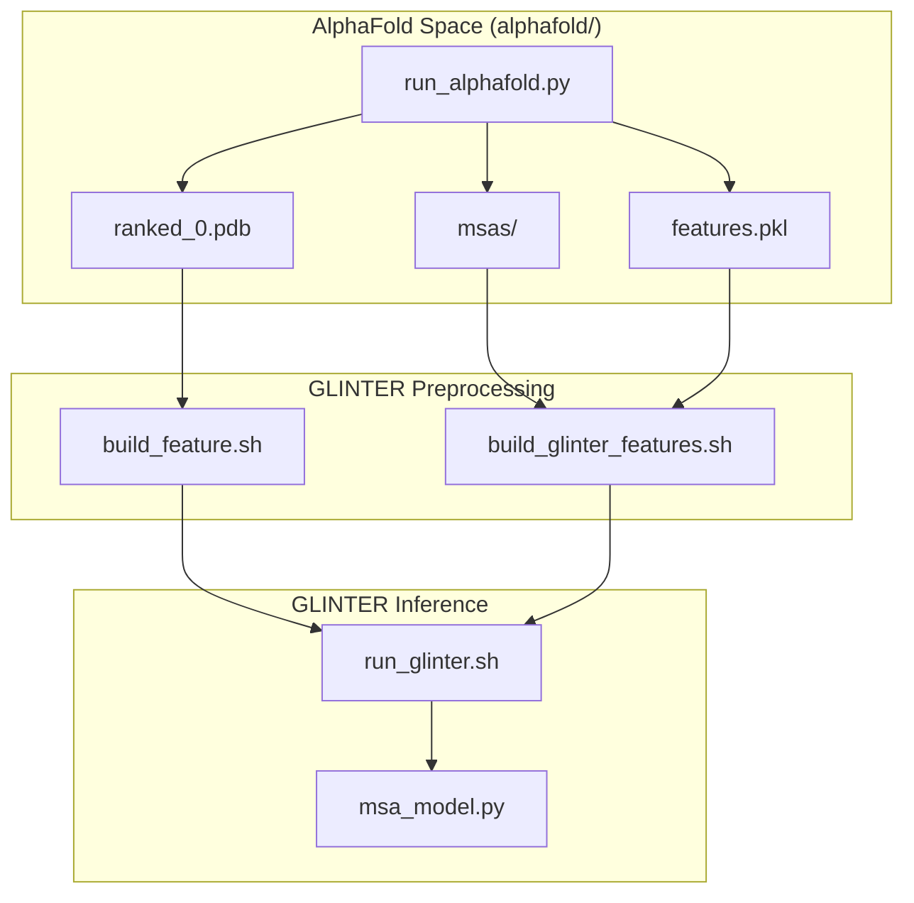
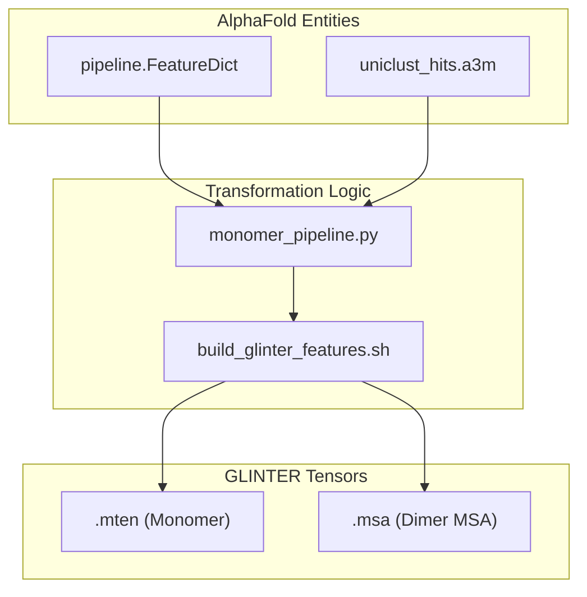

# AlphaFold-Multimer Integration

> **Relevant source files**
> * [alphafold/example_run.sh](https://github.com/zw2x/glinter/blob/8871ca11/alphafold/example_run.sh)
> * [alphafold/monomer_pipeline.py](https://github.com/zw2x/glinter/blob/8871ca11/alphafold/monomer_pipeline.py)
> * [alphafold/run_alphafold.py](https://github.com/zw2x/glinter/blob/8871ca11/alphafold/run_alphafold.py)

The `alphafold/` directory provides a specialized pipeline for using GLINTER as a downstream refinement and re-ranking tool for structures predicted by AlphaFold-Multimer. Instead of relying on experimental PDBs, this workflow consumes AlphaFold's computational outputs—specifically the top-ranked structural models and the evolutionary features generated during the AlphaFold run—to predict inter-protein contacts with higher precision.

### Integration Workflow Overview

The integration bridges the AlphaFold-Multimer prediction process with the GLINTER feature extraction pipeline. It is designed to minimize redundant computations by reusing MSAs (Multiple Sequence Alignments) generated by AlphaFold.

The typical execution flow follows these stages:

1. **AlphaFold Prediction**: Run a modified AlphaFold-Multimer script to generate structural models (`ranked_0.pdb`) and feature pickles (`features.pkl`) [alphafold/run_alphafold.py L109-L111](https://github.com/zw2x/glinter/blob/8871ca11/alphafold/run_alphafold.py#L109-L111)
2. **Monomer Feature Building**: Extract individual chains and build GLINTER-specific monomer features (MSMS surface, HHM profiles) [alphafold/example_run.sh L13-L14](https://github.com/zw2x/glinter/blob/8871ca11/alphafold/example_run.sh#L13-L14)
3. **GLINTER Feature Assembly**: Reformat AlphaFold's MSAs into the `A3M_CC` format required by GLINTER [alphafold/example_run.sh L16](https://github.com/zw2x/glinter/blob/8871ca11/alphafold/example_run.sh#L16-L16)
4. **Refined Inference**: Run GLINTER using the AlphaFold-predicted structure as the geometric template [alphafold/example_run.sh L18](https://github.com/zw2x/glinter/blob/8871ca11/alphafold/example_run.sh#L18-L18)

#### System Integration Diagram

This diagram illustrates how AlphaFold entities map to GLINTER inputs.

**Sources:** [alphafold/run_alphafold.py L76-L112](https://github.com/zw2x/glinter/blob/8871ca11/alphafold/run_alphafold.py#L76-L112)

 [alphafold/example_run.sh L7-L18](https://github.com/zw2x/glinter/blob/8871ca11/alphafold/example_run.sh#L7-L18)

---

### AlphaFold Feature Extraction

GLINTER leverages the `SimpleDataPipeline` to manage the alignment tools and assemble input features [alphafold/monomer_pipeline.py L38-L51](https://github.com/zw2x/glinter/blob/8871ca11/alphafold/monomer_pipeline.py#L38-L51)

 This pipeline specifically targets `uniclust30` hits to generate `.a3m` files that are compatible with both AlphaFold's internal reasoning and GLINTER's evolutionary encoding [alphafold/monomer_pipeline.py L70-L79](https://github.com/zw2x/glinter/blob/8871ca11/alphafold/monomer_pipeline.py#L70-L79)

Key differences from the standard GLINTER workflow:

* **Template Handling**: The integration uses `_make_empty_template_features` to bypass AlphaFold's structural template search, as GLINTER will serve as the structural evaluator [alphafold/monomer_pipeline.py L17-L36](https://github.com/zw2x/glinter/blob/8871ca11/alphafold/monomer_pipeline.py#L17-L36)
* **MSA Reuse**: The pipeline supports `--use-precomputed-msas` to avoid expensive re-searching of genetic databases if the AlphaFold run has already completed [alphafold/run_alphafold.py L66](https://github.com/zw2x/glinter/blob/8871ca11/alphafold/run_alphafold.py#L66-L66)

For details on how chains are split and tensors are built, see [AlphaFold Feature Extraction](/zw2x/glinter/5.1-alphafold-feature-extraction).

**Sources:** [alphafold/monomer_pipeline.py L38-L91](https://github.com/zw2x/glinter/blob/8871ca11/alphafold/monomer_pipeline.py#L38-L91)

 [alphafold/run_alphafold.py L56-L74](https://github.com/zw2x/glinter/blob/8871ca11/alphafold/run_alphafold.py#L56-L74)

---

### AlphaFold Baseline Comparison

A critical component of this integration is the ability to benchmark GLINTER's contact predictions against the raw spatial proximity of the AlphaFold model. The `compute_alphafold_ranked_pairs.py` utility (detailed in child pages) extracts $C\alpha$ coordinates from the `ranked_0.pdb` file to create a distance-based ranking of residue pairs.

This allows researchers to quantify the "refinement delta"—the improvement in contact precision achieved by GLINTER's multi-modal graph learning over AlphaFold's end-to-end geometric output.

For details on coordinate extraction and baseline generation, see [AlphaFold Baseline Comparison](/zw2x/glinter/5.2-alphafold-baseline-comparison).

#### Data Flow: AlphaFold to GLINTER Features

The following diagram maps the code entities involved in transforming AlphaFold outputs into GLINTER-compatible tensors.

**Sources:** [alphafold/monomer_pipeline.py L54-L91](https://github.com/zw2x/glinter/blob/8871ca11/alphafold/monomer_pipeline.py#L54-L91)

 [alphafold/run_alphafold.py L123-L130](https://github.com/zw2x/glinter/blob/8871ca11/alphafold/run_alphafold.py#L123-L130)

---

### Execution Entry Point

The primary entry point for this integration is `run_alphafold.py`, which wraps the `predict_structure` function [alphafold/run_alphafold.py L76](https://github.com/zw2x/glinter/blob/8871ca11/alphafold/run_alphafold.py#L76-L76)

 This script manages the transition from sequence input to the final ranked PDBs that GLINTER subsequently processes [alphafold/run_alphafold.py L178-L188](https://github.com/zw2x/glinter/blob/8871ca11/alphafold/run_alphafold.py#L178-L188)

**Sources:** [alphafold/run_alphafold.py L76-L201](https://github.com/zw2x/glinter/blob/8871ca11/alphafold/run_alphafold.py#L76-L201)

 [alphafold/example_run.sh L7-L11](https://github.com/zw2x/glinter/blob/8871ca11/alphafold/example_run.sh#L7-L11)