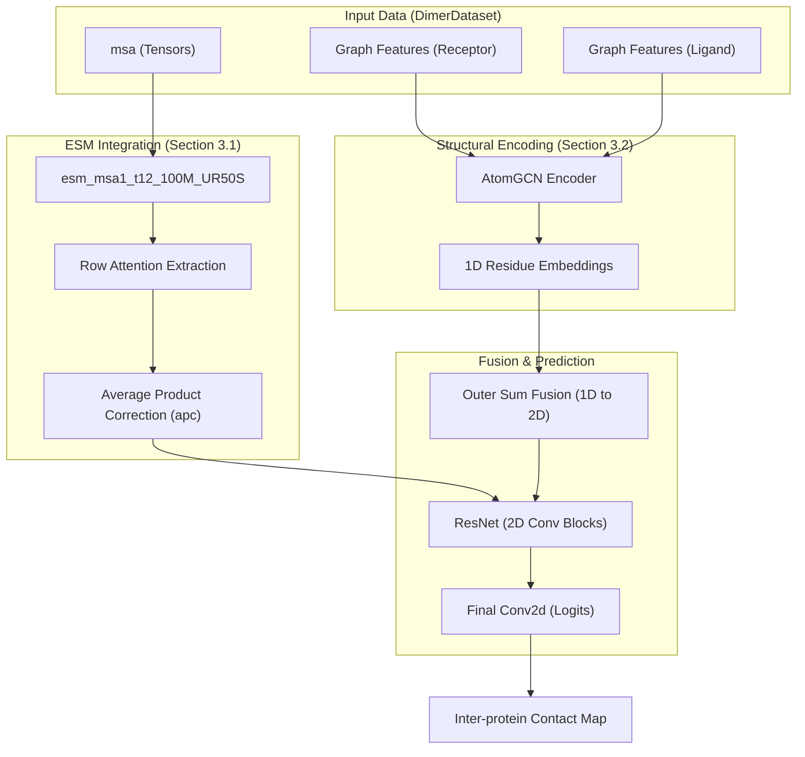

# Core Model Architecture

> **Relevant source files**
> * [glinter/models/__init__.py](https://github.com/zw2x/glinter/blob/8871ca11/glinter/models/__init__.py)
> * [glinter/models/checkpoint_utils.py](https://github.com/zw2x/glinter/blob/8871ca11/glinter/models/checkpoint_utils.py)
> * [glinter/models/msa_model.py](https://github.com/zw2x/glinter/blob/8871ca11/glinter/models/msa_model.py)

The `MSAModel` is the central neural network of GLINTER, designed to predict inter-protein residue contacts by fusing multi-modal features. It integrates evolutionary information from Multiple Sequence Alignments (MSAs) with geometric and structural information derived from protein graphs.

The architecture follows a modular design where 1D structural features and 2D evolutionary features are processed independently before being fused into a residual network for final contact probability estimation.

### System Overview Diagram

The following diagram illustrates how the `MSAModel` [glinter/models/msa_model.py L30-L78](https://github.com/zw2x/glinter/blob/8871ca11/glinter/models/msa_model.py#L30-L78)

 orchestrates the flow of data from raw inputs to the final prediction.

**Sources:**

* `MSAModel` definition: [glinter/models/msa_model.py L30-L46](https://github.com/zw2x/glinter/blob/8871ca11/glinter/models/msa_model.py#L30-L46)
* Feature processing logic: [glinter/models/msa_model.py L164-L250](https://github.com/zw2x/glinter/blob/8871ca11/glinter/models/msa_model.py#L164-L250)
* AtomGCN integration: [glinter/models/msa_model.py L156-L160](https://github.com/zw2x/glinter/blob/8871ca11/glinter/models/msa_model.py#L156-L160)

---

### ESM Protein Language Model Integration

GLINTER leverages the pre-trained **ESM MSA Transformer** (`esm_msa1_t12_100M_UR50S`) to capture co-evolutionary signals. Instead of using the raw hidden states, the model extracts **row attentions** from the transformer layers. These attentions represent residue-residue interactions within the MSA.

Key operations include:

* **Attention Extraction**: Retrieving row-wise attention maps for the concatenated dimer MSA [glinter/models/msa_model.py L171](https://github.com/zw2x/glinter/blob/8871ca11/glinter/models/msa_model.py#L171-L171)
* **Symmetrization & APC**: The attention maps are symmetrized and processed via Average Product Correction (`apc`) to reduce background noise and highlight true evolutionary contacts [glinter/models/msa_model.py L14-L23](https://github.com/zw2x/glinter/blob/8871ca11/glinter/models/msa_model.py#L14-L23)  [glinter/models/msa_model.py L193-L196](https://github.com/zw2x/glinter/blob/8871ca11/glinter/models/msa_model.py#L193-L196)

For details, see [ESM Protein Language Model Integration](/zw2x/glinter/3.1-esm-protein-language-model-integration).

**Sources:**

* `apc` function: [glinter/models/msa_model.py L14-L23](https://github.com/zw2x/glinter/blob/8871ca11/glinter/models/msa_model.py#L14-L23)
* ESM loading: [glinter/models/msa_model.py L9](https://github.com/zw2x/glinter/blob/8871ca11/glinter/models/msa_model.py#L9-L9)  [glinter/models/msa_model.py L58-L62](https://github.com/zw2x/glinter/blob/8871ca11/glinter/models/msa_model.py#L58-L62)

---

### Geometric Graph Encoder (AtomGCN)

Structural features are encoded using `AtomGCN`, a multi-graph grouping network. The model represents each protein monomer using different levels of granularity to capture local and global geometric contexts.

The `_build_encoder_1d` method configures the following graph types based on the input flags:

* **Cα-graph**: Coarse-grained representation using Alpha-carbon coordinates [glinter/models/msa_model.py L105-L117](https://github.com/zw2x/glinter/blob/8871ca11/glinter/models/msa_model.py#L105-L117)
* **Atom-graph**: Fine-grained representation including all heavy atoms [glinter/models/msa_model.py L119-L129](https://github.com/zw2x/glinter/blob/8871ca11/glinter/models/msa_model.py#L119-L129)
* **Surface-graph**: Captures the solvent-accessible surface geometry generated by MSMS [glinter/models/msa_model.py L131-L141](https://github.com/zw2x/glinter/blob/8871ca11/glinter/models/msa_model.py#L131-L141)

The output is a fixed-size structural embedding for each residue, which is later fused with the 2D evolutionary features.

For details, see [Geometric Graph Encoder (AtomGCN)](/zw2x/glinter/3.2-geometric-graph-encoder-(atomgcn)).

**Sources:**

* `_build_encoder_1d` implementation: [glinter/models/msa_model.py L80-L162](https://github.com/zw2x/glinter/blob/8871ca11/glinter/models/msa_model.py#L80-L162)
* `AtomGCN` class usage: [glinter/models/msa_model.py L156-L160](https://github.com/zw2x/glinter/blob/8871ca11/glinter/models/msa_model.py#L156-L160)

---

### Feature Fusion and Prediction Head

The final stage of the `MSAModel` fuses the 1D structural embeddings and 2D evolutionary attentions into a unified 2D representation.

| Component | Description | Code Reference |
| --- | --- | --- |
| **Outer Sum** | Converts 1D residue embeddings ($L \times D$) into a 2D map ($L \times L \times 2D$) by summing feature vectors for every residue pair. | [glinter/models/msa_model.py L236-L242](https://github.com/zw2x/glinter/blob/8871ca11/glinter/models/msa_model.py#L236-L242) |
| **ResNet** | A series of 2D convolutional blocks (BasicBlock2d) that process the fused features to learn spatial contact patterns. | [glinter/models/msa_model.py L75-L76](https://github.com/zw2x/glinter/blob/8871ca11/glinter/models/msa_model.py#L75-L76) |
| **FC Head** | A final $1 \times 1$ convolution layer that maps the hidden dimensions to 2 output channels (contact vs. non-contact). | [glinter/models/msa_model.py L77](https://github.com/zw2x/glinter/blob/8871ca11/glinter/models/msa_model.py#L77-L77) |

**Sources:**

* ResNet initialization: [glinter/models/msa_model.py L75-L77](https://github.com/zw2x/glinter/blob/8871ca11/glinter/models/msa_model.py#L75-L77)
* Fusion logic in forward pass: [glinter/models/msa_model.py L236-L250](https://github.com/zw2x/glinter/blob/8871ca11/glinter/models/msa_model.py#L236-L250)

---

### Dataset and Data Loading

The `DimerDataset` is responsible for preparing the heterogeneous data required by `MSAModel`. It handles the tokenization of MSAs for the ESM module and the construction of graph objects (nodes, edges, and coordinates) for `AtomGCN`.

A specialized `Collater` is used to batch these different data types (tensors and graphs) efficiently for GPU processing.

For details, see [Dataset and Data Loading](/zw2x/glinter/3.3-dataset-and-data-loading).

**Sources:**

* Model argument parsing for features: [glinter/models/msa_model.py L32-L42](https://github.com/zw2x/glinter/blob/8871ca11/glinter/models/msa_model.py#L32-L42)
* Data dictionary usage in forward pass: [glinter/models/msa_model.py L164-L180](https://github.com/zw2x/glinter/blob/8871ca11/glinter/models/msa_model.py#L164-L180)