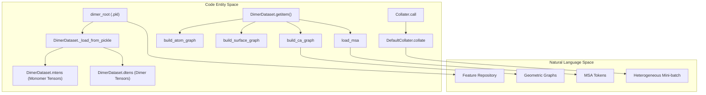
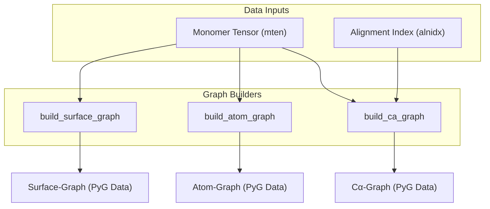

# Dataset and Data Loading

> **Relevant source files**
> * [glinter/dataset/__init__.py](https://github.com/zw2x/glinter/blob/8871ca11/glinter/dataset/__init__.py)
> * [glinter/dataset/_dist.py](https://github.com/zw2x/glinter/blob/8871ca11/glinter/dataset/_dist.py)
> * [glinter/dataset/_feature.py](https://github.com/zw2x/glinter/blob/8871ca11/glinter/dataset/_feature.py)
> * [glinter/dataset/_sequence.py](https://github.com/zw2x/glinter/blob/8871ca11/glinter/dataset/_sequence.py)
> * [glinter/dataset/collater.py](https://github.com/zw2x/glinter/blob/8871ca11/glinter/dataset/collater.py)
> * [glinter/dataset/dimer_dataset.py](https://github.com/zw2x/glinter/blob/8871ca11/glinter/dataset/dimer_dataset.py)
> * [glinter/dataset/msa_utils.py](https://github.com/zw2x/glinter/blob/8871ca11/glinter/dataset/msa_utils.py)

The GLINTER dataset and data loading subsystem is responsible for transforming preprocessed feature tensors and protein structures into heterogeneous graph objects and tokenized MSA tensors suitable for deep learning. It manages the loading of the feature repository, handles on-the-fly graph construction for geometric encoders, and implements a custom collater to batch complex nested data structures.

## Data Flow Overview

The loading process starts with a pickled feature repository containing monomer and dimer tensors. `DimerDataset` iterates through these entries, constructing structural graphs and loading MSA data.

### Data Ingestion and Transformation

The following diagram illustrates the flow from raw feature files to the batched tensors consumed by `MSAModel`.

**Sources:** [glinter/dataset/dimer_dataset.py L22-L62](https://github.com/zw2x/glinter/blob/8871ca11/glinter/dataset/dimer_dataset.py#L22-L62)

 [glinter/dataset/dimer_dataset.py L159-L220](https://github.com/zw2x/glinter/blob/8871ca11/glinter/dataset/dimer_dataset.py#L159-L220)

 [glinter/dataset/collater.py L39-L64](https://github.com/zw2x/glinter/blob/8871ca11/glinter/dataset/collater.py#L39-L64)

---

## DimerDataset Implementation

The `DimerDataset` class serves as the primary data provider. It manages monomeric structural features (`mtens`) and dimeric evolutionary features (`dtens`) separately to optimize memory usage when multiple dimers share the same monomeric components [glinter/dataset/dimer_dataset.py L73-L90](https://github.com/zw2x/glinter/blob/8871ca11/glinter/dataset/dimer_dataset.py#L73-L90)

### Key Functions

* `_load_from_pickle`: Parses the main feature repository, populating internal dictionaries with sequence maps and alignment indices [glinter/dataset/dimer_dataset.py L54-L98](https://github.com/zw2x/glinter/blob/8871ca11/glinter/dataset/dimer_dataset.py#L54-L98)
* `getitem`: The core retrieval logic. It performs on-the-fly graph construction based on the requested features (e.g., `ca-graph`, `atom-graph`) [glinter/dataset/dimer_dataset.py L159-L210](https://github.com/zw2x/glinter/blob/8871ca11/glinter/dataset/dimer_dataset.py#L159-L210)
* `_add_noise`: If training mode is active, it applies Gaussian noise to atom positions for data augmentation [glinter/dataset/dimer_dataset.py L129-L139](https://github.com/zw2x/glinter/blob/8871ca11/glinter/dataset/dimer_dataset.py#L129-L139)

### Feature Selection

Feature loading is controlled by the `DimerFeature` class, which validates requested feature groups such as `ccm`, `esm`, `atom-graph`, and `surface-graph` [glinter/dataset/_feature.py L1-L35](https://github.com/zw2x/glinter/blob/8871ca11/glinter/dataset/_feature.py#L1-L35)

**Sources:** [glinter/dataset/dimer_dataset.py L22-L151](https://github.com/zw2x/glinter/blob/8871ca11/glinter/dataset/dimer_dataset.py#L22-L151)

 [glinter/dataset/_feature.py L1-L35](https://github.com/zw2x/glinter/blob/8871ca11/glinter/dataset/_feature.py#L1-L35)

---

## MSA Loading and Tokenization

MSA data is processed via `load_msa` in `msa_utils.py`. This function handles sequence concatenation, length filtering, and tokenization for the ESM-MSA-1 transformer.

| Feature | Implementation Detail | Code Pointer |
| --- | --- | --- |
| **Pre-cutting** | Slices MSA tensors based on residue alignment indices (`recidx`, `ligidx`) | [glinter/dataset/msa_utils.py L29-L36](https://github.com/zw2x/glinter/blob/8871ca11/glinter/dataset/msa_utils.py#L29-L36) |
| **Row Sampling** | Truncates MSA depth to `max_row` to manage memory | [glinter/dataset/msa_utils.py L41-L42](https://github.com/zw2x/glinter/blob/8871ca11/glinter/dataset/msa_utils.py#L41-L42) |
| **ESM Tokenization** | Prepends `<CLS>` and appends `<EOS>` tokens using the ESM alphabet | [glinter/dataset/msa_utils.py L45-L65](https://github.com/zw2x/glinter/blob/8871ca11/glinter/dataset/msa_utils.py#L45-L65) |
| **Translation Table** | Maps amino acid indices to ESM-specific tokens via `.tt` files | [glinter/dataset/msa_utils.py L3-L15](https://github.com/zw2x/glinter/blob/8871ca11/glinter/dataset/msa_utils.py#L3-L15) |

**Sources:** [glinter/dataset/msa_utils.py L1-L66](https://github.com/zw2x/glinter/blob/8871ca11/glinter/dataset/msa_utils.py#L1-L66)

---

## Graph Construction

GLINTER builds multiple graph types to capture different structural granularities. These are constructed within `getitem` using utilities from `_geometric_graph.py`.

* **Cα-Graph**: Nodes represent Cα atoms; edges are based on `cag-radius` [glinter/dataset/dimer_dataset.py L196-L202](https://github.com/zw2x/glinter/blob/8871ca11/glinter/dataset/dimer_dataset.py#L196-L202)
* **Atom-Graph**: Finer resolution graph including all heavy atoms [glinter/dataset/dimer_dataset.py L214-L219](https://github.com/zw2x/glinter/blob/8871ca11/glinter/dataset/dimer_dataset.py#L214-L219)
* **Surface-Graph**: Nodes represent surface points generated by MSMS [glinter/dataset/dimer_dataset.py L221-L226](https://github.com/zw2x/glinter/blob/8871ca11/glinter/dataset/dimer_dataset.py#L221-L226)

**Sources:** [glinter/dataset/dimer_dataset.py L189-L230](https://github.com/zw2x/glinter/blob/8871ca11/glinter/dataset/dimer_dataset.py#L189-L230)

---

## Batching and Collation

Because GLINTER samples contain a mix of standard PyTorch tensors (MSAs), PyTorch Geometric `Data` objects (Graphs), and nested dictionaries, a specialized `Collater` is required.

### Collater Logic

The `Collater` class [glinter/dataset/collater.py L39-L64](https://github.com/zw2x/glinter/blob/8871ca11/glinter/dataset/collater.py#L39-L64)

 acts as a wrapper around `DefaultCollater` [glinter/dataset/collater.py L10-L37](https://github.com/zw2x/glinter/blob/8871ca11/glinter/dataset/collater.py#L10-L37)

 It recursively traverses dictionaries and lists to batch elements:

1. **Dictionaries**: Collates values for the same key across the batch into a new dictionary [glinter/dataset/collater.py L46-L55](https://github.com/zw2x/glinter/blob/8871ca11/glinter/dataset/collater.py#L46-L55)
2. **PyG Data**: Uses `Batch.from_data_list` to merge individual graphs into a single disjoint batch graph [glinter/dataset/collater.py L16-L17](https://github.com/zw2x/glinter/blob/8871ca11/glinter/dataset/collater.py#L16-L17)
3. **Tensors**: Uses standard `torch.utils.data.dataloader.default_collate` [glinter/dataset/collater.py L18-L19](https://github.com/zw2x/glinter/blob/8871ca11/glinter/dataset/collater.py#L18-L19)

**Sources:** [glinter/dataset/collater.py L1-L64](https://github.com/zw2x/glinter/blob/8871ca11/glinter/dataset/collater.py#L1-L64)