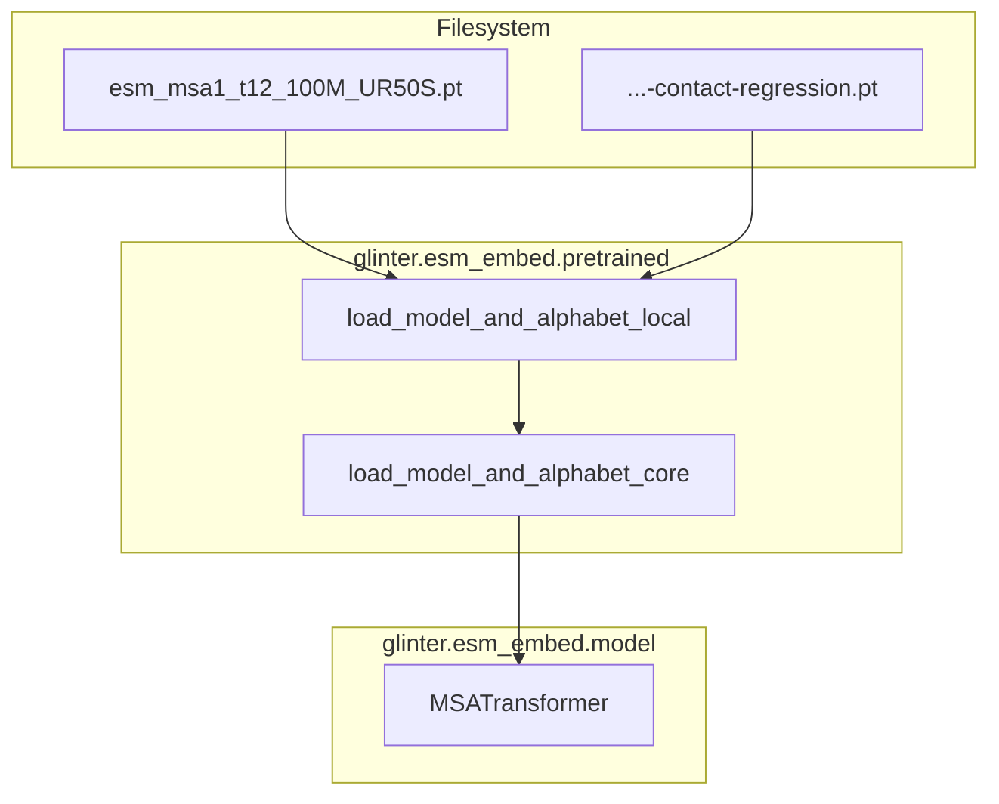
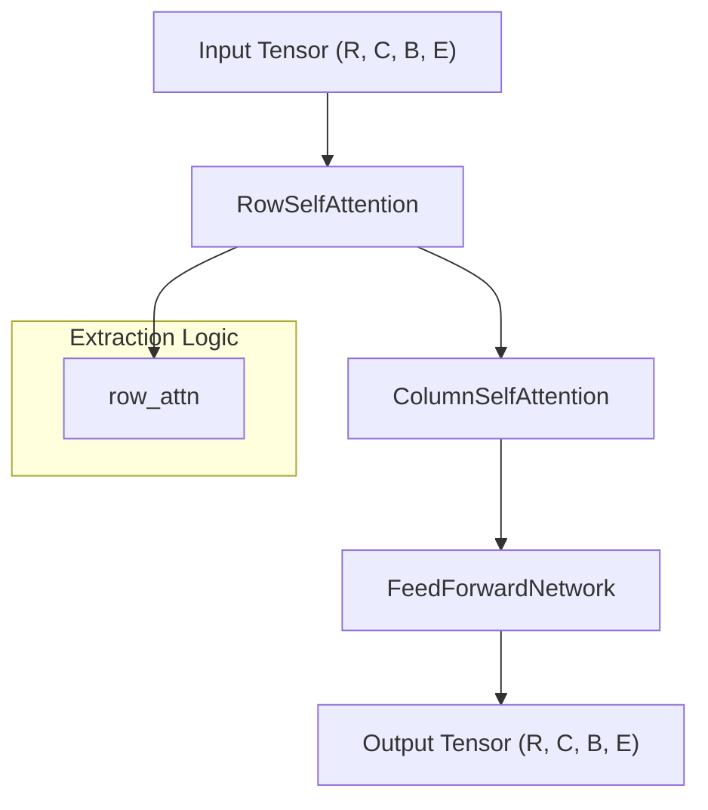

# ESM Protein Language Model Integration

> **Relevant source files**
> * [esm/esm_msa1_t12_100M_UR50S.tt](https://github.com/zw2x/glinter/blob/8871ca11/esm/esm_msa1_t12_100M_UR50S.tt)
> * [glinter/esm_embed/__init__.py](https://github.com/zw2x/glinter/blob/8871ca11/glinter/esm_embed/__init__.py)
> * [glinter/esm_embed/axial_attention.py](https://github.com/zw2x/glinter/blob/8871ca11/glinter/esm_embed/axial_attention.py)
> * [glinter/esm_embed/constants.py](https://github.com/zw2x/glinter/blob/8871ca11/glinter/esm_embed/constants.py)
> * [glinter/esm_embed/data.py](https://github.com/zw2x/glinter/blob/8871ca11/glinter/esm_embed/data.py)
> * [glinter/esm_embed/model.py](https://github.com/zw2x/glinter/blob/8871ca11/glinter/esm_embed/model.py)
> * [glinter/esm_embed/modules.py](https://github.com/zw2x/glinter/blob/8871ca11/glinter/esm_embed/modules.py)
> * [glinter/esm_embed/multihead_attention.py](https://github.com/zw2x/glinter/blob/8871ca11/glinter/esm_embed/multihead_attention.py)
> * [glinter/esm_embed/pretrained.py](https://github.com/zw2x/glinter/blob/8871ca11/glinter/esm_embed/pretrained.py)

The GLINTER model leverages the **ESM MSA Transformer** (`esm_msa1_t12_100M_UR50S`) to extract deep evolutionary features from Multiple Sequence Alignments (MSAs). This integration is central to GLINTER's ability to capture co-evolutionary signals between interacting protein chains. The ESM implementation is bundled within the codebase and modified to facilitate row-attention extraction and specific normalization requirements.

## Model Loading and Initialization

GLINTER utilizes a specialized loading mechanism to initialize the MSA Transformer from pre-trained weights. The loading process handles architecture detection, state-dict mapping, and the optional loading of contact regression weights.

### Key Loading Functions

* **`load_esm_model`**: Entry point that resolves the local path to the `.pt` model file [glinter/esm_embed/pretrained.py L14-L15](https://github.com/zw2x/glinter/blob/8871ca11/glinter/esm_embed/pretrained.py#L14-L15)
* **`load_model_and_alphabet_core`**: The core logic that identifies the architecture (e.g., `msa_transformer`) and maps the saved state dictionary to the `MSATransformer` class [glinter/esm_embed/pretrained.py L33-L66](https://github.com/zw2x/glinter/blob/8871ca11/glinter/esm_embed/pretrained.py#L33-L66)
* **`Alphabet.from_architecture`**: Creates the appropriate tokenization object based on the model type [glinter/esm_embed/data.py L69-L95](https://github.com/zw2x/glinter/blob/8871ca11/glinter/esm_embed/data.py#L69-L95)

### Model Loading Data Flow

The following diagram illustrates how raw weights are transformed into a functional `MSATransformer` instance.

**Diagram: ESM Initialization Workflow**

Sources: [glinter/esm_embed/pretrained.py L17-L31](https://github.com/zw2x/glinter/blob/8871ca11/glinter/esm_embed/pretrained.py#L17-L31)

 [glinter/esm_embed/pretrained.py L56-L66](https://github.com/zw2x/glinter/blob/8871ca11/glinter/esm_embed/pretrained.py#L56-L66)

---

## MSA Transformer Architecture

The core of the integration is the `MSATransformer` class, which implements an axial attention mechanism. Unlike standard Transformers that attend to a 1D sequence, the MSA Transformer operates on a 2D MSA grid (Rows x Columns).

### Axial Attention Layers

The model consists of 12 layers of `AxialTransformerLayer` [glinter/esm_embed/modules.py L129-L142](https://github.com/zw2x/glinter/blob/8871ca11/glinter/esm_embed/modules.py#L129-L142)

 Each layer alternates between:

1. **Row Attention**: Computes attention across the sequence length (columns) for each sequence in the MSA [glinter/esm_embed/axial_attention.py L11-L12](https://github.com/zw2x/glinter/blob/8871ca11/glinter/esm_embed/axial_attention.py#L11-L12)
2. **Column Attention**: Computes attention across different sequences (rows) for each residue position [glinter/esm_embed/axial_attention.py L136-L137](https://github.com/zw2x/glinter/blob/8871ca11/glinter/esm_embed/axial_attention.py#L136-L137)

### Data Flow within AxialTransformerLayer

The `forward` pass of the axial layer allows for the extraction of `row_attn`, which is critical for GLINTER's downstream contact prediction.

**Diagram: AxialTransformerLayer Internal Flow**

Sources: [glinter/esm_embed/modules.py L193-L203](https://github.com/zw2x/glinter/blob/8871ca11/glinter/esm_embed/modules.py#L193-L203)

 [glinter/esm_embed/axial_attention.py L116-L133](https://github.com/zw2x/glinter/blob/8871ca11/glinter/esm_embed/axial_attention.py#L116-L133)

---

## Row Attention and Contact Prediction

GLINTER specifically extracts row attention weights to identify co-evolving residue pairs. This involves several post-processing steps to convert raw attention into usable contact features.

### Attention Extraction

In the `MSATransformer.forward` method, if `need_head_weights` is enabled, the model captures the attention weights from the `RowSelfAttention` modules across all layers [glinter/esm_embed/modules.py L181-L210](https://github.com/zw2x/glinter/blob/8871ca11/glinter/esm_embed/modules.py#L181-L210)

### APC (Average Product Correction)

To reduce noise and phylogenetic bias in the attention maps, GLINTER applies `apc` (Average Product Correction). This function calculates the mean attention across rows and columns to normalize the signal [glinter/esm_embed/modules.py L32-L41](https://github.com/zw2x/glinter/blob/8871ca11/glinter/esm_embed/modules.py#L32-L41)

### Symmetrization

Since residue contacts are undirected, the attention maps are symmetrized using the `symmetrize` function, which computes $X + X^T$ [glinter/esm_embed/modules.py L28-L30](https://github.com/zw2x/glinter/blob/8871ca11/glinter/esm_embed/modules.py#L28-L30)

| Operation | Function | Purpose |
| --- | --- | --- |
| **Extraction** | `MSATransformer.forward` | Captures `row_attn` from each axial layer. |
| **Symmetrization** | `symmetrize` | Ensures $A_{ij} = A_{ji}$ for contact maps. |
| **APC** | `apc` | Normalizes attention by subtracting background signal. |

Sources: [glinter/esm_embed/modules.py L28-L41](https://github.com/zw2x/glinter/blob/8871ca11/glinter/esm_embed/modules.py#L28-L41)

 [glinter/esm_embed/model.py L114-L188](https://github.com/zw2x/glinter/blob/8871ca11/glinter/esm_embed/model.py#L114-L188)

---

## Bundled ESM Implementation

GLINTER includes a modified version of the ESM library within `glinter/esm_embed/`. This local version ensures compatibility and provides specific hooks for GLINTER's multi-modal architecture.

### Key Components in glinter/esm_embed/

* **`Alphabet`**: Handles tokenization of amino acids and MSA-specific tokens (like `<cls>`, `<pad>`, and `<mask_idx>`) [glinter/esm_embed/data.py L15-L45](https://github.com/zw2x/glinter/blob/8871ca11/glinter/esm_embed/data.py#L15-L45)
* **`MultiheadAttention`**: A modified implementation of the standard attention mechanism that supports `need_head_weights` for capturing the 2D maps [glinter/esm_embed/multihead_attention.py L63-L162](https://github.com/zw2x/glinter/blob/8871ca11/glinter/esm_embed/multihead_attention.py#L63-L162)
* **`ESM1LayerNorm`**: A custom LayerNorm implementation that follows the TensorFlow style (epsilon inside the square root), ensuring parity with the original pre-trained weights [glinter/esm_embed/modules.py L45-L66](https://github.com/zw2x/glinter/blob/8871ca11/glinter/esm_embed/modules.py#L45-L66)
* **`proteinseq_toks`**: Defines the standard amino acid vocabulary used for indexing sequences [glinter/esm_embed/constants.py L6-L8](https://github.com/zw2x/glinter/blob/8871ca11/glinter/esm_embed/constants.py#L6-L8)

### Path Resolution

The library uses `ESMROOT` to locate the model weights relative to the package installation [glinter/esm_embed/__init__.py L13](https://github.com/zw2x/glinter/blob/8871ca11/glinter/esm_embed/__init__.py#L13-L13)

Sources: [glinter/esm_embed/data.py L15-L45](https://github.com/zw2x/glinter/blob/8871ca11/glinter/esm_embed/data.py#L15-L45)

 [glinter/esm_embed/modules.py L45-L66](https://github.com/zw2x/glinter/blob/8871ca11/glinter/esm_embed/modules.py#L45-L66)

 [glinter/esm_embed/constants.py L6-L8](https://github.com/zw2x/glinter/blob/8871ca11/glinter/esm_embed/constants.py#L6-L8)