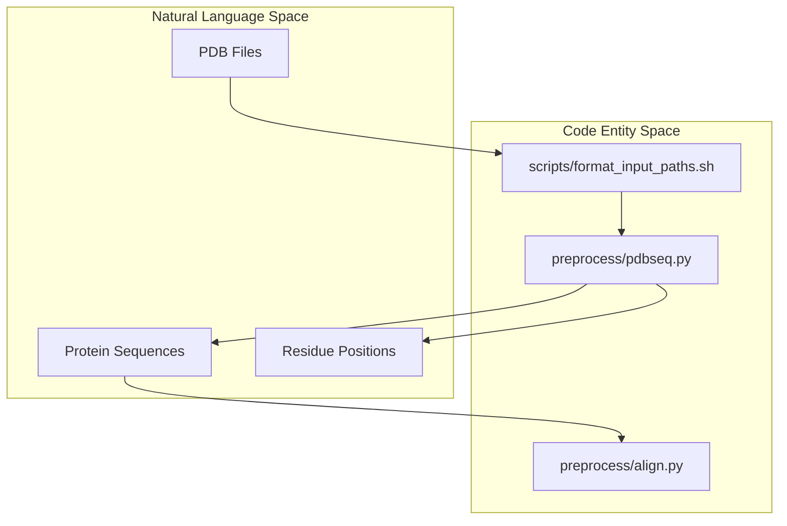
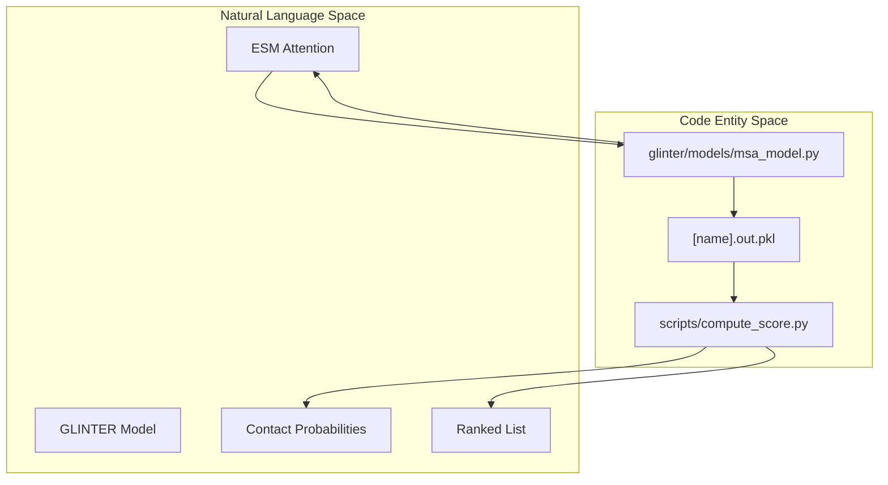

# End-to-End Prediction Workflow

> **Relevant source files**
> * [scripts/build_features.sh](https://github.com/zw2x/glinter/blob/8871ca11/scripts/build_features.sh)
> * [scripts/build_hetero.sh](https://github.com/zw2x/glinter/blob/8871ca11/scripts/build_hetero.sh)
> * [scripts/build_homo.sh](https://github.com/zw2x/glinter/blob/8871ca11/scripts/build_homo.sh)
> * [scripts/compute_score.py](https://github.com/zw2x/glinter/blob/8871ca11/scripts/compute_score.py)
> * [scripts/format_input_paths.sh](https://github.com/zw2x/glinter/blob/8871ca11/scripts/format_input_paths.sh)

The GLINTER prediction workflow transforms raw protein structures (PDB files) into a ranked list of inter-protein residue contacts. The pipeline integrates evolutionary information from Multiple Sequence Alignments (MSAs), geometric features from surface meshes, and structural graphs through a multi-modal deep learning architecture.

## Workflow Overview

The prediction process is orchestrated by two primary entry points: `scripts/build_hetero.sh` for heterodimers and `scripts/build_homo.sh` for homodimers. Both scripts follow a standard sequence of operations: sequence extraction, MSA generation, geometric surface construction, feature tensorization, and model inference.

### Prediction Pipeline Stages

| Stage | Action | Code Entity | Key Outputs |
| --- | --- | --- | --- |
| **Initialization** | Setup directory structure | `format_input_paths.sh` | `$srcdir/$receptor.pdb` |
| **Sequence Extraction** | Extract AA sequence and positions | `pdbseq.py` | `.seq`, `.pos` |
| **Evolutionary Profiling** | Generate and filter MSAs | `run_msa.sh`, `concat_msa.sh` | `.a3m`, `.a3m_cc` |
| **Geometric Modeling** | Generate surface meshes | `run_msms.sh` | `.vert`, `.face`, `.area` |
| **Feature Building** | Construct monomer and MSA tensors | `build_features.sh` | `.mten`, `.msa`, `.pkl` |
| **Model Inference** | ESM Attention & GLINTER Forward | `msa_model.py` | `.out.pkl` |
| **Scoring** | Post-process and rank contacts | `compute_score.py` | `score_mat.pkl`, `ranked_pairs.txt` |

**Sources:** [scripts/build_hetero.sh L26-L71](https://github.com/zw2x/glinter/blob/8871ca11/scripts/build_hetero.sh#L26-L71)

 [scripts/build_homo.sh L20-L67](https://github.com/zw2x/glinter/blob/8871ca11/scripts/build_homo.sh#L20-L67)

---

## 1. Data Preparation and Sequence Extraction

The workflow begins by organizing input PDBs into a standardized directory structure. The `pdbseq.py` script is then invoked to extract the amino acid sequence and map residue indices to their original PDB positions.

For homodimers, an additional alignment step is performed using `preprocess/align.py` to map the receptor and ligand sequences to a single representative sequence, ensuring consistency in the shared MSA space.

**System to Code Entity Mapping: Data Prep**

**Sources:** [scripts/format_input_paths.sh L1-L21](https://github.com/zw2x/glinter/blob/8871ca11/scripts/format_input_paths.sh#L1-L21)

 [scripts/build_hetero.sh L26-L30](https://github.com/zw2x/glinter/blob/8871ca11/scripts/build_hetero.sh#L26-L30)

 [scripts/build_homo.sh L23-L32](https://github.com/zw2x/glinter/blob/8871ca11/scripts/build_homo.sh#L23-L32)

---

## 2. MSA Generation and Feature Construction

GLINTER relies heavily on co-evolutionary signals. For heterodimers, individual MSAs are generated for both chains and then concatenated using `scripts/concat_msa.sh` to create a paired alignment.

The `build_features.sh` script manages the transition from raw data to deep learning tensors:

1. **`msms_builder.py`**: Invokes MSMS to generate surface meshes and parses them into geometric features.
2. **`mten_builder.py`**: Builds monomer tensors (`.mten`) containing structural and chemical properties.
3. **`msa_builder.py`**: Encodes the A3M alignments into numerical tensors (`.msa`).
4. **`feat_verifier.py`**: Aggregates all tensors into a single repository file (`.pkl`) for the data loader.

**Sources:** [scripts/build_features.sh L9-L31](https://github.com/zw2x/glinter/blob/8871ca11/scripts/build_features.sh#L9-L31)

 [scripts/build_hetero.sh L33-L57](https://github.com/zw2x/glinter/blob/8871ca11/scripts/build_hetero.sh#L33-L57)

---

## 3. Model Inference Pipeline

Inference is a two-step process executed via `glinter/models/msa_model.py`.

### Step A: ESM Attention Generation

Before the main forward pass, the model runs in `--generate-esm-attention` mode. It uses the ESM MSA Transformer (`esm_msa1_t12_100M_UR50S`) to extract row-wise attention maps from the concatenated MSA. These are saved to the disk to reduce memory overhead during the main prediction.

### Step B: Multi-Modal Prediction

The model then runs the full architecture, integrating:

* **Geometric Graphs**: `heavy-atom-graph`, `surface-graph`, and `coordinate-ca-graph`.
* **Evolutionary Data**: The pre-generated `pickled-esm` attention maps.

**Sources:** [scripts/build_hetero.sh L65-L69](https://github.com/zw2x/glinter/blob/8871ca11/scripts/build_hetero.sh#L65-L69)

 [scripts/build_homo.sh L61-L65](https://github.com/zw2x/glinter/blob/8871ca11/scripts/build_homo.sh#L61-L65)

---

## 4. Scoring and Output Generation

The raw output of the model is a log-probability tensor representing the likelihood of a contact between residue pairs. The `scripts/compute_score.py` script performs the final post-processing:

1. **Reciprocal Averaging**: If reciprocal predictions exist (e.g., Chain A:B and Chain B:A), the scores are averaged to ensure symmetry [scripts/compute_score.py L19-L23](https://github.com/zw2x/glinter/blob/8871ca11/scripts/compute_score.py#L19-L23)
2. **Position Mapping**: Residue indices used by the model are mapped back to the original PDB residue numbers using the `.pos` files [scripts/compute_score.py L28-L32](https://github.com/zw2x/glinter/blob/8871ca11/scripts/compute_score.py#L28-L32)
3. **Ranking**: Residue pairs are sorted by their softmax-transformed scores in descending order [scripts/compute_score.py L33-L35](https://github.com/zw2x/glinter/blob/8871ca11/scripts/compute_score.py#L33-L35)

**System to Code Entity Mapping: Inference & Scoring**

**Sources:** [scripts/compute_score.py L5-L53](https://github.com/zw2x/glinter/blob/8871ca11/scripts/compute_score.py#L5-L53)

 [scripts/build_hetero.sh L71](https://github.com/zw2x/glinter/blob/8871ca11/scripts/build_hetero.sh#L71-L71)