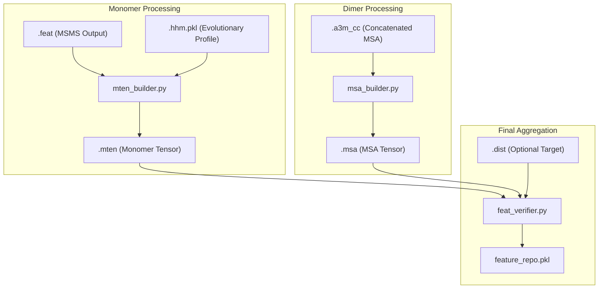
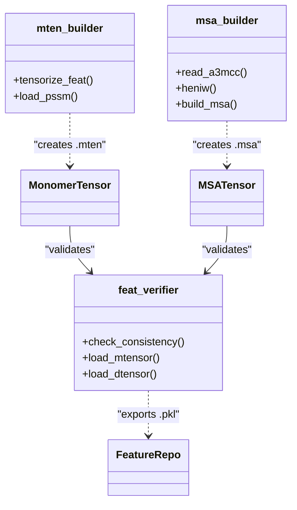

# Feature Tensorization

> **Relevant source files**
> * [glinter/hhm/LoadHHM.py](https://github.com/zw2x/glinter/blob/8871ca11/glinter/hhm/LoadHHM.py)
> * [glinter/hhm/SequenceUtils.py](https://github.com/zw2x/glinter/blob/8871ca11/glinter/hhm/SequenceUtils.py)
> * [glinter/hhm/__init__.py](https://github.com/zw2x/glinter/blob/8871ca11/glinter/hhm/__init__.py)
> * [preprocess/feat_verifier.py](https://github.com/zw2x/glinter/blob/8871ca11/preprocess/feat_verifier.py)
> * [preprocess/msa_builder.py](https://github.com/zw2x/glinter/blob/8871ca11/preprocess/msa_builder.py)
> * [preprocess/mten_builder.py](https://github.com/zw2x/glinter/blob/8871ca11/preprocess/mten_builder.py)

Feature Tensorization is the stage where raw structural data (from MSMS) and evolutionary data (from HH-suite) are transformed into structured PyTorch tensors. This process creates two primary data entities: **Monomer Tensors** (`.mten`), which encapsulate single-chain geometric and evolutionary features, and **MSA Tensors** (`.msa`), which store concatenated and weighted multiple sequence alignments for protein pairs. Finally, these features are validated and aggregated into a unified repository (`.pkl`) for the model training and inference pipelines.

## Data Flow Overview

The tensorization process acts as a bridge between raw file formats and the `DimerDataset` used by the core model.

### Feature Pipeline Diagram

**Sources:** [preprocess/mten_builder.py L89-L92](https://github.com/zw2x/glinter/blob/8871ca11/preprocess/mten_builder.py#L89-L92)

 [preprocess/msa_builder.py L187-L188](https://github.com/zw2x/glinter/blob/8871ca11/preprocess/msa_builder.py#L187-L188)

 [preprocess/feat_verifier.py L164-L166](https://github.com/zw2x/glinter/blob/8871ca11/preprocess/feat_verifier.py#L164-L166)

---

## Monomer Tensorization (.mten)

The script `preprocess/mten_builder.py` aggregates structural information from MSMS `.feat` files (which contain vertex coordinates, normals, and SASA) with evolutionary PSSMs from `.hhm.pkl` files.

### Key Components

* **`tensorize_feat`**: Extracts residue-level sequences, Cα/atom coordinates, and SASA values. It groups atoms by residue and encodes atom types into integer tensors [preprocess/mten_builder.py L23-L71](https://github.com/zw2x/glinter/blob/8871ca11/preprocess/mten_builder.py#L23-L71)
* **Evolutionary Profile Integration**: Loads PSSMs derived from HHM profiles via `load_pssm` [preprocess/mten_builder.py L13-L17](https://github.com/zw2x/glinter/blob/8871ca11/preprocess/mten_builder.py#L13-L17)
* **Sequence Mapping**: Uses `cigar_to_index` to ensure structural coordinates correctly align with the evolutionary profile sequence [preprocess/mten_builder.py L165-L168](https://github.com/zw2x/glinter/blob/8871ca11/preprocess/mten_builder.py#L165-L168)

### .mten Dictionary Structure

| Key | Type | Description |
| --- | --- | --- |
| `SEQ` | `str` | Amino acid sequence (1-letter code). |
| `COORD` | `torch.HalfTensor` | [N_atoms, 3] coordinates. |
| `ATOM` | `torch.uint8` | Encoded atom types. |
| `SAS` | `torch.HalfTensor` | Solvent Accessible Surface area per atom. |
| `GROUP` | `torch.uint8` | Number of atoms per residue. |
| `pssm` | `torch.FloatTensor` | [L, 20] Position-Specific Scoring Matrix. |
| `vertex` | `dict` | Surface mesh coordinates and normals. |

**Sources:** [preprocess/mten_builder.py L148-L154](https://github.com/zw2x/glinter/blob/8871ca11/preprocess/mten_builder.py#L148-L154)

 [preprocess/mten_builder.py L60-L69](https://github.com/zw2x/glinter/blob/8871ca11/preprocess/mten_builder.py#L60-L69)

---

## MSA Tensorization (.msa)

The script `preprocess/msa_builder.py` processes concatenated MSAs (typically in `.a3m_cc` format) to prepare them for the ESM MSA Transformer.

### Sequence Weighting (Henikoff Weights)

To handle redundancy in the MSA, the pipeline calculates Henikoff weights using the `heniw` function [preprocess/msa_builder.py L73-L91](https://github.com/zw2x/glinter/blob/8871ca11/preprocess/msa_builder.py#L73-L91)

 These weights are used during model training to bias the importance of specific sequences in the alignment.

### MSA Subsampling

Because protein language models have memory constraints, `build_msa` can subsample the MSA to a maximum of `maxk` sequences (default 128), prioritizing sequences with higher Henikoff weights [preprocess/msa_builder.py L123-L128](https://github.com/zw2x/glinter/blob/8871ca11/preprocess/msa_builder.py#L123-L128)

### .msa Dictionary Structure

| Key | Type | Description |
| --- | --- | --- |
| `msa` | `np.ndarray` | [K, L] matrix of encoded amino acid indices. |
| `hw` | `np.ndarray` | [K] Henikoff weights for each sequence. |
| `query` | `str` | The concatenated query sequence. |
| `reclen` | `int` | Length of the receptor chain. |
| `liglen` | `int` | Length of the ligand chain. |

**Sources:** [preprocess/msa_builder.py L130-L140](https://github.com/zw2x/glinter/blob/8871ca11/preprocess/msa_builder.py#L130-L140)

 [preprocess/msa_builder.py L34-L66](https://github.com/zw2x/glinter/blob/8871ca11/preprocess/msa_builder.py#L34-L66)

---

## Consistency Verification and Aggregation

The `preprocess/feat_verifier.py` script serves as the final quality control gate. It ensures that the monomer structural features and dimer evolutionary features are consistent in length and sequence identity.

### Logic Flow in check_consistency

1. **Sequence Alignment**: Compares the sequence in the `.mten` file against the `.msa` query sequence using the `seqmap` CIGAR string [preprocess/feat_verifier.py L67-L84](https://github.com/zw2x/glinter/blob/8871ca11/preprocess/feat_verifier.py#L67-L84)
2. **Identity Check**: Optionally filters out models where the structural sequence identity to the MSA query is below 0.9 [preprocess/feat_verifier.py L85-L93](https://github.com/zw2x/glinter/blob/8871ca11/preprocess/feat_verifier.py#L85-L93)
3. **Data Augmentation**: For heterodimers, the script automatically creates a "swapped" version (swapping receptor and ligand) to ensure the model learns reciprocal relationships [preprocess/feat_verifier.py L109-L134](https://github.com/zw2x/glinter/blob/8871ca11/preprocess/feat_verifier.py#L109-L134)
4. **Repository Generation**: Collects all valid monomer and dimer features into a single `.pkl` file (`--repo`) or separate MSA repository (`--msa-repo`) [preprocess/feat_verifier.py L98-L107](https://github.com/zw2x/glinter/blob/8871ca11/preprocess/feat_verifier.py#L98-L107)

### Code Entity Association Diagram

**Sources:** [preprocess/mten_builder.py L139](https://github.com/zw2x/glinter/blob/8871ca11/preprocess/mten_builder.py#L139-L139)

 [preprocess/msa_builder.py L93](https://github.com/zw2x/glinter/blob/8871ca11/preprocess/msa_builder.py#L93-L93)

 [preprocess/feat_verifier.py L38](https://github.com/zw2x/glinter/blob/8871ca11/preprocess/feat_verifier.py#L38-L38)

---

## HHM Evolutionary Profiles

The evolutionary features are parsed from `.hhm` files using the `glinter/hhm/LoadHHM.py` utility.

* **`ReadHHM`**: Parses the HMM block to extract emission scores and state transition probabilities [glinter/hhm/LoadHHM.py L52-L85](https://github.com/zw2x/glinter/blob/8871ca11/glinter/hhm/LoadHHM.py#L52-L85)
* **PSSM/PSFM**: The code derives Position-Specific Scoring Matrices (PSSM) and Frequency Matrices (PSFM) from the HMM emission probabilities, which are then stored in the monomer tensors [glinter/hhm/LoadHHM.py L9-L13](https://github.com/zw2x/glinter/blob/8871ca11/glinter/hhm/LoadHHM.py#L9-L13)

**Sources:** [glinter/hhm/LoadHHM.py L1-L16](https://github.com/zw2x/glinter/blob/8871ca11/glinter/hhm/LoadHHM.py#L1-L16)

 [preprocess/mten_builder.py L13-L17](https://github.com/zw2x/glinter/blob/8871ca11/preprocess/mten_builder.py#L13-L17)