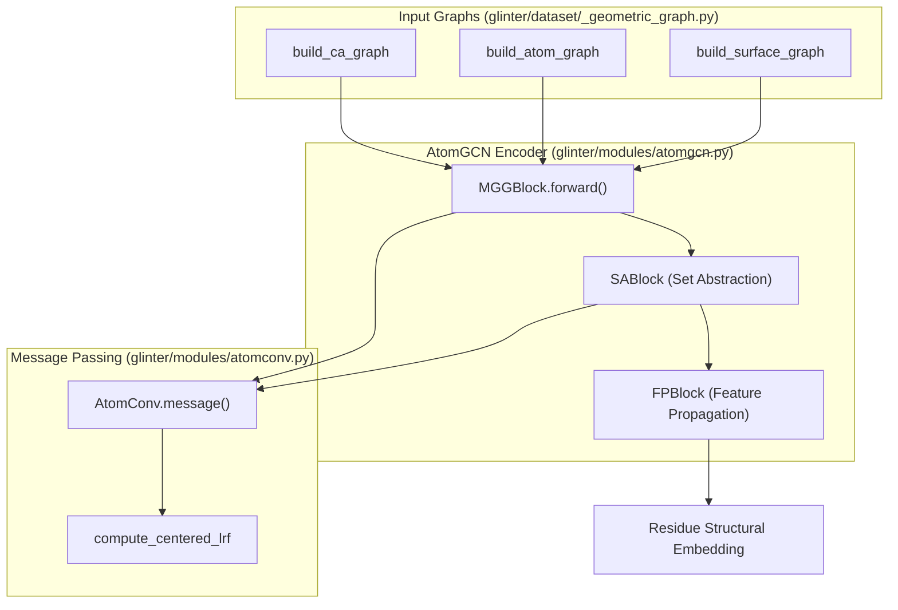
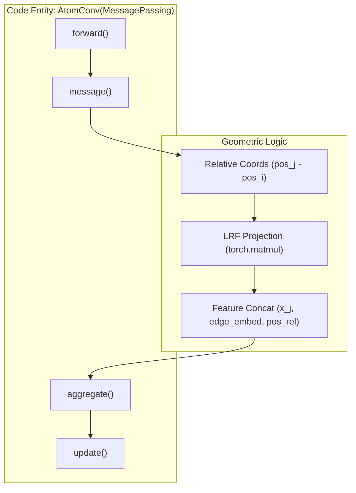

# Geometric Graph Encoder (AtomGCN)

> **Relevant source files**
> * [glinter/dataset/_geometric_graph.py](https://github.com/zw2x/glinter/blob/8871ca11/glinter/dataset/_geometric_graph.py)
> * [glinter/modules/__init__.py](https://github.com/zw2x/glinter/blob/8871ca11/glinter/modules/__init__.py)
> * [glinter/modules/atomconv.py](https://github.com/zw2x/glinter/blob/8871ca11/glinter/modules/atomconv.py)
> * [glinter/modules/atomgcn.py](https://github.com/zw2x/glinter/blob/8871ca11/glinter/modules/atomgcn.py)
> * [glinter/modules/conv.py](https://github.com/zw2x/glinter/blob/8871ca11/glinter/modules/conv.py)
> * [glinter/modules/mlp.py](https://github.com/zw2x/glinter/blob/8871ca11/glinter/modules/mlp.py)

The **Geometric Graph Encoder (AtomGCN)** is the structural backbone of GLINTER. It transforms raw 3D atomic coordinates and surface information into high-dimensional residue-level structural embeddings. Unlike standard Graph Convolutional Networks, AtomGCN utilizes a multi-graph grouping strategy to fuse information from three distinct structural representations: Cα-graphs, atom-graphs, and surface-graphs.

## Structural Graph Representations

Before processing, protein monomers are converted into three heterogeneous graphs. This multi-scale representation allows the model to capture coarse-grained topology, fine-grained atomic interactions, and solvent-accessible surface geometry simultaneously.

### 1. Cα-Graph (Residue Level)

Represents the global topology of the protein backbone.

* **Nodes**: Cα atoms of each residue. [glinter/dataset/_geometric_graph.py L63](https://github.com/zw2x/glinter/blob/8871ca11/glinter/dataset/_geometric_graph.py#L63-L63)
* **Edges**: Established between Cα nodes within a radius $r$ (default 8Å). [glinter/dataset/_geometric_graph.py L97-L98](https://github.com/zw2x/glinter/blob/8871ca11/glinter/dataset/_geometric_graph.py#L97-L98)
* **Node Features**: Solvent Accessible Surface (SAS) area, one-hot amino acid encoding, relative sequence position, and PSSM profiles. [glinter/dataset/_geometric_graph.py L76-L87](https://github.com/zw2x/glinter/blob/8871ca11/glinter/dataset/_geometric_graph.py#L76-L87)
* **LRF**: A Local Reference Frame (LRF) is computed for each Cα node using N and C backbone atom coordinates to ensure rotation-invariance. [glinter/dataset/_geometric_graph.py L101-L103](https://github.com/zw2x/glinter/blob/8871ca11/glinter/dataset/_geometric_graph.py#L101-L103)

### 2. Atom-Graph (Atomic Level)

Captures local chemical environments.

* **Nodes**: Individual atoms (C, N, O, S, etc.). [glinter/dataset/_geometric_graph.py L157](https://github.com/zw2x/glinter/blob/8871ca11/glinter/dataset/_geometric_graph.py#L157-L157)
* **Edges**: Directed edges from atoms to their parent residue's Cα node within a radius $r$ (default 8Å). [glinter/dataset/_geometric_graph.py L190-L191](https://github.com/zw2x/glinter/blob/8871ca11/glinter/dataset/_geometric_graph.py#L190-L191)
* **Edge Features**: A binary indicator showing if an atom belongs to the target residue. [glinter/dataset/_geometric_graph.py L195-L198](https://github.com/zw2x/glinter/blob/8871ca11/glinter/dataset/_geometric_graph.py#L195-L198)

### 3. Surface-Graph (Geometric Level)

Captures the shape and electrostatic properties of the protein surface.

* **Nodes**: Points on the molecular surface generated by MSMS. [glinter/dataset/_geometric_graph.py L219-L221](https://github.com/zw2x/glinter/blob/8871ca11/glinter/dataset/_geometric_graph.py#L219-L221)
* **Edges**: Directed edges from surface points to the nearest Cα nodes within a radius $r$ (default 4Å). [glinter/dataset/_geometric_graph.py L217](https://github.com/zw2x/glinter/blob/8871ca11/glinter/dataset/_geometric_graph.py#L217-L217)

**Sources:** [glinter/dataset/_geometric_graph.py L42-L237](https://github.com/zw2x/glinter/blob/8871ca11/glinter/dataset/_geometric_graph.py#L42-L237)

---

## AtomGCN Architecture

The AtomGCN architecture uses a "Grouping-Abstraction-Propagation" pattern. It aggregates features from the various graphs into residue nodes, downsamples the residue set to capture long-range interactions, and then interpolates back to the original residue resolution.

### Multi-Graph Grouping (MGG)

The `MGGBlock` is the entry point for structural features. It performs parallel graph convolutions on the Cα, Atom, and Surface graphs, then concatenates the results into a single residue-level embedding.

| Component | Class | Description |
| --- | --- | --- |
| **MGG Block** | `MGGBlock` | Aggregates features from multiple source graphs into target query nodes. [glinter/modules/atomgcn.py L7-L80](https://github.com/zw2x/glinter/blob/8871ca11/glinter/modules/atomgcn.py#L7-L80) |
| **Atom Convolution** | `AtomConv` | The core message-passing layer using LRF for rotation-invariant spatial offsets. [glinter/modules/atomconv.py L8-L134](https://github.com/zw2x/glinter/blob/8871ca11/glinter/modules/atomconv.py#L8-L134) |
| **Dynamic Conv** | `AtomConvDynamic` | Extends `AtomConv` with dynamic graph construction and Furthest Point Sampling (FPS). [glinter/modules/atomconv.py L135-L203](https://github.com/zw2x/glinter/blob/8871ca11/glinter/modules/atomconv.py#L135-L203) |

### Set Abstraction and Propagation

To learn hierarchical features, AtomGCN implements a PointNet++ style architecture:

1. **Set Abstraction (`SABlock`)**: Downsamples residues using `fps` (Furthest Point Sampling) and aggregates local neighborhoods using `AtomConvDynamic`. [glinter/modules/atomgcn.py L141-L168](https://github.com/zw2x/glinter/blob/8871ca11/glinter/modules/atomgcn.py#L141-L168)
2. **Feature Propagation (`FPBlock`)**: Interpolates features from the downsampled set back to the original residue nodes using `knn_interpolate`. [glinter/modules/atomgcn.py L169-L194](https://github.com/zw2x/glinter/blob/8871ca11/glinter/modules/atomgcn.py#L169-L194)

### Data Flow Diagram: Graph Processing

This diagram maps the logical flow of geometric data through the specific code entities in `atomgcn.py` and `atomconv.py`.

**Sources:** [glinter/modules/atomgcn.py L7-L225](https://github.com/zw2x/glinter/blob/8871ca11/glinter/modules/atomgcn.py#L7-L225)

 [glinter/modules/atomconv.py L8-L203](https://github.com/zw2x/glinter/blob/8871ca11/glinter/modules/atomconv.py#L8-L203)

 [glinter/dataset/_geometric_graph.py L42-L237](https://github.com/zw2x/glinter/blob/8871ca11/glinter/dataset/_geometric_graph.py#L42-L237)

---

## Message Passing Implementation

The `AtomConv` layer ensures that geometric information is processed in a rotation-invariant manner by projecting relative coordinates into the target node's Local Reference Frame (LRF).

### Coordinate Transformation

In `AtomConv.message`, the spatial displacement between a source node $j$ and target node $i$ is transformed:
$$ \text{pos}_{\text{rel}} = (pos_j - pos_i) \cdot LRF_i $$
This occurs at [glinter/modules/atomconv.py L101-L103](https://github.com/zw2x/glinter/blob/8871ca11/glinter/modules/atomconv.py#L101-L103)

### Code Entity Mapping: Geometric Convolution

This diagram bridges the mathematical concept of a geometric convolution to the specific PyTorch Geometric implementation used in GLINTER.

### Key Hyperparameters

* **Radius (`r`)**: Determines neighborhood size for graph construction.
* **Sampling Rate (`rate`)**: Percentage of nodes kept during Set Abstraction (e.g., 0.5). [glinter/modules/atomconv.py L163-L169](https://github.com/zw2x/glinter/blob/8871ca11/glinter/modules/atomconv.py#L163-L169)
* **Local NN**: An `MLP` that processes the concatenated node and geometric features. [glinter/modules/atomgcn.py L100-L104](https://github.com/zw2x/glinter/blob/8871ca11/glinter/modules/atomgcn.py#L100-L104)

**Sources:** [glinter/modules/atomconv.py L88-L133](https://github.com/zw2x/glinter/blob/8871ca11/glinter/modules/atomconv.py#L88-L133)

 [glinter/modules/atomgcn.py L82-L138](https://github.com/zw2x/glinter/blob/8871ca11/glinter/modules/atomgcn.py#L82-L138)

 [glinter/modules/mlp.py L5-L40](https://github.com/zw2x/glinter/blob/8871ca11/glinter/modules/mlp.py#L5-L40)