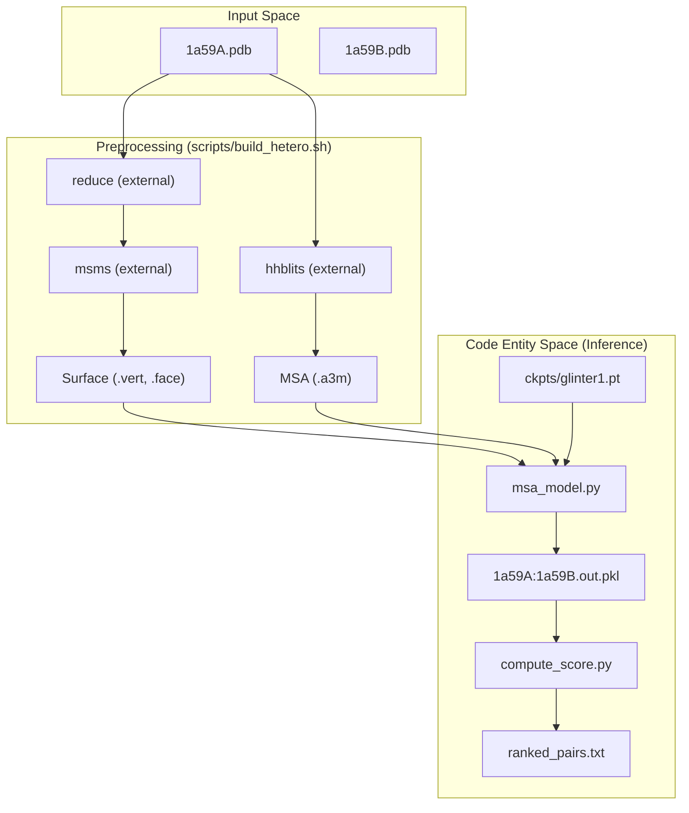
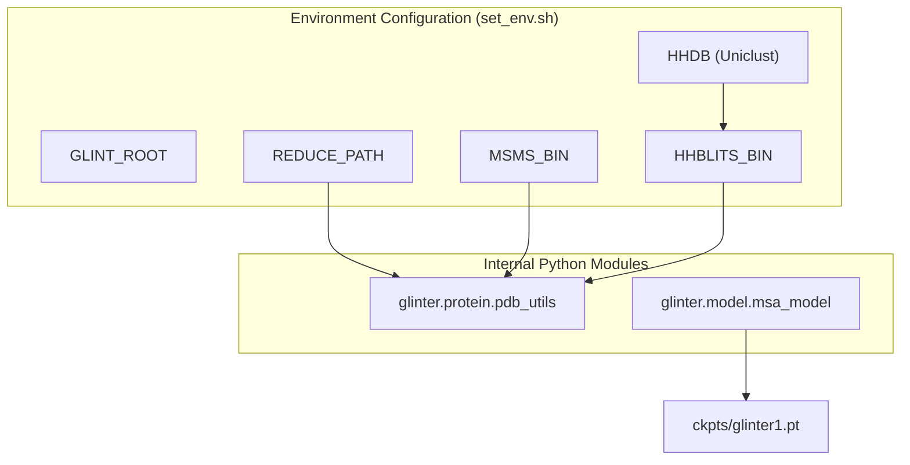

# Getting Started

> **Relevant source files**
> * [README.md](https://github.com/zw2x/glinter/blob/8871ca11/README.md?plain=1)
> * [ckpts/glinter1.pt](https://github.com/zw2x/glinter/blob/8871ca11/ckpts/glinter1.pt)
> * [examples/1a59A.pdb](https://github.com/zw2x/glinter/blob/8871ca11/examples/1a59A.pdb)
> * [examples/1a59B.pdb](https://github.com/zw2x/glinter/blob/8871ca11/examples/1a59B.pdb)
> * [scripts/set_env.sh](https://github.com/zw2x/glinter/blob/8871ca11/scripts/set_env.sh)
> * [setup.py](https://github.com/zw2x/glinter/blob/8871ca11/setup.py)

This page details the installation, environment configuration, and execution of the GLINTER (Graph Learning of INTER-protein contacts) pipeline. GLINTER is a deep learning framework designed to predict inter-protein residue contacts by integrating evolutionary information from Multiple Sequence Alignments (MSAs) with geometric features derived from protein surfaces and graphs.

## Installation and Environment Setup

GLINTER requires `python >= 3.7` [README.md L4](https://github.com/zw2x/glinter/blob/8871ca11/README.md?plain=1#L4-L4)

 The core library is installed via `pip`, but several critical external dependencies for structural biology and sequence analysis must be manually configured.

### 1. Core Library Installation

Clone the repository and install in editable mode to ensure all internal modules are accessible:

```
git clone https://github.com/zw2x/glinter.gitcd glinterpip install -e .
```

**Sources:** [README.md L6-L11](https://github.com/zw2x/glinter/blob/8871ca11/README.md?plain=1#L6-L11)

 [setup.py L1-L30](https://github.com/zw2x/glinter/blob/8871ca11/setup.py#L1-L30)

### 2. Python Dependencies

The following packages are required for tensor operations, graph processing, and structural parsing:

* `torch >= 1.6`
* `torch_geometric`
* `numpy`, `biopython`, `trimesh`, `scipy`, `tqdm`, `matplotlib`

**Sources:** [README.md L14-L15](https://github.com/zw2x/glinter/blob/8871ca11/README.md?plain=1#L14-L15)

 [setup.py L10-L17](https://github.com/zw2x/glinter/blob/8871ca11/setup.py#L10-L17)

### 3. External Software and Models

The pipeline relies on four major external components that must be installed and placed in the `$GLINT_ROOT/external` directory or linked via environment variables:

| Dependency | Purpose | Source |
| --- | --- | --- |
| **MSMS** | Molecular Surface Masking System for `.vert` and `.face` generation. | [README.md L16](https://github.com/zw2x/glinter/blob/8871ca11/README.md?plain=1#L16-L16) |
| **reduce** | Adds hydrogens to PDB files to ensure correct surface calculation. | [README.md L17](https://github.com/zw2x/glinter/blob/8871ca11/README.md?plain=1#L17-L17) |
| **hh-suite** | Used for generating MSAs via `hhblits`. | [README.md L18](https://github.com/zw2x/glinter/blob/8871ca11/README.md?plain=1#L18-L18) |
| **ESM-MSA** | Pre-trained `esm_msa1_t12_100M_UR50S` model for protein language features. | [README.md L19](https://github.com/zw2x/glinter/blob/8871ca11/README.md?plain=1#L19-L19) |
| **Uniclust30** | Sequence database (2016_09 version recommended). | [README.md L61-L64](https://github.com/zw2x/glinter/blob/8871ca11/README.md?plain=1#L61-L64) |

**Sources:** [README.md L13-L22](https://github.com/zw2x/glinter/blob/8871ca11/README.md?plain=1#L13-L22)

 [README.md L61-L64](https://github.com/zw2x/glinter/blob/8871ca11/README.md?plain=1#L61-L64)

### 4. Configuring the Environment

Before running predictions, you must modify `scripts/set_env.sh` to point to your local installation paths for databases and binaries.

```javascript
# scripts/set_env.shexport GLINT_ROOT=$(cd $(dirname $(readlink -f $0)) && cd .. && pwd)export REDUCE_PATH=$GLINT_ROOT/external/reduceexport MSMS_BIN=$GLINT_ROOT/external/msmsexport HHBLITS_BIN=$GLINT_ROOT/external/hhblits-binexport HHDB=$GLINT_ROOT/scratch/uniclust30_2016_09/uniclust30_2016_09
```

**Sources:** [scripts/set_env.sh L1-L14](https://github.com/zw2x/glinter/blob/8871ca11/scripts/set_env.sh#L1-L14)

## Execution Workflow

The prediction workflow consumes raw PDB files and produces a ranked list of residue-residue contacts.

### System Data Flow: PDB to Contact Prediction

The following diagram illustrates how the shell scripts orchestrate the transition from raw data to the `msa_model.py` inference engine.



**Sources:** [README.md L33-L55](https://github.com/zw2x/glinter/blob/8871ca11/README.md?plain=1#L33-L55)

 [scripts/set_env.sh L1-L14](https://github.com/zw2x/glinter/blob/8871ca11/scripts/set_env.sh#L1-L14)

### Running the Heterodimer Example (1a59A/1a59B)

To predict contacts between chain A and chain B of the 1a59 complex:

1. **Source the environment:** ``` source scripts/set_env.sh ```
2. **Execute the prediction script:** ``` scripts/build_hetero.sh examples/1a59A.pdb examples/1a59B.pdb examples/ ```

**Sources:** [README.md L25-L37](https://github.com/zw2x/glinter/blob/8871ca11/README.md?plain=1#L25-L37)

### Running the Homodimer Example

For homodimers, the pipeline optimizes by only building the MSA for a representative monomer:

```
scripts/build_homo.sh examples/1a59A.pdb examples/1a59B.pdb examples/ 1a59B
```

**Sources:** [README.md L38-L42](https://github.com/zw2x/glinter/blob/8871ca11/README.md?plain=1#L38-L42)

## Output Interpretation

The pipeline generates several files in the output directory (e.g., `examples/1a59A:1a59B/`):

| File | Description |
| --- | --- |
| `1a59A:1a59B.out.pkl` | Raw model logits for the A->B direction. [README.md L45-L47](https://github.com/zw2x/glinter/blob/8871ca11/README.md?plain=1#L45-L47) |
| `score_mat.pkl` | Aggregated probability matrix (N x M) of residue contacts. [README.md L49-L50](https://github.com/zw2x/glinter/blob/8871ca11/README.md?plain=1#L49-L50) |
| `ranked_pairs.txt` | Tab-separated list: `[Residue_A_Idx] [Residue_B_Idx] [Probability]`. [README.md L51-L54](https://github.com/zw2x/glinter/blob/8871ca11/README.md?plain=1#L51-L54) |

**Sources:** [README.md L45-L55](https://github.com/zw2x/glinter/blob/8871ca11/README.md?plain=1#L45-L55)

## Dependency Interaction Diagram

This diagram maps the high-level system requirements to the specific environment variables and paths used by the GLINTER scripts.



**Sources:** [scripts/set_env.sh L1-L14](https://github.com/zw2x/glinter/blob/8871ca11/scripts/set_env.sh#L1-L14)

 [README.md L65](https://github.com/zw2x/glinter/blob/8871ca11/README.md?plain=1#L65-L65)

 [setup.py L18-L27](https://github.com/zw2x/glinter/blob/8871ca11/setup.py#L18-L27)