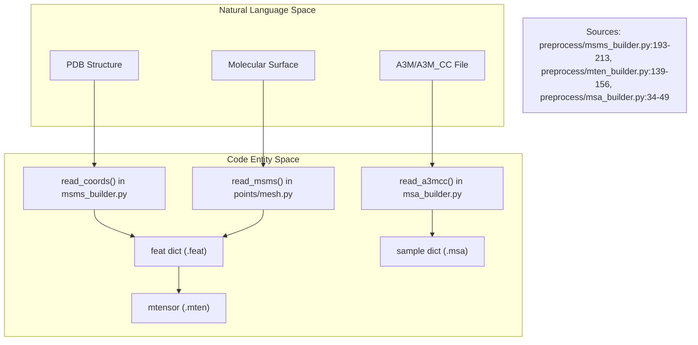
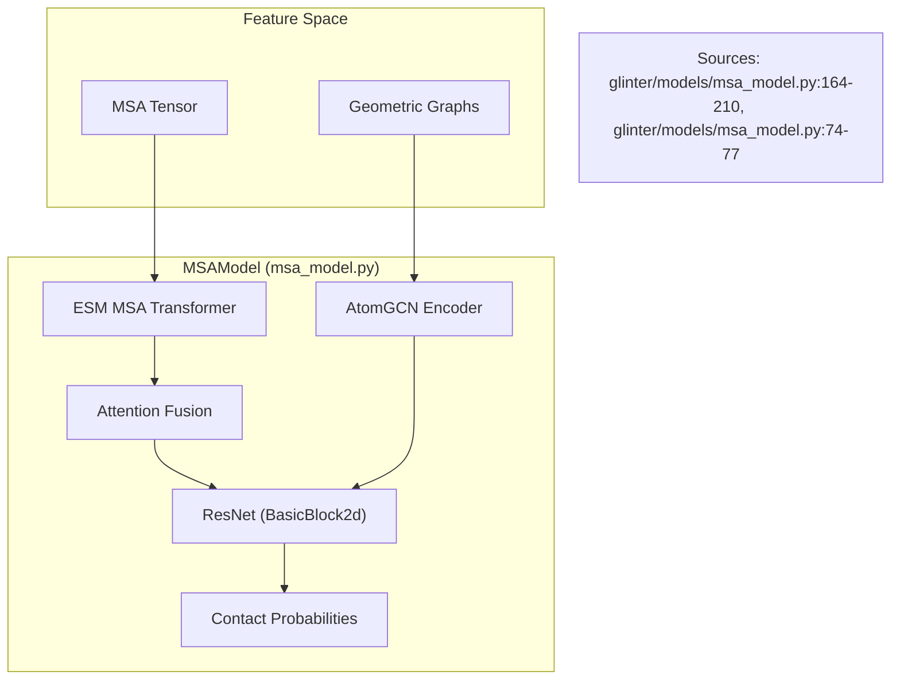

# Glossary

> **Relevant source files**
> * [README.md](https://github.com/zw2x/glinter/blob/8871ca11/README.md?plain=1)
> * [glinter/dataset/_geometric_graph.py](https://github.com/zw2x/glinter/blob/8871ca11/glinter/dataset/_geometric_graph.py)
> * [glinter/esm_embed/modules.py](https://github.com/zw2x/glinter/blob/8871ca11/glinter/esm_embed/modules.py)
> * [glinter/models/msa_model.py](https://github.com/zw2x/glinter/blob/8871ca11/glinter/models/msa_model.py)
> * [glinter/modules/atomgcn.py](https://github.com/zw2x/glinter/blob/8871ca11/glinter/modules/atomgcn.py)
> * [glinter/protein/encoding_utils.py](https://github.com/zw2x/glinter/blob/8871ca11/glinter/protein/encoding_utils.py)
> * [preprocess/feat_verifier.py](https://github.com/zw2x/glinter/blob/8871ca11/preprocess/feat_verifier.py)
> * [preprocess/msa_builder.py](https://github.com/zw2x/glinter/blob/8871ca11/preprocess/msa_builder.py)
> * [preprocess/msms_builder.py](https://github.com/zw2x/glinter/blob/8871ca11/preprocess/msms_builder.py)
> * [preprocess/mten_builder.py](https://github.com/zw2x/glinter/blob/8871ca11/preprocess/mten_builder.py)
> * [scripts/compute_score.py](https://github.com/zw2x/glinter/blob/8871ca11/scripts/compute_score.py)

This glossary defines technical terms, abbreviations, and file formats specific to the GLINTER (Graph Learning of INTER-protein contacts) codebase. GLINTER is designed to predict inter-protein residue contacts by integrating evolutionary information from Multiple Sequence Alignments (MSAs) with structural features derived from molecular surfaces and atomic graphs.

## Core Concepts & Terminology

### 1. MSA (Multiple Sequence Alignment)

Evolutionary information is a primary input for GLINTER. The system uses the **ESM MSA Transformer** (`esm_msa1_t12_100M_UR50S`) to extract co-evolutionary signals [glinter/models/msa_model.py L9-L11](https://github.com/zw2x/glinter/blob/8871ca11/glinter/models/msa_model.py#L9-L11)

* **A3M_CC**: A specific format for concatenated MSAs where sequences from two proteins are paired, typically generated by `hhblits` and scripts like `build_msa.py` [preprocess/msa_builder.py L34-L40](https://github.com/zw2x/glinter/blob/8871ca11/preprocess/msa_builder.py#L34-L40)
* **Henikoff Weights**: A sequence weighting scheme used to reduce redundancy in MSAs. Implemented in `heniw` [preprocess/msa_builder.py L73-L91](https://github.com/zw2x/glinter/blob/8871ca11/preprocess/msa_builder.py#L73-L91)

### 2. Geometric Graphs

GLINTER represents protein structures as multi-modal graphs to capture different geometric scales.

* **CA-Graph**: A graph where nodes are $C\alpha$ atoms. Edges are typically defined by a distance threshold (default 8Å) [glinter/dataset/_geometric_graph.py L42-L45](https://github.com/zw2x/glinter/blob/8871ca11/glinter/dataset/_geometric_graph.py#L42-L45)
* **Atom-Graph**: A finer-grained graph where nodes represent individual atoms, allowing the model to learn chemical environments [glinter/dataset/_geometric_graph.py L145-L148](https://github.com/zw2x/glinter/blob/8871ca11/glinter/dataset/_geometric_graph.py#L145-L148)
* **Surface-Graph**: A graph derived from the molecular surface (generated via MSMS), capturing solvent accessibility and shape [glinter/dataset/_geometric_graph.py L217-L220](https://github.com/zw2x/glinter/blob/8871ca11/glinter/dataset/_geometric_graph.py#L217-L220)

### 3. APC (Average Product Correction)

A post-processing technique applied to co-evolutionary scores (attention matrices) to suppress background noise and phylogenetic bias.

* **Implementation**: `apc(x)` function [glinter/models/msa_model.py L14-L23](https://github.com/zw2x/glinter/blob/8871ca11/glinter/models/msa_model.py#L14-L23)

---

## File Formats & Extensions

| Extension | Description | Source |
| --- | --- | --- |
| `.mten` | **Monomer Tensor**: A pickled dictionary containing residue sequences, atomic coordinates, PSSM, and surface vertices for a single protein chain. | [preprocess/mten_builder.py L171-L173](https://github.com/zw2x/glinter/blob/8871ca11/preprocess/mten_builder.py#L171-L173) |
| `.msa` | **MSA Tensor**: Pickled data containing the concatenated MSA matrix, Henikoff weights, and chain lengths. | [preprocess/msa_builder.py L154-L157](https://github.com/zw2x/glinter/blob/8871ca11/preprocess/msa_builder.py#L154-L157) |
| `.feat` | **Intermediate Feature**: Raw structural features extracted from PDB/MSMS before tensorization. | [preprocess/msms_builder.py L186-L188](https://github.com/zw2x/glinter/blob/8871ca11/preprocess/msms_builder.py#L186-L188) |
| `.out.pkl` | **Model Output**: The raw logits/probabilities produced by the `MSAModel` forward pass. | [scripts/compute_score.py L14-L15](https://github.com/zw2x/glinter/blob/8871ca11/scripts/compute_score.py#L14-L15) |
| `.vert` / `.face` | **MSMS Output**: Mesh files representing the solvent-excluded surface. | [preprocess/msms_builder.py L231-L234](https://github.com/zw2x/glinter/blob/8871ca11/preprocess/msms_builder.py#L231-L234) |

---

## Data Flow: From Files to Code Entities

The following diagram illustrates how raw biological data is transformed into the internal representations used by the `MSAModel`.

**Natural Language to Code Entity Space: Preprocessing**

---

## Architecture Components

### AtomGCN (Geometric Graph Encoder)

The `AtomGCN` class is the primary structural encoder. It uses **Multi-Graph Grouping (MGG)** to process parallel graphs (Atom, CA, Surface) and aggregate them into a unified residue embedding [glinter/modules/atomgcn.py L196-L216](https://github.com/zw2x/glinter/blob/8871ca11/glinter/modules/atomgcn.py#L196-L216)

* **MGGBlock**: Aggregates features from different graph types [glinter/modules/atomgcn.py L7-L11](https://github.com/zw2x/glinter/blob/8871ca11/glinter/modules/atomgcn.py#L7-L11)
* **SABlock**: Set Abstraction block for hierarchical point cloud processing [glinter/modules/atomgcn.py L141-L144](https://github.com/zw2x/glinter/blob/8871ca11/glinter/modules/atomgcn.py#L141-L144)
* **FPBlock**: Feature Propagation block for interpolating features back to higher resolutions [glinter/modules/atomgcn.py L169-L172](https://github.com/zw2x/glinter/blob/8871ca11/glinter/modules/atomgcn.py#L169-L172)

### MSAModel (Core Network)

The top-level `MSAModel` class coordinates the fusion of MSA attention and structural embeddings.

**Natural Language to Code Entity Space: Model Inference**

---

## Domain Concepts

### LRF (Local Reference Frame)

To ensure the model is invariant or equivariant to the orientation of the protein in 3D space, GLINTER computes an LRF for each residue based on the $N$, $C\alpha$, and $C$ atom coordinates [glinter/dataset/_geometric_graph.py L100-L103](https://github.com/zw2x/glinter/blob/8871ca11/glinter/dataset/_geometric_graph.py#L100-L103)

### SAS (Solvent Accessible Surface)

Calculated per atom and aggregated per residue, SAS is a critical feature for identifying interface residues, which are typically solvent-exposed in monomers but buried in dimers [glinter/dataset/_geometric_graph.py L34-L40](https://github.com/zw2x/glinter/blob/8871ca11/glinter/dataset/_geometric_graph.py#L34-L40)

### APC Correction Options

In `MSAModel`, the `row-attn-op` argument determines how the $L \times L$ attention matrix from ESM is processed for the heterodimer interface ($L_{rec} \times L_{lig}$):

* `sym`: Symmetrizes the interface attention block [glinter/models/msa_model.py L188-L192](https://github.com/zw2x/glinter/blob/8871ca11/glinter/models/msa_model.py#L188-L192)
* `apc`: Applies Average Product Correction to the symmetrized matrix [glinter/models/msa_model.py L193-L196](https://github.com/zw2x/glinter/blob/8871ca11/glinter/models/msa_model.py#L193-L196)

---

**Sources:**

* `glinter/models/msa_model.py`
* `preprocess/msa_builder.py`
* `preprocess/mten_builder.py`
* `preprocess/msms_builder.py`
* `glinter/dataset/_geometric_graph.py`
* `glinter/modules/atomgcn.py`
* `glinter/protein/encoding_utils.py`
* `scripts/compute_score.py`