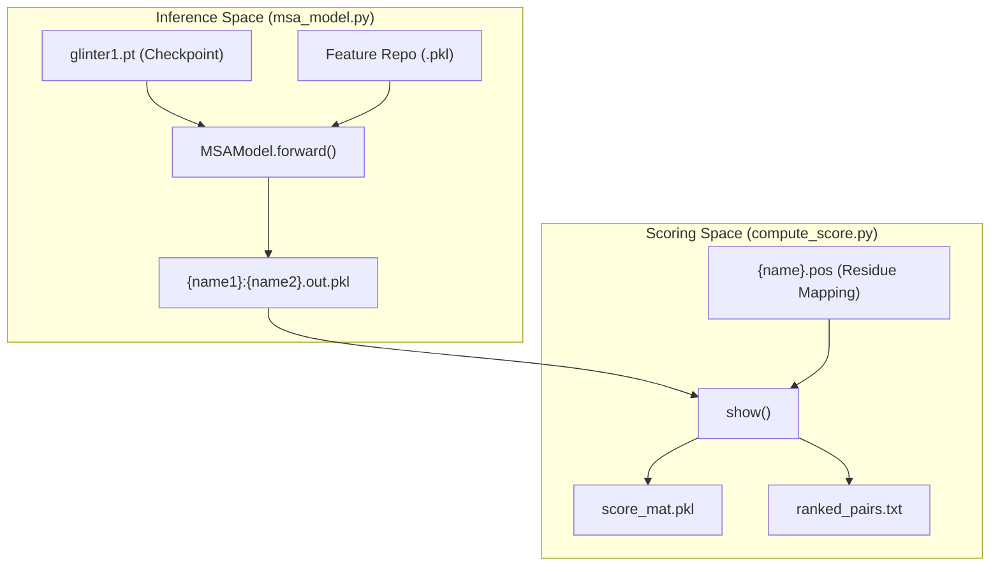
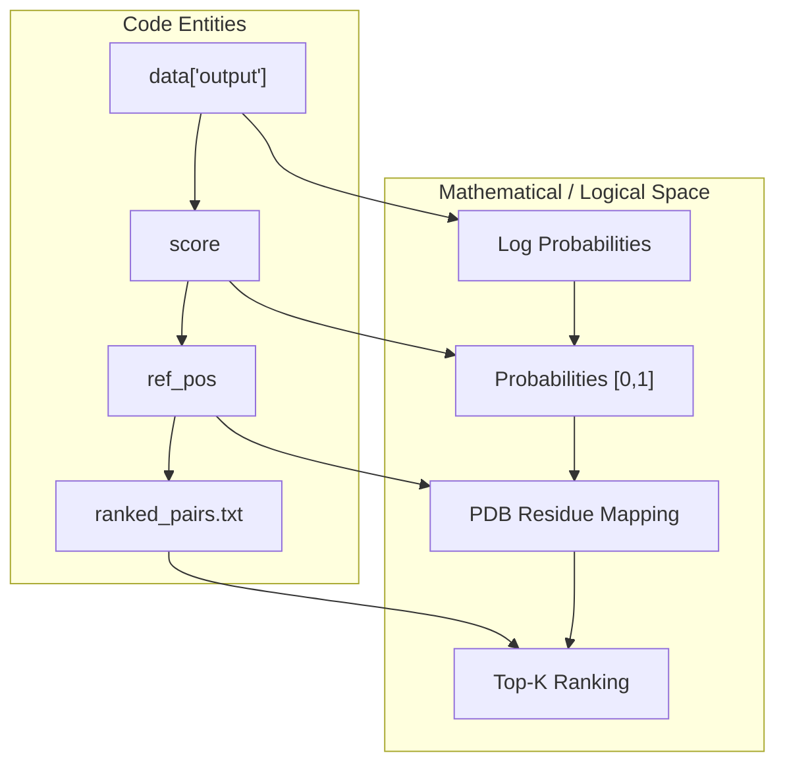

# Inference and Scoring

> **Relevant source files**
> * [ckpts/glinter1.pt](https://github.com/zw2x/glinter/blob/8871ca11/ckpts/glinter1.pt)
> * [glinter/models/checkpoint_utils.py](https://github.com/zw2x/glinter/blob/8871ca11/glinter/models/checkpoint_utils.py)
> * [glinter/models/msa_model.py](https://github.com/zw2x/glinter/blob/8871ca11/glinter/models/msa_model.py)
> * [scripts/compute_score.py](https://github.com/zw2x/glinter/blob/8871ca11/scripts/compute_score.py)

This section covers the final stages of the GLINTER pipeline: executing the trained model to generate raw contact predictions and post-processing those outputs into human-readable, ranked residue-pair lists. The inference process utilizes the multi-modal features generated in the [Preprocessing Pipeline](/zw2x/glinter/2-preprocessing-pipeline) and passes them through the [Core Model Architecture](/zw2x/glinter/3-core-model-architecture) architecture to produce a probability matrix.

### System Overview: From Model to Ranked Scores

The transition from a trained model checkpoint to a final prediction involves two primary steps. First, `msa_model.py` performs a forward pass using pre-calculated features. Second, `compute_score.py` aggregates these predictions (handling both $A:B$ and $B:A$ orientations) and maps internal model indices back to the original residue positions defined in the PDB.

#### Inference and Scoring Workflow

**Sources:** [glinter/models/msa_model.py L164-L211](https://github.com/zw2x/glinter/blob/8871ca11/glinter/models/msa_model.py#L164-L211)

 [scripts/compute_score.py L42-L53](https://github.com/zw2x/glinter/blob/8871ca11/scripts/compute_score.py#L42-L53)

---

### 4.1 Model Inference

Model inference is driven by the `MSAModel` class, typically loaded from a checkpoint like `glinter1.pt` [ckpts/glinter1.pt L1-L12](https://github.com/zw2x/glinter/blob/8871ca11/ckpts/glinter1.pt#L1-L12)

 During this phase, the model integrates evolutionary information from the ESM MSA Transformer with geometric features from the `AtomGCN` encoder [glinter/models/msa_model.py L156-L160](https://github.com/zw2x/glinter/blob/8871ca11/glinter/models/msa_model.py#L156-L160)

A critical component of inference is the handling of row attentions from the ESM model. The `forward` pass extracts these attentions and applies operations such as symmetry (`sym`) or Average Product Correction (`apc`) to prepare the feature map for the ResNet layers [glinter/models/msa_model.py L182-L198](https://github.com/zw2x/glinter/blob/8871ca11/glinter/models/msa_model.py#L182-L198)

 The final output is saved as a `.out.pkl` file containing the log-probabilities for every residue pair in the interaction interface.

For details on ESM attention extraction and feature fusion, see [Model Inference](/zw2x/glinter/4.1-model-inference).

**Sources:** [glinter/models/msa_model.py L30-L78](https://github.com/zw2x/glinter/blob/8871ca11/glinter/models/msa_model.py#L30-L78)

 [glinter/models/msa_model.py L164-L211](https://github.com/zw2x/glinter/blob/8871ca11/glinter/models/msa_model.py#L164-L211)

 [glinter/models/checkpoint_utils.py L35-L41](https://github.com/zw2x/glinter/blob/8871ca11/glinter/models/checkpoint_utils.py#L35-L41)

---

### 4.2 Score Post-Processing and Evaluation

Raw model outputs are indexed according to the tensors processed by the network, which may not match the original PDB residue numbering due to filtering or cropping. The `compute_score.py` script performs the following logic:

1. **Reciprocal Aggregation**: It loads predictions for both dimer orientations ($A:B$ and $B:A$) and averages the probabilities to ensure consistency [scripts/compute_score.py L14-L23](https://github.com/zw2x/glinter/blob/8871ca11/scripts/compute_score.py#L14-L23)
2. **Residue Mapping**: It reads `.pos` files (generated during preprocessing) to map model-internal indices back to PDB residue numbers [scripts/compute_score.py L5-L11](https://github.com/zw2x/glinter/blob/8871ca11/scripts/compute_score.py#L5-L11)
3. **Ranking**: The 2D probability matrix is flattened and sorted to produce a list of residue pairs ranked by their predicted contact probability [scripts/compute_score.py L33-L40](https://github.com/zw2x/glinter/blob/8871ca11/scripts/compute_score.py#L33-L40)

The final outputs include `score_mat.pkl` (a NumPy matrix of scores) and `ranked_pairs.txt` (a space-delimited list of pairs and probabilities) [scripts/compute_score.py L48-L53](https://github.com/zw2x/glinter/blob/8871ca11/scripts/compute_score.py#L48-L53)

For details on index mapping and evaluation metrics, see [Score Post-Processing and Evaluation](/zw2x/glinter/4.2-score-post-processing-and-evaluation).

#### Data Transformation: Tensor to Ranked List

**Sources:** [scripts/compute_score.py L16-L40](https://github.com/zw2x/glinter/blob/8871ca11/scripts/compute_score.py#L16-L40)

 [scripts/compute_score.py L50-L53](https://github.com/zw2x/glinter/blob/8871ca11/scripts/compute_score.py#L50-L53)

---

### Summary of Inference Files

| File | Role | Key Functions/Classes |
| --- | --- | --- |
| `glinter/models/msa_model.py` | Core inference engine | `MSAModel.forward`, `apc` |
| `glinter/models/checkpoint_utils.py` | Model loading utilities | `load_state` |
| `scripts/compute_score.py` | Result aggregation and formatting | `show`, `read_residue_positions` |
| `ckpts/glinter1.pt` | Pre-trained weights | N/A |

**Sources:** [glinter/models/msa_model.py L30](https://github.com/zw2x/glinter/blob/8871ca11/glinter/models/msa_model.py#L30-L30)

 [glinter/models/checkpoint_utils.py L35](https://github.com/zw2x/glinter/blob/8871ca11/glinter/models/checkpoint_utils.py#L35-L35)

 [scripts/compute_score.py L13](https://github.com/zw2x/glinter/blob/8871ca11/scripts/compute_score.py#L13-L13)

 [ckpts/glinter1.pt L1-L10](https://github.com/zw2x/glinter/blob/8871ca11/ckpts/glinter1.pt#L1-L10)