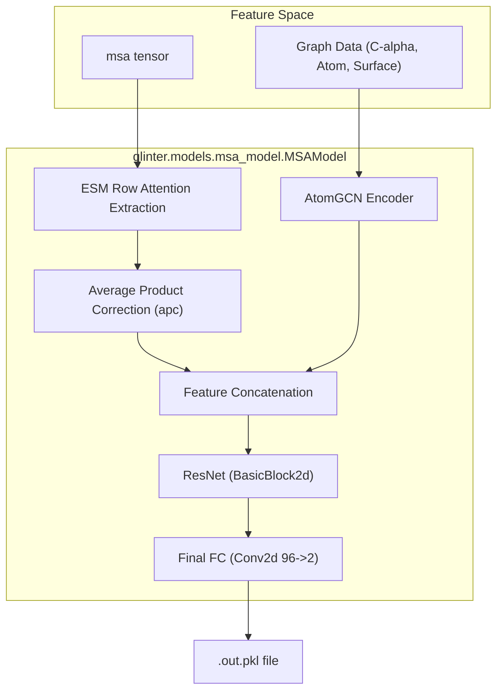
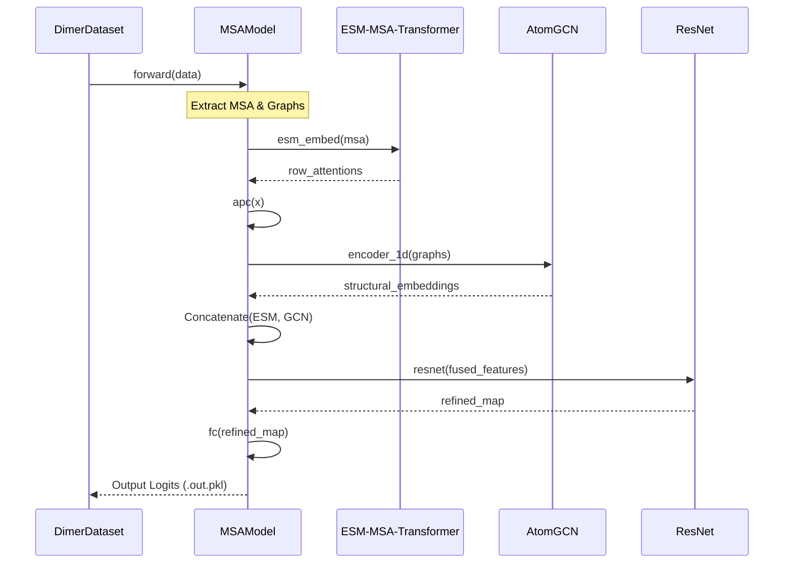

# Model Inference

> **Relevant source files**
> * [ckpts/glinter1.pt](https://github.com/zw2x/glinter/blob/8871ca11/ckpts/glinter1.pt)
> * [glinter/models/checkpoint_utils.py](https://github.com/zw2x/glinter/blob/8871ca11/glinter/models/checkpoint_utils.py)
> * [glinter/models/msa_model.py](https://github.com/zw2x/glinter/blob/8871ca11/glinter/models/msa_model.py)

The model inference stage in GLINTER represents the final forward pass of the neural network, where evolutionary, geometric, and structural features are fused to predict inter-protein residue contacts. This process is primarily driven by the `MSAModel` class, which handles multi-modal feature integration, including ESM attention extraction and Graph Convolutional Network (GCN) processing.

## Inference Architecture Overview

The inference workflow transforms preprocessed feature tensors into a probability map of residue-residue contacts. The `MSAModel` architecture is designed to handle heterogeneous data: sequence-based attention from ESM and structure-based embeddings from `AtomGCN`.

### Data Flow to Output

The inference process follows a specific sequence of operations:

1. **ESM Feature Extraction**: The model extracts row-wise attention from the ESM MSA Transformer.
2. **Structural Embedding**: `AtomGCN` processes C$\alpha$, atom, and surface graphs.
3. **Feature Fusion**: Sequence and structural features are concatenated.
4. **2D Residual Processing**: A ResNet-based convolutional stack refines the fused 2D feature map.
5. **Probability Output**: A final $1 \times 1$ convolution produces the contact logits.

### Model Architecture and Entity Mapping

The following diagram bridges the high-level architecture to the specific code entities responsible for each stage.

**Model Inference Logic Flow**

**Sources:** [glinter/models/msa_model.py L30-L78](https://github.com/zw2x/glinter/blob/8871ca11/glinter/models/msa_model.py#L30-L78)

 [glinter/models/msa_model.py L164-L210](https://github.com/zw2x/glinter/blob/8871ca11/glinter/models/msa_model.py#L164-L210)

## Implementation Details

### ESM Attention Pre-generation

In inference mode, the model often leverages pre-generated or on-the-fly ESM row attentions. The `MSAModel` handles the concatenation of MSAs for the receptor and ligand, then processes the attention matrix to focus on the inter-protein interface.

* **Row Attention Extraction**: The model calls `self.esm_embed(msa)['row_attentions']` [glinter/models/msa_model.py L171](https://github.com/zw2x/glinter/blob/8871ca11/glinter/models/msa_model.py#L171-L171)
* **Symmetrization and APC**: The attention matrix is processed based on the `row-attn-op` argument. If `apc` is selected, the `apc` function [glinter/models/msa_model.py L14-L23](https://github.com/zw2x/glinter/blob/8871ca11/glinter/models/msa_model.py#L14-L23)  is applied to normalize the signal by subtracting the product of row and column sums, a standard technique in contact prediction to reduce phylogenetic noise.
* **Interface Selection**: The attention matrix is sliced to extract the cross-chain interaction region using `reclen` and `liglen` indices [glinter/models/msa_model.py L184-L196](https://github.com/zw2x/glinter/blob/8871ca11/glinter/models/msa_model.py#L184-L196)

### Multi-Modal Feature Fusion

The model constructs a 1D encoder using `_build_encoder_1d` [glinter/models/msa_model.py L80-L162](https://github.com/zw2x/glinter/blob/8871ca11/glinter/models/msa_model.py#L80-L162)

 which can include several graph types:

* **Coordinate/Distance C$\alpha$ Graph**: Encodes the backbone geometry [glinter/models/msa_model.py L105-L117](https://github.com/zw2x/glinter/blob/8871ca11/glinter/models/msa_model.py#L105-L117)
* **Atom Graph**: Encodes fine-grained atomic positions [glinter/models/msa_model.py L119-L129](https://github.com/zw2x/glinter/blob/8871ca11/glinter/models/msa_model.py#L119-L129)
* **Surface Graph**: Encodes molecular surface normals and positions [glinter/models/msa_model.py L131-L141](https://github.com/zw2x/glinter/blob/8871ca11/glinter/models/msa_model.py#L131-L141)

These structural embeddings are produced by the `AtomGCN` class [glinter/models/msa_model.py L156-L160](https://github.com/zw2x/glinter/blob/8871ca11/glinter/models/msa_model.py#L156-L160)

### Inference Output Format (.out.pkl)

The model outputs a `.out.pkl` file, which contains the raw logits or probabilities for every residue pair $(i, j)$ where $i$ belongs to the receptor and $j$ belongs to the ligand.

| Component | Code Reference | Description |
| --- | --- | --- |
| **Logit Generation** | [glinter/models/msa_model.py L77](https://github.com/zw2x/glinter/blob/8871ca11/glinter/models/msa_model.py#L77-L77) | `nn.Conv2d(96, 2, kernel_size=1)` produces a 2-channel output (non-contact vs contact). |
| **ResNet Stack** | [glinter/models/msa_model.py L75-L76](https://github.com/zw2x/glinter/blob/8871ca11/glinter/models/msa_model.py#L75-L76) | Uses `BasicBlock2d` to process the $L_{rec} \times L_{lig}$ feature map. |
| **Checkpoint Loading** | [glinter/models/checkpoint_utils.py L35-L41](https://github.com/zw2x/glinter/blob/8871ca11/glinter/models/checkpoint_utils.py#L35-L41) | `load_state` handles loading the `.pt` weights into the model. |

**Sources:** [glinter/models/msa_model.py L14-L23](https://github.com/zw2x/glinter/blob/8871ca11/glinter/models/msa_model.py#L14-L23)

 [glinter/models/msa_model.py L75-L80](https://github.com/zw2x/glinter/blob/8871ca11/glinter/models/msa_model.py#L75-L80)

 [glinter/models/msa_model.py L164-L210](https://github.com/zw2x/glinter/blob/8871ca11/glinter/models/msa_model.py#L164-L210)

 [glinter/models/checkpoint_utils.py L35-L41](https://github.com/zw2x/glinter/blob/8871ca11/glinter/models/checkpoint_utils.py#L35-L41)

## Checkpoint Management

Model weights are stored in `.pt` files (e.g., `ckpts/glinter1.pt`). These checkpoints contain the `OrderedDict` of the model's `state_dict` [ckpts/glinter1.pt L1-L12](https://github.com/zw2x/glinter/blob/8871ca11/ckpts/glinter1.pt#L1-L12)

The `glinter.models.checkpoint_utils` module provides utility functions for robust weight loading:

* `load_state(path)`: Uses `torch.load` with a custom `map_location` to ensure weights can be loaded on CPU regardless of where they were trained [glinter/models/checkpoint_utils.py L35-L41](https://github.com/zw2x/glinter/blob/8871ca11/glinter/models/checkpoint_utils.py#L35-L41)
* `convert_state_dict_type`: Recursively ensures all tensors in a state dictionary match the target floating-point type [glinter/models/checkpoint_utils.py L19-L30](https://github.com/zw2x/glinter/blob/8871ca11/glinter/models/checkpoint_utils.py#L19-L30)

**Sources:** [glinter/models/checkpoint_utils.py L11-L41](https://github.com/zw2x/glinter/blob/8871ca11/glinter/models/checkpoint_utils.py#L11-L41)

 [ckpts/glinter1.pt L1-L12](https://github.com/zw2x/glinter/blob/8871ca11/ckpts/glinter1.pt#L1-L12)

## Execution Summary Diagram

This diagram shows the sequence of function calls during a typical inference run.

**Inference Sequence Diagram**

**Sources:** [glinter/models/msa_model.py L164-L210](https://github.com/zw2x/glinter/blob/8871ca11/glinter/models/msa_model.py#L164-L210)

 [glinter/models/msa_model.py L14-L23](https://github.com/zw2x/glinter/blob/8871ca11/glinter/models/msa_model.py#L14-L23)

 [glinter/models/msa_model.py L70-L78](https://github.com/zw2x/glinter/blob/8871ca11/glinter/models/msa_model.py#L70-L78)