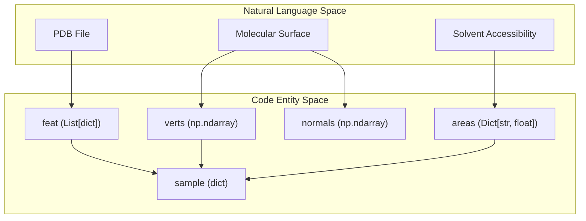

# Molecular Surface Generation (MSMS)

> **Relevant source files**
> * [glinter/points/mesh.py](https://github.com/zw2x/glinter/blob/8871ca11/glinter/points/mesh.py)
> * [glinter/points/msms_parser.py](https://github.com/zw2x/glinter/blob/8871ca11/glinter/points/msms_parser.py)
> * [glinter/points/utils.py](https://github.com/zw2x/glinter/blob/8871ca11/glinter/points/utils.py)
> * [glinter/points/xyzrn.py](https://github.com/zw2x/glinter/blob/8871ca11/glinter/points/xyzrn.py)
> * [preprocess/export_ply.py](https://github.com/zw2x/glinter/blob/8871ca11/preprocess/export_ply.py)
> * [preprocess/msms_builder.py](https://github.com/zw2x/glinter/blob/8871ca11/preprocess/msms_builder.py)
> * [scripts/run_msms.sh](https://github.com/zw2x/glinter/blob/8871ca11/scripts/run_msms.sh)

The Molecular Surface Generation stage is a critical preprocessing step that transforms raw PDB structures into geometric surface meshes. This process provides the `AtomGCN` encoder with high-resolution structural information, including Solvent Accessible Surface (SAS) areas and vertex normals, which are essential for predicting inter-protein contacts.

## Surface Generation Workflow

The generation pipeline relies on two external tools: **Reduce** for hydrogen addition/optimization and **MSMS** (Maximum Speed Molecular Surface) for mesh triangulation. The workflow is orchestrated by a shell script and a Python-based coordinate parser.

### External Tool Integration

The process is primarily managed by `scripts/run_msms.sh`, which executes the following sequence:

1. **Hydrogen Optimization**: `reduce` is called twice. First with `-Trim` to remove existing hydrogens, and then with `-HIS` to add and optimize hydrogens based on local chemical environments [scripts/run_msms.sh L22-L24](https://github.com/zw2x/glinter/blob/8871ca11/scripts/run_msms.sh#L22-L24)
2. **Coordinate Conversion**: The reduced PDB is converted into an `.xyzrn` format (X, Y, Z, Radius, Name) using `glinter/points/xyzrn.py` [scripts/run_msms.sh L29](https://github.com/zw2x/glinter/blob/8871ca11/scripts/run_msms.sh#L29-L29)
3. **Mesh Triangulation**: The `msms` binary is executed with a probe radius of 1.5Å and a density of 3.0 to produce `.vert` (vertices), `.face` (triangles), and `.area` (surface area) files [scripts/run_msms.sh L31](https://github.com/zw2x/glinter/blob/8871ca11/scripts/run_msms.sh#L31-L31)

### Data Flow: PDB to XYZRN

The conversion from PDB to MSMS-compatible input involves mapping atom types to their respective Van der Waals radii.

| Step | Component | Action |
| --- | --- | --- |
| **Input** | `PDBParser` | Loads `.reduced.pdb` structure [glinter/points/xyzrn.py L26-L27](https://github.com/zw2x/glinter/blob/8871ca11/glinter/points/xyzrn.py#L26-L27) |
| **Mapping** | `radii` | Retrieves atomic radius for each atom type [glinter/points/xyzrn.py L38](https://github.com/zw2x/glinter/blob/8871ca11/glinter/points/xyzrn.py#L38-L38) |
| **Naming** | `full_id` | Generates unique atom identifier: `{chain}_{resid}_{resname}_{atom}` [glinter/points/xyzrn.py L43-L45](https://github.com/zw2x/glinter/blob/8871ca11/glinter/points/xyzrn.py#L43-L45) |
| **Output** | `.xyzrn` | Writes space-separated coordinates, radius, and identifier [glinter/points/xyzrn.py L47-L49](https://github.com/zw2x/glinter/blob/8871ca11/glinter/points/xyzrn.py#L47-L49) |

**Sources:** [scripts/run_msms.sh L1-L50](https://github.com/zw2x/glinter/blob/8871ca11/scripts/run_msms.sh#L1-L50)

 [glinter/points/xyzrn.py L1-L54](https://github.com/zw2x/glinter/blob/8871ca11/glinter/points/xyzrn.py#L1-L54)

---

## Mesh Parsing and Processing

Once MSMS has generated the surface files, the `msms_builder.py` script parses these raw text files into structured Python objects for downstream tensorization.

### Parsing Implementation

The `read_msms` function handles the binary/text conversion of the surface geometry:

* **Vertices**: Extracted from `.vert` files, containing XYZ coordinates and NX, NY, NZ normal vectors [glinter/points/mesh.py L23-L25](https://github.com/zw2x/glinter/blob/8871ca11/glinter/points/mesh.py#L23-L25)
* **Faces**: Extracted from `.face` files. The indices are shifted by -1 to convert from MSMS 1-based indexing to Python 0-based indexing [glinter/points/mesh.py L41](https://github.com/zw2x/glinter/blob/8871ca11/glinter/points/mesh.py#L41-L41)

### Point Sampling

To ensure a consistent density for the `AtomGCN`, the mesh is processed using the `trimesh` library in `sample_points`:

1. **Validation**: A `tm.Trimesh` object is created to validate the mesh and reweight vertex normals [glinter/points/mesh.py L54-L59](https://github.com/zw2x/glinter/blob/8871ca11/glinter/points/mesh.py#L54-L59)
2. **Connectivity Check**: Optionally identifies the largest connected component to remove disconnected artifacts [glinter/points/mesh.py L60-L72](https://github.com/zw2x/glinter/blob/8871ca11/glinter/points/mesh.py#L60-L72)
3. **Downsampling**: Close vertices are removed based on a `resolution` parameter (default 0.8) to prevent over-representation of dense regions [glinter/points/mesh.py L76-L78](https://github.com/zw2x/glinter/blob/8871ca11/glinter/points/mesh.py#L76-L78)

**Sources:** [glinter/points/mesh.py L11-L80](https://github.com/zw2x/glinter/blob/8871ca11/glinter/points/mesh.py#L11-L80)

 [preprocess/msms_builder.py L231-L236](https://github.com/zw2x/glinter/blob/8871ca11/preprocess/msms_builder.py#L231-L236)

---

## Feature Aggregation

The final structural representation is a dictionary-based feature set that links geometric data (vertices, areas) back to the protein sequence.

### Entity Relationship Diagram

The following diagram illustrates how the preprocessing code associates physical surface properties with code-level data structures.

### Key Implementation Functions

* **`read_areas(path)`**: Parses the `.area` file to create a mapping of atom identifiers to their SASA (Solvent Accessible Surface Area) values [preprocess/msms_builder.py L20-L36](https://github.com/zw2x/glinter/blob/8871ca11/preprocess/msms_builder.py#L20-L36)
* **`read_dssp(coords, model, path)`**: Integrates secondary structure information (Alpha helix, Beta strand, etc.) and Phi/Psi angles into the residue features [preprocess/msms_builder.py L96-L136](https://github.com/zw2x/glinter/blob/8871ca11/preprocess/msms_builder.py#L96-L136)
* **`collect_features(coords, atom_feats, residue_feats)`**: The central aggregator. It iterates through residues and atoms, attaching the SAS values and DSSP codes to a nested dictionary structure [preprocess/msms_builder.py L138-L176](https://github.com/zw2x/glinter/blob/8871ca11/preprocess/msms_builder.py#L138-L176)

### Final Feature Structure

The output of `dump_feature` is a `.feat` file containing a pickled dictionary with the following keys:

* `name`: The chain/monomer identifier [preprocess/msms_builder.py L224](https://github.com/zw2x/glinter/blob/8871ca11/preprocess/msms_builder.py#L224-L224)
* `feat`: A list of residues, each containing a sub-dictionary of `atoms` (with `coord` and `sas`) and `dssp` data [preprocess/msms_builder.py L209-L213](https://github.com/zw2x/glinter/blob/8871ca11/preprocess/msms_builder.py#L209-L213)
* `verts`: Sampled surface vertex coordinates [preprocess/msms_builder.py L231](https://github.com/zw2x/glinter/blob/8871ca11/preprocess/msms_builder.py#L231-L231)
* `normals`: Surface normal vectors for each vertex [preprocess/msms_builder.py L231](https://github.com/zw2x/glinter/blob/8871ca11/preprocess/msms_builder.py#L231-L231)

**Sources:** [preprocess/msms_builder.py L138-L236](https://github.com/zw2x/glinter/blob/8871ca11/preprocess/msms_builder.py#L138-L236)

 [glinter/points/msms_parser.py L7-L57](https://github.com/zw2x/glinter/blob/8871ca11/glinter/points/msms_parser.py#L7-L57)