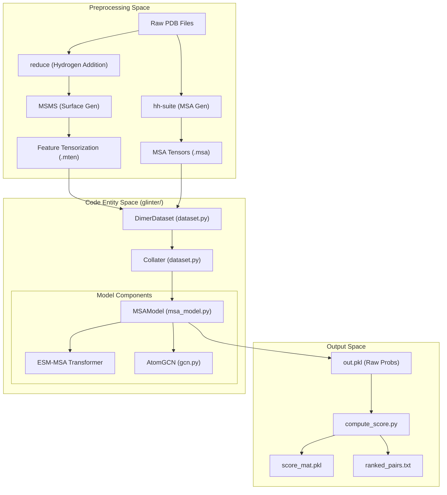

# Overview

> **Relevant source files**
> * [README.md](https://github.com/zw2x/glinter/blob/8871ca11/README.md?plain=1)
> * [glinter/__init__.py](https://github.com/zw2x/glinter/blob/8871ca11/glinter/__init__.py)
> * [setup.py](https://github.com/zw2x/glinter/blob/8871ca11/setup.py)

**GLINTER** (Graph Learning of INTER-protein contacts) is a deep learning framework designed to predict residue-level contacts between two interacting proteins (heterodimers or homodimers). It leverages a multi-modal approach, combining evolutionary information from Multiple Sequence Alignments (MSAs) with geometric and structural features derived from protein surfaces and 3D coordinates.

The system is particularly optimized for high-precision contact prediction, which can be used for protein docking refinement or downstream structural modeling. GLINTER can also be integrated with AlphaFold-Multimer to refine predicted complex structures [README.md L56-L58](https://github.com/zw2x/glinter/blob/8871ca11/README.md?plain=1#L56-L58)

### High-Level Architecture

GLINTER operates as a pipeline that transforms raw PDB files and sequences into a unified graph-based representation. The core architecture, implemented in `MSAModel`, fuses three distinct information streams:

1. **Evolutionary Space**: Utilizes the ESM-MSA Transformer (`esm_msa1_t12_100M_UR50S`) to extract co-evolutionary signals from paired MSAs [README.md L19](https://github.com/zw2x/glinter/blob/8871ca11/README.md?plain=1#L19-L19)
2. **Geometric Space**: Employs an `AtomGCN` (Geometric Graph Encoder) to process structural graphs, including Cα-graphs, atom-graphs, and surface-mesh graphs generated via MSMS [setup.py L15](https://github.com/zw2x/glinter/blob/8871ca11/setup.py#L15-L15)
3. **Structural Features**: Incorporates per-residue features such as secondary structure and solvent accessibility.

### System Components and Data Flow

The following diagram illustrates how the natural language concepts of the pipeline map to specific code entities and scripts within the repository.

**GLINTER Pipeline: From PDB to Contact Map**

Sources: [README.md L13-L19](https://github.com/zw2x/glinter/blob/8871ca11/README.md?plain=1#L13-L19)

 [README.md L45-L54](https://github.com/zw2x/glinter/blob/8871ca11/README.md?plain=1#L45-L54)

 [setup.py L11-L17](https://github.com/zw2x/glinter/blob/8871ca11/setup.py#L11-L17)

### Key Concepts

* **Multi-Graph Representation**: Unlike standard GNNs that only use Cα distances, GLINTER constructs a complex graph including surface vertices and all-atom nodes to capture the physical interface more accurately.
* **Heterodimer vs. Homodimer Handling**: The pipeline provides specific workflows for different dimer types. Heterodimers require reciprocal predictions (A:B and B:A), while homodimers use a representative monomer for MSA building [README.md L34-L42](https://github.com/zw2x/glinter/blob/8871ca11/README.md?plain=1#L34-L42)
* **Taxonomy-Aware MSA**: For effective co-evolutionary analysis, MSAs are processed to ensure hits are paired correctly across species using taxonomy headers [README.md L61-L63](https://github.com/zw2x/glinter/blob/8871ca11/README.md?plain=1#L61-L63)

### Subsystem Integration

The repository is organized into several functional areas that collaborate to produce the final contact prediction:

| Subsystem | Primary Role | Key Files |
| --- | --- | --- |
| **Preprocessing** | Converts PDBs to meshes and MSAs to tensors. | `scripts/build_hetero.sh`, `glinter/protein/` |
| **Model Core** | Neural network architecture fusing GCN and ESM. | `glinter/model/msa_model.py`, `glinter/model/gcn.py` |
| **Data Loading** | Handles batching of heterogeneous graph data. | `glinter/model/dataset.py` |
| **Inference** | Generates and ranks contact probabilities. | `scripts/compute_score.py`, `ckpts/glinter1.pt` |

**Code Association: Data Loading and Model Entry**

Sources: [README.md L45-L51](https://github.com/zw2x/glinter/blob/8871ca11/README.md?plain=1#L45-L51)

 [setup.py L18-L27](https://github.com/zw2x/glinter/blob/8871ca11/setup.py#L18-L27)

### Next Steps

For detailed technical documentation on specific parts of the system, refer to the following child pages:

* **[Getting Started](/zw2x/glinter/1.1-getting-started)**: Detailed installation instructions for external dependencies like `reduce`, `MSMS`, and `hh-suite`, and running your first example.
* **[End-to-End Prediction Workflow](/zw2x/glinter/1.2-end-to-end-prediction-workflow)**: A deep dive into the `build_hetero.sh` and `build_homo.sh` scripts, explaining how data flows from input PDBs to the final `ranked_pairs.txt`.

Sources: [README.md L1-L65](https://github.com/zw2x/glinter/blob/8871ca11/README.md?plain=1#L1-L65)

 [setup.py L1-L30](https://github.com/zw2x/glinter/blob/8871ca11/setup.py#L1-L30)