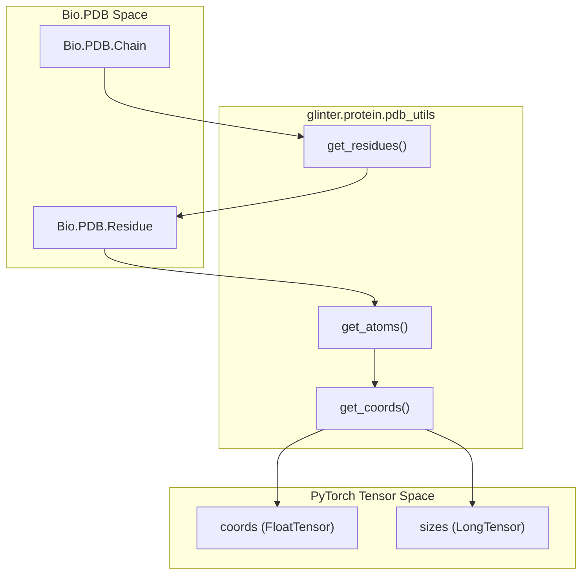
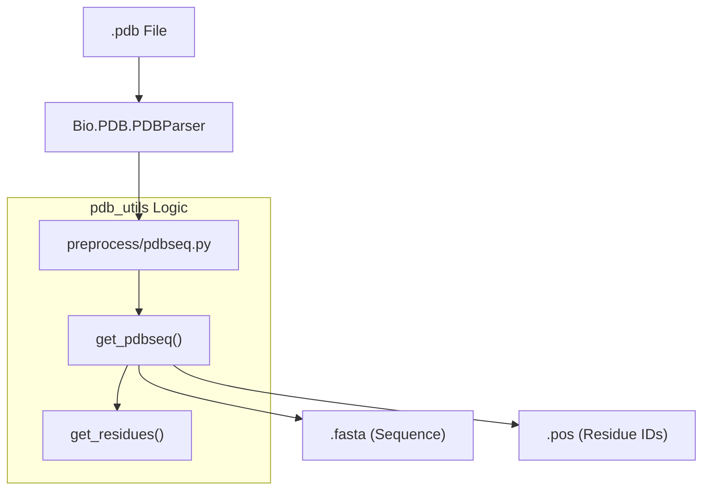

# PDB Parsing and Coordinate Extraction

> **Relevant source files**
> * [glinter/protein/pdb_utils.py](https://github.com/zw2x/glinter/blob/8871ca11/glinter/protein/pdb_utils.py)
> * [preprocess/pdbseq.py](https://github.com/zw2x/glinter/blob/8871ca11/preprocess/pdbseq.py)

The `glinter.protein.pdb_utils` module serves as the primary interface for transforming raw Biopython PDB objects into the filtered residue lists and coordinate tensors required by GLINTER. It enforces structural integrity by filtering out incomplete residues and provides density-based sequence extraction to ensure the quality of structural inputs.

## Residue Filtering and Integrity Checks

GLINTER requires complete backbone information for every residue included in the model's graph representations. The `get_residues` function implements a strict filtering logic to prune the PDB structure before any feature extraction occurs.

### Filtering Logic in get_residues

1. **HETATOM and Insertion Codes**: Residues are excluded if they are flagged as hetero-atoms (`hetatom != ' '`) or if they contain insertion codes (`icode != ' '`) [glinter/protein/pdb_utils.py L34-L36](https://github.com/zw2x/glinter/blob/8871ca11/glinter/protein/pdb_utils.py#L34-L36) .
2. **Backbone Completeness**: A residue is only considered valid if it contains all three primary backbone atoms: **N**, **CA**, and **C** [glinter/protein/pdb_utils.py L38-L41](https://github.com/zw2x/glinter/blob/8871ca11/glinter/protein/pdb_utils.py#L38-L41) . If any of these atoms are missing, the entire residue is discarded.
3. **Disorder Handling**: The function utilizes `residue.get_list()` which, in the Biopython PDB hierarchy, defaults to selecting the first occupancy/location if a residue or atom is disordered [glinter/protein/pdb_utils.py L33](https://github.com/zw2x/glinter/blob/8871ca11/glinter/protein/pdb_utils.py#L33-L33) .

### Sequence Extraction and Density Guard

The `get_pdbseq` function extracts the amino acid sequence from a chain while optionally enforcing a "density" threshold [glinter/protein/pdb_utils.py L12-L29](https://github.com/zw2x/glinter/blob/8871ca11/glinter/protein/pdb_utils.py#L12-L29)

.

* **Density Calculation**: The ratio of valid residues (post-filtering) to the highest residue ID index must exceed the `thr` parameter (default 0.95) [glinter/protein/pdb_utils.py L19](https://github.com/zw2x/glinter/blob/8871ca11/glinter/protein/pdb_utils.py#L19-L19) . This prevents the use of structures with massive internal gaps that would compromise the geometric graph.
* **Sequence Mapping**: It returns the single-letter sequence (converted via `three_to_one`) and can optionally return the original PDB residue indices (`pos`) [glinter/protein/pdb_utils.py L20-L27](https://github.com/zw2x/glinter/blob/8871ca11/glinter/protein/pdb_utils.py#L20-L27) .

## Coordinate Tensorization

Coordinate extraction is handled by `get_coords`, which converts filtered structural data into PyTorch tensors suitable for the `AtomGCN` geometric encoder.

### Data Flow: PDB to Tensor

1. **Atom Selection**: For each valid residue, `get_atoms` is called to retrieve specific atom objects [glinter/protein/pdb_utils.py L59-L62](https://github.com/zw2x/glinter/blob/8871ca11/glinter/protein/pdb_utils.py#L59-L62) . * If `return_ca` is True, only the Cα atom is returned [glinter/protein/pdb_utils.py L46-L47](https://github.com/zw2x/glinter/blob/8871ca11/glinter/protein/pdb_utils.py#L46-L47) . * Otherwise, all atoms are returned, with an option to `ignore_h` (Hydrogen) [glinter/protein/pdb_utils.py L51-L54](https://github.com/zw2x/glinter/blob/8871ca11/glinter/protein/pdb_utils.py#L51-L54) .
2. **Concatenation**: The coordinates are extracted from `atom.coord` and concatenated into a single `torch.FloatTensor` of shape `[TotalAtoms, 3]` [glinter/protein/pdb_utils.py L66-L68](https://github.com/zw2x/glinter/blob/8871ca11/glinter/protein/pdb_utils.py#L66-L68) .
3. **Metadata**: A `torch.LongTensor` named `sizes` is returned, containing the number of atoms per residue, allowing the model to reconstruct residue-to-atom mappings [glinter/protein/pdb_utils.py L65-L69](https://github.com/zw2x/glinter/blob/8871ca11/glinter/protein/pdb_utils.py#L65-L69) .

### Structural Extraction Workflow

The following diagram illustrates how `pdb_utils.py` entities interact to transform a `Bio.PDB.Chain` into tensors.

**Figure 1: PDB to Tensor Extraction Workflow**

**Sources:** [glinter/protein/pdb_utils.py L31-L69](https://github.com/zw2x/glinter/blob/8871ca11/glinter/protein/pdb_utils.py#L31-L69)

## Preprocessing Integration

The utilities in `pdb_utils.py` are primarily consumed by the `preprocess/` scripts to generate the initial FASTA files and residue position maps required for MSA generation and structural alignment.

### preprocess/pdbseq.py

This script acts as a wrapper to convert a single-chain PDB file into a FASTA file and a `.pos` file.

* It sets `thr=-1` when calling `get_pdbseq` to disable the density guard, ensuring that a sequence is generated even for sparse structures during the initial preprocessing phase [preprocess/pdbseq.py L12](https://github.com/zw2x/glinter/blob/8871ca11/preprocess/pdbseq.py#L12-L12) .
* It outputs the sequence to a `.fasta` file and the residue indices to a space-separated text file [preprocess/pdbseq.py L19-L24](https://github.com/zw2x/glinter/blob/8871ca11/preprocess/pdbseq.py#L19-L24) .

**Figure 2: Preprocessing Data Flow**

**Sources:** [preprocess/pdbseq.py L8-L24](https://github.com/zw2x/glinter/blob/8871ca11/preprocess/pdbseq.py#L8-L24)

, [glinter/protein/pdb_utils.py L12-L29](https://github.com/zw2x/glinter/blob/8871ca11/glinter/protein/pdb_utils.py#L12-L29)

## Key Functions Reference

| Function | Purpose | Key Constraints |
| --- | --- | --- |
| `get_residues` | Filters a PDB chain for valid residues. | Must have 'N', 'CA', 'C'; no HETATOMs; no icodes [glinter/protein/pdb_utils.py L31-L43](https://github.com/zw2x/glinter/blob/8871ca11/glinter/protein/pdb_utils.py#L31-L43)   . |
| `get_pdbseq` | Extracts 1-letter AA sequence. | Can enforce a density threshold `thr` [glinter/protein/pdb_utils.py L12-L29](https://github.com/zw2x/glinter/blob/8871ca11/glinter/protein/pdb_utils.py#L12-L29)   . |
| `get_atoms` | Retrieves atoms for a residue. | Handles disorder by selection; can filter Hydrogens [glinter/protein/pdb_utils.py L45-L56](https://github.com/zw2x/glinter/blob/8871ca11/glinter/protein/pdb_utils.py#L45-L56)   . |
| `get_coords` | Generates coordinate tensors. | Returns `coords` [N, 3] and `sizes` [Residues] [glinter/protein/pdb_utils.py L58-L69](https://github.com/zw2x/glinter/blob/8871ca11/glinter/protein/pdb_utils.py#L58-L69)   . |

**Sources:** [glinter/protein/pdb_utils.py L1-L69](https://github.com/zw2x/glinter/blob/8871ca11/glinter/protein/pdb_utils.py#L1-L69)