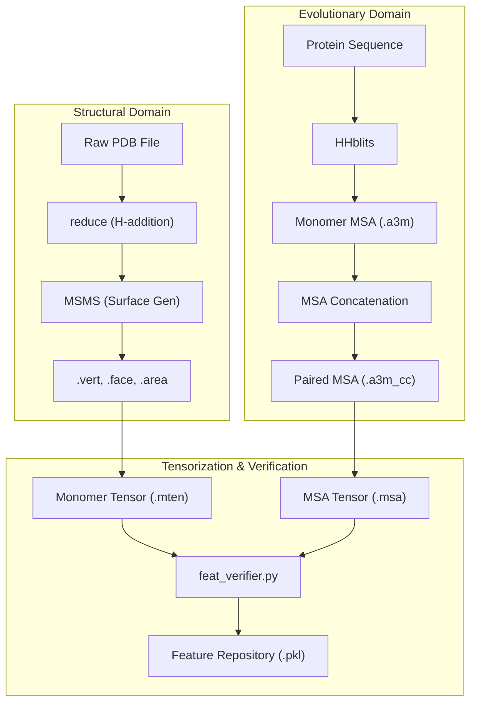
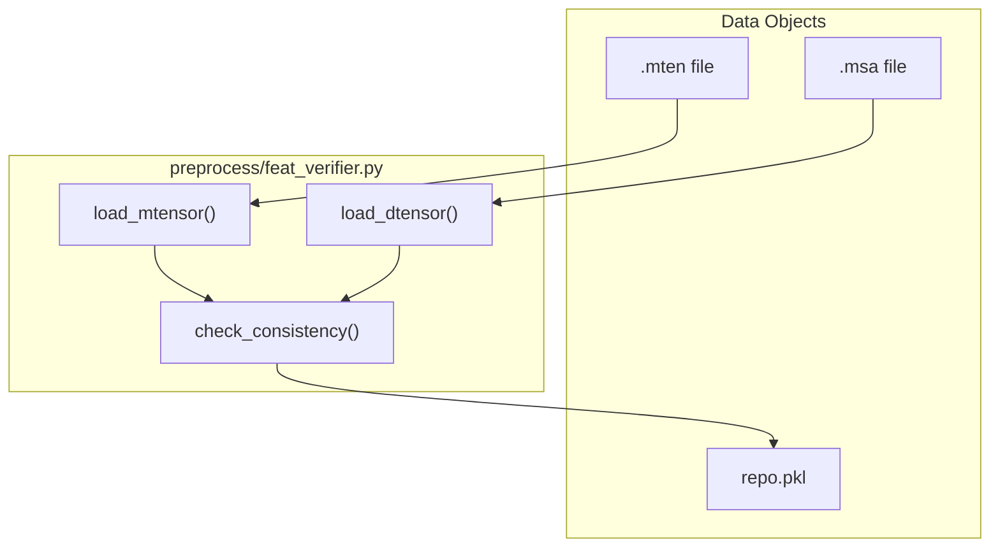

# Preprocessing Pipeline

> **Relevant source files**
> * [preprocess/align.py](https://github.com/zw2x/glinter/blob/8871ca11/preprocess/align.py)
> * [preprocess/feat_verifier.py](https://github.com/zw2x/glinter/blob/8871ca11/preprocess/feat_verifier.py)
> * [preprocess/pdbseq.py](https://github.com/zw2x/glinter/blob/8871ca11/preprocess/pdbseq.py)

The GLINTER preprocessing pipeline transforms raw protein structures (PDB files) and sequences into a unified feature repository used for training and inference. This process involves three primary domains: geometric surface generation, evolutionary sequence analysis, and feature tensorization.

The pipeline ensures that structural information (atoms, residues, and surfaces) is correctly mapped to evolutionary information (Multiple Sequence Alignments) through sequence alignment and consistency checks.

### Pipeline Architecture

The following diagram illustrates the flow from raw data to the final `.pkl` feature repository.

**Data Flow: From Raw Files to Feature Repository**

**Sources:** [preprocess/feat_verifier.py L163-L232](https://github.com/zw2x/glinter/blob/8871ca11/preprocess/feat_verifier.py#L163-L232)

 [preprocess/pdbseq.py L8-L14](https://github.com/zw2x/glinter/blob/8871ca11/preprocess/pdbseq.py#L8-L14)

---

### 2.1 Molecular Surface Generation (MSMS)

The structural component of the pipeline focuses on generating a high-fidelity molecular surface. Raw PDB files are first processed to add missing hydrogen atoms using the `reduce` tool. Subsequently, the **Michel Sanner’s Molecular Surface (MSMS)** software is used to generate the Solvent Excluded Surface (SES).

The output consists of vertex coordinates, face indices, and atomic surface areas, which are parsed into Python data structures for graph construction.

For details, see [Molecular Surface Generation (MSMS)](/zw2x/glinter/2.1-molecular-surface-generation-(msms)).

---

### 2.2 MSA Generation and Concatenation

Evolutionary features are derived from Multiple Sequence Alignments (MSAs). The pipeline uses `HHblits` to search against sequence databases and generate per-monomer MSAs. For dimer contact prediction, these monomer MSAs are filtered and concatenated into a paired format (`.a3m_cc`).

This stage involves:

* Generating monomeric `.a3m` files.
* Applying `HHfilter` to reduce redundancy.
* Concatenating alignments based on organism identifiers or genomic distance (for prokaryotes).

For details, see [MSA Generation and Concatenation](/zw2x/glinter/2.2-msa-generation-and-concatenation).

---

### 2.3 Feature Tensorization

The final stage of preprocessing involves converting structural and evolutionary data into PyTorch-compatible tensors and verifying their consistency.

#### Key Components:

* **Monomer Tensors (`.mten`)**: Contain atom coordinates, residue types, secondary structure, and surface vertex mappings [preprocess/feat_verifier.py L24-L29](https://github.com/zw2x/glinter/blob/8871ca11/preprocess/feat_verifier.py#L24-L29)
* **MSA Tensors (`.msa`)**: Contain the encoded paired MSA sequences and HHM profiles [preprocess/feat_verifier.py L17-L22](https://github.com/zw2x/glinter/blob/8871ca11/preprocess/feat_verifier.py#L17-L22)
* **Consistency Verification**: The `feat_verifier.py` script ensures that the sequences in the structural tensors match the query sequences in the MSA tensors using CIGAR-based alignments [preprocess/feat_verifier.py L80-L93](https://github.com/zw2x/glinter/blob/8871ca11/preprocess/feat_verifier.py#L80-L93)

**Entity Mapping: Code to Tensors**

**Sources:** [preprocess/feat_verifier.py L38-L136](https://github.com/zw2x/glinter/blob/8871ca11/preprocess/feat_verifier.py#L38-L136)

 [preprocess/align.py L4-L30](https://github.com/zw2x/glinter/blob/8871ca11/preprocess/align.py#L4-L30)

#### Sequence Alignment Logic

Because structural models often have missing residues or different numbering than the full protein sequence, `align.py` uses `Bio.pairwise2` to generate a mapping between the "PDB sequence" and the "Reference sequence" [preprocess/align.py L41-L45](https://github.com/zw2x/glinter/blob/8871ca11/preprocess/align.py#L41-L45)

 This mapping is stored as a CIGAR string and used by `cigar_to_index` to align evolutionary features with structural nodes [preprocess/feat_verifier.py L82-L84](https://github.com/zw2x/glinter/blob/8871ca11/preprocess/feat_verifier.py#L82-L84)

For details, see [Feature Tensorization](/zw2x/glinter/2.3-feature-tensorization).

**Sources:**

* `preprocess/feat_verifier.py`: [17-37](https://github.com/zw2x/glinter/blob/8871ca11/17-37)  [38-136](https://github.com/zw2x/glinter/blob/8871ca11/38-136)  [163-232](https://github.com/zw2x/glinter/blob/8871ca11/163-232)
* `preprocess/pdbseq.py`: [8-14](https://github.com/zw2x/glinter/blob/8871ca11/8-14)
* `preprocess/align.py`: [4-30](https://github.com/zw2x/glinter/blob/8871ca11/4-30)  [41-48](https://github.com/zw2x/glinter/blob/8871ca11/41-48)