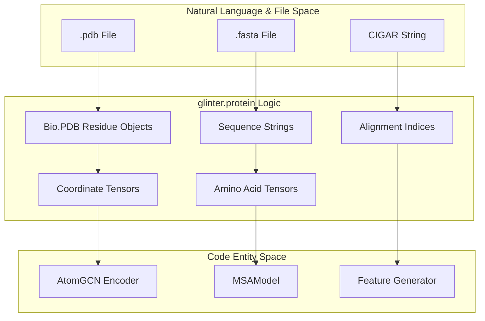
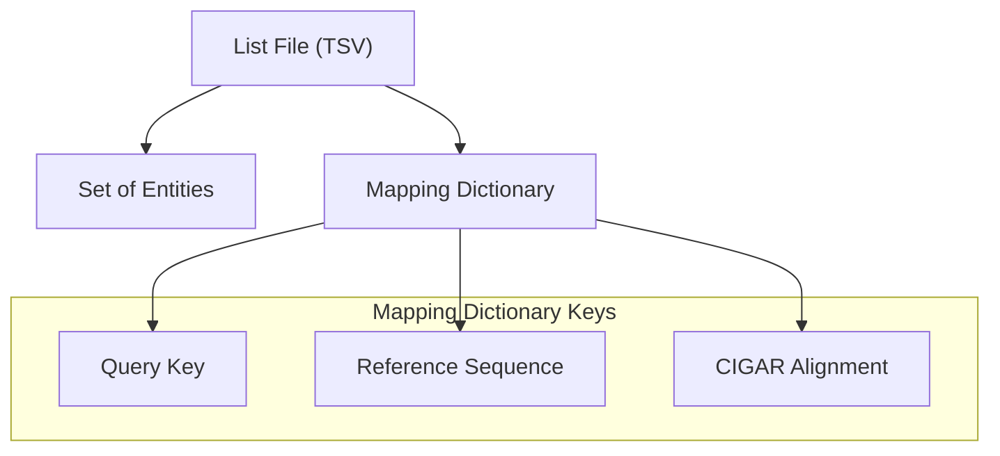

# Protein Utility Library (glinter.protein)

> **Relevant source files**
> * [glinter/protein/__init__.py](https://github.com/zw2x/glinter/blob/8871ca11/glinter/protein/__init__.py)
> * [glinter/protein/align_utils.py](https://github.com/zw2x/glinter/blob/8871ca11/glinter/protein/align_utils.py)
> * [glinter/protein/chemistry.py](https://github.com/zw2x/glinter/blob/8871ca11/glinter/protein/chemistry.py)
> * [glinter/protein/encoding_utils.py](https://github.com/zw2x/glinter/blob/8871ca11/glinter/protein/encoding_utils.py)
> * [glinter/protein/ent_utils.py](https://github.com/zw2x/glinter/blob/8871ca11/glinter/protein/ent_utils.py)
> * [glinter/protein/fasta.py](https://github.com/zw2x/glinter/blob/8871ca11/glinter/protein/fasta.py)
> * [glinter/protein/legacy_utils.py](https://github.com/zw2x/glinter/blob/8871ca11/glinter/protein/legacy_utils.py)
> * [glinter/protein/pdb_utils.py](https://github.com/zw2x/glinter/blob/8871ca11/glinter/protein/pdb_utils.py)

The `glinter.protein` package serves as the foundational utility layer for the GLINTER framework. It provides standardized tools for parsing structural data from PDB files, managing chemical definitions, encoding sequences and secondary structures into tensors, and handling sequence alignments via CIGAR strings. These utilities ensure consistency between the preprocessing pipeline and the core model's data loading mechanisms.

### Library Architecture Overview

The library is organized into specialized modules that handle different aspects of protein data representation:

| Module | Primary Responsibility | Key Entities |
| --- | --- | --- |
| `pdb_utils.py` | Structural parsing and coordinate extraction. | `get_residues`, `get_coords` |
| `encoding_utils.py` | Mapping biological symbols to numerical tensors. | `AA1`, `ATOMS`, `SS8` |
| `align_utils.py` | Processing sequence alignments and CIGAR strings. | `cigar_to_index` |
| `ent_utils.py` | File-based entity management and ID parsing. | `read_ents`, `get_chainid` |
| `chemistry.py` | Chemical constants for surface generation. | `radii`, `polarHydrogens` |
| `fasta.py` | FASTA file parsing. | `read_seqs` |

**Data Flow: From PDB to Tensor Space**

The following diagram illustrates how raw structural data is transformed into the internal representations used by GLINTER.

"Protein Data Transformation Map"

**Sources:** [glinter/protein/pdb_utils.py L7-L69](https://github.com/zw2x/glinter/blob/8871ca11/glinter/protein/pdb_utils.py#L7-L69)

 [glinter/protein/encoding_utils.py L7-L12](https://github.com/zw2x/glinter/blob/8871ca11/glinter/protein/encoding_utils.py#L7-L12)

 [glinter/protein/align_utils.py L25-L60](https://github.com/zw2x/glinter/blob/8871ca11/glinter/protein/align_utils.py#L25-L60)

---

## PDB Parsing and Coordinate Extraction

The `pdb_utils.py` module provides robust filtering for BioPython PDB objects. It is responsible for extracting backbone-complete residues (containing N, CA, and C atoms) and converting their spatial coordinates into PyTorch tensors. This module also includes density guards in `get_pdbseq` to ensure that parsed sequences represent a sufficient fraction of the total chain length.

For details, see [PDB Parsing and Coordinate Extraction](/zw2x/glinter/6.1-pdb-parsing-and-coordinate-extraction).

**Sources:** [glinter/protein/pdb_utils.py L12-L29](https://github.com/zw2x/glinter/blob/8871ca11/glinter/protein/pdb_utils.py#L12-L29)

 [glinter/protein/pdb_utils.py L31-L43](https://github.com/zw2x/glinter/blob/8871ca11/glinter/protein/pdb_utils.py#L31-L43)

 [glinter/protein/pdb_utils.py L58-L69](https://github.com/zw2x/glinter/blob/8871ca11/glinter/protein/pdb_utils.py#L58-L69)

---

## Sequence Encoding and Alignment Utilities

This component manages the translation of biological data into the numerical format required by neural networks. `encoding_utils.py` defines dictionaries and one-hot encoding logic for:

* **Amino Acids:** Standard 20 types plus 'X' for unknown [glinter/protein/encoding_utils.py L76-L83](https://github.com/zw2x/glinter/blob/8871ca11/glinter/protein/encoding_utils.py#L76-L83)
* **Atom Types:** Specific mappings for CA, N, C, CB, O, and generalized types like NX, CX, SX [glinter/protein/encoding_utils.py L36-L38](https://github.com/zw2x/glinter/blob/8871ca11/glinter/protein/encoding_utils.py#L36-L38)
* **Secondary Structure:** 8-state (SS8) encoding (HBEGITS-) [glinter/protein/encoding_utils.py L63](https://github.com/zw2x/glinter/blob/8871ca11/glinter/protein/encoding_utils.py#L63-L63)

Additionally, `align_utils.py` provides `cigar_to_index`, which converts standard CIGAR alignment strings into index tensors for mapping between query and target sequences.

For details, see [Sequence Encoding and Alignment Utilities](/zw2x/glinter/6.2-sequence-encoding-and-alignment-utilities).

**Sources:** [glinter/protein/encoding_utils.py L36-L94](https://github.com/zw2x/glinter/blob/8871ca11/glinter/protein/encoding_utils.py#L36-L94)

 [glinter/protein/align_utils.py L25-L60](https://github.com/zw2x/glinter/blob/8871ca11/glinter/protein/align_utils.py#L25-L60)

---

## Chemical and Entity Management

The library includes comprehensive definitions for molecular surface generation and file-based entity tracking.

### Chemistry Definitions

`chemistry.py` stores parameters originally derived from the MaSIF project, including Van der Waals radii for different atom types and specific polar hydrogen naming conventions used by the `reduce` program. These are critical for the surface feature generation stage.

**Sources:** [glinter/protein/chemistry.py L8-L39](https://github.com/zw2x/glinter/blob/8871ca11/glinter/protein/chemistry.py#L8-L39)

### Entity and Mapping Utilities

`ent_utils.py` provides helpers for parsing complex entity lists and sequence maps. It handles chain ID normalization (e.g., converting empty IDs to '*') and parses the `.seqmap` files that link PDB chains to their corresponding MSA sequences.

"Entity Mapping Logic"

**Sources:** [glinter/protein/ent_utils.py L10-L14](https://github.com/zw2x/glinter/blob/8871ca11/glinter/protein/ent_utils.py#L10-L14)

 [glinter/protein/ent_utils.py L26-L49](https://github.com/zw2x/glinter/blob/8871ca11/glinter/protein/ent_utils.py#L26-L49)

 [glinter/protein/ent_utils.py L51-L90](https://github.com/zw2x/glinter/blob/8871ca11/glinter/protein/ent_utils.py#L51-L90)