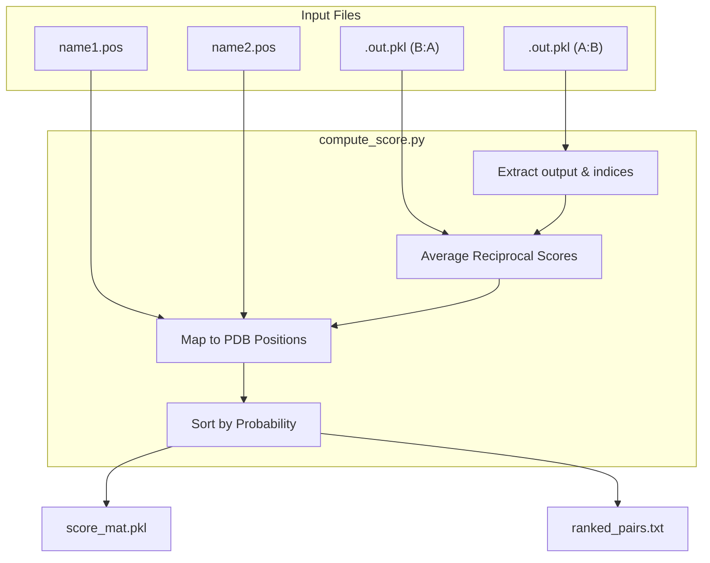
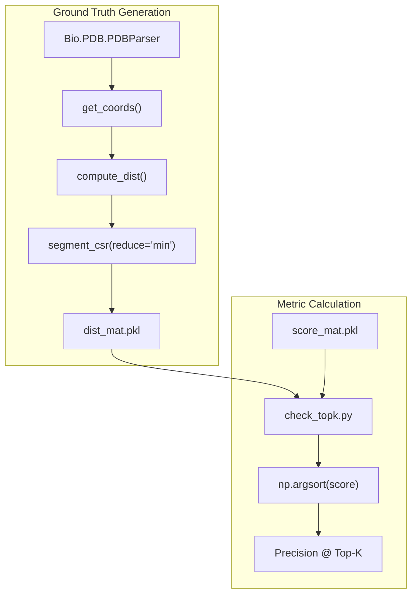

# Score Post-Processing and Evaluation

> **Relevant source files**
> * [scripts/check_topk.py](https://github.com/zw2x/glinter/blob/8871ca11/scripts/check_topk.py)
> * [scripts/compute_dist.py](https://github.com/zw2x/glinter/blob/8871ca11/scripts/compute_dist.py)
> * [scripts/compute_score.py](https://github.com/zw2x/glinter/blob/8871ca11/scripts/compute_score.py)

This page details the final stage of the GLINTER pipeline, where raw model logits are transformed into human-readable residue contact rankings and evaluated against ground-truth structures. The process involves aggregating reciprocal predictions, mapping internal model indices back to original residue positions, and calculating performance metrics such as Top-K accuracy.

## Post-Processing Workflow

The primary script for post-processing is `scripts/compute_score.py`. It processes the output files generated by the inference engine to produce a unified score matrix and a ranked list of potential inter-protein contacts.

### Score Aggregation and Reciprocity

GLINTER typically performs two inference passes for a dimer (A:B and B:A) to ensure consistency. `compute_score.py` aggregates these by averaging the exponential of the logits (converting them to probabilities).

1. **Loading Predictions**: The script loads `.out.pkl` files which contain the `model` dictionary, including the raw `output` tensor and index mapping tensors `recidx` and `ligidx` [scripts/compute_score.py L14-L18](https://github.com/zw2x/glinter/blob/8871ca11/scripts/compute_score.py#L14-L18)
2. **Symmetry Averaging**: If a reciprocal prediction (e.g., `name2:name1.out.pkl`) exists, its score matrix is transposed and averaged with the primary prediction [scripts/compute_score.py L19-L23](https://github.com/zw2x/glinter/blob/8871ca11/scripts/compute_score.py#L19-L23)
3. **Coordinate Mapping**: The script maps the model's internal indices to the original residue positions provided in `.pos` files. This ensures that the final output refers to the biological sequence numbering rather than 0-based tensor indices [scripts/compute_score.py L28-L32](https://github.com/zw2x/glinter/blob/8871ca11/scripts/compute_score.py#L28-L32)

### Output Generation

The script produces two main artifacts:

* `score_mat.pkl`: A serialized NumPy matrix containing the final averaged probabilities for all residue pairs [scripts/compute_score.py L48-L49](https://github.com/zw2x/glinter/blob/8871ca11/scripts/compute_score.py#L48-L49)
* `ranked_pairs.txt`: A text file listing residue pairs sorted by their predicted probability in descending order [scripts/compute_score.py L50-L53](https://github.com/zw2x/glinter/blob/8871ca11/scripts/compute_score.py#L50-L53)

### Data Flow: Inference to Scoring

| Entity | Role | Source |
| --- | --- | --- |
| `name1:name2.out.pkl` | Contains `output` (logits) and `recidx`/`ligidx` (alignment indices). | `msa_model.py` |
| `name.pos` | Maps model residue indices to PDB sequence positions. | `scripts/compute_score.py:45-46` |
| `show()` | Function that aggregates reciprocal scores and ranks pairs. | `scripts/compute_score.py:13-40` |
| `ranked_pairs.txt` | Final tab-separated output: `seq1 seq2 prob`. | `scripts/compute_score.py:50-53` |

**Sources:** [scripts/compute_score.py L1-L53](https://github.com/zw2x/glinter/blob/8871ca11/scripts/compute_score.py#L1-L53)

## Implementation Detail: Mapping and Ranking

The following diagram illustrates how `compute_score.py` bridges the gap between the neural network's tensor space and the biological residue space.

### Score Post-Processing Logic

**Sources:** [scripts/compute_score.py L5-L40](https://github.com/zw2x/glinter/blob/8871ca11/scripts/compute_score.py#L5-L40)

## Evaluation Utilities

GLINTER provides two specialized scripts to evaluate the quality of predicted contacts against known experimental structures.

### Distance Computation (compute_dist.py)

This script calculates the ground-truth minimum heavy-atom distance between all residue pairs in a dimer structure.

* **Coordinate Extraction**: It uses `glinter.protein.pdb_utils.get_coords` to retrieve all non-hydrogen atom coordinates for each chain [scripts/compute_dist.py L52-L57](https://github.com/zw2x/glinter/blob/8871ca11/scripts/compute_dist.py#L52-L57)
* **Segmented Minimum Distance**: The function `compute_dist` calculates the Euclidean distance between all atoms of two residues and uses `torch_scatter.segment_csr` with a `min` reduction to determine the closest contact point between those residues [scripts/compute_dist.py L19-L30](https://github.com/zw2x/glinter/blob/8871ca11/scripts/compute_dist.py#L19-L30)
* **Output**: A distance matrix saved as a `.pkl` file [scripts/compute_dist.py L65-L66](https://github.com/zw2x/glinter/blob/8871ca11/scripts/compute_dist.py#L65-L66)

### Top-K Accuracy Assessment (check_topk.py)

This script evaluates the precision of the top predicted contacts.

1. **Alignment Filtering**: If the prediction was made on a subset of residues (e.g., due to MSA alignment), the ground-truth distance matrix is sliced using `recidx` and `ligidx` to match the model's output dimensions [scripts/check_topk.py L35-L37](https://github.com/zw2x/glinter/blob/8871ca11/scripts/check_topk.py#L35-L37)
2. **Metric Calculation**: It calculates the fraction of the top $K$ predicted pairs that have a ground-truth distance $\le 8\text{\AA}$ [scripts/check_topk.py L31-L44](https://github.com/zw2x/glinter/blob/8871ca11/scripts/check_topk.py#L31-L44)
3. **Standard K-values**: It typically reports accuracy for $K = {10, 25, 50, L/10, L/5}$, where $L$ is the length of the shorter protein [scripts/check_topk.py L31-L42](https://github.com/zw2x/glinter/blob/8871ca11/scripts/check_topk.py#L31-L42)

**Sources:** [scripts/compute_dist.py L1-L66](https://github.com/zw2x/glinter/blob/8871ca11/scripts/compute_dist.py#L1-L66)

 [scripts/check_topk.py L1-L45](https://github.com/zw2x/glinter/blob/8871ca11/scripts/check_topk.py#L1-L45)

## Code Entity Mapping

The following diagram maps the logical evaluation flow to specific functions and variables within the evaluation scripts.

### Evaluation Code Space

**Sources:** [scripts/compute_dist.py L19-L30](https://github.com/zw2x/glinter/blob/8871ca11/scripts/compute_dist.py#L19-L30)

 [scripts/check_topk.py L30-L45](https://github.com/zw2x/glinter/blob/8871ca11/scripts/check_topk.py#L30-L45)

 [glinter/protein/pdb_utils.py L1-L10](https://github.com/zw2x/glinter/blob/8871ca11/glinter/protein/pdb_utils.py#L1-L10)