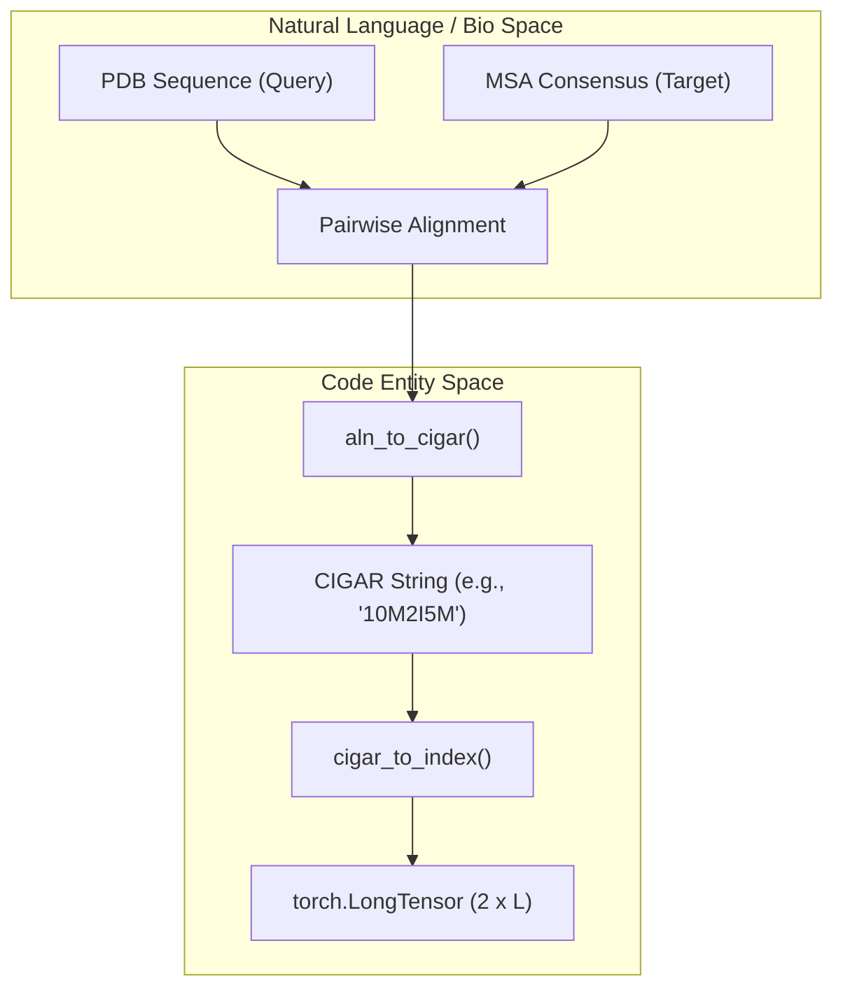
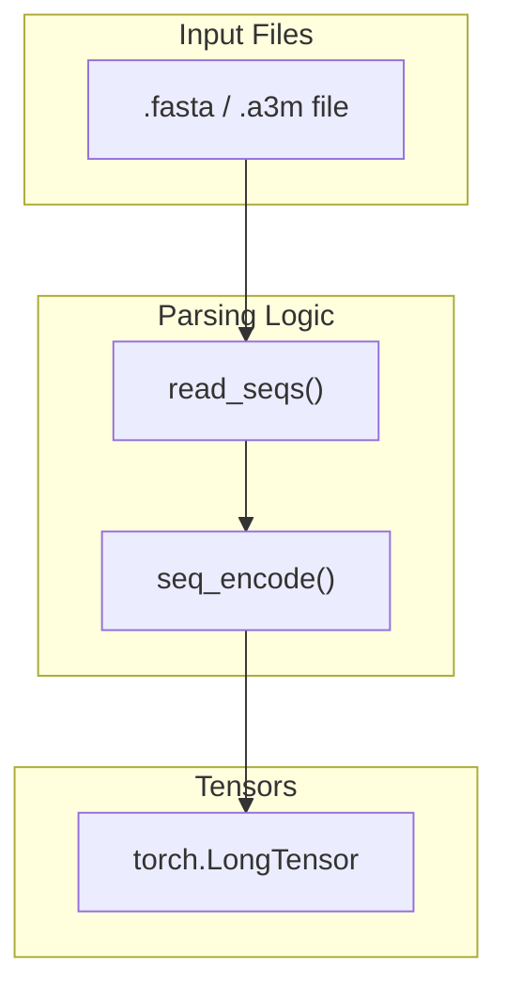

# Sequence Encoding and Alignment Utilities

> **Relevant source files**
> * [glinter/protein/align_utils.py](https://github.com/zw2x/glinter/blob/8871ca11/glinter/protein/align_utils.py)
> * [glinter/protein/chemistry.py](https://github.com/zw2x/glinter/blob/8871ca11/glinter/protein/chemistry.py)
> * [glinter/protein/encoding_utils.py](https://github.com/zw2x/glinter/blob/8871ca11/glinter/protein/encoding_utils.py)
> * [glinter/protein/fasta.py](https://github.com/zw2x/glinter/blob/8871ca11/glinter/protein/fasta.py)
> * [preprocess/align.py](https://github.com/zw2x/glinter/blob/8871ca11/preprocess/align.py)

This section details the low-level utilities used for converting biological sequences, atom types, and structural properties into numerical tensors. It also covers the alignment logic used to map indices between different sequence representations (e.g., PDB-derived sequences vs. MSA sequences).

## 1. Sequence and Structural Encoding

The encoding layer converts categorical biological data into integer indices or one-hot vectors for neural network consumption. These utilities are primarily defined in `glinter/protein/encoding_utils.py`.

### Amino Acid and Secondary Structure Encoding

GLINTER supports standard 20 amino acids plus an 'X' token for unknown residues. It also encodes 8-state secondary structure (SS8) definitions.

* **Amino Acids (AA1):** Uses a dictionary mapping for the 20 standard residues plus 'X' [glinter/protein/encoding_utils.py L76-L81](https://github.com/zw2x/glinter/blob/8871ca11/glinter/protein/encoding_utils.py#L76-L81)  The `encode_aa1` function produces either index tensors or one-hot embeddings [glinter/protein/encoding_utils.py L88-L94](https://github.com/zw2x/glinter/blob/8871ca11/glinter/protein/encoding_utils.py#L88-L94)
* **Secondary Structure (SS8):** Maps the symbols `HBEGITS-` to numerical indices [glinter/protein/encoding_utils.py L63-L71](https://github.com/zw2x/glinter/blob/8871ca11/glinter/protein/encoding_utils.py#L63-L71)
* **Conversion:** Utilities `three_to_one` and `one_to_three` handle the mapping between 3-letter and 1-letter residue codes [glinter/protein/encoding_utils.py L103-L107](https://github.com/zw2x/glinter/blob/8871ca11/glinter/protein/encoding_utils.py#L103-L107)

### Atom Type Encoding

Atom types are categorized to facilitate graph-based structural encoding. The `ATOMS` dictionary defines specific labels for backbone and side-chain atoms.

* **Standard Atoms:** `CA`, `N`, `C`, `CB`, `O`.
* **Generalized Types:** `NX`, `CX`, `OX`, `SX`, `HX`, `X` are used for atoms based on their element type if they do not match standard backbone names [glinter/protein/encoding_utils.py L36-L38](https://github.com/zw2x/glinter/blob/8871ca11/glinter/protein/encoding_utils.py#L36-L38)
* **Out-of-Vocabulary (OOV) Logic:** The `_atom_oov` function attempts to map unknown atoms to a generalized element type (e.g., any Nitrogen to `NX`) before defaulting to `X` [glinter/protein/encoding_utils.py L49-L50](https://github.com/zw2x/glinter/blob/8871ca11/glinter/protein/encoding_utils.py#L49-L50)

### Chemistry Definitions

For surface-based features (derived from MaSIF), `glinter/protein/chemistry.py` provides physical constants:

* **Radii:** Atomic radii for explicit and disembodied cases [glinter/protein/chemistry.py L8-L16](https://github.com/zw2x/glinter/blob/8871ca11/glinter/protein/chemistry.py#L8-L16)
* **Hydrogen Bonding:** Dictionaries for polar hydrogens [glinter/protein/chemistry.py L19-L39](https://github.com/zw2x/glinter/blob/8871ca11/glinter/protein/chemistry.py#L19-L39)  donor atoms [glinter/protein/chemistry.py L56-L69](https://github.com/zw2x/glinter/blob/8871ca11/glinter/protein/chemistry.py#L56-L69)  and acceptor geometry [glinter/protein/chemistry.py L45-L54](https://github.com/zw2x/glinter/blob/8871ca11/glinter/protein/chemistry.py#L45-L54)

**Sources:**

* `glinter/protein/encoding_utils.py` [1-120](https://github.com/zw2x/glinter/blob/8871ca11/1-120)
* `glinter/protein/chemistry.py` [1-152](https://github.com/zw2x/glinter/blob/8871ca11/1-152)

---

## 2. Alignment and CIGAR Utilities

Alignment utilities are critical for mapping residue indices between structural PDB files and the evolutionary MSAs, which may contain gaps or insertions.

### CIGAR String Computation

The system uses CIGAR (Compact Idiosyncratic Gapped Alignment Report) strings to represent alignments:

* `M`: Match or mismatch (both sequences have a residue).
* `I`: Insertion (residue in query, gap in target).
* `D`: Deletion (gap in query, residue in target).

The `aln_to_cigar` function in `preprocess/align.py` converts `Bio.pairwise2` alignment objects into CIGAR strings and identifies the starting indices (`qbeg`, `tbeg`) [preprocess/align.py L4-L30](https://github.com/zw2x/glinter/blob/8871ca11/preprocess/align.py#L4-L30)

### Index Mapping

The `cigar_to_index` function transforms a CIGAR string into a `2 x L` mapping tensor. This tensor allows the model to retrieve corresponding indices from two different sequences for a shared alignment [glinter/protein/align_utils.py L25-L60](https://github.com/zw2x/glinter/blob/8871ca11/glinter/protein/align_utils.py#L25-L60)

### Diagram: Alignment Index Flow

This diagram illustrates how a CIGAR string is converted into a coordinate mapping between a Query sequence (e.g., PDB) and a Target sequence (e.g., MSA).

**Sources:**

* `preprocess/align.py` [4-30](https://github.com/zw2x/glinter/blob/8871ca11/4-30)
* `glinter/protein/align_utils.py` [25-60](https://github.com/zw2x/glinter/blob/8871ca11/25-60)

---

## 3. FASTA and Sequence Parsing

GLINTER uses custom FASTA reading utilities to handle large MSAs and specific header requirements.

### FASTA Reading

The `read_seqs` function in `glinter/protein/fasta.py` parses FASTA files into an `OrderedDict` [glinter/protein/fasta.py L5-L6](https://github.com/zw2x/glinter/blob/8871ca11/glinter/protein/fasta.py#L5-L6)

* **Top-K:** Can be configured to only read the first `N` sequences (useful for processing query sequences) [glinter/protein/fasta.py L14-L15](https://github.com/zw2x/glinter/blob/8871ca11/glinter/protein/fasta.py#L14-L15)
* **Header Management:** Option to ignore headers or preserve only the first query header for length calculations [glinter/protein/fasta.py L34-L39](https://github.com/zw2x/glinter/blob/8871ca11/glinter/protein/fasta.py#L34-L39)
* **Conflict Resolution:** If duplicate headers exist, the `pick_longer` flag determines if the longer sequence is kept [glinter/protein/fasta.py L22-L23](https://github.com/zw2x/glinter/blob/8871ca11/glinter/protein/fasta.py#L22-L23)

### ASCII to Integer Encoding

The `seq_encode` function provides a high-performance translation of amino acid strings into byte-level integer tensors using `bytes.maketrans` [glinter/protein/encoding_utils.py L113-L119](https://github.com/zw2x/glinter/blob/8871ca11/glinter/protein/encoding_utils.py#L113-L119)

### Diagram: Sequence Data Flow

This diagram maps the transition from raw FASTA files to the numerical tensors used in the `MSAModel`.

**Sources:**

* `glinter/protein/fasta.py` [5-45](https://github.com/zw2x/glinter/blob/8871ca11/5-45)
* `glinter/protein/encoding_utils.py` [113-120](https://github.com/zw2x/glinter/blob/8871ca11/113-120)

---

## 4. Utility Summary Table

| Category | Key Function/Variable | File | Description |
| --- | --- | --- | --- |
| **AA Encoding** | `AA1`, `encode_aa1` | `encoding_utils.py` | Maps 20 amino acids + X to indices/one-hot. |
| **SS Encoding** | `SS8`, `encode_ss8` | `encoding_utils.py` | Maps HBEGITS- secondary structure to indices. |
| **Atom Encoding** | `ATOMS`, `encode_atoms` | `encoding_utils.py` | Maps PDB atom types to structural categories. |
| **Alignment** | `cigar_to_index` | `align_utils.py` | Converts CIGAR strings to `2 x L` index tensors. |
| **Alignment** | `aln_to_cigar` | `preprocess/align.py` | Generates CIGAR from `pairwise2` objects. |
| **Parsing** | `read_seqs` | `fasta.py` | Efficient FASTA/A3M parsing into OrderedDict. |
| **Chemistry** | `radii` | `chemistry.py` | Physical radii for different atom elements. |

**Sources:**

* `glinter/protein/encoding_utils.py` [7-12](https://github.com/zw2x/glinter/blob/8871ca11/7-12)
* `glinter/protein/align_utils.py` [4-6](https://github.com/zw2x/glinter/blob/8871ca11/4-6)
* `glinter/protein/fasta.py` [3](https://github.com/zw2x/glinter/blob/8871ca11/3)
* `glinter/protein/chemistry.py` [8-16](https://github.com/zw2x/glinter/blob/8871ca11/8-16)