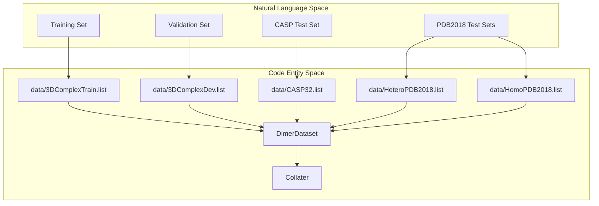

# Training Data

> **Relevant source files**
> * [data/3DComplexDev.list](https://github.com/zw2x/glinter/blob/8871ca11/data/3DComplexDev.list)
> * [data/3DComplexTrain.list](https://github.com/zw2x/glinter/blob/8871ca11/data/3DComplexTrain.list)
> * [data/CASP32.list](https://github.com/zw2x/glinter/blob/8871ca11/data/CASP32.list)
> * [data/HeteroPDB2018.list](https://github.com/zw2x/glinter/blob/8871ca11/data/HeteroPDB2018.list)
> * [data/HomoPDB2018.list](https://github.com/zw2x/glinter/blob/8871ca11/data/HomoPDB2018.list)
> * [data/README.md](https://github.com/zw2x/glinter/blob/8871ca11/data/README.md?plain=1)

This page describes the benchmark datasets and list file formats used for training, validating, and testing the GLINTER model. The data is organized into subsets derived from the 3DComplex database, CASP competitions, and recent PDB releases to evaluate performance on both homodimeric and heterodimeric protein complexes.

## Dataset Overview

GLINTER utilizes several distinct datasets to ensure robust training and comprehensive evaluation. These datasets are defined by `.list` files located in the `data/` directory, which contain the identifiers for the protein complexes.

| Dataset | Purpose | Size | Composition |
| --- | --- | --- | --- |
| **3DComplexTrain** | Model Training | 6342 dimers | Heterogeneous dimers from 3DComplex [data/README.md L1](https://github.com/zw2x/glinter/blob/8871ca11/data/README.md?plain=1#L1-L1) |
| **3DComplexDev** | Validation/Tuning | 100 dimers | Heterogeneous dimers from 3DComplex [data/README.md L3](https://github.com/zw2x/glinter/blob/8871ca11/data/README.md?plain=1#L3-L3) |
| **CASP32** | Primary Testing | 32 dimers | 23 homodimers, 9 heterodimers from CASP13/14 [data/README.md L5-L6](https://github.com/zw2x/glinter/blob/8871ca11/data/README.md?plain=1#L5-L6) |
| **HeteroPDB2018** | External Testing | 72 dimers | Heterodimers released after Jan 1, 2018 [data/README.md L8-L9](https://github.com/zw2x/glinter/blob/8871ca11/data/README.md?plain=1#L8-L9) |
| **HomoPDB2018** | External Testing | 165 dimers | Homodimers released after Jan 1, 2018 [data/README.md L11-L12](https://github.com/zw2x/glinter/blob/8871ca11/data/README.md?plain=1#L11-L12) |

**Sources:**

* [data/README.md L1-L12](https://github.com/zw2x/glinter/blob/8871ca11/data/README.md?plain=1#L1-L12)

---

## List File Formats

The identifiers used in the `.list` files follow specific naming conventions depending on the source of the data. These identifiers are used by the preprocessing pipeline to locate PDB files and by the `DimerDataset` to load feature tensors.

### 3DComplex Format

The `3DComplexTrain.list` and `3DComplexDev.list` files use a combined PDB ID and complex index format: `[PDB_ID]_[INDEX]`.

* **Example:** `1a59_1` [data/3DComplexTrain.list L8](https://github.com/zw2x/glinter/blob/8871ca11/data/3DComplexTrain.list#L8-L8)
* **Example:** `1ay9_2` [data/3DComplexDev.list L1](https://github.com/zw2x/glinter/blob/8871ca11/data/3DComplexDev.list#L1-L1)

### CASP Format

The `CASP32.list` uses standard CASP target identifiers. Heterodimers are prefixed with `H` and homodimers (often representing the "original" target) are suffixed with `o`.

* **Heterodimer Example:** `H0957` [data/CASP32.list L1](https://github.com/zw2x/glinter/blob/8871ca11/data/CASP32.list#L1-L1)
* **Homodimer Example:** `T0965o` [data/CASP32.list L10](https://github.com/zw2x/glinter/blob/8871ca11/data/CASP32.list#L10-L10)

### PDB2018 Format

The `HeteroPDB2018.list` and `HomoPDB2018.list` files contain standard 4-character PDB access codes.

* **Hetero Example:** `6nus` [data/HeteroPDB2018.list L1](https://github.com/zw2x/glinter/blob/8871ca11/data/HeteroPDB2018.list#L1-L1)
* **Homo Example:** `6xdc` [data/HomoPDB2018.list L1](https://github.com/zw2x/glinter/blob/8871ca11/data/HomoPDB2018.list#L1-L1)

**Sources:**

* [data/3DComplexTrain.list L1-L641](https://github.com/zw2x/glinter/blob/8871ca11/data/3DComplexTrain.list#L1-L641)
* [data/3DComplexDev.list L1-L100](https://github.com/zw2x/glinter/blob/8871ca11/data/3DComplexDev.list#L1-L100)
* [data/CASP32.list L1-L32](https://github.com/zw2x/glinter/blob/8871ca11/data/CASP32.list#L1-L32)
* [data/HeteroPDB2018.list L1-L72](https://github.com/zw2x/glinter/blob/8871ca11/data/HeteroPDB2018.list#L1-L72)
* [data/HomoPDB2018.list L1-L165](https://github.com/zw2x/glinter/blob/8871ca11/data/HomoPDB2018.list#L1-L165)

---

## Data Flow and Integration

The following diagram illustrates how these list files interface with the codebase to drive the training and evaluation processes.

### Data Association Logic

This diagram bridges the **Natural Language Space** (Dataset Names) to the **Code Entity Space** (List files and Dataset classes).

**Sources:**

* [data/README.md L1-L12](https://github.com/zw2x/glinter/blob/8871ca11/data/README.md?plain=1#L1-L12)
* [data/3DComplexTrain.list L1-L100](https://github.com/zw2x/glinter/blob/8871ca11/data/3DComplexTrain.list#L1-L100)
* [data/CASP32.list L1-L32](https://github.com/zw2x/glinter/blob/8871ca11/data/CASP32.list#L1-L32)

---

## Implementation Details

### Dataset Loading

The identifiers in these lists are consumed by the `DimerDataset` class (typically found in the training scripts). The dataset iterates through the strings provided in the `.list` files to fetch the corresponding preprocessed features:

1. **Monomer Tensors:** `.mten` files containing structural features.
2. **MSA Tensors:** `.msa` files containing evolutionary information.
3. **Graph Objects:** Geometric representations constructed from PDB coordinates.

### Training vs. Testing Logic

During the training phase, `3DComplexTrain.list` is used to update model weights, while `3DComplexDev.list` is used for early stopping and hyperparameter tuning. The remaining lists (`CASP32`, `HeteroPDB2018`, `HomoPDB2018`) are reserved strictly for final performance reporting to ensure no data leakage occurs.

### Dataset Composition Summary

| List File | Dimer Count | Data Source |
| --- | --- | --- |
| `3DComplexTrain.list` | 6342 | 3DComplex |
| `3DComplexDev.list` | 100 | 3DComplex |
| `CASP32.list` | 32 | CASP 13/14 |
| `HeteroPDB2018.list` | 72 | PDB (Heterodimers) |
| `HomoPDB2018.list` | 165 | PDB (Homodimers) |

**Sources:**

* [data/README.md L1-L12](https://github.com/zw2x/glinter/blob/8871ca11/data/README.md?plain=1#L1-L12)
* [data/3DComplexTrain.list L1-L100](https://github.com/zw2x/glinter/blob/8871ca11/data/3DComplexTrain.list#L1-L100)
* [data/3DComplexDev.list L1-L100](https://github.com/zw2x/glinter/blob/8871ca11/data/3DComplexDev.list#L1-L100)
* [data/CASP32.list L1-L32](https://github.com/zw2x/glinter/blob/8871ca11/data/CASP32.list#L1-L32)
* [data/HeteroPDB2018.list L1-L72](https://github.com/zw2x/glinter/blob/8871ca11/data/HeteroPDB2018.list#L1-L72)
* [data/HomoPDB2018.list L1-L165](https://github.com/zw2x/glinter/blob/8871ca11/data/HomoPDB2018.list#L1-L165)