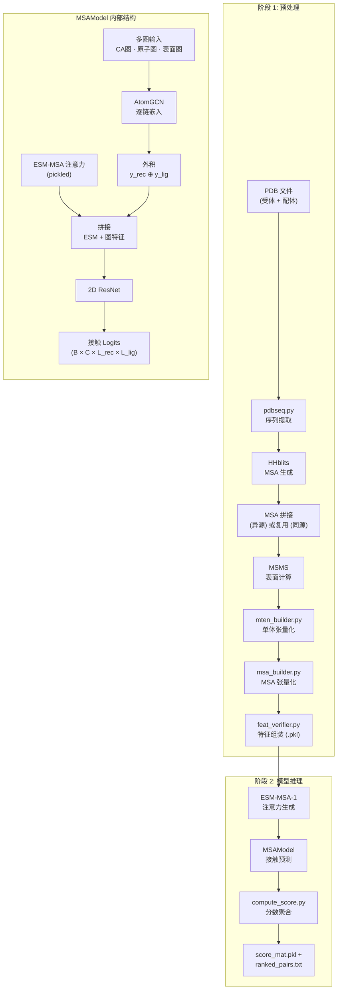

---
slug:1-overview
blog_type:normal
---


**GLINTER**（Graph Learning of INTER-protein contacts，蛋白质间接触图学习）是一个深度学习框架，用于预测二聚体复合物中两条蛋白质链——**受体**（receptor）和**配体**（ligand）——之间的残基-残基接触关系。通过将3D蛋白质结构上的多图几何卷积与来自MSA transformer注意力的进化信息相结合，GLINTER输出一个逐对残基的接触概率矩阵，从而支持蛋白质对接引导和AlphaFold-Multimer集成等下游应用。

来源: [README.md](/README.md#L1-L66), [setup.py](/setup.py#L1-L31)

## GLINTER 预测的内容

给定两个单体PDB结构，GLINTER预测受体上的哪些残基位置与配体上的哪些残基位置存在物理接触。最终输出是一个**带有相关概率的残基位置对排序列表**——例如，`ranked_pairs.txt`中包含类似`42 87 0.93`的行，表示受体位置42与配体位置87接触的概率为93%。对于异源二聚体，预测会在两个方向（A→B和B→A）上计算并取平均值；对于同源二聚体，则只计算单个方向。该接触图可以直接约束蛋白质复合物结构预测。

来源: [README.md](/README.md#L36-L54), [scripts/compute_score.py](/scripts/compute_score.py#L13-L40)

## 架构一览

GLINTER的预测流程遵循清晰的两阶段结构：**(1) 特征预处理**将原始PDB文件转换为张量化表示，**(2) 模型推理**通过2D ResNet将多图神经网络嵌入与MSA注意力特征结合，以生成接触logits。



来源: [scripts/build_hetero.sh](/scripts/build_hetero.sh#L1-L72), [scripts/build_features.sh](/scripts/build_features.sh#L1-L32), [glinter/models/msa_model.py](/glinter/models/msa_model.py#L164-L246)

## 核心模型: MSAModel

核心神经网络是[`MSAModel`](/glinter/models/msa_model.py#L30)，一个`nn.Module`，它将两个互补的信息流融合为2D接触预测：

| 流 | 来源 | 捕获的信息 | 输出形状 |
|--------|--------|-----------------|--------------|
| **ESM-MSA 注意力** | ESM-MSA-1 transformer行注意力 | 来自拼接MSA的共进化信号；跨链注意力揭示进化耦合 | `(B, L*N, L_rec, L_lig)` |
| **多图嵌入** | 每条链上3个几何图的AtomGCN | 每个残基的空间、化学和表面属性 | 每条链`(B, 128, L_rec, L_lig)`，并求外积 |

两个流在通道维度上拼接，并通过**2D ResNet**（`BasicBlock2d` → 96通道）处理，随后经过一个`Conv2d`头输出2类logits（接触/非接触）。模型为ESM流支持四种注意力提取模式：`lower_tri`、`upper_tri`、`sym`（默认，取两个三角方向的平均值）和`apc`（平均乘积校正）。

<CgxTip>`--feature`标志是一个由逗号分隔的字符串，由`DimerFeature`解析——它控制模型在运行时使用哪些图类型和嵌入来源。默认推理配置为`heavy-atom-graph,surface-graph,coordinate-ca-graph,pickled-esm`，意味着所有四个特征组同时激活。</CgxTip>

来源: [glinter/models/msa_model.py](/glinter/models/msa_model.py#L30-L78), [glinter/dataset/_feature.py](/glinter/dataset/_feature.py#L1-L36)

## 多图几何网络: AtomGCN

逐残基嵌入由[`AtomGCN`](/glinter/modules/atomgcn.py#L196)生成，它实现了一个为异构多图输入适配的PointNet++风格架构。AtomGCN内部的流程为：

1. **MGGBlock**（多图分组）——在每个源图（CA图、原子图、表面图）上运行并行的`AtomConv`消息传递层，并拼接它们的输出。每个图从其自身的节点空间卷积到共享的Cα查询节点空间。
2. **SABlock**（集抽象）——应用`AtomConvDynamic`，结合最远点采样和半径图构建，实现层次化特征学习。
3. **FPBlock**（特征传播）——使用k-NN插值将特征从抽象点传播回原始的Cα位置。

每条`AtomConv`消息都在一个由N–Cα–C主链三联体导出的**局部参考系**（LRF）中计算，使模型在设计上具有旋转等变性。

来源: [glinter/modules/atomgcn.py](/glinter/modules/atomgcn.py#L196-L273), [glinter/modules/atomconv.py](/glinter/modules/atomconv.py#L8-L133)

## 三种几何图

GLINTER为每个单体构建三种不同的图表示，每种图捕获不同的结构特征：

| 图 | 节点 | 边 | 关键特征 |
|-------|-------|-------|-------------|
| **CA图** (`coordinate-ca-graph` / `distance-ca-graph`) | Cα原子 | 半径邻居 (r=8Å) | 序列one-hot，PSSM，SAS，位置编码；边距离；来自主链的LRF |
| **原子图** (`atom-graph` / `heavy-atom-graph`) | 所有大原子 | 到Cα的半径 (r=6Å) | 原子类型one-hot，SAS，残基类型；残基内边标志 |
| **表面图** (`surface-graph`) | MSMS表面顶点 | 到Cα的半径 (r=6Å) | 表面法向量（旋转至LRF中）；无节点特征 |

CA图既是特征源，也是**查询图**，其节点通过MGGBlock接收来自其他两个图的消息。

来源: [glinter/dataset/_geometric_graph.py](/glinter/dataset/_geometric_graph.py#L42-L200)

## 特征系统

[`DimerFeature`](/glinter/dataset/_feature.py#L1)类控制哪些特征组处于激活状态。完整的特征词汇表如下：

| 特征键 | 类别 | 描述 |
|-------------|----------|-------------|
| `ccm` | 进化 | 跨链协方差矩阵 (1维) |
| `esm` | 进化 | 实时ESM-MSA-1注意力 (144维，推理时需要模型) |
| `pickled-esm` | 进化 | 来自`.esm.npz`文件的预计算ESM注意力 (144维) |
| `ca-embed` | 结构 | 仅Cα的1D CNN嵌入 (无图边) |
| `coordinate-ca-graph` | 结构 | 具有基于坐标的边的Cα图 |
| `distance-ca-graph` | 结构 | 具有基于距离的边特征的Cα图 |
| `atom-graph` / `heavy-atom-graph` | 结构 | 全原子到Cα的消息传递图 |
| `surface-graph` | 结构 | 表面顶点到Cα的消息传递图 |

<CgxTip>在生产推理中请使用`pickled-esm`代替`esm`——它将ESM注意力生成与接触预测解耦为两个独立步骤，从而大幅降低GPU内存需求。标准的两步工作流为：(1) `--feature esm --generate-esm-attention` 导出`.esm.npz`，然后 (2) `--feature heavy-atom-graph,surface-graph,coordinate-ca-graph,pickled-esm` 进行预测。</CgxTip>

来源: [glinter/dataset/_feature.py](/glinter/dataset/_feature.py#L1-L36), [glinter/models/msa_model.py](/glinter/models/msa_model.py#L290-L344)

## 异源二聚体 vs. 同源二聚体预测

GLINTER采用不同的MSA策略处理两种生物学场景：

- **异源二聚体** (`build_hetero.sh`)：受体和配体是不同的序列。每条链通过HHblits获取自己的MSA，两个MSA进行拼接，并从联合MSA中提取ESM-MSA注意力。预测在A→B和B→A两个方向上运行；分数取平均值以生成最终接触矩阵。
- **同源二聚体** (`build_homo.sh`)：两条链共享相同的序列。仅构建一个MSA（用于代表性链），并将该MSA在两侧复用。由于复合物是对称的，预测仅在单一方向上运行。

来源: [scripts/build_hetero.sh](/scripts/build_hetero.sh#L1-L72), [README.md](/README.md#L34-L47)

## 项目结构

```
glinter/
├── ckpts/glinter1.pt              # 预训练模型检查点
├── esm/                            # ESM-MSA-1 模型权重 & 词元表
├── data/                           # 基准列表 (3DComplex, CASP, PDB)
├── examples/                       # 示例 PDB 文件 (1a59A, 1a59B)
├── glinter/                        # 核心 Python 包
│   ├── models/                     # MSAModel，检查点加载
│   ├── modules/                    # AtomGCN, AtomConv, AtomConvDynamic, MLP
│   ├── dataset/                    # DimerDataset，图构建器，MSA 工具
│   ├── esm_embed/                  # ESM-MSA-1 transformer (改编自 FAIR)
│   ├── protein/                    # PDB 解析，编码，比对工具
│   ├── points/                     # 表面网格处理 (MSMS, PLY)
│   └── hhm/                        # HMM 配置文件加载工具
├── preprocess/                     # 特征构建脚本
│   ├── pdbseq.py                   # 从 PDB 提取序列
│   ├── msa_builder.py              # 构建并张量化 MSA
│   ├── msms_builder.py             # 通过 MSMS 计算表面特征
│   ├── mten_builder.py             # 张量化单体特征
│   └── feat_verifier.py            # 组装最终特征 .pkl
├── scripts/                        # 端到端流程 Shell 脚本
├── alphafold/                      # AlphaFold-Multimer 集成
└── external/                       # 第三方工具 (MSA 拼接，过滤等)
```

来源: [setup.py](/setup.py#L1-L31), [README.md](/README.md#L1-L22)

## 数据集与基准测试

`data/`目录提供了用于训练和评估的精选基准列表：

| 数据集 | 二聚体数 | 描述 |
|---------|--------|-------------|
| `3DComplexTrain.list` | 6,342 | 来自3DComplex数据库的训练集 |
| `3DComplexDev.list` | 100 | 来自3DComplex的验证集 |
| `CASP32.list` | 32 | 测试集：来自CASP13/14的23个同源二聚体 + 9个异源二聚体 |
| `HeteroPDB2018.list` | 72 | 额外测试：2018年1月后发布的异源二聚体 |
| `HomoPDB2018.list` | 165 | 额外测试：2018年1月后发布的同源二聚体 |

来源: [data/README.md](/data/README.md#L1-L13)

## AlphaFold-Multimer 集成

GLINTER可以通过提供蛋白质间接触先验来增强AlphaFold-Multimer的预测。集成工作流（`alphafold/example_run.sh`）首先运行AlphaFold以获取逐链MSA和排序的结构，然后通过GLINTER的特征流程和模型输入这些MSA，生成可以引导或重新排序复合物结构预测的接触分数。

来源: [alphafold/example_run.sh](/alphafold/example_run.sh#L1-L19)

## 后续深入阅读

现在你已经了解了GLINTER的功能及其架构形态，请按照以下阅读路径继续深入：

1. **[快速开始](2-quick-start)** — 使用示例PDB文件运行你的第一次蛋白质间接触预测
2. **[预测流程详解](3-prediction-pipeline-walkthrough)** — 逐步追踪每个脚本的端到端执行过程
3. **[架构概览](4-architecture-overview)** — 详细的模块交互图与数据流
4. **[MSAModel与前向传播](5-msamodel-and-forward-pass)** — 模型内部的精确张量形状与计算图
5. **[AtomGCN多图网络](6-atomgcn-multi-graph-network)** — 异构图如何被并行处理
6. **[DimerDataset与特征加载](11-dimerdataset-and-feature-loading)** — 原始.pkl文件如何转化为模型就绪的批次数据