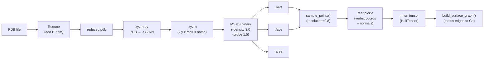

---
slug:10-protein-surface-mesh-processing
blog_type:normal
---


Glinter 不仅将每个蛋白质单体表示为原子图，还将其表示为**离散的溶剂可及表面网格**——一组三维顶点及其朝外法向量，用于近似分子在溶剂边界处的形状。这种双重表示启用了 `surface-graph` 特征路径，在该路径中，表面顶点通过基于半径的边连接到附近的 Cα 原子，从而将蛋白质外部的几何上下文注入预测模型。整个流水线——从原始 PDB 文件到张量化的表面图——跨越四个阶段：**PDB 精简**、**XYZRN 转换**、**MSMS 表面计算**，以及**顶点采样与张量化**。

## 表面网格流水线架构

从 PDB 到表面图的端到端流程由一个 Shell 脚本和三个顺序执行的 Python 模块协同完成。每个阶段都会生成供下一阶段使用的中间文件格式：



Shell 入口点 `run_msms.sh` 依次调用 Reduce、XYZRN 转换器和 MSMS 二进制程序，然后将所有输出产物（`.reduced.pdb`、`.vert`、`.face`、`.area`、`.xyzrn`）移动到目标目录。后续的 Python 预处理（`msms_builder.py`、`mten_builder.py`）读取这些文件，以生成序列化的特征字典和张量化的单体文件。

来源: [run_msms.sh](scripts/run_msms.sh#L1-L51), [mten_builder.py](preprocess/mten_builder.py#L150-L154)

## 阶段 1 — PDB 精简与添加氢原子

在计算表面之前，必须使用 **Reduce** 工具对原始 PDB 进行归一化处理，该工具会补全缺失的氢原子并标准化组氨酸的质子化状态。此步骤至关重要，因为 MSMS 需要显式的氢原子位置来计算正确的溶剂排除表面。Shell 流水线会运行 Reduce 两次——首先使用 `-Trim` 剥离现有的氢原子，然后使用 `-HIS` 以正确的位置重新添加它们：

```
$REDUCE_PATH/reduce -Trim $pdb > $tmpdir/tmp.pdb
$REDUCE_PATH/reduce -HIS $tmpdir/tmp.pdb > $reduced
```

生成的 `.reduced.pdb` 文件将成为所有下游表面和特征处理的权威原子结构。

来源: [run_msms.sh](scripts/run_msms.sh#L23-L24)

## 阶段 2 — XYZRN 转换 (PDB → 原子坐标 + 半径)

`chain_to_xyzrn` 函数将精简后的 PDB 转换为 MSMS 期望输入的 **XYZRN 格式**。每行将单个原子编码为五个空格分隔的字段：**x y z radius name**，其中 `radius` 是从 `chemistry.radii` 字典中查找得到的范德华半径，`name` 是格式为 `{chainid}_{resid}_{resname}_{atomname}` 的复合标识符。

| 原子类型 | 范德华半径 (Å) |
|-----------|--------------------------|
| N         | 1.54                     |
| O         | 1.40                     |
| C         | 1.74                     |
| H         | 1.20                     |
| S         | 1.80                     |
| P         | 1.80                     |

该函数遍历经 Biopython 解析的结构中的每一条链、残基和原子。类型未包含在 `radii` 字典中的原子（例如非标准金属）会被静默跳过。可以通过 `ignore_h` 标志选择性地排除氢原子，不过在计算表面时通常会保留它们，因为 Reduce 刚刚特意放置了它们。

来源: [xyzrn.py](glinter/points/xyzrn.py#L16-L49), [chemistry.py](glinter/protein/chemistry.py#L8-L16)

## 阶段 3 — MSMS 表面计算与文件解析

**MSMS**（Michel Sanner 分子表面）二进制程序根据 XYZRN 原子列表计算解析的溶剂排除表面。它通过两个关键参数进行调用：

| 参数   | 默认值 | 含义 |
|-------------|---------|---------|
| `-density`  | 3.0     | 表面每 Ų 的顶点密度 |
| `-hdensity` | 3.0     | 解析面片的顶点密度 |
| `-probe`    | 1.5     | 溶剂探针半径 (Å) |

MSMS 生成三个共享相同文件名主体的输出文件：

- **`.vert`** — 表面顶点：每行包含 `x y z nx ny nz`（三维坐标 + 朝外法向量），后跟原子/残基标识符。第 3 行的文件头声明了总顶点数。
- **`.face`** — 三角面片：每行包含三个从 1 开始计数的顶点索引，构成一个三角形。第 3 行的文件头声明了总面片数。
- **`.area`** — 每个原子的溶剂可及表面积：每行包含 `name SES SAS`，其中 SAS 是归属于该原子的溶剂可及表面积。

存在两个解析器用于读取这些输出。主解析器 `mesh.read_msms(vert_path, face_path)` 直接从 `.vert` 和 `.face` 文件中读取顶点坐标、面片索引和顶点法向量。面片索引会从 MSMS 的从 1 开始的编号调整为 Python 的从 0 开始的约定（`faces - 1`）。替代解析器 `msms_parser.read_msms(file_root)` 额外从顶点文件中提取 `atom_id` 和 `res_id` 字段，使其适用于需要将表面顶点追溯至特定原子的应用场景。

来源: [mesh.py](glinter/points/mesh.py#L11-L45), [msms_parser.py](glinter/points/msms_parser.py#L7-L57), [run_msms.sh](scripts/run_msms.sh#L31-L48)

## 阶段 4 — 顶点采样与连通分量选择

原始 MSMS 输出通常会产生**数千个顶点**——远超神经网络输入所需。`sample_points` 函数通过两个连续操作将其减少为易于处理的、大致均匀的点集：

**连通分量过滤**（`require_connected=True`）：蛋白质表面可能包含不连通的碎片（例如，由埋藏空腔或数值伪影引起）。该函数通过 `trimesh.graph.connected_components` 计算连通分量，识别最大分量，并验证其覆盖了 95% 以上的总顶点数。如果最大分量低于此阈值，函数将返回 `None` 并发出警告，标明这是一个严重不连通的网格。

**基于分辨率的去重**（`resolution=0.8`）：`trimesh.points.remove_close` 函数消除与已选顶点距离小于 `resolution` Å 的顶点，产生大致均匀的采样。经验上，顶点数量在分辨率超过 0.8 后趋于平缓——这是在特征构建期间使用的默认值。去重后，存留的顶点法向量会从 trimesh 对象重新计算的 `vertex_normals`（即相邻面片法向量的面积加权平均值，比原始 MSMS 逐顶点法向量更精确）中进行重新索引。

```python
# 来自 msms_builder.py — 规范调用
verts, normals = sample_points(
    *read_msms(vert_path, face_path),
    resolution=0.8,
)
```

生成的 `(verts, normals)` 对——通常包含几百个点——以 `dict(coords=verts, normals=normals)` 的形式存储在 `.feat` pickle 文件的 `vertex` 键下。

<CgxTip>`resolution` 参数直接控制表面图的大小。较低的值会产生更密集的网格（更多顶点，更精细的几何细节），但代价是增加内存和计算量。默认值 0.8 Å 是根据顶点数趋于平缓的经验点选择的——低于此值收益递减</CgxTip>

来源: [mesh.py](glinter/points/mesh.py#L47-L80), [msms_builder.py](preprocess/msms_builder.py#L230-L240)

## 逐原子表面积提取

除了网格几何体外5`.area` 文件还提供了**逐原子溶剂可及表面积 (SAS)** 值。`read=!(http://img-bed.cn/20241209/gxywy.png)_areas` 函数将该文件解析为以完整原子标识符（`chainid_resid_resname_atomname`）为键的字典，将每个原子映射至其 SAS 贡献。这些逐原子的 SAS 值随后被聚合为逐残基的值（对该残基所有原子求和），并作为节点特征整合到 Cα 图和原子图中，从而提供每个残基溶剂暴露程度的度量——这是界面预测的强信号。

来源: [msms_builder.py](preprocess/msms_builder.py#L20-L36)

## 特征收集与张量化

`msms_builder.collect_features` 函数将坐标数据、逐原子 SAS 面积以及可选的 DSSP 二级结构合并为一个统一的逐残基特征字典。每个残基条目包含其名称、嵌套的 `atoms` 字典（每个原子持有其 `coord` 和 `sas`），以及可选的残基级 DSSP 字段（二级结构、相对 ASA、φ/ψ 角度）。此结构被序列化为 `.feat` pickle 文件。

随后，`mten_builder.tensorize_feat` 函数将此 pickle 转换为张量形式——将原子类型编码为整数代码，坐标和 SAS 编码为 `float16` 张量，残基大小编码为 `uint8` 组计数。关键是，**表面顶点数据被单独张量化**为 `HalfTensor` 以提高内存效率：

```python
mtensor['vertex'] = dict(
    coord=torch.HalfTensor(feat['vertex']['coords']),
    normal=torch.HalfTensor(feat['vertex']['normals']),
)
```

此 `vertex` 字典与原子特征（`COORD`、`ATOM`、`SAS`、`GROUP`、`pssm`）一起存放在单体张量（`.mten` 文件）中，使得在训练时无需重新计算即可使用表面网格。

来源: [msms_builder.py](preprocess/msms_builder.py#L138-L176), [mten_builder.py](preprocess/mten_builder.py#L150-L154)

## 表面图构建

在训练/推理阶段，当 `surface-graph` 特征激活时，`DimerDataset._load_mten` 从单体张量中提取顶点坐标和法向量至扁平键 `vcoord` 和 `vnormal` 中。随后，`build_surface_graph` 函数构建具有以下结构的 PyTorch Geometric `Data` 对象：

| 属性     | 类型              | 形状            | 描述 |
|---------------|-------------------|------------------|-------------|
| `pos`         | `float32` tensor  | (V, 3)           | 表面顶点坐标 |
| `nor`         | `float32` tensor  | (V, 3)           | 朝外顶点法向量 |
| `edge_index`  | `long` tensor     | (2, E)           | 半径图边：表面顶点 → Cα 原子 |

边的构建使用 `torch_cluster.radius`，默认半径 `sug_radius=6` Å，将每个表面顶点连接到该距离内的所有 Cα 原子。这创建了从表面到骨架的二分图邻接关系，允许消息传递将几何上下文从溶剂边界流动至残基层表示。

如果提供了随机旋转矩阵（在训练期间进行 SO(3) 增强时的标准操作），它会同时应用于 `vcoord`、`vnormal` 和原子坐标，以保持一致的几何关系。该旋转是均匀采样自 \[-180°, 180°\] 的各轴旋转的复合，在 `points.utils.get_random_rotmat` 中实现。

来源: [_geometric_graph.py](glinter/dataset/_geometric_graph.py#L217-L259), [dimer_dataset.py](glinter/dataset/dimer_dataset.py#L222-L230), [dimer_dataset.py](glinter/dataset/dimer_dataset.py#L304-L306)

## 局部参考系计算

`compute_centered_lrf` 工具从三个锚点原子——Cα（中心）、C（定义 x 轴方向）和 N（定义 z 轴所在平面）——构建**逐残基局部参考系 (LRF)**。此正交标准系提供了一个旋转不变的坐标系，用于编码局部几何：

1. **x 轴**：从 Cα → C 的归一化向量
2. **z 轴**：(Cα→C) × (Cα→N) 的归一化叉积
3. **y 轴**：x × z（完成右手系）

LRF 在 `build_ca_graph` 中计算，并作为 `lrf` 属性附加到 Cα 图。虽然 LRF 不是表面网格的直接组成部分，但它为在旋转等变的局部坐标系中表示表面顶点位置提供了几何基础——这是蛋白质几何深度学习中常用的模式。

来源: [utils.py](glinter/points/utils.py#L36-L48), [_geometric_graph.py](glinter/dataset/_geometric_graph.py#L101-L103)

## 用于可视化的 PLY 导出

`export_ply.py` 脚本提供了从 MSMS 输出到 **PLY 多边形文件格式**的一步转换，可在 MeshLab 或 PyMOL 等工具中进行可视化。它通过 `msms_parser.read_msms` 读取顶点、面片和法向量，构建一个 `trimesh.Trimesh` 对象（启用验证与处理），并写入包含顶点法向量的 ASCII PLY 文件。这对于调试表面质量或生成出版级别的图表非常有用。

来源: [export_ply.py](preprocess/export_ply.py#L1-L21)

## 模块摘要

表面网格子系统横跨 `glinter/points/` 下的四个文件进行组织，并在 `preprocess/` 中提供预处理支持：

| 模块 | 关键函数 | 角色 |
|--------|---------------|------|
| `points/mesh.py` | `read_msms`, `sample_points`, `plot_mesh`, `plot_normals` | 核心 I/O 与采样 |
| `points/msms_parser.py` | `read_msms` | 带有原子/残基追溯的替代解析器 |
| `points/xyzrn.py` | `chain_to_xyzrn` | 用于 MSMS 输入的 PDB → XYZRN 转换 |
| `points/utils.py` | `compute_centered_lrf`, `get_random_rotmat`, `add_gaussian_noise` | 几何变换与增强 |
| `preprocess/msms_builder.py` | `read_areas`, `read_coords`, `collect_features`, `dump_feature` | 来自 MSMS 输出的特征组装 |
| `preprocess/export_ply.py` | — | MSMS → PLY 可视化导出 |
| `scripts/run_msms.sh` | — | Shell 编排：Reduce → XYZRN → MSMS |

<CgxTip>`mesh.py` 和 `msms_parser.py` 中的两个 `read_msms` 函数在接口上有所不同：`mesh.read_msms` 接受独立的 `(vert_path, face_path)` 参数并返回 `(coords, faces, normals)`，而 `msms_parser.read_msms` 接受单个 `file_root` 并返回 `(vertices, faces, normalv, res_id)`。`mesh.py` 版本用于训练流水线；`msms_parser.py` 版本用于需要原子追溯的 PLY 导出。</CgxTip>

来源: [mesh.py](glinter/points/mesh.py#L1-L133), [msms_parser.py](glinter/points/msms_parser.py#L1-L58), [xyzrn.py](glinter/points/xyzrn.py#L1-L55), [utils.py](glinter/points/utils.py#L1-L57)

## 相关页面

表面网格是 Glinter 中三种几何表示之一。关于其他图构建路径，请参阅 [Geometric Graph Construction](8-geometric-graph-construction)。关于 Shell 级别的 MSMS 调用细节，请参阅 [Surface Computation with MSMS](16-surface-computation-with-msms)。关于训练时如何将表面特征加载到数据集中，请参阅 [DimerDataset and Feature Loading](11-dimerdataset-and-feature-loading)。