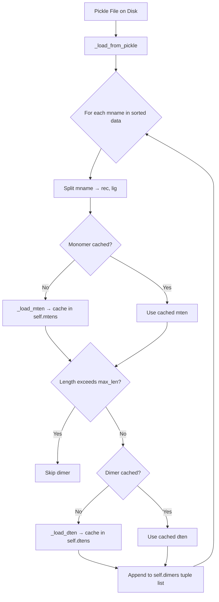
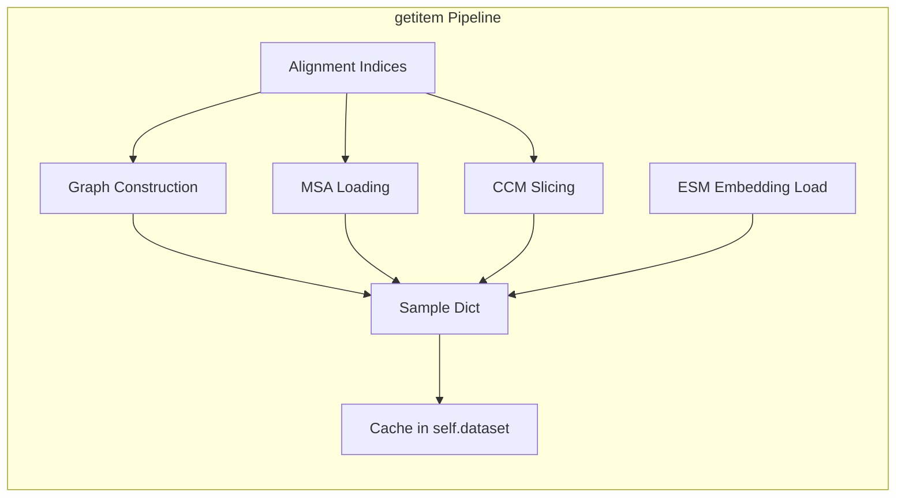
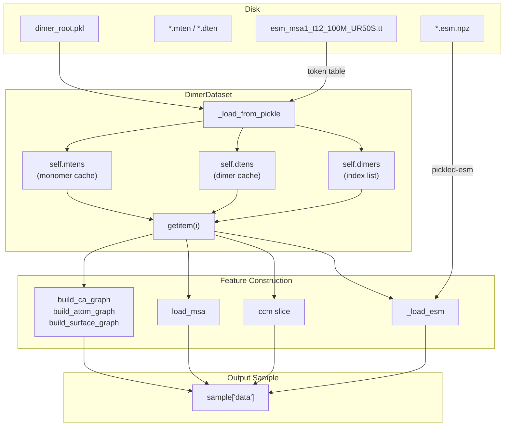

---
slug:11-dimerdataset-and-feature-loading
blog_type:normal
---

`DimerDataset` 是 Glinter 中的核心数据编排层——它将原始的 pickled 单体/二聚体张量转换为结构化的特征字典，以供模型直接使用。它并非简单的文件读取器，而是作为一个**惰性加载、带缓存、特征门控的流水线**运作：单体和二聚体张量仅反序列化一次，几何图按需构建，声明式的 `DimerFeature` 配置则控制着哪些特征组进入最终样本。这种设计确保了同一个数据集对象能够服务于差异极大的模型配置（例如，仅 MSA、仅图 或混合模式），而不会产生冗余的 I/O 或计算开销。

来源: [dimer_dataset.py](/glinter/dataset/dimer_dataset.py#L1-L21), [_feature.py](/glinter/dataset/_feature.py#L1-L36)

## DimerFeature — 声明式特征选择

`DimerFeature` 类是基础配置单元，驱动着 `DimerDataset.getitem()` 内部的每一个分支决策。它由逗号分隔的字符串（例如 `"ccm,coordinate-ca-graph,atom-graph"`）构建而成，并暴露一个单一的断言方法 `use(*keys)`：如果传入的键中有**任何一个**处于活跃状态，该方法即返回 `True`。这种 OR 语义是有意为之的——代码库中经常查询 `use('atom-graph', 'heavy-atom-graph')`，因为 `heavy-atom-graph` 是 `atom-graph` 的超集变体，且两者会触发相同的构建路径。

九个有效的特征组及其功能总结如下：

| 特征组 | 类别 | 描述 |
|---|---|---|
| `ccm` | 成对 | 共进化接触图矩阵 (reclen × liglen) |
| `esm` | MSA | 加载时通过 ESM 词表转换的原始 MSA 标记 |
| `pickled-esm` | 嵌入 | 从 `.esm.npz` 文件加载的预计算 ESM-MSA 嵌入 |
| `ca-embed` | 序列 | 仅包含 CA 节点嵌入（无图边）——轻量级模式 |
| `coordinate-ca-graph` | 图 | 带有坐标、边和局部参考系的完整 Cα 图 |
| `distance-ca-graph` | 图 | Cα 图 **加上** 作为边特征的欧几里得边距离 |
| `atom-graph` | 图 | 带有残基分组边的完整原子级图 |
| `heavy-atom-graph` | 图 | 去除氢原子的原子图 |
| `surface-graph` | 图 | 带有法线且连接至 Cα 锚点的表面顶点图 |

系统强制执行两个互斥约束：特征列表不能为空，且 `esm` 和 `pickled-esm` 不能共存——它们代表了提供 MSA 信息的两种不同策略（在线标记化 vs. 离线预计算嵌入）。

来源: [_feature.py](/glinter/dataset/_feature.py#L1-L36)

## 数据集初始化与 Pickle 加载

`DimerDataset.__init__` 方法建立了三个内存缓存——`self.mtens`（单体张量）、`self.dtens`（二聚体张量）和 `self._esm_data`（pickled ESM 嵌入）——它们均由各自的标识符作为键进行索引。实际的数据加载被推迟到 `_load_from_pickle` 中执行，该方法读取一个 pickle 文件，该文件包含一个以模型名称（`mname`）为键的字典。

pickle 文件中的每个条目结构为 `{mname: {dimer: ..., rec: ..., lig: ...}}`，其中 `rec` 和 `lig` 是单体张量字典，`dimer` 是二聚体张量。加载循环按排序顺序处理这些条目，并执行以下操作：

1. **解析标识符**——将 `mname`（格式为 `"rec:lig"`）拆分为受体和配体键，并从单体张量内部的 seqmap 引用中派生出 `dname`（二聚体张量名称）。
2. **惰性加载单体张量**——仅当单体键尚未被缓存时，才调用 `_load_mten`。
3. **应用长度过滤**——跳过满足 `rec_alnidx.size(-1) + lig_alnidx.size(-1) > max_len` 的二聚体，这对于 ESM-MSA-1 的固定容量注意力窗口至关重要。
4. **惰性加载二聚体张量**——通过 `_load_dten` 采用相同的缓存策略。
5. **验证 ESM 文件存在性**——当 `pickled-esm` 激活时，仅保留在磁盘上具有对应 `.esm.npz` 文件的二聚体。

如果没有二聚体通过过滤，则会立即抛出 `ValueError`——静默的空数据集会导致下游产生令人困惑的级联错误。

来源: [dimer_dataset.py](/glinter/dataset/dimer_dataset.py#L22-L98)

## 单体张量加载 — `_load_mten`

`_load_mten` 方法将原始的单体 pickle 字典转换为精简的特征字典。它执行两个关键转换：

**序列标记化。** 原始 `SEQ` 字符串通过 `seq_encode`（将 ASCII 大写字母映射为整数索引）进行编码，然后索引到 `self.esm_tt` 中——这是从 `esm_msa1_t12_100M_UR50S.tt` 加载的 ESM 标记转换表。这种两步映射（字符 → 整数 → ESM 标记 ID）确保序列数据从一开始就与 ESM-MSA 词汇表兼容。

**比对索引计算。** `cigar_to_index` 函数将 CIGAR 字符串（来自 HHblits 比对的 M/I/D 格式）解析为一个 2×L 的 `LongTensor`，其中第 0 行是查询序列（PDB 序列）索引，第 1 行是目标序列（A3M 序列）索引。这些比对索引至关重要，因为 MSA 和 PSSM 特征是在 A3M 序列空间中计算的，而结构特征存在于 PDB 残基空间中——`alnidx` 桥接了这两个坐标系。

其余字段（`COORD`、`GROUP`、`ATOM`、`SAS`、`pssm`）直接透传，而表面顶点数据（`vcoord`、`vnormal`）仅在 `surface-graph` 激活时有条件地加载。

来源: [dimer_dataset.py](/glinter/dataset/dimer_dataset.py#L287-L308), [align_utils.py](/glinter/protein/align_utils.py#L25-L60), [encoding_utils.py](/glinter/protein/encoding_utils.py#L113-L119)

## 二聚体张量加载 — `_load_dten`

`_load_dten` 方法处理成对级别的数据。它总是提取 `concated`（指示 MSA 是否由拼接链构建的标志）、`reclen` 和 `liglen`。根据特征标志的不同：

- **`esm` 模式**：原始 MSA 整数矩阵 `dten['msa']` 通过 `self.esm_tt` 转换为 ESM 标记 ID。捕获 `IndexError` 可为调试格式错误的 MSA 数据提供诊断打印信息。
- **`ccm` 模式**：共进化接触图 `dten['ccm']` 被转换为 `FloatTensor`。

值得注意的是，MSA 在 `_load_dten` 期间**没有**被预切片——该职责落在了样本构建时的 `load_msa` 上，因为共享相同 `dname` 的不同二聚体可能具有不同的比对索引子集。

来源: [dimer_dataset.py](/glinter/dataset/dimer_dataset.py#L310-L333)

## 样本构建 — `getitem`

`getitem` 方法是数据集的核心。它采用**首次访问计算、后续访问缓存**的模式运作：如果索引 `i` 存在于 `self.dataset` 中，则直接返回缓存的特征字典（在训练期间可选择添加高斯噪声增强）。首次访问时，将执行完整的特征流水线：

### 比对索引提取

来自缓存单体张量的比对索引（`rec_alnidx`、`lig_alnidx`）提供了 PDB 残基编号与 A3M 序列编号之间的映射。`rec_alnidx[0]`（源索引）作为 `recidx`/`ligidx` 存储在输出中供下游使用，而 `rec_alnidx[1]`（目标索引）则用于切片 PSSM 和 MSA 特征。

### 图构建

所有三种图类型都由 `ca-embed`/`coordinate-ca-graph`/`distance-ca-graph` 特征组门控。当其中任何一个激活时：

1. **随机旋转**——为受体和配体独立采样一个新的 `get_random_rotmat(3)`。这种 SO(3) 增强在图构建之前应用于所有坐标，确保旋转等变性训练。
2. **Cα 图**——`build_ca_graph` 构建一个 PyG `Data` 对象，包含节点嵌入（SAS + 独热序列 + 位置编码 + PSSM，总维度 1+21+1+20=43）、Cα 位置、半径图边和局部参考系（LRF）。在 `distance-ca-graph` 模式下，欧几里得边距离作为 `edge_embed` 加入。
3. **原子图**——`build_atom_graph` 构建一个全原子图，其中边将原子连接到附近的 Cα 中心（在 `atg_radius` 内）。节点嵌入结合了原子类型独热编码、SAS 和残基类型独热编码。`residue_edge_embed` 二值特征指示原子-Cα 边是否为残基内边。
4. **表面图**——`build_surface_graph` 创建一个带有位置和法线的顶点级图，其中边将表面顶点连接到附近的 Cα 锚点（在 `sug_radius` 内）。

`ca-embed` 模式是一种特殊的轻量级变体，仅返回节点嵌入张量（无边、无位置），适用于仅序列基线。

### MSA 加载

当二聚体张量包含 `'msa'` 键时，将调用 `load_msa`。此函数处理两种 MSA 存储格式：

- **非拼接**（`concated=False`）：受体和配体 MSA 分别存储，并使用各自的比对索引按列拼接。
- **拼接**（`concated=True`）：单个 MSA 覆盖两条链；受体索引直接映射，而配体索引偏移 `reclen`。

切片后，`max_row` 截断 MSA 深度，如果提供了 `esm_alphabet`，则可选地前置/追加 BOS/EOS 标记。最后的断言验证 `msa.size(-1) == reclen + liglen + 1`（包括 BOS）。

### CCM 和 ESM 嵌入加载

接触图（`ccm`）如果其维度不匹配 `reclen × liglen`，则被切片以匹配比对索引，然后扩展以增加通道维度。预计算的 ESM 嵌入从 `.esm.npz` 文件作为 `HalfTensor` 加载以提高内存效率，并通过断言验证空间维度是否匹配。

来源: [dimer_dataset.py](/glinter/dataset/dimer_dataset.py#L159-L280), [msa_utils.py](/glinter/dataset/msa_utils.py#L17-L66)

## MSA 工具 — 标记表与 MSA 组装

`load_tt` 函数将 ESM 标记转换表（一个映射整数 ID 的 TSV 文件）解析为 `LongTensor` 查找表。此表是原始 MSA 整数编码与 ESM-MSA-1 词汇表之间的桥梁——每个序列字符和 MSA 列值在进入 Transformer 之前都要通过此表。

`load_msa` 函数从二聚体张量字典组装最终的 MSA 张量。其双路径逻辑（拼接与非拼接）处理了流水线支持的两种预处理策略。基于比对索引的切片（`_msa[:, recidx]`）是使 MSA 列与 PDB 残基位置对齐的机制——如果没有此步骤，A3M 到 PDB 比对中的插入和删除将导致特征错位。

来源: [msa_utils.py](/glinter/dataset/msa_utils.py#L1-L66)

## Collater — 异构批次组装

`Collater` 类解决了一个非平凡的批处理问题：样本是**嵌套字典**，同时包含标准 PyTorch 张量和 PyG `Data` 图对象，它们具有不兼容的整理语义。整理逻辑递归下降字典结构：

- **PyG `Data` 对象** → 通过 `Batch.from_data_list` 进行批处理（它合并节点/边数组并添加批次分配向量）。注意：当前实现仅支持 `Batch` 对象的批大小为 1——尝试批处理多个 `Batch` 对象会引发 `NotImplementedError`。
- **PyTorch 张量** → 通过 `default_collate` 整理（沿新的维度 0 堆叠）。
- **标量** → 转换为张量。
- **字符串** → 作为普通列表返回。
- **嵌套字典** → 递归处理。

这种递归策略意味着像 `{'data': {'rec_cag': Data(...), 'lig_cag': Data(...), 'ccm': Tensor(...)}}` 这样的样本可以被正确批处理：图对象成为 `Batch` 对象，而接触图张量被堆叠。

来源: [collater.py](/glinter/dataset/collater.py#L1-L65)

## 训练增强

训练期间应用两种增强策略：

**随机旋转。** 每次调用 `getitem` 都会通过 `get_random_rotmat(3)` 为受体和配体独立生成随机旋转矩阵。它通过组合围绕三个坐标轴中每个轴的随机旋转来采样均匀旋转。所有坐标数组（原子位置、表面顶点位置、表面法线）都由相同的旋转进行变换，在保持内部几何的同时解除全局方向的相关性。

**高斯噪声。** 在训练期间，当 `args.add_gaussian_noise` 为 `True` 时，样本嵌套数据字典中所有 `.pos` 属性都会接收标准差 `std=0.5` Å 的加性高斯噪声。关键的是，在添加噪声之前会对图对象进行**深拷贝**——这防止了原地修改破坏 `self.dataset` 中缓存的样本，否则会导致噪声在各个 epoch 之间累积。

来源: [dimer_dataset.py](/glinter/dataset/dimer_dataset.py#L129-L168), [utils.py](/glinter/points/utils.py#L5-L34)

## 数据流总结

下图展示了从磁盘到模型就绪样本的完整数据流：

<CgxTip>比对索引张量（`alnidx`，来自 `cigar_to_index` 的 2×L LongTensor）是流水线中最关键且最容易出错的环节。第 0 行从 PDB 残基空间映射，第 1 行从 A3M 序列空间映射。跨越这些空间的每个特征（PSSM、MSA、CCM）都必须通过 `alnidx` 进行索引——此处的失配会产生静默的错误特征，在不引发错误的情况下降低模型质量。</CgxTip>

<CgxTip>当 `pickled-esm` 激活时，ESM 嵌入以 `HalfTensor` (float16) 形式存储以提高内存效率，但在样本返回时转换为 `float32`。如果你观察到与精度相关的训练不稳定性，请检查在离线 ESM 推理步骤中生成的 `.esm.npz` 文件是否具有足够的浮点精度。</CgxTip>

来源: [dimer_dataset.py](/glinter/dataset/dimer_dataset.py#L1-L339), [_feature.py](/glinter/dataset/_feature.py#L1-L36), [collater.py](/glinter/dataset/collater.py#L1-L65), [msa_utils.py](/glinter/dataset/msa_utils.py#L1-L67)

## 命令行参数

`DimerDataset.add_args` 类方法在 `ArgumentParser` 上注册以下参数：

| 参数 | 类型 | 默认值 | 描述 |
|---|---|---|---|
| `--dimer-root` | Path | (必填) | pickled 二聚体数据文件的路径 |
| `--esm-root` | Path | — | 包含 `.esm.npz` 嵌入文件的目录 |
| `--esm-tt` | Path | `esm/esm_msa1_t12_100M_UR50S.tt` | ESM 标记转换表 |
| `--feature` | DimerFeature | (必填) | 逗号分隔的特征组名称 |
| `--add-gaussian-noise` | flag | False | 启用位置噪声增强 |
| `--cag-radius` | float | 8.0 | Cα 图邻域半径 (Å) |
| `--atg-radius` | float | 6.0 | 原子图邻域半径 (Å) |
| `--sug-radius` | float | 6.0 | 表面图邻域半径 (Å) |

这三个半径参数直接控制相应图的稀疏性——较大的半径会产生更密集的连接（每个节点有更多的边），但代价是增加内存和计算量。默认值（8/6/6 Å）反映了生物学直觉，即有意义的结构相互作用大致发生在 Cα 接触的一个 α 螺旋回转内，以及原子和表面接触的单个残基配位球内。

来源: [dimer_dataset.py](/glinter/dataset/dimer_dataset.py#L100-L127)

## 相关页面

- 有关几何图构建的详细信息，请参阅 [Geometric Graph Construction](8-geometric-graph-construction)。
- 有关特征配置字符串的解析和验证方式，请参阅 [Feature Configuration System](13-feature-configuration-system)。
- 有关单体张量（`.mten`）和二聚体张量（`.dten`）的生成方式，请参阅 [Feature Tensor Assembly](17-feature-tensor-assembly)。
- 有关 MSA 数据在到达此流水线之前如何生成和加权，请参阅 [MSA Building and Henikoff Weighting](12-msa-building-and-henikoff-weighting)。