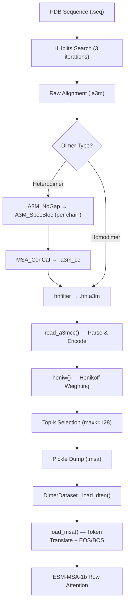

---
slug:12-msa-building-and-henikoff-weighting
blog_type:normal
---


MSA（多序列比对）构建与 Henikoff 加权流程是 Glinter 二聚体界面预测的进化信息主干。它将 HHblits 生成的原始 `.a3m` 比对结果转换为数值张量——编码序列多样性、共进化信号及逐行重要性权重——以供 ESM-MSA-1b 注意力编码器消费。该流程涵盖三个阶段：**MSA 生成**（外部 HHblits）、**MSA 构建**（Python `msa_builder.py`）以及 **MSA 加载**（PyTorch `DimerDataset`）。在构建阶段实现的 Henikoff 加权方案，为每行 MSA 分配一个归一化权重，该权重反映了该行对比对的独特贡献，从而防止近缘序列的过度表征导致下游注意力机制产生偏差。

## MSA 流程架构

从原始序列到模型输入的完整 MSA 流程遵循一个线性转换链，异二聚体（拼接的 MSA）和同二聚体（单链 MSA）具有不同的路径：



异二聚体路径在通过 **MSA_ConCat** 将受体和配体 MSA 拼接为联合 `.a3m_cc` 比对之前，引入了两个额外的外部工具——**A3M_NoGap**（去除全空位列）和 **A3M_SpecBloc**（通过参考 `TaxTree` 应用分类学特化阻断）。随后，两条路径均通过 **hhfilter**（`-diff 200 -cov 20`）以减少冗余并施加覆盖度阈值，最后进入 Python 构建阶段。

来源: [run_hhblits.sh](/preprocess/MSA/run_hhblits.sh#L1-L82), [concat_msa.sh](/preprocess/MSA/concat_msa.sh#L1-L24), [filter_msa.sh](/preprocess/MSA/filter_msa.sh#L1-L13)

## A3M 解析与序列编码

`read_a3mcc` 函数是将基于文本的 A3M 比对转换为 NumPy 整数数组的入口点。它通过 `read_seqs` 读取 `.a3m` 文件中的所有序列，然后通过两步转换处理每条序列：(1) 通过正则表达式 `re.sub('[a-z]', '', s)` 去除小写字符，从而移除 HHblits 以小写编码的插入状态残基；(2) 使用由 `bytes.maketrans` 构建的预计算转换表 `AA`，将剩余的大写残基和空位映射为 `uint8` 整数。

该编码将 20 种标准氨基酸和空位字符（`-`）映射到 `[0, 26)` 范围内，其中空位字符被分配索引 26（即 `WORDS` 常量的最后一个位置）。这种整数表示至关重要，因为它具有双重用途：它既是 Henikoff 加权函数（用于计算每列残基频率）的直接输入，随后又会在数据集加载时通过 `esm_tt` 查找表转换为 ESM 的 token 索引。

对于异二聚体输入（`use_a3mcc=True`），`read_a3mcc` 还会解析 FASTA 头部，从模式 `.+ (\d+) / (\d+) ->.*` 中提取受体和配体序列长度，并返回 `(msa, query, (rec_len, lig_len))`。健全性检查 `assert rec_len + lig_len == len(query)` 用于验证拼接后的比对维度是否一致。

来源: [msa_builder.py](/preprocess/msa_builder.py#L11-L66), [fasta.py](/glinter/protein/fasta.py#L1-L46)

## Henikoff 基于位置的加权

`heniw` 函数实现了 **Henikoff & Henikoff (1994) 基于位置的加权**，这是一种为每条序列分配权重以校正 MSA 中样本偏差的经典方法。其核心思想是：在不同位置拥有稀有残基的序列，其权重应高于与许多其他序列完全相同的序列。

该算法分为三步执行：

| 步骤 | 操作 | 形状 | 目的 |
|------|-----------|------|---------|
| 1. 列多样性 | `cnt[:,i] = bincount(msa[:, i])` | `(27, ncol)` | 统计每列残基频率 |
| 2. 原始权重 | `msaw = (1 / Σ(cnt > 0)) / cnt[msa, col]` | `(nrow, ncol)` | 逐位置权重：多样性倒数 ÷ 残基计数 |
| 3. 行聚合 | `hw = Σ(msaw, axis=-1) / Σ(hw)` | `(nrow,)` | 对位置求和，归一化为概率分布 |

**步骤 1** 构建了一个 `(27 × ncol)` 的频率矩阵，其中 `cnt[r, c]` 表示在第 `c` 列 exhibiting 残基 `r` 的 MSA 行数。**步骤 2** 计算逐位置权重：每个位置的贡献为 `1 / d_c`（其中 `d_c` 为该列不同残基的数量），再除以该特定残基的计数——因此，在多样性高的列中出现的独特残基贡献很大，而在保守列中出现的常见残基贡献很小。**步骤 3** 对每行所有列的贡献求和并归一化，使权重总和为 1。

<CgxTip>序列的 Henikoff 权重是所有列的 `1/(d_c × n_{r,c})` 之和，其中 `d_c` 是第 `c` 列的多样性，`n_{r,c}` 是该残基在该列的频率。这自然地降低了冗余序列的权重：如果两条序列完全相同，它们各自获得的权重将是单条独特序列的一半。</CgxTip>

### 空位折扣

计算基础 Henikoff 权重后，当 `discount_gaps=True`（默认值）时，`heniw` 会应用可选的**空位密度折扣**：

```python
hw = hw * num_words(msa, exclude=GAP) / ncol
```

这会将每行的权重乘以其非空位密度（非空位位置的比例），从而确保含有大量空位的序列——通常是具有片段化比对的远缘同源物——获得成比例降低的影响力。`num_words` 辅助函数计算排除空位 token（索引 26）后的逐行计数，生成一个非空位计数向量，然后将其按元素除以比对宽度。

来源: [msa_builder.py](/preprocess/msa_builder.py#L19-L91)

## Top-k 序列选择

Henikoff 加权后，`build_msa` 函数会应用 **top-k 选择** 步骤，将 MSA 截断至信息量最大的序列：

```python
if len(hw) > maxk and maxk > 0:
    idx = np.argsort(hw)[::-1][:maxk]
    msa = msa[idx]
    hw = hw[idx]
```

在默认 `maxk=128` 的情况下，序列按 Henikoff 权重降序排列，仅保留前 128 条。这有两个目的：(1) 限制了 ESM-MSA-1b Transformer 的计算成本，其注意力复杂度与 MSA 深度呈二次方关系；(2) 优先选择贡献最多独特进化信息的序列。记录所选索引的 `idx` 数组会存储在输出样本中，以保持可追溯性。

在调试路径（`dump=False`）中，该函数使用 matplotlib 可视化所选 MSA 的空位密度分布，提供比对质量的诊断视图。

来源: [msa_builder.py](/preprocess/msa_builder.py#L93-L161)

## 样本序列化与二聚体张量组装

`build_msa` 函数组装包含下游训练所需的所有 MSA 派生信息的最终样本字典：

| 键 | 类型 | 描述 |
|-----|------|-------------|
| `rec` | `str` | 受体链标识符 |
| `lig` | `str` | 配体链标识符 |
| `query` | `str` | 查询序列（MSA 的第一行） |
| `msa` | `np.ndarray` (uint8) | 整数编码的 MSA，形状为 `(nrow, ncol)` |
| `hw` | `np.ndarray` (float32) | Henikoff 权重，形状为 `(nrow,)` |
| `reclen` / `liglen` | `int` | 受体 / 配体序列长度 |
| `idx` | `np.ndarray` 或 `None` | top-k 选择后的保留行索引 |
| `concated` | `bool` | MSA 是否经过拼接（异二聚体） |

样本通过 pickle 序列化到 `<stem>.msa` 文件中。`concated` 标志尤为重要：它区分了异二聚体 MSA（其中受体和配体序列并排拼接为单一比对）与同二聚体 MSA（其中单链比对同时用于两侧）。该标志通过 `feat_verifier.py` 传播至二聚体张量（`.dten`），并最终在数据集访问时被 `load_msa` 消费。

来源: [msa_builder.py](/preprocess/msa_builder.py#L122-L161), [build_features.sh](/scripts/build_features.sh#L17-L23)

## 数据集访问时的 MSA 加载

在训练或推理期间调用 `DimerDataset.__getitem__` 时，预构建的 MSA 张量会通过 `msa_utils.py` 中的 `load_msa` 进行第二次转换。该函数处理两项关键操作：**基于索引的子集化**和 **ESM token 转换**。

**索引子集化**提取与结构比对残基相对应的比对列（来自 `alnidx`）。对于拼接的 MSA（`concated=True`），受体列直接使用 `recidx`，而配体列则通过 `reclen` 偏移：`ligidx + ligbeg`。对于非拼接 MSA（`concated=False`），受体和配体索引均应用于同一 MSA，并将结果拼接：`torch.cat((_msa[:, recidx], _msa[:, ligidx]), dim=-1)`。

**ESM token 转换**发生在 `_load_dten` 中，原始整数 MSA 通过 `esm_tt` 查找表进行转换：`_dten['msa'] = self.esm_tt[_msa]`。该表将 27 字符的字母表索引映射到 ESM-MSA-1b 词汇表。token 转换后，`load_msa` 可选择在每行前添加 BOS token（`cls_idx`）并在尾部追加 EOS token（`eos_idx`），以符合 ESM Transformer 的预期输入格式。

`max_row` 参数在 PyTorch 层面提供了最终的深度限制（`msa = msa[:max_row]`），作为预处理期间应用的 `maxk` 截断的补充。

来源: [msa_utils.py](/glinter/dataset/msa_utils.py#L17-L66), [dimer_dataset.py](/glinter/dataset/dimer_dataset.py#L244-L255), [dimer_dataset.py](/glinter/dataset/dimer_dataset.py#L310-L333)

## 异二聚体与同二聚体 MSA 构建

流程根据二聚体类型进行分支，这由 `msa_builder.py` 中的 `--use-concat` 标志和 `build_features.sh` 中的 `$mode` 变量控制：

| 方面 | 异二聚体 (mode=1) | 同二聚体 (mode≠1) |
|--------|----------------------|---------------------|
| MSA 来源 | `.a3m_cc`（拼接） | `.a3m`（单链） |
| Shell 流程 | `concat_msa.sh` → `filter_msa.sh` | `run_hhblits.sh` → `filter_msa.sh` |
| Python 标志 | `--use-concat` | *（默认）* |
| `concated` 值 | `True` | `False` |
| 序列检查 | 通过 `.seq` 文件验证 `rec_len` + `lig_len` | 两侧使用相同长度 |
| 加载时的列偏移 | 配体列偏移 `reclen` | 无需偏移 |

对于异二聚体，外部 `MSA_ConCat` 工具合并两条经过 `A3M_NoGap`（去空位）和 `A3M_SpecBloc`（分类学特化）处理的链特异性 MSA。随后在拼接后的比对上运行 `meff_cdhit` 工具以计算有效序列数（`M_eff`），这是一种比对多样性的度量，存储在 `.meff` 文件中。该多样性指标通过提供比对包含多少独立进化信息的单一标量摘要，对 Henikoff 权重形成了补充。

来源: [concat_msa.sh](/preprocess/MSA/concat_msa.sh#L1-L24), [build_features.sh](/scripts/build_features.sh#L19-L23), [msa_builder.py](/preprocess/msa_builder.py#L93-L120)

## HHblits 配置与有效序列数

HHblits 搜索通过平衡灵敏度与比对质量的参数进行配置：

| 参数 | 值 | 目的 |
|-----------|-------|---------|
| `-n` | 3 | 搜索迭代次数 |
| `-e` | 0.001 | E 值阈值 |
| `-maxfilt` | 500000 | 最大过滤轮数 |
| `-diff inf` | ∞ | 保留所有多样性序列（无深度限制） |
| `-id 99` | 99% | 成对同一性过滤 |
| `-cov` | `min(60, 7000/(L-1))` | 自适应覆盖度阈值 |

覆盖度参数随查询长度自适应调整：短查询需要更高的覆盖度（最高达 60%），而长查询则允许较低的覆盖度，其断点设置为确保至少覆盖 80 个残基（`7000/(L-1)` 大致保证 `coverage × L ≥ 80`）。

HHblits 运行后，`meff_cdhit` 外部工具从 `.a3m` 文件计算有效序列数。如果比对超过 200,000 行，则跳过计算并写入 `M_eff = 11` 作为哨兵值，从而避免在极大比对上执行昂贵的 CD-HIT 聚类。

来源: [run_hhblits.sh](/preprocess/MSA/run_hhblits.sh#L19-L76)

## 端到端数据流总结

从 FASTA 序列到就绪 ESM 的 MSA 张量的完整转换涉及六个不同的编码阶段：

| 阶段 | 输入 | 输出 | 模块 |
|-------|-------|--------|--------|
| 1. HHblits | `.seq` | `.a3m` + `.hhm` + `.meff` | `run_hhblits.sh` |
| 2. 拼接 | 链 `.a3m` 文件 | `.a3m_cc` | `concat_msa.sh` |
| 3. 过滤 | `.a3m` / `.a3m_cc` | `.hh.a3m` | `filter_msa.sh` |
| 4. 解析与编码 | `.hh.a3m` | `np.ndarray(uint8)` | `read_a3mcc()` |
| 5. 加权与选择 | 整数 MSA | 截断后的 `(msa, hw)` | `heniw()` + top-k |
| 6. Token 转换与填充 | `msa` 张量 | 就绪 ESM 的 `LongTensor` | `load_msa()` |

<CgxTip>Henikoff 权重（`hw`）在阶段 5 中计算并存储，但在 ESM-MSA 前向传播中目前并未作为显式注意力权重使用——它们主要用于选择信息量最大的 top-k 序列。扩展模型以将 `hw` 用作行注意力偏置，将是更直接利用它们的一种自然方式。</CgxTip>

来源: [msa_builder.py](/preprocess/msa_builder.py#L93-L161), [msa_utils.py](/glinter/dataset/msa_utils.py#L17-L66), [msa_model.py](/glinter/models/msa_model.py#L164-L212)

## 相关页面

- HHblits 调用的详细信息涵盖在 [使用 HHblits 生成 MSA](15-msa-generation-with-hhblits) 中。
- 构建的 MSA 如何流入特征配置和数据集加载，详见 [DimerDataset 与特征加载](11-dimerdataset-and-feature-loading) 和 [特征配置系统](13-feature-configuration-system)。
- 模型对 MSA 行注意力的下游消费描述于 [MSAModel 与前向传播](5-msamodel-and-forward-pass) 和 [ESM-MSA 注意力嵌入](9-esm-msa-attention-embedding) 中。