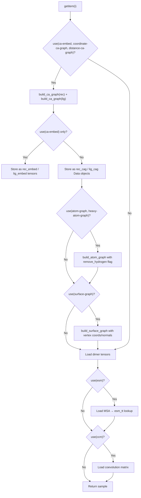
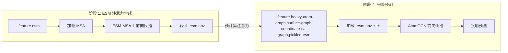

---
slug:13-feature-configuration-system
blog_type:normal
---


Glinter 的特征配置系统是一个**逗号分隔的声明式协议**，它控制着在运行时哪些结构和进化表征进入模型。`DimerFeature` 类无需硬编码特征子集，而是解析单个字符串参数（例如 `--feature heavy-atom-graph,surface-graph,coordinate-ca-graph,pickled-esm`），并暴露一个统一的查询接口，数据集加载器和模型构造器均使用该接口来条件性地激活代码路径。这种设计将特征选择与具体实现解耦：添加新特征只需在一个 `groups` 属性中注册，并连接相应的 `use()` 检查，无需修改参数模式本身。

来源：[_feature.py](/glinter/dataset/_feature.py#L1-L36), [dimer_dataset.py](/glinter/dataset/dimer_dataset.py#L1-L339)

## DimerFeature 注册表

`DimerFeature` 类是所有已识别特征名称的唯一事实来源。它由逗号分隔的字符串构造而成，并立即验证两个不变量：每个标记必须属于预定义的 `groups` 集合，且互斥对 `esm` / `pickled-esm` 不能共存。如果提供的键中**有任何一个**存在，`use(*keys)` 方法就会返回 `True`，从而实现简洁的条件逻辑，例如 `self._feature.use('ca-embed', 'coordinate-ca-graph', 'distance-ca-graph')` 会在请求三个 CA 级别特征中的至少一个时激活代码块。

| 特征组 | 类别 | 描述 |
|---|---|---|
| `ccm` | 进化 | 共进化接触矩阵（gremlin CCM） |
| `esm` | 进化 | 实时 ESM-MSA-1 注意力嵌入（运行时模型推理） |
| `pickled-esm` | 进化 | 来自 `.esm.npz` 文件的预计算 ESM-MSA-1 注意力 |
| `ca-embed` | CA 级别 | 仅节点嵌入（无图边），输出为 `(L, D)` 张量 |
| `coordinate-ca-graph` | CA 级别 | 包含 3D 坐标、局部参考系和边连接性的 CA 图 |
| `distance-ca-graph` | CA 级别 | 包含显式边距离特征的 CA 图（隐含坐标） |
| `atom-graph` | 原子 | 包含氢的完整原子图，边从原子指向 CA 质心 |
| `heavy-atom-graph` | 原子 | 去除氢的原子图（`remove_hydrogen=True`） |
| `surface-graph` | 表面 | 带有法线的网格顶点图，边从顶点指向 CA 质心 |

来源：[_feature.py](/glinter/dataset/_feature.py#L15-L21), [_feature.py](/glinter/dataset/_feature.py#L11-L12)

## 特征验证与互斥性

构造函数强制执行两条验证规则。首先，逗号分隔输入中的每个标记都会对照 `groups` 属性进行检查——拼写错误或未注册的名称会立即引发 `ValueError`。其次，`esm` 和 `pickled-esm` 是互斥的，因为它们代表了同一底层 ESM-MSA-1 注意力表征的两种不同交付机制：`esm` 在前向传播期间即时运行 ESM 模型，而 `pickled-esm` 从磁盘加载预序列化的注意力图。同时选择两者将是冗余且浪费的。

```python
# Validation in __init__
for k in features:
    if k not in self.groups:
        raise ValueError(f'{k} is not defined')
if 'esm' in features and 'pickled-esm' in features:
    raise ValueError(f'use one of "esm" or "pickled-esm"')
```

`__contains__` 方法也会验证其参数，因此 `use()` 调用中的拼写错误会显式报错，而不是静默返回 `False`。

来源：[_feature.py](/glinter/dataset/_feature.py#L2-L13), [_feature.py](/glinter/dataset/_feature.py#L29-L32)

## CLI 集成与半径参数

`DimerFeature` 通过 `DimerDataset.add_args` 接入参数解析器，该函数以 `type=DimerFeature` 注册 `--feature`。这意味着 argparse 自身会根据命令行字符串构造 `DimerFeature` 实例，在程序继续执行之前执行验证。另外三个半径参数控制图构建的空间范围，并由几何图构建器消费：

| 参数 | 默认值 | 使用者 |
|---|---|---|
| `--cag-radius` | 8.0 | `build_ca_graph` — CA-CA 邻居搜索的半径球 |
| `--atg-radius` | 6.0 | `build_atom_graph` — 原子→CA 邻居搜索的半径球 |
| `--sug-radius` | 6.0 | `build_surface_graph` — 表面顶点→CA 邻居搜索的半径球 |
| `--add-gaussian-noise` | False | 训练时对图位置的高斯噪声增强 |

来源：[dimer_dataset.py](/glinter/dataset/dimer_dataset.py#L100-L127)

## 数据集加载器中的特征分发

`DimerDataset.getitem()` 将 `self._feature.use(...)` 用作**特征分发器**，以条件性地仅构造请求的表征。分发遵循层级模式：首先检查 CA 级别特征，在该代码块内，仅当设置了相应的特征标志时才构建原子图和表面图。这避免了构建未使用图的开销——这是一项显著的优化，因为表面图构建需要网格顶点数据，而原子图可能很大。



单体张量加载器 `_load_mten` 也具有特征感知能力：仅当请求了 `surface-graph` 时，它才从 `.mten` 文件中读取顶点坐标和法线，从而减少了省略表面特征的配置的 I/O 开销。类似地，`_load_dten` 仅在 `esm` 激活时才加载 MSA 并将其转换为 ESM 标记，仅在 `ccm` 激活时才加载 CCM 张量。

来源：[dimer_dataset.py](/glinter/dataset/dimer_dataset.py#L159-L280), [dimer_dataset.py](/glinter/dataset/dimer_dataset.py#L287-L333)

## 模型构造器中的特征分发

`MSAModel.__init__` 镜像了数据集的特征分发，以条件性地组装神经架构。`embed_dim` 累加器从零开始，并根据激活的特征增长：`esm` 或 `pickled-esm` 增加 144 个通道，`ccm` 增加 1 个通道，1D 编码器输出增加 `output_dim × 2` 个通道（每条链一个）。1D 编码器本身（`_build_encoder_1d`）也是特征驱动的：`ca-embed` 构建一个 `Conv1d` 堆栈，而任何图特征（`coordinate-ca-graph`、`distance-ca-graph`、`atom-graph`、`surface-graph`）都会向 `src_graphs` 追加一个图规范，最终构造一个 `AtomGCN` 模块。这意味着模型的参数量和架构会随特征字符串变化——选择 `ccm,ca-embed` 会产生一个轻量级的纯 Conv1d 模型，而选择 `heavy-atom-graph,surface-graph,coordinate-ca-graph,pickled-esm` 则会产生完整的多图 AtomGCN 架构。

| 特征组合 | 编码器类型 | 额外嵌入通道 |
|---|---|---|
| 仅 `ccm` | None | 1 |
| 仅 `esm` | None | 144 |
| `ccm,ca-embed` | Conv1d 堆栈 | 1 + 256 |
| `pickled-esm,coordinate-ca-graph` | AtomGCN（1 个图） | 144 + 256 |
| `pickled-esm,coordinate-ca-graph,atom-graph,surface-graph` | AtomGCN（3 个图） | 144 + 256 |

来源：[msa_model.py](/glinter/models/msa_model.py#L44-L78), [msa_model.py](/glinter/models/msa_model.py#L80-L162)

## 整理器：批处理异构特征类型

`Collater` 类处理批处理包含 PyTorch Geometric `Data` 对象（图）、普通张量和标量元数据的样本的挑战。它委托给 `DefaultCollater`，后者递归地整理嵌套字典：`Data` 对象通过 `Batch.from_data_list` 进行批处理，张量通过 `default_collate` 进行批处理，映射通过递归字典构造进行批处理。这是必不可少的，因为不同的特征配置会产生不同的数据类型——`ca-embed` 产生普通张量，而图特征产生带有 `x`、`pos`、`edge_index` 和 `lrf` 属性的 `Data` 对象。整理器将它们统一为单个可批处理的结构，无论激活了哪些特征。

来源：[collater.py](/glinter/dataset/collater.py#L1-L65)

## 实用的特征配置

代码库中出现了两种规范配置。**ESM 注意力生成**阶段使用 `--feature esm` 以推理模式运行 ESM-MSA-1 模型，并将行注意力图转储到 `.esm.npz` 文件。**完整预测**阶段随后使用 `--feature heavy-atom-graph,surface-graph,coordinate-ca-graph,pickled-esm` 来加载那些预计算的注意力以及三个结构图。这种两阶段模式避免了在预测期间将大型 ESM 模型保留在 GPU 内存中的内存开销。



来源：[run_glinter.sh](/alphafold/run_glinter.sh#L18-L21), [msa_model.py](/glinter/models/msa_model.py#L290-L344)

<CgxTip>特征字符串由 argparse 通过 `type=DimerFeature` 解析，因此验证错误（拼写错误、互斥性违规）会在参数解析时被捕获——在任何数据加载或模型构造开始之前。这种快速失败行为使得错误配置立即暴露。</CgxTip>

<CgxTip>当选择 `distance-ca-graph` 时，它隐式启用了 `coordinate-ca-graph` 的行为（图仍然具有坐标和 LRF），但增加了一维的边距离嵌入。在模型中，`use_distance_graph` 控制 `edge_dim`，AtomGCN 使用它来确定是否将边特征传递给消息传递层。</CgxTip>

## 特征数据流总结

下表追溯了每个特征从其预处理文件格式到数据集加载再到模型消费的完整过程，展示了特征配置选择的完整生命周期。

| 特征 | 预处理文件 | 数据集键 | 模型消费者 | 张量形状 |
|---|---|---|---|---|
| `ccm` | `.dten` → `ccm` | `data['ccm']` | 添加到 2D 嵌入维度 | `(1, L_rec, L_lig)` |
| `esm` | `.dten` → `msa` (已标记化) | `data['msa']` | ESM 前向传播 → 行注意力 | `(L, N, K, K)` → `(144, L_rec, L_lig)` |
| `pickled-esm` | `.esm.npz` | `data['esm']` | 直接添加到 2D 嵌入 | `(144, L_rec, L_lig)` |
| `ca-embed` | `.mten` (COORD, SEQ, PSSM, SAS) | `data['rec_embed']`, `data['lig_embed']` | Conv1d 编码器 | `(L, 43)` → `(L, 128)` |
| `coordinate-ca-graph` | `.mten` | `data['rec_cag']`, `data['lig_cag']` | AtomGCN (图 0) | `Data(x, pos, edge_index, lrf)` |
| `distance-ca-graph` | `.mten` | `data['rec_cag']`, `data['lig_cag']` | AtomGCN (图 0, edge_dim=1) | `Data(x, pos, edge_index, lrf, edge_embed)` |
| `atom-graph` / `heavy-atom-graph` | `.mten` | `data['rec_atg']`, `data['lig_atg']` | AtomGCN (图 1) | `Data(x, pos, edge_index, edge_embed)` |
| `surface-graph` | `.mten` (顶点坐标/法线) | `data['rec_sug']`, `data['lig_sug']` | AtomGCN (图 2) | `Data(pos, nor, edge_index)` |

来源：[dimer_dataset.py](/glinter/dataset/dimer_dataset.py#L184-L230), [msa_model.py](/glinter/models/msa_model.py#L164-L246)

## 下一步

既然你已经了解了特征选择是如何声明和分发的，你可以追踪生成此系统所消费的 `.mten` 和 `.dten` 文件的预处理阶段：参见 [PDB 序列提取](14-pdb-sequence-extraction) 了解预处理流水线的起点，或参见 [DimerDataset 与特征加载](11-dimerdataset-and-feature-loading) 了解数据集类如何协调配置特征的加载。