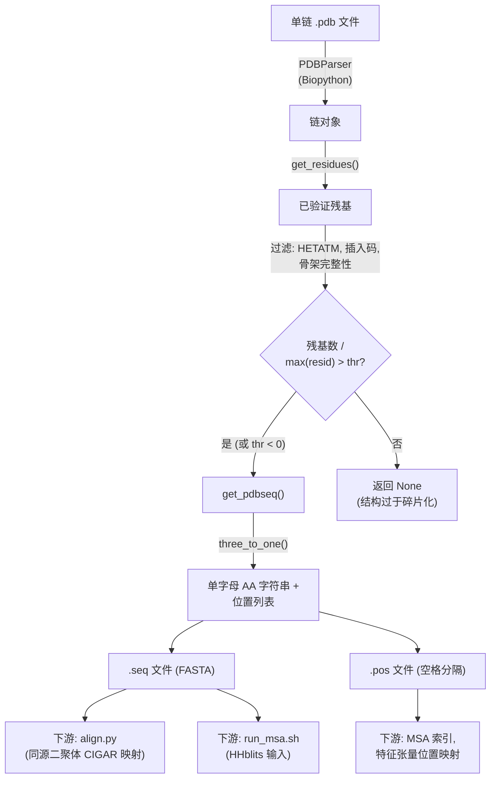
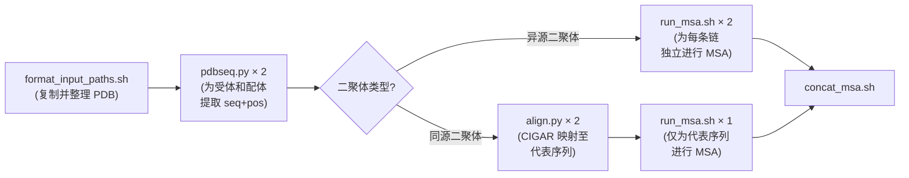

---
slug:14-pdb-sequence-extraction
blog_type:normal
---


**PDB 序列提取**阶段是 Glinter 流程中基础的预处理步骤——它连接了原始晶体学结构文件（`.pdb`）与下游生物序列分析（MSA 生成、同源二聚体比对及特征张量组装）。给定一个单链 PDB 文件，该阶段会提取经过验证的单字母编码氨基酸序列及对应的残基位置索引，并分别写入 `.seq` 和 `.pos` 文件。此阶段在所有其他预处理**之前**运行，其输出会被所有后续阶段使用。

## 架构与数据流

提取过程可分解为三个概念层：**PDB 解析**（Biopython 的 `PDBParser`）、**残基验证**（结构完整性过滤）和**序列编码**（三字母到单字母的氨基酸映射）。下图展示了这些层的组合方式及输出流向：



来源: [pdbseq.py](/preprocess/pdbseq.py#L1-L25), [pdb_utils.py](/glinter/protein/pdb_utils.py#L1-L70)

## 入口点：`pdbseq.py`

命令行入口点 [`preprocess/pdbseq.py`](/preprocess/pdbseq.py#L1-L25) 是一个专注的脚本，它仅接受三个参数，并对输入结构强制执行严格的**单链约束**：

| 参数 | 位置 | 描述 | 输出格式 |
|---|---|---|---|
| `path` | `sys.argv[1]` | 输入的单链 PDB 文件 | — |
| `sys.argv[2]` | `sys.argv[2]` | 输出序列文件路径 | FASTA: `>{stem}\n{seq}` |
| `sys.argv[3]` | `sys.argv[3]` | 输出位置文件路径 | 空格分隔的整数 |

`pdbseq()` 函数在返回前执行两个关键断言：(1) PDB 必须包含**恰好一条链**，且 (2) 该链必须至少产生一个有效残基。它使用 `thr=-1` 调用 `get_pdbseq`，这将**绕过完整性阈值检查**——在此提取阶段，无论碎片化程度如何，任何有效的残基序列均被接受。输出的 `.seq` 文件使用 PDB 文件名主干作为 FASTA 头部，而 `.pos` 文件将原始 PDB 残基编号记录为空格分隔的整数列表。

```python
# 来自 build_hetero.sh 的调用模式:
python $GLINT_ROOT/preprocess/pdbseq.py \
    $srcdir/$receptor/$receptor.pdb \   # 输入 PDB
    $srcdir/$receptor/$receptor.seq \   # 输出 FASTA 序列
    $srcdir/$receptor/$receptor.pos     # 输出残基位置
```

来源: [pdbseq.py](/preprocess/pdbseq.py#L8-L24), [build_hetero.sh](/scripts/build_hetero.sh#L29-L30)

## 残基验证：`get_residues()`

函数 [`get_residues(chain)`](/glinter/protein/pdb_utils.py#L31-L43) 对 Biopython 链对象中的每个残基应用三级过滤器。每级过滤器针对一类会破坏下游序列表示的结构伪影：

**过滤器 1 — HETATM 排除**：被标记为杂原子的残基（`hetatom != ' '`）将被移除。这排除了水分子（`HOH`）、结合配体、金属离子以及缺乏标准氨基酸编码的修饰残基。只有 `ATOM` 记录会保留。

**过滤器 2 — 插入码排除**：带有非空插入码的残基（`icode != ' '`）将被移除。PDB 插入码（例如残基 `45A`）代表替代构象或微观不均一性，会产生有歧义的位置映射。

**过滤器 3 — 骨架完整性检查**：残基必须具备所有三个骨架原子——**N**、**CA** 和 **C**——才能被保留。缺失任何骨架原子的残基在结构上是不完整的，无法参与有意义的几何特征计算。这通过检查原子名称集合来验证：`all(_ in _names for _ in ('N', 'CA', 'C'))`。

来源: [pdb_utils.py](/glinter/protein/pdb_utils.py#L31-L43)

## 序列提取：`get_pdbseq()`

函数 [`get_pdbseq(chain, thr=0.95, return_positions=False)`](/glinter/protein/pdb_utils.py#L12-L29) 将验证后的残基转换为单字母氨基酸字符串。它接受 Biopython `Chain` 对象或预过滤的残基列表，从而在 CLI 提取路径和特征构建路径中均可复用。

**完整性阈值**（`thr`）用于防止严重碎片化的结构。它计算比值 `len(residues) / max(residue_id)`，其中 `max(residue_id)` 是最后一个有效残基的 PDB 残基编号。若此比值低于 `thr`，函数返回 `None`——该结构相对于其 PDB 编号范围存在过多缺口。默认 `thr=0.95` 允许最多 5% 的残基缺口。当 `thr < 0`（如在 `pdbseq.py` 中的调用）时，此检查被完全绕过。

| `thr` 值 | 行为 | 使用场景 |
|---|---|---|
| `0.95`（默认） | 若超过 5% 的残基位置为缺口则拒绝 | 特征构建 (`msms_builder.py`) |
| `< 0`（如 `-1`） | 始终接受任何非空残基列表 | CLI 提取 (`pdbseq.py`) |
| `0.0`–`1.0` | 自定义缺口容差 | 编程式 API 使用 |

当 `return_positions=True` 时，该函数同时返回序列字符串和 PDB 残基 ID 列表——保留序列索引与结构文件中原始编号之间的映射。

来源: [pdb_utils.py](/glinter/protein/pdb_utils.py#L12-L29)

## 氨基酸编码：`three_to_one()`

函数 [`three_to_one(s)`](/glinter/protein/encoding_utils.py#L103-L104) 使用由规范 20 种标准残基加上未知占位符 `X` 构建的字典 `d3_to_d1`，将 IUPAC 三字母氨基酸码映射为单字母码。任何不在标准集合中的残基名称（如磷酸丝氨酸 `SEP`、硒代甲硫氨酸 `MSE`）均映射至 `'X'`，确保提取过程不会因非标准残基而失败——它们被标记而非被丢弃。完整映射如下：

```
ALA→A  CYS→C  ASP→D  GLU→E  PHE→F  GLY→G  HIS→H  ILE→I  LYS→K
LEU→L  MET→M  ASN→N  PRO→P  GLN→Q  ARG→R  SER→S  THR→T  VAL→V
TRP→W  TYR→Y  [其他]→X
```

来源: [encoding_utils.py](/glinter/protein/encoding_utils.py#L76-L104)

## 流程集成与输出消费

序列提取阶段在异源二聚体和同源二聚体预处理流程中均占据关键位置。它在输入格式化步骤（`format_input_paths.sh`）之后**立即**调用，且位于任何 MSA 计算**之前**：



**在异源二聚体模式**（[`build_hetero.sh`](/scripts/build_hetero.sh#L29-L30)）下，`pdbseq.py` 被调用两次——分别针对受体和配体。生成的 `.seq` 文件成为每条链独立 HHblits MSA 搜索的查询序列。

**在同源二聚体模式**（[`build_homo.sh`](/scripts/build_homo.sh#L23-L28)）下，同样执行双重提取，但 `.seq` 文件还另有用途：它们通过 [`align.py`](/preprocess/align.py#L1-L48) 与一条**代表序列**进行比对，生成 CIGAR 字符串，将每条链的 PDB 残基编号映射到代表序列的编号上。此比对至关重要，因为同源二聚体共享一条源自代表序列的单一 MSA，每条链的特征必须索引至该共享 MSA 空间中。

`.pos` 文件记录了原始 PDB 残基编号，供下游特征构建器消费，以维持结构特征（原子、表面顶点）与 MSA 比对列之间正确的索引对应关系。

来源: [build_hetero.sh](/scripts/build_hetero.sh#L26-L47), [build_homo.sh](/scripts/build_homo.sh#L22-L44)

## 在特征构建中的复用：`msms_builder.py`

`get_pdbseq` 函数还会在表面特征组装阶段于 [`msms_builder.py`](/preprocess/msms_builder.py#L49) 中被调用。此时它使用**默认阈值**（`thr=0.95`）运行，拒绝缺失残基超过 5% 的结构。特征构建阶段更严格的检查确保了只有解析良好的结构才会进入计算成本高昂的表面网格生成与张量组装环节。该函数在预过滤的残基列表上调用（而非直接调用链对象），展示了 `get_pdbseq` 的双重输入接口。

来源: [msms_builder.py](/preprocess/msms_builder.py#L46-L59), [pdb_utils.py](/glinter/protein/pdb_utils.py#L12-L16)

<CgxTip>处理同源二聚体时，`.pos` 文件对于正确的特征比对至关重要。PDB 残基编号可能包含缺口（例如残基 1–45，接着是 50–100），下游张量索引必须通过这些位置回溯映射，才能与 MSA 列对齐。务必验证 `.pos` 输出长度与 `.seq` 输出长度是否匹配。</CgxTip>

<CgxTip>`pdbseq.py` 中的单链断言意味着多链 PDB 文件必须在提取前拆分。`format_input_paths.sh` 脚本将每条链整理至其独立的子目录 `{chain_name}/{chain_name}.pdb` 中，确保满足此断言。对于包含无序残基的结构，Biopython 的 `PDBParser` 会自动选择一种构象（通过 `get_list()`），因此提取的序列代表了一种有效构象。</CgxTip>

## 下一步

序列提取完成后，流程将使用提取的 `.seq` 文件作为查询，进入 MSA 生成阶段。对于同源二聚体，通过 `align.py` 进行的比对衔接了本阶段与下一阶段。继续阅读 [MSA Generation with HHblits](15-msa-generation-with-hhblits) 了解下一预处理阶段，或查看 [DimerDataset and Feature Loading](11-dimerdataset-and-feature-loading) 以了解提取的序列在训练和推理期间是如何被消费的。