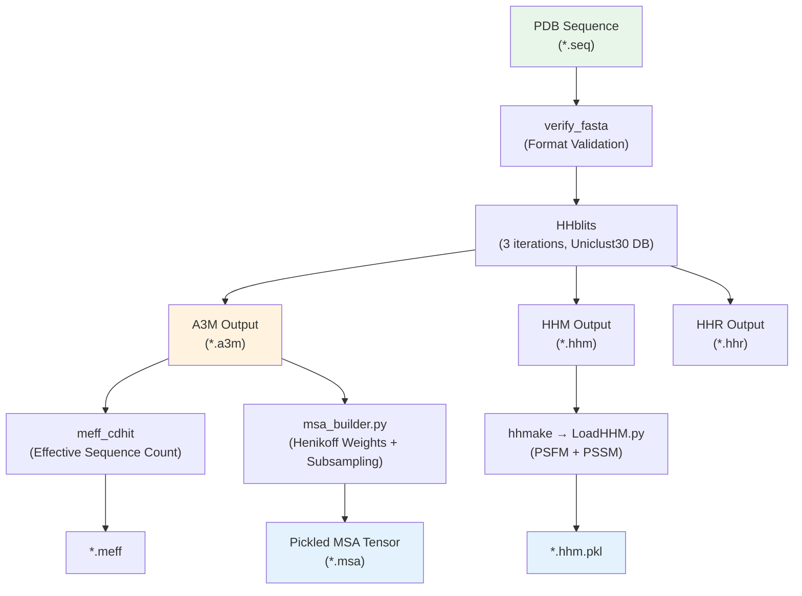

---
slug:15-msa-generation-with-hhblits
blog_type:normal
---


Glinter的MSA生成流水线利用HH-suite工具包中的**HHblits**，将原始蛋白质序列转换为丰富的多序列比对（MSA），随后使用位置特异性打分矩阵（PSSM）、Henikoff序列权重和有效序列数对其进行增强。该阶段是特征工程流水线的基础瓶颈——MSA的质量与多样性直接决定了下游[MSAModel与前向传播](5-msamodel-and-forward-pass)计算可获取的信息量。该流水线对**同源二聚体**（单链MSA）和**异源二聚体**（由两条链配对拼接的MSA）采用不同的处理方式，这一差异会传递至后续的每一个处理阶段。

## 流水线架构

MSA生成系统是一个四阶段的Shell与Python流水线，由顶层的`scripts/run_msa.sh`统筹调度，并委派`preprocess/MSA/`目录下的专用脚本执行各转换步骤。从FASTA输入到序列化MSA张量的完整数据流如下：



来源: [run_hhblits.sh](/preprocess/MSA/run_hhblits.sh#L1-L82), [run_msa.sh](/scripts/run_msa.sh#L1-L6), [msa_builder.py](/preprocess/msa_builder.py#L1-L237)

## 环境配置

在进行任何MSA操作之前，必须通过`scripts/set_env.sh`初始化环境，该脚本会设置整个流水线中使用的三个关键路径变量。**`HHBLITS_BIN`**变量指向包含`hhblits`、`hhmake`和`hhfilter`的HH-suite二进制文件目录。**`HHDB`**变量指定聚类序列数据库——默认为`uniclust30_2016_09`，这是HH-suite附带的UniProt标准30%相似度聚类版本。脚本通过检查`.ffindex`文件来验证数据库完整性，若索引缺失或损坏则立即退出。

| 变量 | 默认路径 | 用途 |
|---|---|---|
| `HHBLITS_BIN` | `$GLINT_ROOT/external/hhblits-bin` | HH-suite可执行文件 (hhblits, hhmake, hhfilter) |
| `HHDB` | `$GLINT_ROOT/scratch/uniclust30_2016_09/uniclust30_2016_09` | 用于谱搜索的聚类序列数据库 |
| `GLINT_ROOT` | 从脚本位置自动检测 | 所有相对路径的仓库根目录 |

<CgxTip>必须更改`HHDB`路径以匹配你本地安装的HH-suite数据库。uniclust30数据库相对轻量（约6GB），但若需更高的灵敏度，可替换为`bfd`或`uniclust30_2020_06`——只需确保同一目录下存在`.ffindex` / `.ffdata`文件对即可。</CgxTip>

来源: [set_env.sh](/scripts/set_env.sh#L1-L15)

## 阶段 1：FASTA验证与覆盖率计算

`run_hhblits.sh`脚本首先在`$GLINT_ROOT/external/`目录下定位`meff_cdhit`和`verify_fasta`这两个外部工具。输入为一个**目录**（`$MSADir`），其基本名成为序列名（`$relnam`），预期的输入文件为`$MSADir/$relnam.seq`——即由[PDB序列提取](14-pdb-sequence-extraction)生成的FASTA格式查询序列。

`verify_fasta`工具对FASTA输入进行清洗，生成HHblits能可靠解析的纯净`.seq`文件。验证后，脚本计算**动态最小比对覆盖率**参数。该覆盖率阈值取以下两个值中的*较小者*：**60%的固定下限**（`a=60`），以及按`b = int(7000 / (seq_length - 1))`计算的**自适应阈值**。该自适应值确保即使对于极短序列，同源序列也能覆盖查询序列至少80个残基。对于200个残基的蛋白质，`b = int(7000/199) = 35`，因此覆盖率为35%；对于50个残基的蛋白质，`b = int(7000/49) = 142`，因此采用60%的固定下限。

来源: [run_hhblits.sh](/preprocess/MSA/run_hhblits.sh#L17-L45)

## 阶段 2：HHblits谱搜索

HHblits的调用使用了经过精心调优的参数集，以在灵敏度、计算开销和MSA多样性之间取得平衡。命令模板如下：

```bash
$HHBLITS -i $seqfile -cpu $cpu_num -d $HHDB \
    -o $hhrfile -ohhm $hhmfile -oa3m $a3mfile \
    -n 3 -e 0.001 -maxfilt 500000 -diff inf -id 99 -cov $coverage
```

| 参数 | 值 | 原理 |
|---|---|---|
| `-n` | 3 | 三轮迭代搜索；每轮基于上一轮的命中结果构建谱并重新搜索 |
| `-e` | 0.001 | E值纳入阈值——足够严格以过滤虚假命中，同时保留远缘同源序列 |
| `-maxfilt` | 500000 | 每次预过滤通过的最大序列数；高上限以避免丢失罕见同源序列 |
| `-diff` | inf | 选择最大化多样性的序列（无限diff → 保留所有不同序列直至`-maxfilt`） |
| `-id` | 99 | 用于过滤的最大两两序列相似度（99% = 此阶段几乎无冗余过滤） |
| `-cov` | dynamic | 命中序列对查询序列的最小覆盖率，根据序列长度计算（见阶段1） |
| `-cpu` | 2 | 用于并行预过滤的线程数 |

三个输出文件在下游扮演不同角色：**`.a3m`**包含带有小写插入残基的比对序列（主要MSA输入），**`.hhm`**包含带有发射和转移概率的谱HMM（转换为PSSM/PSFM），**`.hhr`**包含两两命中列表（用于诊断）。所有工作均在`/tmp/`下的临时目录中进行，以避免污染源目录，仅在成功时将结果移回。

<CgxTip>`-diff inf -id 99`的组合意味着原始A3M文件可能极大（数十万条序列）。这是有意为之——多样性过滤会在后续通过[filter_msa.sh](/preprocess/MSA/filter_msa.sh#L1-L13)中的`hhfilter`以`-diff 200 -cov 20`参数执行，将MSA缩减至最多200条最大化多样性序列。相较于激进的前期过滤，此两阶段策略保留了更多信息。</CgxTip>

来源: [run_hhblits.sh](/preprocess/MSA/run_hhblits.sh#L46-L62)

## 阶段 3：有效序列数

HHblits完成后，脚本使用`meff_cdhit`外部工具计算**Meff**（有效序列数）。Meff用于考量MSA中的序列冗余——若许多序列近乎相同，则有效信息量远小于原始序列计数。然而，对于极大的MSA（≥ 200,000行），脚本会走捷径直接向`.meff`文件写入`11`，从而避免高昂的CD-HIT聚类开销。常量11作为一个指示高多样性的保守占位符，若后续MSA被过滤缩减，则会被正常的Meff计算所覆盖。

来源: [run_hhblits.sh](/preprocess/MSA/run_hhblits.sh#L64-L75)

## 阶段 4：HHM至PSSM/PSFM转换

`msa_to_hhm.sh`脚本遍历源目录查找所有`.a3m`文件，对于每个缺乏对应`.hhm.pkl`的文件，执行两步操作：(1) 运行`hhmake`将A3M转换为独立的`.hhm`谱HMM，(2) 调用`glinter/hhm/LoadHHM.py`解析HHM并将其序列化为Python pickle。

`LoadHHM.py`模块（改编自RaptorX）对HMM块执行复杂的多步转换：

1. **发射分数解析**：每个位置的20个氨基酸发射分数以负整数（单位为1/1000比特）读取，并通过`hmm1[l] = -int32(score) / 1000`转换为log₂空间的浮点数
2. **转移概率提取**：七个状态转移概率（M→M, M→I, M→D, I→M, I→I, D→M, D→D）从存储格式指数化，然后使用Neff加权伪计数进行**正则化**，以避免零概率转移
3. **发射概率转换**：`hmm1_prob = 2^(hmm1)`，随后逐位置重新归一化使总和为1
4. **Gonnet伪计数添加**：来自Gonnet矩阵的背景替换概率与观测发射概率混合：`final = (neff·observed + 10·gonnet) / (neff + 10)`，提升观测数稀少位置的鲁棒性
5. **最终PSSM计算**：`PSSM = log₂(PSFM) + HMMNull/1000`，其中`HMMNull`是背景氨基酸频率向量

生成的pickle包含的键有`PSFM`（位置特异性频率矩阵，20列）、`PSSM`（位置特异性打分矩阵，20列）、`sequence`、`NEFF`、`hmm1`、`hmm2`、`hmm1_prob`和`hmm1_score`。

来源: [msa_to_hhm.sh](/preprocess/MSA/msa_to_hhm.sh#L1-L13), [LoadHHM.py](/glinter/hhm/LoadHHM.py#L1-L321), [SequenceUtils.py](/glinter/hhm/SequenceUtils.py#L1-L124)

## 阶段 5：A3M过滤

HHblits生成的原始A3M通常过大而难以实用。`filter_msa.sh`脚本使用`hhfilter`并指定参数`-diff 200 -cov 20`，生成`.hh.a3m`文件。`-diff 200`标志选择最多200条最大化两两多样性的序列，而`-cov 20`要求命中序列至少覆盖查询序列的20%。当`--use-hhfilter`标志激活时（在异源二聚体和同源二聚体流水线中，通过[build_features.sh](/scripts/build_features.sh#L20-L26)默认激活），`msa_builder.py`消费的便是此过滤后的MSA。

对于**异源二聚体**，过滤应用于*拼接的*跨链MSA（`.a3m_cc`）；对于**同源二聚体**，过滤应用于单链MSA（`.a3m`）。脚本优先检查`.a3m_cc`，若不存在则回退至`.a3m`——此模式与`msa_builder.py`的路径解析逻辑相呼应。

来源: [filter_msa.sh](/preprocess/MSA/filter_msa.sh#L1-L13)

## 阶段 6：异源二聚体的MSA拼接

异源二聚体预测需要一个**配对MSA**，以耦合两条链的进化信息。`concat_msa.sh`脚本通过三个外部工具统筹此过程：

1. **`A3M_NoGap`**：移除每条链A3M中仅含空位的列，生成`.a3m_ng`（无空位）文件
2. **`A3M_SpecBloc`**：使用NCBI分类树（`$GLINT_ROOT/external/TaxTree`）进行分类学分割，按物种将序列分组为物种块（`.a3m_sb`文件）。此步骤至关重要——来自同一物种的序列更可能形成真实的生物复合物
3. **`MSA_ConCat`**：拼接经物种块处理的受体和配体MSA，将匹配物种的序列配对以形成联合比对（`.a3m_cc`）

拼接后，`meff_cdhit`以序列相似度阈值`-S 0.65`和覆盖率阈值`-c 0`重新计算配对MSA的Meff，并将结果写入`.meff`。拼接的MSA编码了在同一生物体中共同出现的受体序列与配体序列对——这是链间接触预测的强进化信号。

来源: [concat_msa.sh](/preprocess/MSA/concat_msa.sh#L1-L24)

## 阶段 7：MSA张量组装（msa_builder.py）

Python模块`preprocess/msa_builder.py`是Shell生成的A3M文件与PyTorch可用张量之间的桥梁。其`build_msa()`函数对每个A3M执行以下操作：

**A3M解析**（`read_a3mcc`）：使用`glinter.protein.read_seqs`读取A3M文件，剥离代表相对于查询序列比对插入的小写字符，并通过预计算的字节转换表（`AA = bytes.maketrans(...)`）将每个字符转换为uint8索引。结果为`(N_seq, L_align)`整数矩阵，其中每个值为27字符字母表（26个大写字母+空位）中的索引。对于拼接的异源二聚体MSA，受体和配体长度使用正则表达式模式`.+ (\d+) / (\d+) ->.*`从FASTA头部提取。

**Henikoff加权**（`heniw`）：计算考量MSA冗余的位置特异性序列权重。对于每个位置`i`，权重贡献为`1 / (位置i处的唯一氨基酸数量)`，每条序列的原始权重为所有位置贡献之和。权重随后被**归一化**使总和为1，并基于空位折扣，通过乘以每条序列非空位残基的比例进行折扣：`hw *= num_words(msa, exclude=GAP) / ncol`。该空位折扣会降低主要由空位构成的序列的权重，此类序列携带的进化信息较少。

**Top-K下采样**：若MSA包含超过`maxk`条序列（默认128），则序列按Henikoff权重降序排列，仅保留前`maxk`条。这使模型的注意力集中于最具信息量（多样且比对良好）的序列。

**序列化**：每个处理后的MSA以字典形式序列化为pickle，包含键`rec`、`lig`、`query`、`msa`（uint8 ndarray）、`hw`（float32 Henikoff权重）、`reclen`、`liglen`、`idx`（下采样索引或None）以及`concated`（布尔值——指示是否为跨链拼接MSA）。

| `build_msa()`参数 | 默认值 | 描述 |
|---|---|---|
| `maxk` | 128 | Henikoff下采样后保留的最大序列数 |
| `dump` | True | 是否将输出序列化为pickle（False启用调试可视化） |
| `use_a3mcc` | 来自CLI | 若为True，解析带有链长提取的拼接异源二聚体A3M |
| `no_check` | False | 跳过针对参考`.seq`文件的序列长度验证 |

来源: [msa_builder.py](/preprocess/msa_builder.py#L1-L237), [fasta.py](/glinter/protein/fasta.py#L1-L46)

## 完整流水线调用模式

两个端到端流水线脚本根据二聚体类型以不同方式调用MSA生成：

**异源二聚体**（[build_hetero.sh](/scripts/build_hetero.sh#L1-L72)）：对受体和配体链独立运行`run_msa.sh` → 通过`concat_msa.sh`拼接 → 使用`--use-concat --use-hhfilter`标志构建特征，这会使得`msa_builder.py`加载`.hh.a3m`文件并将其作为拼接的跨链MSA进行解析。

**同源二聚体**（[build_homo.sh](/scripts/build_homo.sh#L1-L68)）：仅对代表链运行`run_msa.sh` → 通过`filter_msa.sh`过滤 → 将过滤后的MSA复制至二聚体目录 → 使用`--use-hhfilter`构建特征（无`--use-concat`），这会使得`msa_builder.py`加载单链`.hh.a3m`并将其作为非拼接MSA处理。

在这两种情况下，`build_features.sh`将`msa_builder.py`作为其最终MSA步骤调用，生成[DimerDataset与特征加载](11-dimerdataset-and-feature-loading)在训练和推理期间读取的`.msa` pickle文件。

来源: [build_hetero.sh](/scripts/build_hetero.sh#L28-L50), [build_homo.sh](/scripts/build_homo.sh#L30-L52), [build_features.sh](/scripts/build_features.sh#L17-L26)

## 下游消费

生成的`.msa` pickle由`glinter/dataset/msa_utils.py`的`load_msa()`函数加载，该函数处理受体/配体列索引、可选的ESM词元边界标记（CLS/EOS）以及截至`max_row`的行截断。来自`.hhm.pkl`的PSSM输入至`glinter/dataset/_sequence.py`的`build_sequence()`，在此与独热序列编码和溶剂可及表面积拼接，形成逐残基节点特征。这些MSA衍生特征共同构成了Glinter[架构概览](4-architecture-overview)中的进化信息通道。

关于下一预处理阶段，请前往[使用MSMS进行表面计算](16-surface-computation-with-msms)，该阶段计算几何表面特征以补充此处所述的进化MSA特征。若要了解这些MSA张量在训练时如何加载，请参见[DimerDataset与特征加载](11-dimerdataset-and-feature-loading)。