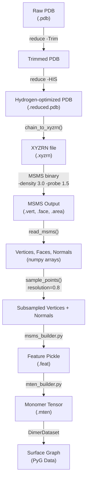

---
slug:16-surface-computation-with-msms
blog_type:normal
---


Glinter 模型不仅通过序列和原子结构来建模蛋白质界面，还通过每个单体的**溶剂排除表面 (SES)** 进行建模。表面顶点和法线提供了一种几何表示，能够捕获结合界面的“形状指纹”——这是纯原子坐标无法表达的信息。本文档详细介绍了将原始 PDB 结构转换为子采样表面点以供图神经网络使用的完整流程，涵盖从 Shell 脚本编排、MSMS 调用、输出解析、点子采样到下游特征组装的全过程。

## 流程概述

表面计算流程是一个多阶段过程，它将外部 C++ 工具 (MSMS) 与基于 Python 的后处理衔接起来。从宏观上看，一个 PDB 文件会经历氢键优化、格式转换、三角化表面生成，最后是顶点子采样，从而产生一组稀疏但具代表性的表面点，这些点携带 3D 坐标和朝外的法线。



来源: [run_msms.sh](scripts/run_msms.sh#L1-L51), [msms_builder.py](preprocess/msms_builder.py#L1-L292), [mten_builder.py](preprocess/mten_builder.py#L1-L177)

## 环境设置与外部依赖

该流程依赖两个外部二进制文件，其路径由环境脚本导出。**MSMS** (Michel Sanner 分子表面) 从原子球体计算三角化的溶剂排除表面，而 **Reduce** 负责质子化——具体来说，是优化组氨酸互变异构体，这可能会改变生物关键界面残基处的表面几何结构。

| 变量 | 用途 | 默认路径 |
|---|---|---|
| `MSMS_BIN` | MSMS 表面计算二进制文件 | `$GLINT_ROOT/external/msms` |
| `REDUCE_PATH` | Reduce 氢键操作工具 | `$GLINT_ROOT/external/reduce` |
| `REDUCE_HET_DICT` | Reduce 异质物字典 | `$REDUCE_PATH/reduce_wwPDB_het_dict.txt` |

`set_env.sh` 脚本会验证 HHblits 数据库的可用性，但不会验证 MSMS/Reduce 路径，因此在运行流程之前，请确保这些二进制文件存在于预期位置。

来源: [set_env.sh](scripts/set_env.sh#L1-L15)

## 阶段 1: 使用 Reduce 进行氢键优化

MSMS 需要显式的氢原子位置才能计算准确的溶剂排除表面。Shell 流程分两步应用 Reduce：首先**去除**所有现有氢原子以保证干净的初始状态，然后**重新添加**它们并进行组氨酸互变异构状态优化。这种两步策略避免了过时或模糊的氢原子放置，这种放置否则会在组氨酸残基附近产生不正确的表面拓扑结构——这是 PDB 存储中常见的情况。

```bash
$REDUCE_PATH/reduce -Trim $pdb > $tmpdir/tmp.pdb
$REDUCE_PATH/reduce -HIS $tmpdir/tmp.pdb > $reduced
```

`-HIS` 标志启用组氨酸质子化优化，该优化选择最大化氢键满足度的互变异构体 (Nδ1-H vs Nε2-H)。输出的 `.reduced.pdb` 是用于所有下游表面计算的权威原子结构。

来源: [run_msms.sh](scripts/run_msms.sh#L18-L21)

## 阶段 2: PDB 到 XYZRN 的转换

MSMS 不直接使用 PDB 文件。相反，它需要 **XYZRN 格式**——一种以空格分隔的文本文件，其中每行代表一个原子，格式为 `x y z radius name`。`chain_to_xyzrn()` 函数通过遍历所有链和残基、从预定义表中查找每个原子的范德华半径并输出格式化的行来执行此转换。

半径查找至关重要：`radii` 字典中不存在的原子会被静默跳过。标准表涵盖五种生物学相关的原子类型：

| 原子类型 | 半径 (Å) | 作用 |
|---|---|---|
| N | 1.54 | 骨架氮原子 |
| C | 1.74 | 骨架/侧链碳原子 |
| O | 1.40 | 骨架/侧链氧原子 |
| S | 1.80 | 半胱氨酸/甲硫氨酸硫原子 |
| H | 1.20 | 氢原子 (仅在 `ignore_h=False` 时) |

**P** (磷, 1.80 Å) 的半径也为核酸上下文进行了定义，而 **Z** (1.39 Å) 和 **X** (0.77 Å) 用作 Cβ/Cα 分离情况的后备占位符。每个输出行将唯一的原子标识符编码为 `chainid_resid_resname_atomname`，这使得下游的逐原子面积分配成为可能。

来源: [xyzrn.py](glinter/points/xyzrn.py#L14-L48), [chemistry.py](glinter/protein/chemistry.py#L9-L16)

## 阶段 3: MSMS 表面三角化

调用 MSMS 二进制文件时包含三个关键参数，用于控制三角化密度和溶剂探针大小：

```bash
$MSMS_BIN -density 3.0 -hdensity 3.0 -probe 1.5 -if $xyzrn -of $file_base -af $file_base
```

| 参数 | 值 | 含义 |
|---|---|---|
| `-density` | 3.0 | 解析表面每 Ų 的三角形密度 |
| `-hdensity` | 3.0 | ses 组件（再入表面）每 Ų 的三角形密度 |
| `-probe` | 1.5 | 溶剂探针半径 (Å)（标准水分子） |
| `-if` | 路径 | 输入 xyzrn 文件 |
| `-of` | 路径 | 输出基础路径（生成 `.vert` 和 `.face`） |
| `-af` | 路径 | 面积文件基础路径（生成 `.area`） |

**1.5 Å** 的探针半径对应于标准的水分子半径。**3.0 顶点/Ų** 的密度产生适合界面检测的细粒度三角化；较低的值会产生具有较少顶点但几何保真度降低的粗糙网格。MSMS 生成三个输出文件：`.vert`（顶点坐标 + 法线）、`.face`（三角形面索引）和 `.area`（逐原子溶剂可及表面积）。

如果未生成 `.area` 文件——表明 MSMS 在输入结构上失败——流程会静默清理临时目录并退出，从而有效地跳过该结构。

来源: [run_msms.sh](scripts/run_msms.sh#L27-L33)

## 阶段 4: 解析 MSMS 输出

Glinter 为 MSMS 输出提供了**两种解析器**，以满足不同的下游需求。两者都读取 `.vert` 和 `.face` 文件，但在提取的元数据上有所不同。

### 主解析器: `mesh.read_msms()`

此解析器用于特征构建流程中，将顶点读取为六列记录 (x, y, z, nx, ny, nz)，将面读取为三列整数索引。它应用了关键的**从 1 起始到 0 起始的索引校正** (`faces - 1`)，这是必需的，因为 MSMS 使用 Fortran 风格的从 1 起始的顶点编号，而 NumPy/Python 期望从 0 起始的索引。

```python
def read_msms(vert_path, face_path):
    # Reads header line for vertex/face count
    # Parses vertex coordinates (cols 0-2) and normals (cols 3-5)
    # Corrects face indices: faces - 1  (MSMS uses 1-based)
    return coords, faces, normals
```

### 扩展解析器: `msms_parser.read_msms()`

此替代解析器改编自 MaSIF 项目 (LPDI EPFL)，它还从顶点文件中提取**原子标识符**（第 7 列）和**残基标识符**（第 9 列）。当你需要知道哪个原子“拥有”每个表面顶点时（例如，将逐原子特征（如 SAS 面积或化学类型）传播到表面点上），这种逐顶点到原子的映射至关重要。

| 解析器 | 返回值 | 用例 |
|---|---|---|
| `mesh.read_msms()` | `coords, faces, normals` | 特征流程 (默认) |
| `msms_parser.read_msms()` | `vertices, faces, normalv, res_id` | 逐顶点残基映射 |

两种解析器都通过对顶点/面数量的断言来验证完整性，确保在文件 I/O 期间没有数据丢失。

来源: [mesh.py](glinter/points/mesh.py#L15-L45), [msms_parser.py](glinter/points/msms_parser.py#L7-L58)

## 阶段 5: 点子采样

原始 MSMS 输出包含密集的三角化——通常**每条链有数千个顶点**——这对图神经网络来说计算成本过高。`sample_points()` 函数通过两阶段过程将其减少为稀疏的代表性集合：**连通分量过滤**（可选），然后是**基于分辨率的去重**。

### 连通分量选择

当 `require_connected=True` 时，该函数通过 `trimesh.graph.connected_components()` 识别三角化网格的所有连通分量。它选择**最大分量**并验证其覆盖了至少 95% 的总顶点。如果网格明显断开（例如，由于链断裂或残基缺失），该函数返回 `None`，从而有效地拒绝该结构。此过滤器可防止碎片化的表面产生误导性的几何特征。

### 基于分辨率的去重

`resolution` 参数（默认 **0.8 Å**）控制保留的表面点之间的最小成对距离。该函数调用 `trimesh.points.remove_close()`，它会迭代地移除那些与已保留顶点的距离小于分辨率阈值的顶点。这产生了表面的近似均匀采样，其中没有两个点的距离小于 0.8 Å。

根据经验，保留的顶点数量**在分辨率 ≈ 0.8 Å 后达到平台期**，使其成为平衡几何覆盖与计算成本的稳定默认值。在去重之前，该函数还使用 trimesh 的内置 `vertex_normals` 属性**重新加权顶点法线**，这考虑了入射在每个顶点上的三角形面积的变化——这是一种比原始 MSMS 输出在物理上更准确的法线。

来源: [mesh.py](glinter/points/mesh.py#L47-L83)

## 阶段 6: 通过 msms_builder 进行特征组装

`msms_builder.py` 中的 `dump_feature()` 函数编排完整的逐单体特征提取，读取 MSMS 输出文件以及 PDB 结构和可选的 DSSP 二级结构。表面计算具体整合如下：

```python
verts, normals = sample_points(
    *read_msms(
        root.joinpath(f'{ch}/{ch}.vert'),
        root.joinpath(f'{ch}/{ch}.face'),
    ), resolution=0.8,
)
sample['vertex'] = dict(
    coords=verts,
    normals=normals,
)
```

解包 `*read_msms(...)` 将 `(coords, faces, normals)` 作为三个位置参数传递给 `sample_points()`，后者将它们解构为 trimesh 构造。生成的子采样顶点和法线作为 NumPy 数组存储在特征字典的 `vertex` 键下，同时存储的还有逐原子 SAS 面积（从 `.area` 文件读取）、原子坐标和可选的 DSSP 注释。整个字典被序列化为 Python pickle（`.feat` 文件）。

`--no-vertex` 标志允许完全跳过表面计算，生成仅包含原子级特征的特征文件——这对于消融研究或在 MSMS 不可用时非常有用。

来源: [msms_builder.py](preprocess/msms_builder.py#L220-L240), [msms_builder.py](preprocess/msms_builder.py#L145-L175)

## 阶段 7: 张量组装与下游消费

`mten_builder.py` 脚本将 `.feat` pickle 转换为适用于模型训练的张量化 `.mten` pickle。表面数据以**半精度浮点数** (`torch.HalfTensor`) 形式存储，以减少内存占用：

```python
mtensor['vertex'] = dict(
    coord=torch.HalfTensor(feat['vertex']['coords']),
    normal=torch.HalfTensor(feat['vertex']['normals']),
)
```

在数据集加载时，`DimerDataset._load_mten()` 仅当在特征配置中**启用了 `surface-graph` 特征时**，才将这些张量提取到 `vcoord` 和 `vnormal` 键中。这种条件加载意味着如果模型变体不需要，可以在训练时完全绕过表面计算。

然后，`build_surface_graph()` 函数构造一个 PyTorch Geometric `Data` 对象，其中表面顶点作为图节点。边通过从表面顶点到 Cα 原子的**半径图**（默认半径 6 Å）构建，使得消息能够从表面几何传递到残基级表示。顶点坐标和法线都通过与应用于原子坐标相同的随机旋转矩阵进行旋转，从而保持多图表示中的刚体一致性。

| 表面图属性 | 内容 | 形状 |
|---|---|---|
| `pos` | 子采样顶点坐标 | `(N_vertices, 3)` |
| `nor` | 朝外的顶点法线 | `(N_vertices, 3)` |
| `edge_index` | 表面到 Cα 的半径图边 | `(2, N_edges)` |

<CgxTip>`sample_points()` 中的 `resolution` 参数是表面计算中影响最大的旋钮。低于 0.5 Å 的值会产生非常密集的点云，这会显著增加表面图构建期间的内存和计算量，而高于 1.2 Å 的值会在凹陷界面区域丢失几何细节。0.8 Å 的默认值代表了经验的平台期点。</CgxTip>

来源: [mten_builder.py](preprocess/mten_builder.py#L155-L165), [dimer_dataset.py](glinter/dataset/dimer_dataset.py#L263-L268), [_geometric_graph.py](glinter/dataset/_geometric_graph.py#L222-L258)

## 文件产物摘要

完整的 MSMS 流程为每个单体生成以下文件产物，所有产物都存储在逐结构子目录下：

| 文件 | 生产者 | 内容 |
|---|---|---|
| `{id}.reduced.pdb` | Reduce | 氢键优化的原子结构 |
| `{id}.xyzrn` | `xyzrn.py` | MSMS 输入的原子坐标 + 半径 |
| `{id}.vert` | MSMS | 表面顶点坐标 + 法线 |
| `{id}.face` | MSMS | 三角形面索引列表 |
| `{id}.area` | MSMS | 逐原子溶剂可及表面积 |
| `{id}.feat` | `msms_builder.py` | 完整特征字典 (pickle) |
| `{id}.mten` | `mten_builder.py` | 张量化的单体特征 (pickle) |

来源: [run_msms.sh](scripts/run_msms.sh#L39-L47), [msms_builder.py](preprocess/msms_builder.py#L145-L175), [mten_builder.py](preprocess/mten_builder.py#L148-L165)

## 运行流程

表面计算可以在两种粒度下调用：通过 Shell 脚本进行逐结构计算，或通过 Python 构建器进行批量计算。

**单结构** (Shell):
```bash
source scripts/set_env.sh
bash scripts/run_msms.sh <pdbid> <pdbroot>
```

**批量特征组装** (Python):
```bash
python preprocess/msms_builder.py \
    --srcdir <msms_root> \
    --tgtdir <target_dir> \
    --ents <dimer_list> \
    --use-dssp
```

批处理命令读取 `--srcdir` 下的所有 MSMS 输出目录（可选由 `--ents` 列表过滤），并在 `--tgtdir` 中生成 `.feat` pickle。`--debug` 标志在前 5 个结构上运行空运行而不转储文件，这有助于在大规模执行之前验证流程。

来源: [run_msms.sh](scripts/run_msms.sh#L1-L51), [msms_builder.py](preprocess/msms_builder.py#L259-L292)

## 表面数据的后续流向

生成 `.mten` 文件后，表面顶点和法线通过 `build_surface_graph()` 中的**表面图**构造进入模型，该构造通过半径邻域将表面点连接到 Cα 原子。该表面图是三种互补图表示（连同 CA 图和原子图）之一，馈入 [AtomGCN 多图网络](6-atomgcn-multi-graph-network)。预处理序列的下一页，[特征张量组装](17-feature-tensor-assembly)，记录了所有图表示如何联合张量化并打包以供训练。