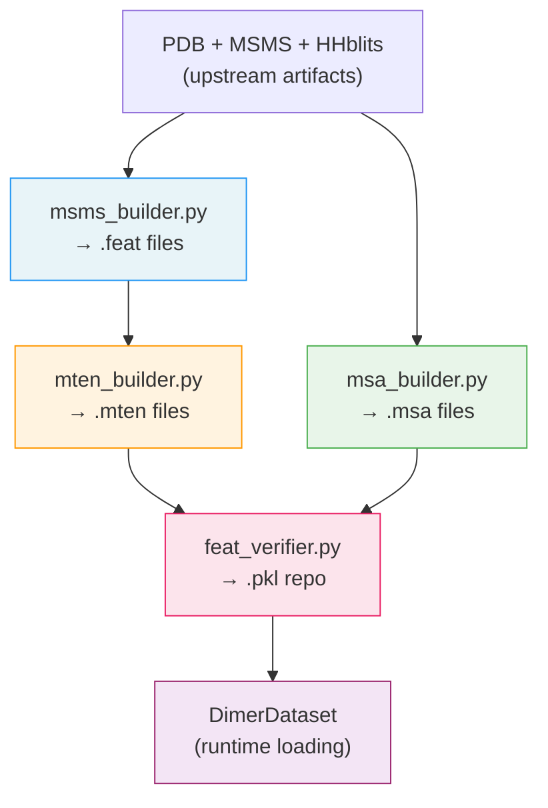
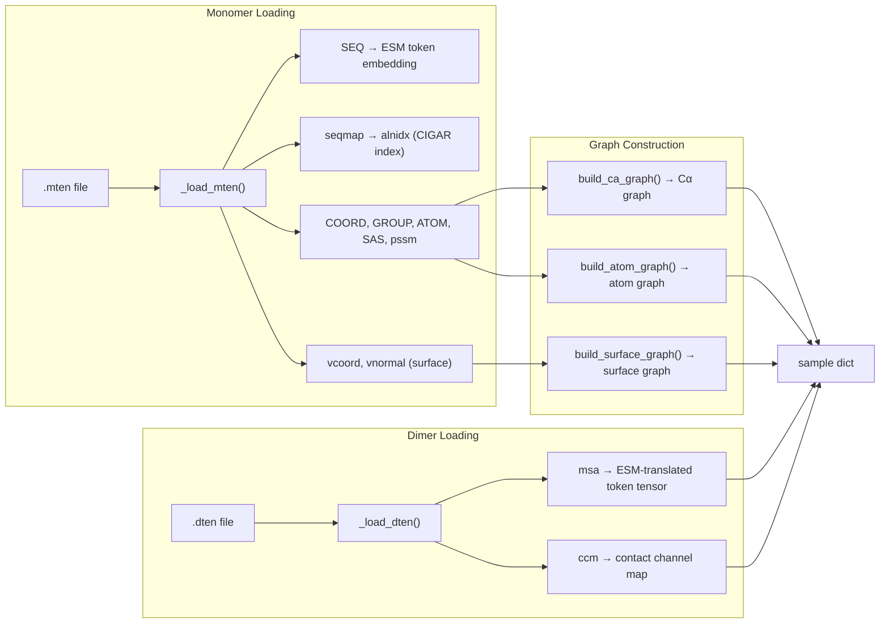

---
slug:17-feature-tensor-assembly
blog_type:normal
---

特征张量组装阶段是整个 glinter 预处理管线的汇聚点——来自 PDB 文件、MSA 和表面网格的原始结构与进化数据在此统一整合为**两种不同的张量产物**：**单体张量**（`.mten`）和**二聚体张量**（`.dten`）。这些序列化张量编码了模型在推理时所需的全部信息：原子坐标、溶剂可及性、PSSM 特征谱、表面顶点、MSA 行以及跨链接触图。理解此阶段至关重要，因为下游的 `DimerDataset` 会直接消费这些产物，张量布局中的任何不一致都会作为隐性模型故障向下传播。

## 四阶段组装管线

特征张量组装并非单一的整体操作——它由 `build_features.sh` 统筹调度，将四个独立的构建器按序组合成确定性管线。每个构建器消费上游预处理（HHblits MSA 生成、MSMS 表面计算、PDB 序列提取）的输出，并生成供下一个构建器或最终验证器消费的中间产物。

该 Shell 脚本按顺序分派每个构建器，并根据 `mode`（异源二聚体 vs. 同源二聚体）进行分支，以控制 MSA 的拼接和序列映射策略。对于异源二聚体（`mode=1`），MSA 构建器使用 `--use-concat` 来生成拼接的配对比对；对于同源二聚体，每条链的 MSA 独立构建，随后由验证器进行复制。

来源：[build_features.sh](/scripts/build_features.sh#L1-L32)

## 阶段 1：结构特征收集（`.feat`）

`msms_builder.py` 是首个被调用的构建器。它读取 PDB 结构和 MSMS 表面文件，生成 `.feat` pickle 文件——即作为张量化输入的**原始结构特征字典**。每个 `.feat` 文件包含一个嵌套字典，具有三个顶层键：

| 键 | 类型 | 描述 |
|-----|------|-------------|
| `feat` | `list[dict]` | 逐残基特征列表；每个条目包含 `name`（3 字母残基代码）、`atoms`（原子→{coord, sas} 的字典），以及可选的 `dssp` |
| `seqmap` | `dict` | PDB 序列与 A3M 参考序列之间的比对映射：`cigar`、`qbeg`、`tbeg`、`ref`、`refseq` |
| `seq` | `str` | 源自 PDB 的单字母序列 |
| `vertex` | `dict` | 表面网格，包含来自 MSMS 以 0.8 分辨率采样得到的 `coords`（N×3）和 `normals`（N×3） |
| `name` | `str` | 链标识符 |

`collect_features` 函数是核心聚合逻辑：它遍历解析后的 PDB 坐标，将逐原子的 SAS 值（来自 `.area` 文件）和逐残基的 DSSP 注释（二级结构、相对 ASA、phi/psi 角）附加到每个残基条目中。当未提供显式序列映射时，`seqmap` 默认为恒等映射（`{len}M` 的 `cigar`，偏移量为 1）——这是同源二聚体中 PDB 序列与 A3M 序列完全相同的情况。

来源：[msms_builder.py](/preprocess/msms_builder.py#L138-L176)，[msms_builder.py](/preprocess/msms_builder.py#L178-L251)

## 阶段 2：单体张量化（`.mten`）

`mten_builder.py` 将 `.feat` 字典转换为**张量化的单体产物**——即 `.mten` 文件。在此阶段，Python 列表和字符串转换为具有受控 dtype 精度的稠密 PyTorch 张量。核心函数 `tensorize_feat` 构建了蛋白质的扁平原子表示：

**`tensorize_feat` 生成的张量模式**：

| 键 | 形状 | Dtype | 描述 |
|-----|-------|-------|-------------|
| `SEQ` | 标量字符串 | `str` | 单字母氨基酸序列（由残基拼接而成） |
| `COORD` | N_atoms × 3 | `float16` | 扁平顺序下的所有原子坐标 |
| `ATOM` | N_atoms | `uint8` | 编码的原子类型索引（CA=0, N=1, C=2, CB=3, O=4, ...） |
| `SAS` | N_atoms | `float16` | 逐原子的溶剂可及表面面积 |
| `GROUP` | N_res | `uint8` | 每个残基的原子数（用于基于片段的规约） |
| `SS8` | N_res | `uint8` | DSSP 8 类二级结构（可选，`--use-dssp`） |
| `rASA` | N_res | `float16` | 来自 DSSP 的相对 ASA（可选） |
| `Phi` | N_res | `float16` | 骨架 phi 角（可选） |
| `Psi` | N_res | `float16` | 骨架 psi 角（可选） |

原子编码使用 11 类词汇表：`CA, N, C, CB, O, NX, CX, OX, SX, HX, X`，其中 `X` 是词汇表外回退，`{N,C,O,S}X` 代表不在骨架中的通用 N/C/O/S 原子。除非设置了 `--use-hydrogen`，否则默认排除氢原子（`ignore_h=True`）。每个残基的原子计数存储在 `GROUP` 中，使下游的 `segment_csr` 操作无需显式循环即可将逐原子特征（如 SAS）规约为逐残基特征。

在 `tensorize_feat` 之后，构建器从外部来源追加三个额外字段：

- **`pssm`**：从 HHM 特征谱 pickle（`.hhm.pkl`）加载，形状为 N_res × 20 的 `float32` 张量，表示位置特异性评分矩阵列
- **`vertex`**：包含来自 MSMS 表面网格的 `coord` 和 `normal` 作为 `float16` 张量的字典
- **`seqmap`** / **`name`**：从 `.feat` 文件保留下来的元数据

关键的验证步骤会检查 `mtensor['SEQ'] != feat['seq']`——如果张量化的序列与存储的序列不一致，该单体将被静默跳过。这可以捕获 PDB 与 A3M 参考序列之间的比对不匹配问题。

来源：[mten_builder.py](/preprocess/mten_builder.py#L19-L71)，[mten_builder.py](/preprocess/mten_builder.py#L88-L176)，[encoding_utils.py](/glinter/protein/encoding_utils.py#L36-L58)

## 阶段 3：二聚体 MSA 张量化（`.dten`）

`msa_builder.py` 将拼接或配对的 A3M 比对处理为 `.dten` pickle 文件。与单体张量不同，二聚体张量专注于 MSA 中编码的**进化耦合信息**。`build_msa` 函数生成：

| 键 | 形状 | Dtype | 描述 |
|-----|-------|-------|-------------|
| `msa` | N_rows × N_cols | `uint8` | 数值编码的 MSA（A=0, B=1, ..., Z=25, gap=26） |
| `hw` | N_rows | `float32` | Henikoff 序列权重（对空位进行折扣） |
| `query` | str | `str` | 查询序列行 |
| `reclen` / `liglen` | scalar | `int` | 受体和配体序列长度 |
| `concated` | scalar | `bool` | MSA 是拼接（异源）还是复制（同源） |
| `idx` | N_selected | `int` 或 `None` | 按 Henikoff 权重选择的 top-k 行索引 |

MSA 编码通过 `string.ascii_uppercase + '-'` 将大写氨基酸字母加上 `-` 映射为索引，并使用正则表达式 `re.sub('[a-z]', '', s)` 剥离小写插入。Henikoff 加权（`heniw`）计算位置特异性逆计数，对逐序列贡献求和，并按非空位密度重新加权——这会同时降低冗余序列和高空位序列的权重。当设置 `maxk=128` 时，仅保留权重排名前 128 的行。

对于异源二聚体（`--use-concat`），A3M 文件已包含由 `&` 分隔的配对受体-配体序列，且 `rec_len + lig_len` 等于总列数。对于同源二聚体，两条链使用相同的 MSA 并且 `concated=False`，这意味着下游加载器将复制 MSA 列。

来源：[msa_builder.py](/preprocess/msa_builder.py#L1-L161)

## 阶段 4：一致性验证与仓库组装

`feat_verifier.py` 是最终的把关者——它交叉验证单体张量、二聚体张量和可选的距离目标，然后写入供 `DimerDataset` 在运行时读取的整合 `.pkl` 仓库。`check_consistency` 函数执行三项关键验证：

1. **Seqmap 参考命名**：验证 `refrec + ':' + reflig == dname`，确保单体张量中的受体和配体参考名称与二聚体张量标识符匹配
2. **参考序列拼接**：断言 `refrecseq + refligseq == dseq`，确认来自两个单体的已比对参考序列拼接后等于二聚体查询序列
3. **比对一致性**：可选地检查 PDB 与 A3M 序列之间由 CIGAR 派生的比对一致性是否超过 90%（由 `--check-seqid` 控制）

当所有检查通过时，验证器组装一个结构为 `{mname: {rec: recten, lig: ligten, dimer: dten}}` 的仓库条目。关键的是，对于同源二聚体（`concated=True`），它通过添加一个交换条目 `(lig:rec)`（附带转置的距离目标和列重排的 MSA）来**扩充数据集**——这利用了同源二聚体界面的对称性，使有效训练数据翻倍。

<CgxTip>`.pkl` 仓库是 `DimerDataset` 在运行时加载的唯一文件。它将所有单体张量（按参考名称）、二聚体张量（按二聚体名称）和距离目标捆绑到一个索引字典中。如果一个单体出现在多个二聚体中，它只会被存储一次并通过键进行引用——这种去重对于大型数据集的内存效率至关重要。</CgxTip>

来源：[feat_verifier.py](/preprocess/feat_verifier.py#L38-L136)

## DimerDataset 中的运行时特征组装

虽然 `.mten` 和 `.dten` 文件是预计算的产物，但 `DimerDataset.__getitem__` 方法在训练/推理时执行第二层**动态特征组装**。在此阶段，预张量化的数据被转换为模型实际消费的几何图结构。

`_load_mten` 方法根据激活的特征配置选择性地提取字段。`SEQ` 字符串通过预计算的查找表（`self.esm_tt`）立即转换为 ESM token 索引。`seqmap` CIGAR 字符串转换为形状为 2 × L 的比对索引对（`alnidx`），用于映射 PDB 序列与 A3M 参考序列之间的位置——该索引对于将 PSSM 特征谱和 MSA 行对齐到正确的残基位置至关重要。

### Cα 图组装

`build_ca_graph` 函数构建一个 `torch_geometric.data.Data` 对象，包含：

- **节点特征**（`x`）：[SAS (1D), AA one-hot (21D), 位置编码 (1D), PSSM (20D)] 的拼接 = **每个 Cα 43 维**
- **节点位置**（`pos`）：Cα 坐标，可选择通过随机旋转矩阵进行数据增强旋转
- **边索引**：默认 `r=8Å` 的半径图，连接 Cα 原子
- **局部参考系**（`lrf`）：由每个残基处的 Cα→C 和 Cα→N 向量计算得出，提供旋转等变的几何上下文
- **边特征**（可选）：当 `use_distance_graph=True` 时，将欧几里得边距离作为 `edge_embed` 附加

PSSM 比对使用 CIGAR 派生的索引：`pssm[srcidx] = sample['pssm'][tgtidx]`，从 PDB 位置映射到计算特征谱的 A3M 位置。

来源：[dimer_dataset.py](/glinter/dataset/dimer_dataset.py#L159-L280)，[dimer_dataset.py](/glinter/dataset/dimer_dataset.py#L287-L308)，[_geometric_graph.py](/glinter/dataset/_geometric_graph.py#L42-L143)

### 原子图组装

`build_atom_graph` 构建一个异质图，在半径（默认 `r=6Å`）内将**所有重原子**连接到 Cα 原子。节点特征拼接 [原子类型独热 (11D), SAS (1D), 残基类型独热 (21D)] = **33 维**。`residue_index` 张量将每个原子映射回其父残基，边特征编码原子-Cα 对是否属于同一残基（二值标志）。当 `remove_hydrogen=True`（`heavy-atom-graph` 特征）时，匹配 `HX` 类型索引的原子会在图构建前被过滤。

来源：[_geometric_graph.py](/glinter/dataset/_geometric_graph.py#L145-L215)

### 表面图组装

`build_surface_graph` 创建一个在半径 `r=6Å` 内将**表面网格顶点**连接到 Cα 原子的图。`Data` 对象存储顶点位置（`pos`）和法线（`nor`）——两者均与应用于原子坐标的同一随机旋转矩阵共同旋转，确保所有图类型间数据增强的一致性。

来源：[_geometric_graph.py](/glinter/dataset/_geometric_graph.py#L217-L259)

### 二聚体特征组装

`_load_dten` 方法处理二聚体张量以供运行时使用。当 `esm` 特征激活时，原始 MSA 整数张量通过 `self.esm_tt`（ESM token 表）转换，以生成 ESM 兼容的 token 索引。`ccm`（跨链接触图）作为 `float32` 张量加载。在 `getitem` 时，MSA 进一步被 `recidx` 和 `ligidx` 比对索引切片，以仅选择已比对的位置，并在 ESM 字母表需要时前置/追加 BOS/EOS token。

来源：[dimer_dataset.py](/glinter/dataset/dimer_dataset.py#L310-L338)，[msa_utils.py](/glinter/dataset/msa_utils.py#L17-L66)

## 特征配置控制

`DimerFeature` 类作为**特征选择器**，决定在运行时组装哪些图和嵌入。它解析逗号分隔的特征字符串（例如 `coordinate-ca-graph,atom-graph,surface-graph,ccm`），并根据允许的组验证每个键：

| 特征键 | 组装效果 |
|-------------|-------------------|
| `ccm` | 从二聚体张量加载跨链接触图 |
| `esm` | 在加载时将 MSA 转换为 ESM token |
| `pickled-esm` | 从 `.esm.npz` 文件加载预计算的 ESM 嵌入 |
| `ca-embed` | 仅返回 Cα 节点嵌入（无图结构） |
| `coordinate-ca-graph` | 构建基于坐标边的 Cα 图 |
| `distance-ca-graph` | 构建带距离边特征的 Cα 图 |
| `atom-graph` | 构建原子到 Cα 图（包含氢原子） |
| `heavy-atom-graph` | 构建原子到 Cα 图（排除氢原子） |
| `surface-graph` | 构建表面顶点到 Cα 图 |

`esm` 和 `pickled-esm` 特征互斥——前者通过 ESM-MSA-1 模型即时计算 ESM 嵌入，后者从磁盘加载缓存的嵌入。

<CgxTip>使用 `pickled-esm` 时，数据集在初始化时通过 `**/*.esm.npz` 构建名称到路径的索引。任何模型名称缺失于该索引的二聚体都会被静默排除出数据集——当 ESM 嵌入生成不完整时，这是导致数据集意外变小的常见原因。</CgxTip>

来源：[_feature.py](/glinter/dataset/_feature.py#L1-L36)，[dimer_dataset.py](/glinter/dataset/dimer_dataset.py#L100-L127)

## 整理策略

`Collater` 类处理已组装样本的批处理。对于字典结构的样本（`DimerDataset` 的标准输出），它执行**逐键整理**——批次中每个键的值被独立地递归整理。对于 `torch_geometric.data.Data` 对象（几何图），它委托给 `Batch.from_data_list`，后者在偏移边索引以保持图不相交的同时拼接节点/边属性。张量通过 PyTorch 的 `default_collate` 进行堆叠，而字符串作为普通列表返回（不堆叠）。

来源：[collater.py](/glinter/dataset/collater.py#L1-L65)

## 产物文件格式摘要

| 文件 | 扩展名 | 生成方 | 消费方 | 内容 |
|------|-----------|-------------|-------------|---------|
| 结构特征 | `.feat` | `msms_builder.py` | `mten_builder.py` | 残基原子、DSSP、SAS、顶点、seqmap |
| 单体张量 | `.mten` | `mten_builder.py` | `DimerDataset` | 张量化的 SEQ、COORD、ATOM、SAS、GROUP、PSSM、vertex |
| MSA 张量 | `.dten` | `msa_builder.py` | `DimerDataset` | MSA 行、Henikoff 权重、查询、长度 |
| ESM 嵌入 | `.esm.npz` | 外部 ESM 推理 | `DimerDataset` | 预计算的 ESM-MSA 注意力嵌入 |
| 已验证仓库 | `.pkl` | `feat_verifier.py` | `DimerDataset` | 整合的 {rec, lig, dimer} 条目 |

来源：[build_features.sh](/scripts/build_features.sh#L1-L32)

## 后续步骤

随着特征张量完成组装和验证，管线将继续进行预测与评分。关于这些产物在运行时如何被消费，请参阅 [DimerDataset 与特征加载](11-dimerdataset-and-feature-loading)；有关完整的配置 API，请参阅 [特征配置系统](13-feature-configuration-system)；关于组装后的特征在推理时如何流经模型，请参阅 [异源二聚体与同源二聚体预测](18-heterodimer-vs-homodimer-prediction)。