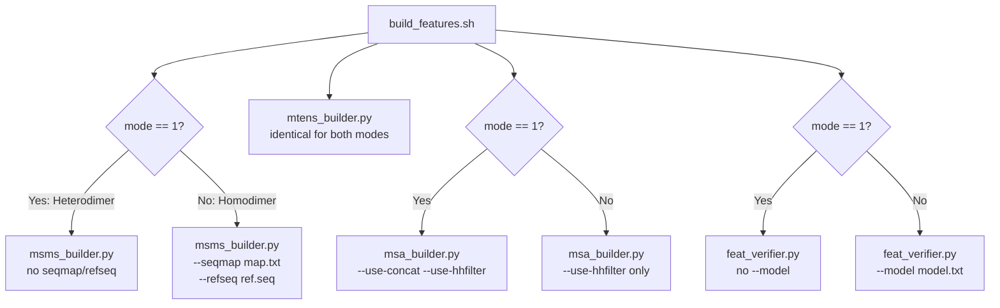
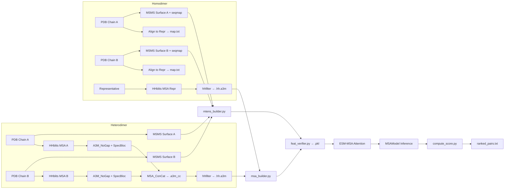

---
slug:18-heterodimer-vs-homodimer-prediction
blog_type:normal
---

Glinterr 预测蛋白质间接触，支持**异源二聚体**（两条不同的蛋白质链）和**同源二聚体**（两条相同或高度相似的链）。尽管核心模型架构（[MSAModel 与前向传播](5-msamodel-and-forward-pass)）是共享的，但这两种二聚体类型在每一个预处理阶段——从 MSA 构建到表面特征映射——都存在分歧，因为它们的共进化信号具有根本不同的结构。本页解释了 Glinter 如何将每种二聚体类型路由通过其流水线，关键的分支逻辑位于何处，以及这些差异为何对预测质量至关重要。

## 数据层面的二聚体类型分类

该代码库在 `data/` 目录下维护了独立的精选基准列表。**HeteroPDB2018.list** 包含约 72 个异源二聚体复合物的 PDB 条目，而 **HomoPDB2018.list** 包含约 165 个同源二聚体复合物的条目。这种分类是基于结构的：同源二聚体是两条链共享相同代表序列（即 `rec == lig`）的复合物，而异源二聚体则具有不同的代表序列。这种区别作为**模式标志**传播到每个下游组件——异源二聚体为 `mode=1`，同源二聚体为 `mode=2`（或任何非 1 的值）——该标志首先在入口 Shell 脚本中设置。

来源: [HeteroPDB2018.list](/data/HeteroPDB2018.list#L1-L72), [HomoPDB2018.list](/data/HomoPDB2018.list#L1-L166)

## 入口脚本: build_hetero.sh vs build_homo.sh

两个编排脚本 `build_hetero.sh` 和 `build_homo.sh` 共享相同的终端步骤——ESM 注意力生成、模型推理和分数计算——但在三个准备阶段有所不同。下表总结了每个分支点：

| 流水线阶段 | `build_hetero.sh` | `build_homo.sh` |
|---|---|---|
| **MSA 来源** | 每条链的独立 MSA → 通过 `concat_msa.sh` 拼接 | 两条链共享单一代表 MSA |
| **序列比对** | 不需要（链之间相互独立） | 通过 `align.py` 将每条链的 PDB 序列比对至代表序列 |
| **映射产物** | 无 | 生成 `map.txt`, `ref.seq`, `model.txt` |
| **MSA 过滤** | 对拼接的 MSA (`*.a3m_cc`) 运行 `filter_msa.sh` | 对单一代表 MSA (`*.hh.a3m`) 运行 `filter_msa.sh` |
| **特征构建模式** | `build_features.sh $srcdir 1` | `build_features.sh $srcdir 2` |
| **MSMS 构建器标志** | 无 `--seqmap` / `--refseq` | `--seqmap $srcdir/map.txt --refseq $srcdir/ref.seq` |
| **MSA 构建器标志** | `--use-concat --use-hhfilter` | 仅 `--use-hhfilter` |
| **特征验证器标志** | 无 `--model` | `--model $srcdir/model.txt` |

对于异源二聚体，`name` 变量构建为 `receptor:ligand`（例如 `6nus_A:6nus_B`），每条链的 MSA 独立构建后再进行拼接。对于同源二聚体，需指定一个**代表序列**（`$repr`）作为第四个参数；两条链都被反向比对到该单一代表序列，且仅为其构建一个 MSA。

来源: [build_hetero.sh](/scripts/build_hetero.sh#L1-L72), [build_homo.sh](/scripts/build_homo.sh#L1-L68)

## MSA 构建: 拼接 vs 复制

这是架构上最显著的分歧。MSA 编码了共进化信息，其结构在不同二聚体类型间存在根本差异。

### 异源二聚体: 拼接的 MSA

对于异源二聚体，每条链都有由 HHblits 生成的独立 MSA。`concat_msa.sh` 脚本编排了三步过程：(1) 通过 `A3M_NoGap` **去除空隙**，(2) 通过 `A3M_SpecBloc` 针对分类树进行**基于物种的阻断**，以防止同源序列夸大链间信号，以及 (3) 通过 `MSA_ConCat` **拼接 MSA**，将两个过滤后的 MSA 连接成一个配对的比对文件 (`*.a3m_cc`)。随后，多样性过滤器（序列一致性阈值为 0.65 的 `meff_cdhit`）计算序列的有效数量。最后，`hhfilter` 将拼接后的 MSA 缩减至最多 200 条覆盖率 ≥20% 的多样化序列，生成 `*.hh.a3m`。

### 同源二聚体: 单一代表 MSA

对于同源二聚体，由于两条链共享相同的序列（经比对后），仅针对代表序列构建**一个** MSA。代表序列的 MSA 被 `hhfilter` 直接过滤为 `*.hh.a3m`。由于两条链的共进化信号源自同一序列家族，因此不会发生拼接。

### msa_builder.py 如何读取差异

`msa_builder.py` 中的 `--use-concat` 标志决定了加载哪个 A3M 文件以及如何解析它。当 `use_concat=True`（异源二聚体）时，构建器读取拼接的 `.a3m_cc`（或其过滤后的 `.hh.a3m`）并使用 `fetch_length=True` 调用 `read_a3mcc()`，该函数解析描述头部以分别恢复 `rec_len` 和 `lig_len`。生成的样本字典具有 `concated=True`。当 `use_concat=False`（同源二聚体）时，构建器读取单链 `.a3m` 文件，将 `rec_len` 和 `lig_len` 都设置为相同的总长度，并标记 `concated=False`。

来源: [concat_msa.sh](/preprocess/MSA/concat_msa.sh#L1-L24), [filter_msa.sh](/preprocess/MSA/filter_msa.sh#L1-L13), [msa_builder.py](/preprocess/msa_builder.py#L93-L161), [concat_msa.sh (top-level)](/scripts/concat_msa.sh#L1-L6)

## 同源二聚体的序列比对与映射

同源二聚体需要显式的**序列映射**，因为两条链可能具有不同的残基编号或微小的序列差异（例如，由于 PDB 中未解析的残基）。`align.py` 脚本使用 Biopython 的 `pairwise2.align.localms` 执行局部比对，匹配得分为 2，错配罚分为 −1，空位开放罚分为 −2，空位扩展罚分为 −0.5。比对被编码为 **CIGAR 字符串**（例如 `45M2D30M`），连同查询和目标的起始位置（`qbeg`, `tbeg`）。

对于具有代表序列 `repr` 的同源二聚体 `receptor:ligand`，`build_homo.sh` 两次运行 `align.py`——一次将配体映射到代表序列，一次将受体映射到代表序列——并将两次结果追加到 `map.txt`。它还将代表序列的序列复制到 `ref.seq`，并写入格式为 `receptor:ligand  repr:repr` 的 `model.txt` 文件。这些产物被 `msms_builder.py`（通过 `--seqmap` 和 `--refseq`）以及 `feat_verifier.py`（通过 `--model`）消费，以将每条链的逐残基特征正确映射回代表坐标系。

相反，异源二聚体完全跳过比对；每条链的特征都在其自身的原生坐标系中计算。

来源: [align.py](/preprocess/align.py#L1-L48), [build_homo.sh](/scripts/build_homo.sh#L27-L32)

## 表面特征构建: build_features.sh 中的模式分支

`build_features.sh` 脚本是中央调度器，将模式标志传递给其子调用。在**表面/单体张量**阶段，模式决定了 `msms_builder.py` 是否接收序列映射参数：

当向 `msms_builder.py` 提供 `seqmap` 时，每条链的逐残基特征（SAS 面积、DSSP 二级结构、原子坐标）通过基于 CIGAR 的比对索引到代表序列。当缺少 `seqmap`（异源二聚体）时，将使用 `cigar = '{len(seq)}M'`、`tbeg=1`、`qbeg=1` 和 `refseq=seq` 创建一个平凡的恒等映射。

来源: [build_features.sh](/scripts/build_features.sh#L1-L32), [msms_builder.py](/preprocess/msa_builder.py#L215-L221)

## `concated` 标志: MSA 加载与特征验证

MSA 张量字典中的 `concated` 布尔值是贯穿数据流水线区分二聚体类型的运行时标志。它在 `msa_builder.py` 期间设置，并在两个关键位置被消费：

### 在 msa_utils.py 中: 加载时的列索引

`load_msa()` 函数使用 `concated` 来确定如何从 MSA 矩阵中提取受体和配体列：

- **`concated=True`（异源二聚体）**: MSA 列已经被分区——受体列占据 `[0:reclen]`，配体列占据 `[reclen:reclen+liglen]`。在索引到 MSA 之前，配体索引偏移了 `reclen`：`_idx = torch.cat((recidx, ligidx + ligbeg), dim=0)`。

- **`concated=False`（同源二聚体）**: 两条链使用相同的 MSA。受体列来自 `_msa[:, recidx]`，配体列来自 `_msa[:, ligidx]`——两者都索引到**相同**的列范围，然后拼接：`msa = torch.cat((_msa[:, recidx], _msa[:, ligidx]), dim=-1)`。

### 在 feat_verifier.py 中: 数据增强与交叉配对生成

`feat_verifier.py` 中的 `check_consistency()` 函数使用 `concated` 来决定如何为训练增强生成**交换的二聚体** (lig:rec)。当 `concated=True` 时，MSA 列发生物理重排：配体列移到前面，受体列移到后面，查询字符串也类似地重新排序。当 `concated=False` 时，查询序列直接翻倍（`dseq += dseq`），因为两条链使用相同的 MSA，并且不会生成交换条目（增强实际上被禁用，因为 `augment` 被设置为 `dten['concated']` 的值）。

此外，`feat_verifier.py` 将找到的模型划分为 `hts`（异源二聚体：`rec != lig`）和 `hms`（同源二聚体：`rec == lig`）字典，使用相同的 `check_consistency()` 调用处理每个字典，但推导的 `dname` 不同——异源二聚体使用完整的 `rec:lig` 配对，而同源二聚体仅使用单一代表名称。

来源: [msa_utils.py](/glinter/dataset/msa_utils.py#L17-L66), [feat_verifier.py](/preprocess/feat_verifier.py#L38-L136), [feat_verifier.py](/preprocess/feat_verifier.py#L186-L234)

## 分数计算与预测对称化

在模型产生接触概率矩阵后，`compute_score.py` 计算最终排序的残基对。对于异源二聚体，脚本检查是否存在**逆序对**输出文件（`{name2}:{name1}.out.pkl`）。如果存在，逆序分数矩阵被转置并与正序矩阵平均：`score = (score_fwd + score_rev.T) / 2`。这种对称化通过结合两种链排序的证据来提高预测可靠性。

对于同源二聚体，不会生成逆序对文件（根据定义，两种排序是等价的），因此分数来自单次前向传播。然后脚本使用 `.pos` 文件将预测的接触映射回原始的 PDB 残基位置，按概率降序对所有残基对进行排序，并写入 `ranked_pairs.txt`。

来源: [compute_score.py](/scripts/compute_score.py#L1-L54)

## 模型推理: 共享架构，不同输入形状

[MSAModel](5-msamodel-and-forward-pass) 不包含任何显式的异源二聚体/同源二聚体分支逻辑。相反，二聚体类型通过 **MSA 输入的形状**和 **reclen/liglen 划分**隐式体现。在前向传播期间，ESM 行注意力张量在 `reclen` 边界处被切片：`x[:, :, :reclen, reclen:]` 提取链间注意力块。对于异源二聚体，此边界位于两个真正不同的序列家族之间；对于同源二聚体，此边界位于同一家族的两个副本之间，捕获**被重新用作链间信号的序列内共进化**。`row_attn_op` 参数（默认为 `sym`）控制如何组合两个三角块——`sym` 为对称平均，`apc` 为平均乘积校正。

<CgxTip>在构建同源二聚体特征时，代表序列的选择很重要：更接近两条链共识的代表序列可最小化比对空隙，并减少基于 CIGAR 的特征索引期间的信息丢失。`map.txt` 和 `model.txt` 产物编码了此映射，并且必须与 MSA 的参考序列保持一致。</CgxTip>

<CgxTip>对于异源二聚体，MSA 拼接流水线的物种阻断步骤 (`A3M_SpecBloc`) 对于防止旁系同源匹配产生虚假的链间共进化信号至关重要。跳过此步骤可能会产生过度自信但错误的接触预测。</CgxTip>

来源: [msa_model.py](/glinter/models/msa_model.py#L164-L200), [dimer_dataset.py](/glinter/dataset/dimer_dataset.py#L54-L98)

## 完整流水线比较

下图并排显示了两种二聚体类型的完整预处理和预测流程，突出了路径分叉和汇聚的位置：

来源: [build_hetero.sh](/scripts/build_hetero.sh#L1-L72), [build_homo.sh](/scripts/build_homo.sh#L1-L68), [build_features.sh](/scripts/build_features.sh#L1-L32)

## 何时使用哪种脚本

| 场景 | 脚本 | 关键要求 |
|---|---|---|
| 两种不同的蛋白质（如抗体 + 抗原） | `build_hetero.sh` | 两个独立的 PDB 文件 |
| 相同蛋白质的两个副本 | `build_homo.sh` | 两个 PDB 文件 + 代表序列名称 |
| AlphaFold-Multimer 输出精化 | `run_glinter.sh` | 来自 AlphaFold 流水线的已预处理 `.pkl` |
| 基准列表上的批量评估 | 循环中的 `build_hetero.sh` / `build_homo.sh` | 来自 `data/` 目录的列表 |

有关 AlphaFold-Multimer 集成，请参阅 [AlphaFold-Multimer 集成](20-alphafold-multimer-integration)。有关如何从模型输出计算最终接触分数的详细信息，请参阅 [接触分数计算](19-contact-score-computation)。